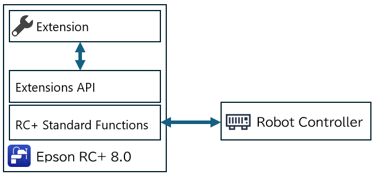
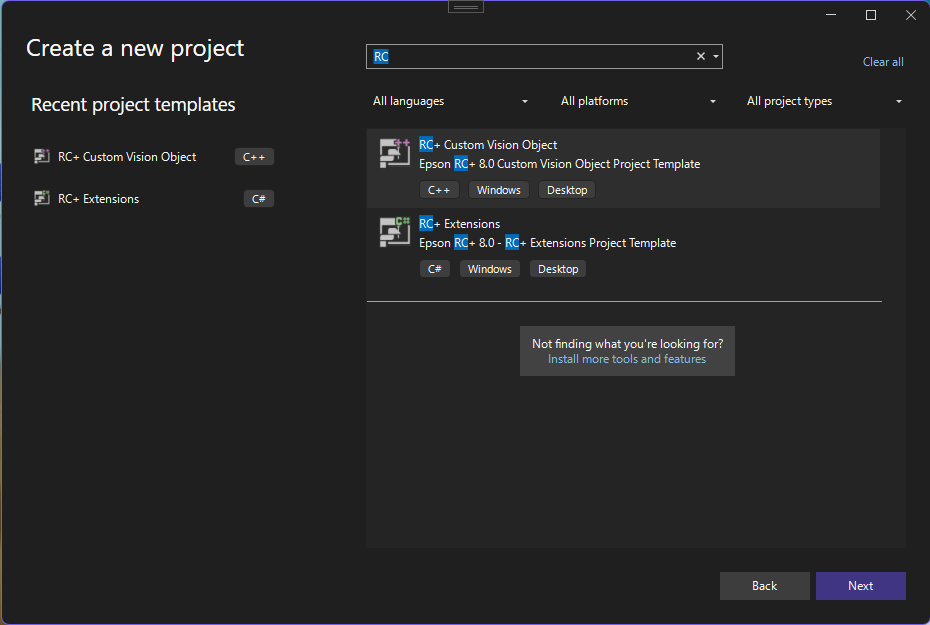
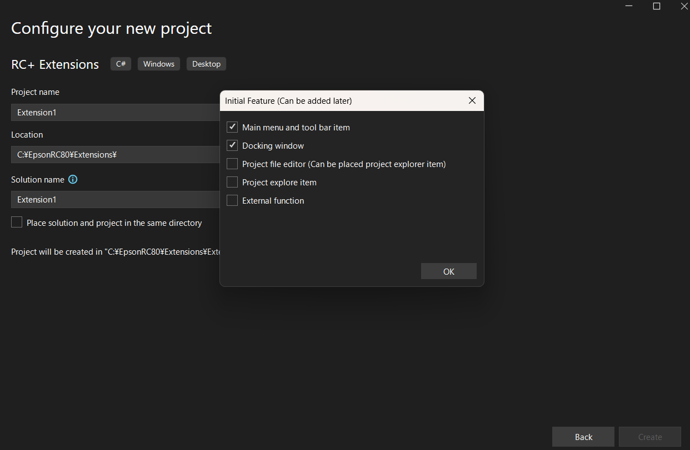
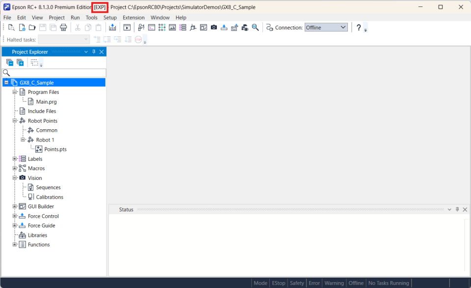
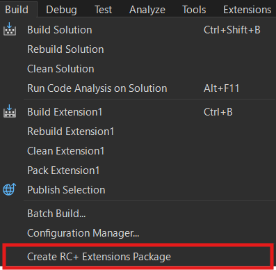

# Epson RC+ 8.0 <br/>RC+ Extensions

[日本語](./readme_ja.md) / [English](./readme.md)

## 1. RC+ Extensions

RC+ Extensions is a platform that enables flexible expansion by allowing users to customize Epson RC+ 8.0 according to their applications and business processes, and to integrate with external devices and systems.

In addition to using extensions provided by Epson, users can develop their own extensions using Visual Studio and install them in Epson RC+ 8.0 for use.  
This enables Epson RC+ 8.0 to be continuously and flexibly enhanced, and makes it easy to reuse and share the developed extensions within an organization.

Functions of RC+ Extensions:

* Using extensions: You can install and use extensions provided by Epson or extensions developed by users.
* Developing extensions: You can create your own extensions using Visual Studio and the RC+ Extensions SDK.

* Epson RC+ 8.0 Ver. 8.1.3.0 or later, as well as an Epson RC+ Premium Edition license, is required.

The following figure shows how to use RC+ Extensions and the development procedure.

* User: By using the Epson RC+ Extensions Manager, users can browse, download, and install extensions from the Gallery provided by Epson. By specifying a local source, extensions developed by developers can also be used in the same way.
* Developer: Using Visual Studio and the RC+ Extensions SDK, developers can create, package, and share extensions.


For details about using RC+ Extensions, refer to the following manual.  
"Epson RC+ 8.0 Extensions RC+ Extensions 8.0 - Using RC+ Extensions"  
For detailed API specifications, refer to the RC+ Extensions API Reference:  
<https://epson-robots.github.io/rcplus-extensions>

## 2. RC+ Extensions Development

### 2.1 Overview

With RC+ Extensions, the following types of extensions can be developed. Each type differs in its target functions and development methods.

| Types of extensions | Major language/technology | Overview |
| --- | --- | --- |
| **RC+ Custom**: <br/>Customize the UI and processing of Epson RC+ | C#, WPF, XAML | You can add custom operation screens to Epson RC+. In addition, new functions can be implemented by integrating the standard functions provided by the SDK with external software and hardware. |
| **PC Vision Custom Vision Objects**: <br/>Customizes the vision objects | C++, (Image processing knowledge) | You can add custom vision objects to the PC Vision functions of VisionGuide. This makes it possible to incorporate custom image processing and detection logic. |

* Epson RC+ 8.0 Ver. 8.1.3.0 or later, as well as an Epson RC+ Premium Edition license, is required.

The development flow is as follows:

1. Preparing the development environment: See [Installation](#32-Installation)
2. Creating an RC+ Extensions project: See [Getting Started](#33-GettingStarted)
3. Implementation and debugging: See [Tutorial](#34-Tutorial)
4. Packaging and sharing: See [Distributing Extensions](DistributingExtensions)

### 3 RC+ Custom Development

#### 3.1 Overview

RC+ Custom goes beyond the standard functionality of Epson RC+ and enables extensions to meet user-specific needs. The following types of extensions can be implemented.

* **UI Extension**: Add your own windows to the Epson RC+ screen
* **Standard Function Call**: Invoke standard Epson RC+ functions such as point editing and controller connection.
* **SPEL+ Integration**: Invoke extensions from a SPEL+ program using the Declare statement.
* **Web Content Integration**: Uses C# WPF WebView2 to display web pages on Epson RC+. It also permits two-way messaging between the Extension and the Web.

The following figure shows the system configuration.



Extension runs within the RC+ main process (in-process). An extension must access standard RC+ functions via the public interfaces of the Extensions API in the RC+ Extensions SDK, and is therefore not designed to have direct access to the internals of RC+. This ensures the consistency of the RC+ standard functions while safely enabling UI additions and function integration through extensions.

#### 3.2 Installation

The following preparations are required before starting development.

1. Install Epson RC+ 8.0.
    * Version: 8.1.3.0 or later
    * Required license: Epson RC+ Premium Edition
    * The installation path can be specified freely. In this manual, C:\EpsonRC80 is assumed.
1. Install Visual Studio.
    * Version: Visual Studio 2022 17.14 or later (including Enterprise, Professional, or Community editions)
    * Required components: .NET Desktop Development, C++ Desktop Development
1. Install .NET 8 SDK.
    * Version: 8.0.307 or later
1. Install the extension (VSIX) into Visual Studio.
    * Double-click C:\EpsonRC80\Extensions\SDKs\ExtensionsGenerator.vsix. The VSIX installer starts. Follow the on-screen instructions to install the extension.  
    *The Premium Edition is required to use VSIX.When you start the RC+ authorized with the Premium Edition, VSIX will automatically be expanded to the path described above.  
    * This extension registers "project templates" and "file templates" for RC+ Extensions in Visual Studio. Follow the procedure below to create projects using these templates.

#### 3.3 Getting Started

Follow the procedure below to create an RC+ Extensions project.

1. In Visual Studio, select [Create a new project].
1. Select the [RC+ Extensions] project template.  
    
1. Select the features you want to use in the [Initial Feature] window.  
    
    * **Main menu and tool bar item**: Add the dedicated Extension menu to the Epson RC+ main window menu and toolbar.
    * **Docking window**: Add the dedicated Extension docking window to the Epson RC+ main window.
    * **Project file editor**: Add your own extension-specific files under project management.
    * **Project explore item**: Add your own extension-specific items to the Project Explorer
    * **External function**: You can call an extension-specific process from SPEL+ using the Declare statement.
    * * File templates for required functions can be added later. Right-click Solution Explorer and select [Add] - [New item]. Search for [RC+] and add it.

The created project can be built as is and debugged while installed in RC+.  
By selecting [Debug]-[Start Debugging] from the menu, the extension is built, and Epson RC+ starts after the build is completed. After Epson RC+ starts, make sure that the selected function (window or menu) is displayed. [EXP] is displayed in the title of the main window to indicate the debug status of the extension.  
  
If an RC+ instance already exists when RC+ starts, close it.

#### 3.4 Tutorial

Here we will go through the steps to create an actual extension.  
For ease of reading, the contents of the edited files may only be partially shown. For the complete contents of the file, refer to the full set of source code stored in the samples folder.

Extensions you can create with this tutorial:

* [Webcam recorder](#341-Webcamrecorder)
* [Simple jog](#342-Simplejog)

##### 3.4.1 Webcam recorder

Let's create an RC+ Extension that utilizes a webcam, which is one of the peripheral devices that can be connected to a PC.

First, enable previewing of webcam images in the RC+ docking window (beginner level).

Next, add an image recording function (intermediate level). Recording begins when the SPEL+ program starts and stops when the program ends. Under the assumption that the program will run for a long time, create and record a new file every 5 seconds and retain only the most recent two files.

This is an attempt to add functionality similar to vehicle dashcam to the system. By monitoring the robot's operation during equipment startup, it becomes possible to later visually check what occurred from the recorded video if the program stops unexpectedly.

If the PC is connected to a network, it can also be used to send alerts along with the recorded data.

Let's begin.

###### Beginner level

1. Follow the procedure in [Getting Started](#33-GettingStarted) to create a new RC+ Extension project.
    * Name it "WebCamRecorder."
    * Select the **Main menu and tool bar item** and **Docking window** initial features.
    * For ARM64 versions of Windows, set the configuration to x64.

1. Build and debug the project to make sure it works.
    * The menu item `WebCamRecorder (xx)` (where xx is the display language) is added. The project is OK if the docking window appears when you select this menu item.

1. Close RC+ once.

1. Double-click the WebCamRecorder project in Visual Studio Solution Explorer and make the following changes.
    * Change the TargetFramework to net8.0-windows10.0.19041.0.
        * This allows you to use the Windows Media Foundation API. The following changes are also related to this. Windows Media Foundation is a COM-based API set that is included as standard in Windows operating systems starting from Windows Vista, as the successor to DirectShow. Although it is not currently included in the standard .NET libraries, it can be used in the same way as standard libraries by using tools such as Microsoft.Windows.CsWin32, described below.
    * Add the line `<EnableWindowsTargeting>true</EnableWindowsTargeting>`.
    * Add the line `<AllowUnsafeBlocks>true</AllowUnsafeBlocks>`.

1. Select [Tools] > [NuGet Package Manager] > [Manage NuGet Packages for Solution] to open the window.
    * Search for the Microsoft.Windows.CsWin32 package in the "Browse" tab. Install the latest stable version (0.3.264 at the time of writing).
        * Microsoft.Windows.CsWin32 is a library that makes it easy to invoke the Windows API from C#. See <https://github.com/microsoft/CsWin32> for details.

1. Add the NativeMethods.txt and NativeMethods.json files to your project.
    * These are the files required to use the Windows API with Microsoft.Windows.CsWin32.
    * NativeMethods.txt

        ```txt
        MFStartup
        MFShutdown
        MFCreateAttributes
        MFEnumDeviceSources
        MFCreateSourceReaderFromMediaSource
        MFCreateMediaType
        MFCreateSinkWriterFromURL
        MFCreateSample
        MFCreateAlignedMemoryBuffer

        (code omitted)

        CoInitializeEx
        CoTaskMemFree

        COINIT
        ```

    * NativeMethods.json

        ```JSON
        {
            "$schema": "https://aka.ms/CsWin32.schema.json",
            "public": true
        }
        ```

1. Add the following files to the project.
    * CameraInfo.cs
        * This file describes the CameraInfo class that represents the camera in this extension.

        ```C#
        (previous code omitted)

        namespace WebCamRecorder
        {
            /// <summary>
            /// Camera information
            /// </summary>
            public class CameraInfo
            {
                /// <summary>
                /// Friendly name (may not be unique)
                /// </summary>
                public string FriendlyName { get; }

                /// <summary>
                /// Unique symbolic link
                /// </summary>
                public string SymbolicLink { get; }

                /// <summary>
                /// Constructor
                /// </summary>
                /// <param name="friendlyName">Friendly name</param>
                /// <param name="symbolicLink">Symbolic link</param>
                public CameraInfo(
                    string friendlyName,
                    string symbolicLink
                )
                {
                    FriendlyName = friendlyName;
                    SymbolicLink = symbolicLink;
                }
            }
        }
        ```

    * CameraInfoCollection.cs
        * This file defines the CameraInfoCollection class, which represents a list of cameras and is used to obtain the media source (the object that serves as the entry point for data processing in Windows Media Foundation) of a specified camera.

        ```C#
        (previous code omitted)

        namespace WebCamRecorder
        {
            (code omitted)

            /// <summary>
            /// Camera collection object
            /// </summary>
            public sealed class CameraInfoCollection : IDisposable
            {
                /// <summary>
                /// Camera information
                /// </summary>
                public List<CameraInfo> CameraInfos = [];

                /// <summary>
                /// Source activates
                /// </summary>
                private unsafe IMFActivate_unmanaged** _sourceActivates;

                /// <summary>
                /// Constructor
                /// </summary>
                /// <param name="sourceActivates">Source activates</param>
                public unsafe CameraInfoCollection(
                    IMFActivate_unmanaged** sourceActivates
                )
                {
                    _sourceActivates = sourceActivates;
                }

                /// <summary>
                /// Create media source for the specified camera
                /// </summary>
                /// <param name="cameraInfo">Selected camera</param>
                /// <returns>Media source object</returns>
                public unsafe IMFMediaSource? GetMediaSource(
                    CameraInfo cameraInfo
                )
                {
                    var index = CameraInfos.FindIndex(
                        (x) => (
                            x != null
                            && x.FriendlyName == cameraInfo.FriendlyName
                            && x.SymbolicLink == cameraInfo.SymbolicLink
                        )
                    );
                    if (index < 0)
                    {
                        return null;
                    }
                    else
                    {
                        if (Marshal.GetObjectForIUnknown((nint)_sourceActivates[index]) is not IMFActivate managedSourceActivate)
                        {
                            return null;
                        }

                        var mediaSource = managedSourceActivate.ActivateObject(typeof(IMFMediaSource).GUID) as IMFMediaSource;

                        Marshal.ReleaseComObject(managedSourceActivate);

                        return mediaSource;
                    }
                }

                (remaining code omitted)
        ```

    * IFrameProcessor.cs
        * This file defines the IFrameProcessor interface for processing images obtained from the camera.

        ```C#
        (previous code omitted)

        namespace WebCamRecorder
        {
            /// <summary>
            /// Frame processor interface
            /// </summary>
            public interface IFrameProcessor
            {
                /// <summary>
                /// Initialize the processor
                /// </summary>
                /// <param name="width">Frame width</param>
                /// <param name="height">Frame height</param>
                /// <param name="stride">Frame stride</param>
                /// <param name="bitRate">Bit rate</param>
                public void Initialize(
                    uint width,
                    uint height,
                    uint stride,
                    uint bitRate
                );

                /// <summary>
                /// Termniate the processor
                /// </summary>
                public void Terminate();

                /// <summary>
                /// Process the frame
                /// </summary>
                /// <param name="frame">Frame data</param>
                /// <param name="duration">Duration</param>
                public void Process(
                    byte[] frame,
                    long duration
                );

                /// <summary>
                /// Request stopping
                /// </summary>
                public void Stop();

                /// <summary>
                /// The processing is currently stopping or not
                /// </summary>
                public bool IsStopped { get; }
            }
        }
        ```

    * CameraManager.cs
        * This file defines the CameraManager class, which captures images and sequentially passes the image data to the image processor (an instance of a class that implements the IFrameProcessor interface described above).

        ```C#
        (previous code omitted)

        namespace WebCamRecorder
        {
            (code omitted)

            /// <summary>
            /// Camera manager
            /// </summary>
            public class CameraManager
            {
                /// <summary>
                /// List of frame processors
                /// </summary>
                public List<IFrameProcessor> FrameProcessors { get; } = [];

                (code omitted)

                /// <summary>
                /// List available cameras
                /// </summary>
                /// <returns>Collection object</returns>
                public unsafe CameraInfoCollection? ListCameras()
                {

                (code omitted)

                /// <summary>
                /// Read a frame from source
                /// </summary>
                /// <param name="sourceReader">Source reader object</param>
                /// <param name="frame">Buffer</param>
                /// <param name="duration">Variable to get duration</param>
                /// <returns>1: got it, 0: not got, -1: error</returns>
                private static unsafe int ReadFrame(
                    IMFSourceReader sourceReader,
                    byte[] frame,
                    out long duration
                )
                {
                (code omitted)

                /// <summary>
                /// Start the processings
                /// </summary>
                /// <param name="cameraInfo">Selected camera</param>
                /// <returns>Task</returns>
                public async Task Start(
                    CameraInfo cameraInfo
                )
                {
                    while (!_done)
                    {
                        const int _waitMSec = 10;

                        await Task.Delay(_waitMSec);
                    }

                    await Task.Run(() =>
                    {
                        HRESULT hr;

                        hr = PInvoke.CoInitializeEx(COINIT.COINIT_MULTITHREADED);
                        if (hr.Failed)
                        {
                            return;
                        }

                        hr = PInvoke.MFStartup(PInvoke.MF_VERSION, PInvoke.MFSTARTUP_FULL);
                        if (hr.Succeeded)
                        {
                            _done = false;

                            var sourceReader = CreateSourceReader(cameraInfo);
                            if (sourceReader != null)
                            {
                                GetVideoInfos(
                                    sourceReader,
                                    out var width,
                                    out var height,
                                    out var stride,
                                    out var bitRate
                                );

                                var frame = new byte[stride * height];

                                foreach (var frameProcessor in FrameProcessors)
                                {
                                    frameProcessor.Initialize(width, height, stride, bitRate);
                                }

                                _stopping = false;
                                while (true)
                                {
                                    var status = ReadFrame(sourceReader, frame, out var duration);
                                    if (status < 0)
                                    {
                                        break;
                                    }
                                    else if (status > 0)
                                    {
                                        foreach (var frameProssor in FrameProcessors)
                                        {
                                            frameProssor.Process(frame, duration);
                                        }
                                    }

                                    if (_stopping && FrameProcessors.All(x => x.IsStopped))
                                    {
                                        break;
                                    }
                                }

                                foreach (var frameProcessor in FrameProcessors)
                                {
                                    frameProcessor.Terminate();
                                }

                                Marshal.ReleaseComObject(sourceReader);
                            }

                            _ = PInvoke.MFShutdown();

                            _done = true;
                            _stoppedAction?.Invoke();
                        }
                    });
                }

                (remaining code omitted)
        ```

    * Previewer.cs
        * This file defines the Previewer class for previewing camera images.
            * PreviewImage is an Image control used to display an image in the window. During initialization, bitmap data is created and set as the Source of the PreviewImage. The image data is then passed from the CameraManager and written to the bitmap.

        ```C#
        (previous code omitted)

        namespace WebCamRecorder  
        {
            (code omitted)

            /// <summary>
            /// Image previewer for the camera
            /// </summary>
            public class Previewer : IFrameProcessor
            {
                /// <summary>
                /// Image control
                /// </summary>
                public Image? PreviewImage;

                /// <summary>
                /// Bitmap
                /// </summary>
                private WriteableBitmap? _bitmap;

                (code omitted)

                /// <inheritdoc />
                public void Initialize(
                    uint width,
                    uint height,
                    uint stride,
                    uint bitRate
                )
                {
                    _width = (int)width;
                    _height = (int)height;
                    _stride = (int)stride;

                    Application.Current.Dispatcher.Invoke(() =>
                    {
                        _bitmap = new(
                            _width, _height,
                            96, 96,
                            PixelFormats.Bgr32,
                            null
                        );

                        if (PreviewImage != null)
                        {
                            PreviewImage.Source = _bitmap;
                        }
                    });
                }

                (code omitted)

                /// <inheritdoc />
                public void Process(
                    byte[] frame,
                    long duration
                )
                {
                    if (_bitmap == null)
                    {
                        return;
                    }

                    Application.Current.Dispatcher.Invoke(() =>
                    {
                        _bitmap.WritePixels(
                            new Int32Rect(0, 0, _width, _height),
                            frame,
                            _stride,
                            0
                        );
                    });
                }

                (remaining code omitted)
        ```

1. Edit the DockingWindowContent.xaml file in the DockingWindow folder.
    * Considering the case when the image is larger than the window, place the ScrollViewer and move the DockPanel inside it.
    * Delete the original TextBlock and Grid.
    * Add a StackPanel with a Label and a ComboBox.
        * When the ComboBox drop-down menu is opened, this extension stops image capture (if it is in progress) and retrieves a list of connected cameras. The image capture process starts when a camera is selected from the drop-down menu. These processes will be described later. The following properties and commands are assumed to be added to the view model and bound to the appropriate locations.
            * Cameras(`ReactiveCollection<CameraInfo>`): Represents the list of cameras.
            * SelectedCameraIndex(`ReactivePropertySlim<int>`): Represents the index of the selected camera in the camera list.
            * RefreshCamerasCommand(ReactiveCommand): A command to (re)acquire the camera list.
        * Note the Content property of the Label. It is bound to Captions[CaptionCamera].Value. In this extension, define the strings to be localized according to the RC+ display language in Captions.xlsx. Although details are described later, you can localize according to the RC+ display language by binding in the same way using the name defined in the symbol column of Captions.xlsx (in this case, CaptionCamera).
    * Add an Image named PreviewImage.

        ```XML
        <UserControl x:Class="WebCamRecorder.DockingWindow.DockingWindowContent"
                    xmlns="http://schemas.microsoft.com/winfx/2006/xaml/presentation"
                    xmlns:x="http://schemas.microsoft.com/winfx/2006/xaml"
                    xmlns:mc="http://schemas.openxmlformats.org/markup-compatibility/2006"
                    xmlns:d="http://schemas.microsoft.com/expression/blend/2008"
                    xmlns:i="http://schemas.microsoft.com/xaml/behaviors"
                    xmlns:local="clr-namespace:WebCamRecorder.DockingWindow"
                    mc:Ignorable="d"
                    d:DesignHeight="450" d:DesignWidth="800">

            <UserControl.DataContext>
                <local:DockingWindowContentViewModel />
            </UserControl.DataContext>

            <ScrollViewer
                VerticalScrollBarVisibility="Auto"
                HorizontalScrollBarVisibility="Auto">

                <DockPanel
                    Background="White"
                    LastChildFill="True">

                    <StackPanel
                        DockPanel.Dock="Top"
                        Orientation="Horizontal"
                        Margin="10">

                        <Label
                            Content="{Binding Captions[CaptionCamera].Value}" />
                        <ComboBox
                            ItemsSource="{Binding Cameras}"
                            SelectedIndex="{Binding SelectedCameraIndex.Value}"
                            IsReadOnly="True"
                            DisplayMemberPath="FriendlyName"
                            MinWidth="200"
                            Margin="10,0,0,0">
                            <i:Interaction.Triggers>
                                <i:EventTrigger
                                    EventName="DropDownOpened">
                                    <i:InvokeCommandAction
                                        Command="{Binding RefreshCamerasCommand}" />
                                </i:EventTrigger>
                            </i:Interaction.Triggers>
                        </ComboBox>

                    </StackPanel>

                    <Image
                        x:Name="PreviewImage"
                        Width="640"
                        Height="480"
                        Stretch="UniformToFill"
                        HorizontalAlignment="Left" />

                </DockPanel>
            </ScrollViewer>

        </UserControl>
        ```

1. Edit DockingWindowContentViewModelAddition.cs in the DockingWindow folder.
    * The DockingWindow folder also contains the DockingWindowContentViewModel.cs file, and these two files define the DockingWindowContentViewModel class.
        * DockingWindowContentViewModel.cs contains methods for closing and saving as well as methods for editing content, such as copy, cut, and paste, to use for the processes you need.
            * This extension only adds a process to stop imaging when the window is closed.

                ```C#
                (previous code omitted)

                /// <inheritdoc />
                public Task<bool> CloseAsync()
                {
                    _cameraManager.Stop();

                    return Task.FromResult(true);
                }

                (remaining code omitted)
                ```

        * DockingWindowContentViewModelAddition.cs contains the view model constructor and the WindowCreated method, which is called only once after a window is created. By consolidating the window-specific properties and commands, along with the related API calls, in this file, the overall view model can be written more clearly.

            ```C#
            (previous code omitted)

            namespace WebCamRecorder.DockingWindow
            {
                (code omitted)

                /// <summary>
                /// Extension : Docking Window (Specific Part)
                /// </summary>
                internal partial class DockingWindowContentViewModel
                {
                    /// <summary>
                    /// Camera list
                    /// </summary>
                    public ReactiveCollection<CameraInfo> Cameras { get; } = [];

                    /// <summary>
                    /// Index of the selected camera
                    /// </summary>
                    public ReactivePropertySlim<int> SelectedCameraIndex { get; } = new(-1);

                    /// <summary>
                    /// Refresh camera list command
                    /// </summary>
                    public ReactiveCommand RefreshCamerasCommand { get; } = new();

                    (code omitted)

                    /// <summary>
                    /// Camera manager
                    /// </summary>
                    private readonly CameraManager _cameraManager = new();

                    /// <summary>
                    /// Previewer
                    /// </summary>
                    private readonly Previewer _previewer = new();

                    (code omitted)

                    /// <summary>
                    /// Refresh camera list
                    /// </summary>
                    private void OnRefreshCameras()
                    {
                        SelectedCameraIndex.Value = -1;

                        Cameras.Clear();
                        var cameraInfoCollection = _cameraManager.ListCameras();
                        if (cameraInfoCollection != null)
                        {
                            foreach (var cameraInfo in cameraInfoCollection.CameraInfos)
                            {
                                Cameras.Add(cameraInfo);
                            }
                            cameraInfoCollection.Dispose();
                        }
                    }

                    /// <summary>
                    /// Change camera
                    /// </summary>
                    /// <param name="index">The index of the selected camera</param>
                    /// <returns>Task</returns>
                    private async Task OnSelectedCameraChanged(
                        int index
                    )
                    {
                        _cameraManager.Stop();

                        if (index >= 0)
                        {
                            await _cameraManager.Start(Cameras[index]);
                        }
                    }

                    /// <summary>
                    /// Set image control for previewer
                    /// </summary>
                    /// <param name="previewImage">Image control for previewing</param>
                    public void SetPreviewImage(
                        Image previewImage
                    )
                    {
                        _previewer.PreviewImage = previewImage;
                    }

                    /// <summary>
                    /// Constructor
                    /// </summary>
                    public DockingWindowContentViewModel()
                    {
                        _cameraManager.FrameProcessors.Add(_previewer);

                        RefreshCamerasCommand.Subscribe(OnRefreshCameras).AddTo(_disposables);

                        SelectedCameraIndex.Subscribe(async (index) =>
                        {
                            await OnSelectedCameraChanged(index);
                        })
                        .AddTo(_disposables);
                    }

                    (remaining code omitted)
            ```

1. Edit the DockingWindowContent.xaml.cs file in the DockingWindow folder.
    * Pass a reference to the preview image control to the view model.

        ```C#
        (previous code omitted)

        if (DataContext is DockingWindowContentViewModel viewModel)
        {
            viewModel.SetPreviewImage(PreviewImage);
        }

        (remaining code omitted)
        ```

1. Open and edit the Captions.xlsx file.
    * As described above, define the strings to be localized according to the RC+ display language in this file.
        
        * ID is the caption number. Assign numbers so that they are not duplicated in this file.
        * "description" is used for comments. Write the comment freely, as required.
        * "symbol" specifies the name used to reference the string in the extension source code (.xaml, .cs). When you edit the Captions.xlsx file and build the project, constant definitions that associate "symbol" with ID are generated as Captions.cs. Do not edit this file directly.

            ```C#
            // <auto-generated>

            namespace WebCamRecorder
            {
                using System.Reflection;

                internal class Constants
                {
                    internal class Caption
                    {
                        (code omitted)

                        public const int ExtensionName = 0;
                        public const int MainMenu = 1;
                        public const int WindowTitle = 400;
                        public const int CaptionCamera = 401;
                    }
                }
            }
            ```

        * In each column (English, Japanese, etc.), enter the string you want to display in that language.

1. Build and debug the project.
    * Connect a webcam to your PC, open the WebCamRecorder window and select a camera. If the image appears, the operation was successful.

###### Intermediate level

The beginner level does not use any Extensions APIs other than those used in the generated solution.

At the intermediate level, we will use the Extensions APIs that provide the following features.

* Acquire the pathname of the project folder for the open project (Project API).
* Acquire a list of SPEL+ tasks (Program Execution API).

By leveraging the rich .NET libraries and Windows APIs together with the necessary Extensions APIs, you can create and use your own applications as extensions that work closely with RC+ and SPEL+ programs.

Let's begin.

1. If RC+ is running, close it. Start Visual Studio, and open the solution you created at the beginner level.

1. Add Recorder.cs.
    * The Recorder class implements IFrameProcessor in the same way as the Previewer class. Recorder generates a video file in H.264 format from the image data passed from CameraManager.
    * A new video file named `Video_N.mp4` (where N ranges from 000 to 999 and returns to 000 after reaching 999) is created approximately every 5 seconds in the folder specified in the Recorder instance. To prevent excessive use of PC storage, only the two most recent files are kept.
        * This extension deletes all videos in the folder when a new recording starts.
    * Also, to provide dashcam-like behavior, recording continues for two seconds after a stop instruction is issued. (This means that the last video saved will be a maximum of 7 seconds.)
    * In addition to the Auto mode, in which recording is synchronized with the start and end of the SPEL+ program, a Manual mode is also provided, allowing recording to be started and stopped at any time.
    * As the camera image preview does not need to be explicitly started (it starts when you select the camera), IFrameProcessor only provides a Stop method to instruct it to stop. Therefore, the Recorder is designed to have the above recording modes as a Mode property, and recording starts according to the Mode setting. Additionally, we'll generate a PropertyChanged event when the Mode changes, so that the program can detect when recording actually stops.

        ```C#
        (previous code omitted)

        namespace WebCamRecorder
        {
            (code omitted)

            /// <summary>
            /// Recorder
            /// </summary>
            public class Recorder : IFrameProcessor, INotifyPropertyChanged
            {
                /// <summary>
                /// Recording mode definitions
                /// </summary>
                public enum RecordingMode
                {
                    Stop,
                    Auto,
                    Manual,
                }

                /// <inheritdoc />
                public event PropertyChangedEventHandler? PropertyChanged;

                /// <summary>
                /// Recording mode
                /// </summary>
                public RecordingMode Mode
                {
                    get
                    {
                        return _mode;
                    }
                    set
                    {
                        if (_sinkWriter == null)
                        {
                            _shouldStop = false;

                            _mode = value;
                            RaisePropertyChanged();
                        }
                    }
                }

                /// <summary>
                /// Folder for video files
                /// </summary>
                public string VideoFolder
                {
                    get
                    {
                        return _videoFolder;
                    }
                    set
                    {
                        if (_sinkWriter == null)
                        {
                            try
                            {
                                Directory.CreateDirectory(value);
                                _videoFolder = value;
                            }
                            catch (Exception)
                            {
                                // EMPTY
                            }
                        }
                    }
                }

                (code omitted)

                /// <inheritdoc />
                public void Process(
                    byte[] frame,
                    long duration
                )
                {
                    if (_sinkWriter == null)
                    {
                        if (_mode == RecordingMode.Stop)
                        {
                            return;
                        }

                        _sinkWriter = CreateSinkWriter(GetNextSegmentFile());

                        _recordTime = 0;
                        _segmentSpan = _initialSegmentSpan;
                    }

                    if (_sinkWriter != null && _sample != null)
                    {
                        SetFlippedFrame(frame);

                        _sample.SetSampleTime(_recordTime);
                        _sample.SetSampleDuration(duration);

                        _sinkWriter.WriteSample(_streamIndex, _sample);

                        _recordTime += duration;
                        if (_recordTime > _segmentSpan)
                        {
                            _sinkWriter.Finalize();
                            Marshal.ReleaseComObject(_sinkWriter);
                            _sinkWriter = null;

                            if (_shouldStop)
                            {
                                Mode = RecordingMode.Stop;
                            }
                        }
                    }
                }

                /// <inheritdoc />
                public void Stop()
                {
                    const long _minAdditionalTime = 20_000_000;

                    if (_segmentSpan - _recordTime < _minAdditionalTime)
                    {
                        _segmentSpan = _recordTime + _minAdditionalTime;
                    }

                    _shouldStop = true;
                }

                (remaining code omitted)
        ```

1. Edit the DockingWindowContent.xaml file in the DockingWindow folder.
    * Add an indicator to the screen to show that recording is in progress, and a button to start and stop recording manually (Manual mode).
    * The following properties and commands will be added to the view model later.
        * IsRecording(`ReactivePropertySlim<bool>`): Indicates that recording is in progress.
        * CanStartRecording(`ReactivePropertySlim<bool>`): Indicates that recording can be started, and StartRecordingCommand(`ReactiveCommand`): Issues a command to start recording.
        * CanStopRecording(`ReactivePropertySlim<bool>`): Indicates that recording can be stopped, and StopRecordingCommand(`ReactiveCommand`): Issues a command to stop recording.
        * In this extension, manual recording cannot be started or stopped while recording is in progress in Auto mode. Conversely, recording in Auto mode is disabled while recording is in progress in Manual mode.
            * In either case, closing the docking window will stop the recording.

        ```XML
        (previous code omitted)

        </ComboBox>
        <Border
            CornerRadius="10"
            Width="60"
            Height="20"
            Margin="20,0,0,0"
            VerticalAlignment="Center">
            <TextBlock
                Text="REC"
                HorizontalAlignment="Center"
                VerticalAlignment="Center">
                <TextBlock.Style>
                    <Style
                        TargetType="TextBlock">
                        <Style.Triggers>
                            <DataTrigger
                                Binding="{Binding IsRecording.Value}"
                                Value="True">
                                <Setter
                                    Property="Foreground"
                                    Value="White" />
                            </DataTrigger>
                            <DataTrigger
                                Binding="{Binding IsRecording.Value}"
                                Value="False">
                                <Setter
                                    Property="Foreground"
                                    Value="Black" />
                            </DataTrigger>
                        </Style.Triggers>
                    </Style>
                </TextBlock.Style>
            </TextBlock>
            <Border.Style>
                <Style
                    TargetType="Border">
                    <Style.Triggers>
                        <DataTrigger
                            Binding="{Binding IsRecording.Value}"
                            Value="True">
                            <Setter
                                Property="Background"
                                Value="Red" />
                        </DataTrigger>
                        <DataTrigger
                            Binding="{Binding IsRecording.Value}"
                            Value="False">
                            <Setter
                                Property="Background"
                                Value="LightGray" />
                        </DataTrigger>
                    </Style.Triggers>
                </Style>
            </Border.Style>
        </Border>
        <Button
            Command="{Binding StartRecordingCommand}"
            IsEnabled="{Binding CanStartRecording.Value}"
            Content="{Binding Captions[LabelStart].Value}"
            Width="80"
            VerticalAlignment="Center"
            Margin="10,0,0,0" />
        <Button
            Command="{Binding StopRecordingCommand}"
            IsEnabled="{Binding CanStopRecording.Value}"
            Content="{Binding Captions[LabelStop].Value}"
            Width="80"
            VerticalAlignment="Center"
            Margin="10,0,0,0" />
        ```

1. Edit the DockingWindowContentViewModelAddition.cs file in the DockingWindow folder.
    * Add the properties and commands that were bound in the view (.xaml).
    * Also add an instance of the Recorder class to the CameraManager.
    * Pay attention to the WindowCreated method. Here, we use the Project API of the Extensions API to acquire the project folder (pathname) of the open project.
        * Acquire the API object using the Main.GetAPI method.
        * The ProjectFolder property of the Project API object is the pathname of the project folder for the open project. If no project is open, the property is null.
            * If no project is open, use the "Videos" folder for the logged in Windows user instead of the project folder.
        * The Recorder is configured to create a subfolder named WebCamRecorder in the project folder or in the logged-in user's "Videos" folder and to save the recording files there.

        ```C#
        (previous code omitted)
        /// <summary>
        /// Recording in progress or not
        /// </summary>
        public ReactivePropertySlim<bool> IsRecording { get; } = new(false);

        /// <summary>
        /// Can start recording or not
        /// </summary>
        public ReactivePropertySlim<bool> CanStartRecording { get; } = new(false);

        /// <summary>
        /// Start recording command
        /// </summary>
        public ReactiveCommand StartRecordingCommand { get; }

        /// <summary>
        /// Can stop recording or not
        /// </summary>
        public ReactivePropertySlim<bool> CanStopRecording { get; } = new(false);

        /// <summary>
        /// Stop recording command
        /// </summary>
        public ReactiveCommand StopRecordingCommand { get; }

        (code omitted)

        /// <summary>
        /// Recorder
        /// </summary>
        private readonly Recorder _recorder = new();

        (code omitted)

        /// <summary>
        /// Change camera
        /// </summary>
        /// <param name="index">The index of the selected camera</param>
        /// <returns>Task</returns>
        private async Task OnSelectedCameraChanged(
            int index
        )
        {
            EnableOrDisableRecordingCommands();

            _cameraManager.Stop();

            if (index >= 0)
            {
                await _cameraManager.Start(Cameras[index]);
            }
        }

        (code omitted)

        /// <summary>
        /// Update recording command possibilities
        /// </summary>
        private void EnableOrDisableRecordingCommands()
        {
            CanStartRecording.Value = (SelectedCameraIndex.Value >= 0 && _recorder.Mode == Recorder.RecordingMode.Stop);
            CanStopRecording.Value = (_recorder.Mode == Recorder.RecordingMode.Manual);
        }
        /// <summary>
        /// Start recording
        /// </summary>
        private void OnStartRecording(
            bool isAuto
        )
        {
            if (_recorder.Mode == Recorder.RecordingMode.Stop)
            {
                try
                {
                    var files = Directory.EnumerateFiles(
                        _recorder.VideoFolder,
                        $"*{Recorder.VideoFileExtension}"
                    );
                    foreach (var file in files)
                    {
                        File.Delete(file);
                    }
                }
                catch (Exception)
                {
                    // IGNORE
                }
                _recorder.Mode = isAuto ? Recorder.RecordingMode.Auto : Recorder.RecordingMode.Manual;

                EnableOrDisableRecordingCommands();
            }
        }

        /// <summary>
        /// Stop recording
        /// </summary>
        private void OnStopRecording()
        {
            _recorder.Stop();

            CanStopRecording.Value = false;
        }

        /// <summary>
        /// Constructor
        /// </summary>
        public DockingWindowContentViewModel()
        {
            _cameraManager.FrameProcessors.Add(_previewer);
            _cameraManager.FrameProcessors.Add(_recorder);

            (code omitted)

            _recorder.PropertyChanged += (_, _) =>
            {
                IsRecording.Value = (_recorder.Mode != Recorder.RecordingMode.Stop);
                EnableOrDisableRecordingCommands();
            };

            (code omitted)

        }

        /// <inheritdoc />
        public Task WindowCreated()
        {
            string videoFolder;

            var projectAPI = Main.GetAPI<IRCXProjectAPI>();
            if (projectAPI != null && projectAPI.ProjectFolder != null)
            {
                videoFolder = projectAPI.ProjectFolder;
            }
            else
            {
                videoFolder = Environment.GetFolderPath(Environment.SpecialFolder.MyVideos);    
            }
            _recorder.VideoFolder = Path.Combine(videoFolder, "WebCamRecorder");

            (remaining code omitted)
        ```

1. Build and debug the project.
    * Open the docking window, select the camera, and try starting and stopping recording.
    * 
    * If the video file is saved in the specified folder* and can be played back, the operation is successful.  
        * "WebCamRecorder" folder in the project folder if a project is open. "Videos" folder for the logged in Windows user if no project is open.
1. Edit the DockingWindowContentViewModelAddition.cs file in the DockingWindow folder.
    * Add the image recording function in Auto mode. For this, the extension needs to know when the SPEL+ program execution starts and ends.
        * The SPEL+ program is multitasking. In this extension, the start and end of a SPEL+ program are treated as the start and end of a normal task.
        * The list of tasks can be acquired with the Tasks property of the Program Execution API object.
            * Tasks is an `IEnumerable<IRCXTask>` collection. An IRCXTask instance has State and Kind properties that indicate the task state and task type, respectively.
            * Any change to the tasks in SPEL+ generate a PropertyChanged event for the Tasks property.
    * Add the following code to the WindowCreated method to monitor whether a normal task is running and update _isProgramRunning in `ReactivePropertySlim<bool>`.

        ```C#
        (previous code omitted)

        /// <summary>
        /// Program execution API object
        /// </summary>
        private IRCXProgramExecutionAPI? _programExecutionAPI;

        /// <summary>
        /// Program running state
        /// </summary>
        private readonly ReactivePropertySlim<bool> _isProgramRunning = new(false, ReactivePropertyMode.DistinctUntilChanged);

        (code omitted)

        /// <inheritdoc />
        public Task WindowCreated()
        {
            (code omitted)

            _programExecutionAPI = Main.GetAPI<IRCXProgramExecutionAPI>();

            _programExecutionAPI?.ObserveProperty(x => x.Tasks).Subscribe((tasks) =>
            {
                _isProgramRunning.Value = tasks
                .Any(
                    x => (
                        x.Kind == IRCXProgramExecutionAPI.IRCXTask.RCXTaskKind.Normal
                        && x.State == IRCXProgramExecutionAPI.IRCXTask.RCXTaskState.Run
                    )
                );
            })
            .AddTo(_disposables);

        (remaining code omitted)
        ```

    * Additionally, add code to the constructor that detects changes to the _isProgramRunning property updated as mentioned above and calls the methods to start or stop recording accordingly.

        ```C#
        (previous code omitted)

        /// <summary>
        /// Constructor
        /// </summary>
        public DockingWindowContentViewModel()
        {

        (code omitted)
            _isProgramRunning.Subscribe((isRunning) =>
            {
                if (SelectedCameraIndex.Value >= 0)
                {
                    if (isRunning)
                    {
                        OnStartRecording(isAuto: true);
                    }
                    else
                    {
                        OnStopRecording();
                    }

                    EnableOrDisableRecordingCommands();
                }
            })
            .AddTo(_disposables);
        }

        (remaining code omitted)
        ```

1. Build and debug the project.
    * Open the extension window, select a camera, and check the displayed preview image.
    * Open the Run window and run the program.
        * If recording starts when the program starts, stops approximately 2 seconds after it ends, and the video file is saved in the designated folder, the operation is successful.

##### 3.4.2 Simple jog

RC+ includes a full-featured "Jog & Teach" that can be invoked from the Robot Manager and other components. By creating an extension, you can implement a custom jog panel (window) that provides access only to the required Jog & Teach functions.  
Depending on the usage scenario, creating a custom jog panel may improve teaching efficiency.  
In addition to custom jog panels, customizing RC+ through RC+ Extensions allows you to create your own tailored RC+ environment and work more comfortably.

The beginner level of this tutorial explains how to create the following simple jog panel and how to call the functions.

* Click the motor "Toggle" button to turn the motor on or off.
* The panel has two gamepad-style stick controls on the left and right sides that can be moved by dragging the mouse.
  * Moving the left stick up or down jogs along the Z coordinates.
  * Moving the right stick up or down jogs along the Y coordinates. Moving it left or right jogs along the X coordinates.
* When you click the "Teach" button, the robot's current position and posture are sequentially taught to undefined points in the selected point file.
  * For each point, a comment is added indicating that it was taught using this extension and the date and time of teaching.
  * The panel displays a log showing the points that have been taught.

At the intermediate level, enable robot operation using a gamepad when one is actually connected.

* Assign motor "toggle" to the left bumper button (also referred to as the shoulder button).
* Allow the left and right stick-like controls to operate the robot with an actual stick.
* Assign "Teach" to the A button.

---
**\<NOTE\>**

If you try this extension on an actual robot, ensure that **appropriate safety measures are taken in the system design, and always operate it from outside the safety fence**.

---

Let's begin.

###### Beginner level

1. Follow the procedure in [Getting Started](#33-GettingStarted) to create a new RC+ Extensions project.
    * Set the name to SimpleJog.
    * Select the **Main menu and tool bar item** and **Docking window** initial features.
    * For ARM64 versions of Windows, change the configuration to x64.

1. Build and debug the project to make sure it works.
    * The menu item `SimpleJog (xx)` (where xx is the display language) is added. The project is OK if the docking window appears when you select this menu item.

1. Close RC+ once.

1. Add the following files to the DockingWindow folder.
    * Stick.xaml
        * This file defines a user control that implements a "stick"-like appearance.
            * When the control is enabled, the central "knob" part turns red and can be moved by dragging it with the mouse.
        * 

        ```XML
        <UserControl x:Class="SimpleJog.DockingWindow.Stick"
                    xmlns="http://schemas.microsoft.com/winfx/2006/xaml/presentation"
                    xmlns:x="http://schemas.microsoft.com/winfx/2006/xaml"
                    xmlns:mc="http://schemas.openxmlformats.org/markup-compatibility/2006" 
                    xmlns:d="http://schemas.microsoft.com/expression/blend/2008"
                    xmlns:i="http://schemas.microsoft.com/xaml/behaviors"
                    xmlns:local="clr-namespace:SimpleJog.DockingWindow"
                    mc:Ignorable="d" 
                    d:DesignHeight="300" d:DesignWidth="300">

            <Canvas
                Width="300"
                Height="300">

                (code omitted)

            </Canvas>

        </UserControl>
        ```

    * Stick.xaml.cs
        * This is the code-behind file with code added to move the "knob" of the Stick control with the mouse.

        ```C#
        (previous code omitted)

        namespace SimpleJog.DockingWindow
        {
            (code omitted)

            /// <summary>
            /// Stick.xaml interaction logic
            /// </summary>
            public partial class Stick : UserControl
            {
                (code omitted)

                /// <summary>
                /// Constructor
                /// </summary>
                public Stick()
                {
                    InitializeComponent();

                    Knob.Loaded += (_, _) =>
                    {
                        _radius = Math.Min(KnobRange.RenderSize.Width, KnobRange.Height) / 2.0 * _limitFactor;
                        _deadZone = _radius * _deadZoneFactor;
                        _center = new Point(KnobRange.RenderSize.Width / 2.0, KnobRange.RenderSize.Height / 2.0);
                    };

                    Knob.MouseLeftButtonDown += (_, ev) =>
                    {
                        Knob.CaptureMouse();

                        _dragging = true;

                        _offset = ev.GetPosition(KnobRange) - _center;
                        _smoothed = new Vector();
                    };

                    (code omitted)
                }

                /// <summary>
                /// Update knob position
                /// </summary>
                /// <param name="mousePosInRange">Relative mouse position in knob range</param>
                private void UpdateKnobPosition(
                    Point mousePosInRange
                )
                {
                    var x = mousePosInRange.X - _center.X;
                    var y = mousePosInRange.Y - _center.Y;

                    var distanceFromCenter = Math.Sqrt(x * x + y * y);
                    if (distanceFromCenter < _deadZone)
                    {
                        Position = _smoothed = new Vector();
                    }
                    else if (distanceFromCenter < _radius)
                    {
                        _smoothed = new Vector(
                            _smoothed.X * (1 - _smoothingFactor) + (x / _radius) * _smoothingFactor,
                            _smoothed.Y * (1 - _smoothingFactor) + (y / _radius) * _smoothingFactor
                        );
                        Position = new Vector(_smoothed.X, -_smoothed.Y);
                    }
                }
            }
        }
        ```

    * StickProperties.cs
        * This file adds a Vector-type Position property that indicates the "knob" position on the Stick control.
            * Each element of the Vector (X and Y) is normalized to take values between -1.0 and +1.0.

        ```C#
        (previous code omitted)

        namespace SimpleJog.DockingWindow
        {
            using System.Windows;

            /// <summary>
            /// Stick.xaml dependency properties
            /// </summary>
            public partial class Stick
            {
                /// <summary>
                /// Normalized position
                /// </summary>
                public Vector Position
                {
                    get => (Vector)GetValue(PositionProperty);
                    set => SetValue(PositionProperty, value);
                }

                /// <summary>
                /// Field of the "Position"
                /// </summary>
                public static readonly DependencyProperty PositionProperty =
                    DependencyProperty.Register(
                        nameof(Position),
                        typeof(Vector),
                        typeof(Stick),
                        new FrameworkPropertyMetadata(
                            default(Vector),
                            (FrameworkPropertyMetadataOptions.BindsTwoWayByDefault
                            | FrameworkPropertyMetadataOptions.AffectsRender),
                            OnPositionChanged,
                            CoercePositionNormalized
                        )
                    );

                /// <summary>
                /// Position changed event handler
                /// </summary>
                /// <param name="d">The object</param>
                /// <param name="ev">The event</param>
                private static void OnPositionChanged(
                    DependencyObject d,
                    DependencyPropertyChangedEventArgs ev
                )
                {
                    if (d is Stick stick)
                    {
                        stick.UpdateRawPosition();
                    }
                }

                /// <summary>
                /// Coerce value of the "Position"
                /// </summary>
                /// <param name="d">The object</param>
                /// <param name="value">The value</param>
                /// <returns>Corrected value</returns>
                private static object CoercePositionNormalized(
                    DependencyObject d,
                    object value
                )
                {
                    var vector = (Vector)value;

                    vector.X = Math.Clamp(vector.X, -1.0, 1.0);
                    vector.Y = Math.Clamp(vector.Y, -1.0, 1.0);

                    return vector;
                }

                /// <summary>
                /// Field key of the "RawPosition"
                /// </summary>
                private static readonly DependencyPropertyKey RawPositionPropertyKey =
                    DependencyProperty.RegisterReadOnly(
                        nameof(RawPosition),
                        typeof(Vector),
                        typeof(Stick),
                        new PropertyMetadata(default(Vector))
                    );

                /// <summary>
                /// Field of the "RawPosition"
                /// </summary>
                public static readonly DependencyProperty RawPositionProperty =
                    RawPositionPropertyKey.DependencyProperty;

                /// <summary>
                /// Raw (pixel) position
                /// </summary>
                public Vector RawPosition => (Vector)GetValue(RawPositionProperty);

                /// <summary>
                /// Set raw position
                /// </summary>
                private void UpdateRawPosition()
                {
                    var rawPosition = new Vector(Position.X * _radius, -(Position.Y * _radius));

                    SetValue(RawPositionPropertyKey, rawPosition);
                }
            }
        }
        ```

1. Now build the program so you can see the Stick in the .xaml design view.

1. Edit the DockingWindowContent.xaml file in the DockingWindow folder.
    * Delete the original DockPanel.
    * Instead, create a 3x3 Grid and place the following in each cell. Hereafter, using zero-based indexing, the cell at row R and column C is denoted as (R, C).
        * For the third row and third column, set Height and Width to "*". These are margins, so the Grid is effectively 2×2.
        * (0, 0): Place the DockPanel and enter a Label "Motor:," Border, Button, and TextBlock inside it.
            * Border is an indicator showing the motor status, referencing IsMotorOn(`ReactivePropertySlim<bool>`) and MotorState(`ReactivePropertySlim<string>`). When the motor is on, ON is displayed in white on a green background. When the motor is off, OFF is displayed in black on a light gray background.
            * Button turns the motor on and off.
                * Content is bound to Captions[LabelToggle].Value.
                * Command is bound to MotorToggleCommand(ReactiveCommand).
                * IsEnabled is bound to IsOnline.Value. IsOnline(`ReactivePropertySlim<bool>`) is a flag that is True when a connection has been established with the robot controller.
            * The Text in the TextBlock is bound to APIResult.Value. APIResult(`ReactivePropertySlim<string>`) is for debugging this extension. It is a string representation of the call status (RCXResult type) of the invoked Extensions API. Some APIs return information other than the status. To display the additional information in this case, provide APIResultAux(ReactivePropertySlim&lt;string&gt;) and bind APIResultAux.Value to the ToolTip.
        * (1. 0): Place a 3×4 Grid, and add six Labels indicating the coordinate directions and two Sticks inside it.
            * Sticks are wrapped in a Viewbox to allow it to be resized.
                * IsEnabled is bound to IsMotorOn.Value.
                * Position is bound to LeftStickPosition.Value for the left Stick. LeftStickPosition(`ReactivePropertySlim<Vector>`) is the "knob" position of the left Stick. The same applies to the right Stick.
        * (0, 1): Place a Label. Content is bound to Captions[CaptionLogHeader].Value.
        * (1, 1): Place the DockPanel and enter a Button and ListBox inside it.
            * Button is for teaching.
                * Content is bound to Captions[LabelTeach].Value.
                * Command is bound to TeachCommand(ReactiveCommand).
                * IsEnabled is bound to CanTeach.Value. CanTeach(`ReactivePropertySlim<bool>`) is a flag that indicates whether teaching is possible.
            * ListBox is a log that records information about the taught points.
                * ItemsSource is bound to LogItems(`ReactiveCollection<LogItem>`). LogItem will be created later.
                * Set AutoScrollBehavior to display the latest log information, which is appended to the end. AutoScrollBehavior will also be created later.

        ```XML
        <UserControl x:Class="SimpleJog.DockingWindow.DockingWindowContent"
                    xmlns="http://schemas.microsoft.com/winfx/2006/xaml/presentation"
                    xmlns:x="http://schemas.microsoft.com/winfx/2006/xaml"
                    xmlns:mc="http://schemas.openxmlformats.org/markup-compatibility/2006"
                    xmlns:d="http://schemas.microsoft.com/expression/blend/2008"
                    xmlns:i="http://schemas.microsoft.com/xaml/behaviors"
                    xmlns:local="clr-namespace:SimpleJog.DockingWindow"
                    mc:Ignorable="d"
                    d:DesignHeight="450" d:DesignWidth="800">

            <UserControl.DataContext>
                <local:DockingWindowContentViewModel />
            </UserControl.DataContext>

            <Grid
                Margin="10">

                <Grid.RowDefinitions>
                    <RowDefinition Height="30" />
                    <RowDefinition Height="Auto" />
                    <RowDefinition Height="*" />
                </Grid.RowDefinitions>

                <Grid.ColumnDefinitions>
                    <ColumnDefinition Width="Auto" />
                    <ColumnDefinition Width="Auto" />
                    <ColumnDefinition Width="*" />
                </Grid.ColumnDefinitions>
                    
                <DockPanel
                    Grid.Row="0" Grid.Column="0"
                    LastChildFill="True">

                    <Label
                        Content="Motor:"
                        VerticalAlignment="Center" />

                    <Border
                        CornerRadius="10"
                        Width="60"
                        Height="20"
                        Margin="10,0,0,0"
                        VerticalAlignment="Center">
                        <TextBlock
                            Text="{Binding MotorState.Value}"
                            HorizontalAlignment="Center"
                            VerticalAlignment="Center">
                            <TextBlock.Style>
                                <Style
                                    TargetType="TextBlock">
                                    <Style.Triggers>
                                        <DataTrigger
                                            Binding="{Binding IsMotorOn.Value}"
                                            Value="True">
                                            <Setter
                                                Property="Foreground"
                                                Value="White" />
                                        </DataTrigger>
                                        <DataTrigger
                                            Binding="{Binding IsMotorOn.Value}"
                                            Value="False">
                                            <Setter
                                                Property="Foreground"
                                                Value="Black" />
                                        </DataTrigger>
                                </Style.Triggers>
                                </Style>
                            </TextBlock.Style>
                        </TextBlock>
                        <Border.Style>
                            <Style
                                TargetType="Border">
                                <Style.Triggers>
                                    <DataTrigger
                                        Binding="{Binding IsMotorOn.Value}"
                                        Value="True">
                                        <Setter
                                            Property="Background"
                                            Value="#00bb00" />
                                    </DataTrigger>
                                    <DataTrigger
                                        Binding="{Binding IsMotorOn.Value}"
                                        Value="False">
                                        <Setter
                                            Property="Background"
                                            Value="LightGray" />
                                    </DataTrigger>
                                </Style.Triggers>
                            </Style>
                        </Border.Style>
                    </Border>

                    <Button
                        Command="{Binding MotorToggleCommand}"
                        IsEnabled="{Binding IsOnline.Value}"
                        Content="{Binding Captions[LabelToggle].Value}"
                        Width="90"
                        Margin="10,0,0,0"
                        VerticalAlignment="Center" />

                    <TextBlock
                        Text="{Binding APIResult.Value}"
                        ToolTip="{Binding APIResultAux.Value}"
                        TextAlignment="Right"
                        VerticalAlignment="Center"
                        Margin="10,0,20,0" />

                </DockPanel>

                <Grid
                    Grid.Row="1" Grid.Column="0"
                    Margin="0,10,0,0">

                    <Grid.Resources>
                        <Style
                            TargetType="Label">
                            <Setter
                                Property="FontSize"
                                Value="16" />
                        </Style>
                    </Grid.Resources>

                    <Grid.RowDefinitions>
                        <RowDefinition Height="Auto" />
                        <RowDefinition Height="Auto" />
                        <RowDefinition Height="Auto" />
                    </Grid.RowDefinitions>

                    <Grid.ColumnDefinitions>
                        <ColumnDefinition Width="Auto" />
                        <ColumnDefinition Width="Auto" />
                        <ColumnDefinition Width="Auto" />
                        <ColumnDefinition Width="Auto" />
                    </Grid.ColumnDefinitions>

                    <Label
                        Grid.Row="0" Grid.Column="0"
                        Content="+Z"
                        HorizontalAlignment="Center" />
                    <Label
                        Grid.Row="2" Grid.Column="0"
                        Content="-Z"
                        HorizontalAlignment="Center" />
                    <Viewbox
                        Grid.Row="1" Grid.Column="0"
                        Width="200">
                        <local:Stick
                            IsEnabled="{Binding IsMotorOn.Value}"
                            Position="{Binding InputService.LeftStickPosition.Value}" />
                    </Viewbox>

                    <Label
                        Grid.Row="1" Grid.Column="1"
                        Content="-X"
                        Margin="20,0,0,0"
                        VerticalAlignment="Center" />
                    <Label
                        Grid.Row="1" Grid.Column="3"
                        Content="+X"
                        Margin="0,0,10,0"
                        VerticalAlignment="Center" />
                    <Label
                        Grid.Row="0" Grid.Column="2"
                        Content="+Y"
                        HorizontalAlignment="Center" />
                    <Label
                        Grid.Row="2" Grid.Column="2"
                        Content="-Y"
                        HorizontalAlignment="Center" />
                    <Viewbox
                        Grid.Row="1" Grid.Column="2"
                        Width="200">
                        <local:Stick
                            IsEnabled="{Binding IsMotorOn.Value}"
                            Position="{Binding InputService.RightStickPosition.Value}" />
                    </Viewbox>

                </Grid>

                <Label
                    Grid.Row="0" Grid.Column="1"
                    Content="{Binding Captions[CaptionLogHeader].Value}"
                    VerticalAlignment="Center" />

                <DockPanel
                    Grid.Row="1" Grid.Column="1"
                    LastChildFill="True">

                    <Button
                        DockPanel.Dock="Bottom"
                        Command="{Binding TeachCommand}"
                        IsEnabled="{Binding CanTeach.Value}"
                        Content="{Binding Captions[LabelTeach].Value}"
                        Width="100"
                        Margin="0,10,0,0"
                        HorizontalAlignment="Center" />

                    <ListBox
                        x:Name="TeachingLog"
                        ItemsSource="{Binding LogItems}"
                        Width="200">
                        <i:Interaction.Behaviors>
                            <local:AutoScrollBehavior />
                        </i:Interaction.Behaviors>
                    </ListBox>

                </DockPanel>

            </Grid>

        </UserControl>
        ```

1. Create the LogItem.cs file in the DockingWindow folder.
    * In this extension, the teaching log will display the point number and the X, Y, and Z values in the world coordinate system.

        ```C#
        (previous code omitted)

        namespace SimpleJog.DockingWindow
        {
            using static Epson.RoboticsShared.ExtensionsAPI.IRCXRobotManagerAPI;

            /// <summary>
            /// Teaching log list box item
            /// </summary>
            public class LogItem
            {
                /// <summary>
                /// Point number
                /// </summary>
                public int PointNumber { get; }

                /// <summary>
                /// Point position
                /// </summary>
                public IDictionary<RCXJogCartesianAxis, double>? WorldPosition { get; }

                /// <inheritdoc />
                public override string ToString()
                {
                    if (WorldPosition == null)
                    {
                        return $"P{PointNumber}";
                    }
                    else
                    {
                        var x = WorldPosition[RCXJogCartesianAxis.X];
                        var y = WorldPosition[RCXJogCartesianAxis.Y];
                        var z = WorldPosition[RCXJogCartesianAxis.Z];

                        return $"P{PointNumber}  X: {x:f2}, Y: {y:f2}, Z: {z:f2}";
                    }
                }

                (remaining code omitted)
        ```

1. Create the AutoScrollBehavior.cs file in the DockingWindow folder.
    * Details are omitted here as it is purely WPF related.

1. Edit the DockingWindowContentViewModelAddition.cs file in the DockingWindow folder.
    * Add the properties and commands that were bound in the .xaml file.
    * To check whether or not a connection is established with the robot controller, refer to the IsOnline property of the Controller Connection API. IsOnline is true if the connection is established, false if the connection is cut, or null otherwise (in an intermediate state such as attempting to establish a connection). A PropertyChanged event is generated if the connection state changes.
        * ObserveProperty(x => x.PropName).Subscribe(...) is the classic way to observe property changes of any API object that has a property named PropName. This extension also makes use of it.
    * To determine the motor state, refer to the IsMotorOn property of the Controller API. IsMotorOn may be null because the controller is in an error state, for example. A PropertyChanged event is generated if the motor state changes.
    * Use the Jogger object for jogging operation. Acquire a Robot Manager API object and call the CreateJoggerAsync method to acquire the Jogger object. The Jogger object has an IsValid flag. This feature can be used only if this flag is true. Be sure to check this flag when calling methods of the Jogger object. If the Jogger object becomes disabled due to a controller disconnection or other reason, create the Jogger object again.
        * Jog-related parameters (jog movement distance, speed, etc.) are shared across the entire RC+ system. Changes made in "Jog & Teach" of the RC+ main system generally also apply to SimpleJog. Parameter changes are not implemented in SimpleJog in this version. If necessary, use "Jog & Teach" in RC+ together with SimpleJog.
            * Another possible extension would be to set the jog movement distance according to the stick position (small movements result in a short distance, large movements result in a long distance, etc.).
        * When using a gamepad, you can operate both the left and right sticks simultaneously. The current API does not support jogging in multiple directions. Therefore, this extension employs a round-robin algorithm that starts the timer when the Jogger object is created and sequentially performs jogging in each axis direction based on the stick position obtained at the timer cycle. Since executing multiple jog tasks simultaneously is prohibited, an error occurs if the new jog task is started while the jog task initiated in the previous cycle is not complete.
            * It is also possible to implement this by canceling an ongoing jog operation and starting a new one.
    * Point files can be obtained from the PointFileDescriptors property of the Point API object. Since this extension is used to teach the current robot's position and posture, if multiple robots are connected to the controller, the teaching must be associated with the current robot or with a common point file.
        * This extension teaches data to the current robot's default point file or, if that is unavailable, to one of the common point files. If no target point file is found, set CanTeach.Value to false to disable the teach button and command.
        * The robot number of the current robot is obtained from the CurrentRobotNumber property of the Robot Manager API. If the current robot is switched, a PropertyChanged event is generated for this property, and the target point file is reselected at that time.

        ```C#
        (previous code omitted)

        namespace SimpleJog.DockingWindow
        {
            (code omitted)

            /// <summary>
            /// Extension : Docking Window (Specific Part)
            /// </summary>
            internal partial class DockingWindowContentViewModel
            {
                /// <summary>
                /// The controller is online or not
                /// </summary>
                public ReactivePropertySlim<bool> IsOnline { get; } = new(false);

                /// <summary>
                /// Motors are powered or not
                /// </summary>
                public ReactivePropertySlim<bool> IsMotorOn { get; } = new(false);

                /// <summary>
                /// Motor state expression
                /// </summary>
                public ReactivePropertySlim<string> MotorState { get; } = new("Off");

                /// <summary>
                /// Toggle motor state command
                /// </summary>
                public AsyncReactiveCommand MotorToggleCommand { get; }

                /// <summary>
                /// TeachCommand feasibility
                /// </summary>
                public ReactivePropertySlim<bool> CanTeach { get; } = new(false);

                /// <summary>
                /// Teach command
                /// </summary>
                public AsyncReactiveCommand TeachCommand { get; }

                /// <summary>
                /// Teached points information for log
                /// </summary>
                public ReactiveCollection<LogItem> LogItems { get; } = [];

                /// <summary>
                /// API result expression
                /// </summary>
                public ReactivePropertySlim<string> APIResult { get; } = new();

                /// <summary>
                /// Auxiliary information for API result (Error message etc.)
                /// </summary>
                public ReactivePropertySlim<string> APIResultAux { get; } = new();

                /// <summary>
                /// Controller connection API object
                /// </summary>
                private IRCXControllerConnectionAPI? _connectionAPI;

                /// <summary>
                /// Controller API object
                /// </summary>
                private IRCXControllerAPI? _controllerAPI;

                /// <summary>
                /// Robot manager API object
                /// </summary>
                private IRCXRobotManagerAPI? _robotManagerAPI;

                /// <summary>
                /// Point API object
                /// </summary>
                private IRCXPointAPI? _pointAPI;

                /// <summary>
                /// Jogger object
                /// </summary>
                private IRCXRobotManagerAPI.IRCXJogger? _jogger;

                /// <summary>
                /// Polling timer
                /// </summary>
                private PeriodicTimer? _pollingTimer;

                /// <summary>
                /// Polling task
                /// </summary>
                private Task? _pollingTask;

                /// <summary>
                /// Next axis to jog
                /// </summary>
                private IRCXRobotManagerAPI.RCXJogCartesianAxis _targetAxis = IRCXRobotManagerAPI.RCXJogCartesianAxis.Z;

                /// <summary>
                /// Polling interval
                /// </summary>
                private const long _pollingMSec = 10;

                /// <summary>
                /// Target point file for teaching
                /// </summary>
                private string? _targetPointFile;

                /// <summary>
                /// Toggles the motor state
                /// </summary>
                /// <returns>Task</returns>
                private async Task OnMotorToggleAsync()
                {
                    if (_controllerAPI != null)
                    {
                        if (_controllerAPI.IsMotorOn == true)
                        {
                            var result = await _controllerAPI.MotorOffAsync();
                            APIResult.Value = result.ToString();
                            APIResultAux.Value = string.Empty;
                        }
                        else if (_controllerAPI.IsMotorOn == false)
                        {
                            var result = await _controllerAPI.MotorOnAsync();
                            APIResult.Value = result.ToString();
                            APIResultAux.Value = string.Empty;
                        }
                    }
                }

                /// <summary>
                /// Jog along specified axis
                /// </summary>
                /// <param name="axis">Axis</param>
                /// <param name="position">Stick position</param>
                /// <returns>Task</returns>
                private async Task Jog(
                    IRCXRobotManagerAPI.RCXJogCartesianAxis axis,
                    double position
                )
                {
                    if (_jogger != null && _jogger.IsValid)
                    {
                        var oppositeDirection = (position > 0);
                        var (result, message) = await _jogger.StartCartesianJogAsync(axis, oppositeDirection);
                        APIResult.Value = result.ToString() + (string.IsNullOrEmpty(message) ? string.Empty : " *");
                        APIResultAux.Value = message;
                    }
                }

                /// <summary>
                /// Check the stick positions and jog
                /// </summary>
                /// <returns>Task</returns>
                private async Task CheckStickPosition()
                {
                    switch (_targetAxis)
                    {
                        case IRCXRobotManagerAPI.RCXJogCartesianAxis.X:
                            if (Math.Abs(RightStickPosition.Value.X) >= _positionThreshold)
                            {
                                await Jog(_targetAxis, RightStickPosition.Value.X);
                            }
                            _targetAxis = IRCXRobotManagerAPI.RCXJogCartesianAxis.Y;
                            break;

                        case IRCXRobotManagerAPI.RCXJogCartesianAxis.Y:
                            if (Math.Abs(RightStickPosition.Value.Y) >= _positionThreshold)
                            {
                                await Jog(_targetAxis, RightStickPosition.Value.Y);
                            }
                            _targetAxis = IRCXRobotManagerAPI.RCXJogCartesianAxis.Z;
                            break;

                        case IRCXRobotManagerAPI.RCXJogCartesianAxis.Z:
                            if (Math.Abs(LeftStickPosition.Value.Y) >= _positionThreshold)
                            {
                                await Jog(_targetAxis, LeftStickPosition.Value.Y);
                            }
                            _targetAxis = IRCXRobotManagerAPI.RCXJogCartesianAxis.X;
                            break;
                    }
                }

                /// <summary>
                /// Set target point file
                /// </summary>
                /// <param name="robotNumber">Robot number</param>
                private void SetTargetPointFile(
                    int? robotNumber
                )
                {
                    _targetPointFile = null;

                    if (_pointAPI != null)
                    {
                        var descriptors = _pointAPI.PointFileDescriptors;

                        _targetPointFile = descriptors
                            .Where(x => x.RobotNumber == robotNumber && x.IsDefault)
                            .Select(x => x.FileName)
                            .FirstOrDefault();

                        if (_targetPointFile == null)
                        {
                            _targetPointFile = descriptors
                                .Where(x => x.RobotNumber == null)
                                .Select(x => x.FileName)
                                .FirstOrDefault();
                        }
                    }

                    CanTeach.Value = (IsOnline.Value && !string.IsNullOrEmpty(_targetPointFile));
                }

                /// <summary>
                /// Teach point
                /// </summary>
                /// <returns>Task</returns>
                private Task OnTeachAsync()
                {
                    if (_pointAPI != null && _targetPointFile != null)
                    {
                        var (result, points) = _pointAPI.GetPoints(_targetPointFile);
                        if (result == RCXResult.Success && points != null)
                        {
                            var pointNumbers = points.Select(x => (int)x["Number"].Value).ToHashSet();
                            var pointNumberRange = Enumerable.Range(
                                _pointAPI.PointNumberMin,
                                _pointAPI.PointNumberMax - _pointAPI.PointNumberMin + 1
                            );
                            foreach (var number in pointNumberRange)
                            {
                                if (!pointNumbers.Contains(number))
                                {
                                    var stamp = DateTime.Now.ToString("yyyy-MM-dd HH:mm:ss");

                                    var teachResult = _pointAPI.TeachPoint(
                                        _targetPointFile,
                                        number,
                                        description: $"SimpleJog: {stamp}",
                                        shouldSave: true
                                    );
                                    APIResult.Value = teachResult.ToString();
                                    APIResultAux.Value = string.Empty;

                                    if (teachResult == RCXResult.Success)
                                    {
                                        LogItems.Add(new(number, _robotManagerAPI?.WorldPosition));
                                    }
                                    break;
                                }
                            }
                        }
                    }

                    return Task.CompletedTask;
                }

                /// <summary>
                /// Constructor
                /// </summary>
                public DockingWindowContentViewModel()
                {
                    MotorToggleCommand = IsOnline
                    .ToAsyncReactiveCommand()
                    .WithSubscribe(OnMotorToggleAsync)
                    .AddTo(_disposables);

                    TeachCommand = CanTeach
                    .ToAsyncReactiveCommand()
                    .WithSubscribe(OnTeachAsync)
                    .AddTo(_disposables);
                }

                /// <inheritdoc />
                public Task WindowCreated()
                {
                    _connectionAPI = Main.GetAPI<IRCXControllerConnectionAPI>();

                    _connectionAPI?.ObserveProperty(x => x.IsOnline).Subscribe((isOnline) =>
                    {
                        IsOnline.Value = (isOnline == true);

                        CanTeach.Value = (IsOnline.Value && !string.IsNullOrWhiteSpace(_targetPointFile));
                    })
                    .AddTo(_disposables);

                    _controllerAPI = Main.GetAPI<IRCXControllerAPI>();
                    _robotManagerAPI = Main.GetAPI<IRCXRobotManagerAPI>();
                    _pointAPI = Main.GetAPI<IRCXPointAPI>();

                    _controllerAPI?.ObserveProperty(x => x.IsMotorOn).Subscribe(async (isMotorOn) =>
                    {
                        IsMotorOn.Value = (isMotorOn == true);
                        MotorState.Value = (isMotorOn == true) ? "On" : "Off";

                        if (_robotManagerAPI != null)
                        {
                            if (isMotorOn == true)
                            {
                                _jogger = await _robotManagerAPI.CreateJoggerAsync();
                                _pollingTimer = new PeriodicTimer(TimeSpan.FromMilliseconds(_pollingMSec));
                                _pollingTask = Task.Factory.StartNew(async () =>
                                {
                                    while (await _pollingTimer.WaitForNextTickAsync())
                                    {
                                        await CheckStickPosition();
                                    }
                                });
                            }
                            else
                            {
                                if (_jogger != null)
                                {
                                    await _jogger.DisposeAsync();
                                    _jogger = null;
                                }
                                _pollingTask?.Dispose();
                                _pollingTimer?.Dispose();
                            }

                        }
                    })
                    .AddTo(_disposables);

                    _robotManagerAPI?.ObserveProperty(x => x.CurrentRobotNumber).Subscribe((robotNumber) =>
                    {
                        SetTargetPointFile(robotNumber);
                    })
                    .AddTo(_disposables);

                    return Task.CompletedTask;
                }
            }
        }
        ```

1. Edit the MainMenuItem.cs file.
    * Jogging requires an established connection with the robot controller (virtual or physical). Therefore, when a window is opened from the toolbar, an attempt is made to connect to the controller if no connection is established.
        * Use the Controller Connection API to connect to the controller. The ConnectControllerAsync method works in the same way as controller connection in RC+. In automatic connection mode, it attempts to connect to the controller that was connected previously. If automatic connection is not enabled, the "PC to Controller Communications" screen appears.

        ```C#
        (previous code omitted)
                /// <inheritdoc />
                public async Task ExecuteMainMenuItemCommandAsync(
                    string commandName,
                    bool fromToolBar
                )
                {
                    if (fromToolBar)
                    {
                        var controllerConnectionAPI = Main.GetAPI<IRCXControllerConnectionAPI>();
                        if (controllerConnectionAPI?.IsOnline == false)
                        {
                            _ = await controllerConnectionAPI.ConnectControllerAsync().ConfigureAwait(true);
                        }
                    }

                    await DockingWindowContentViewModel.Show();
                }
        (remaining code omitted)
        ```

1. Edit the Captions.xlsx file.
    * 

1. Build and debug the project.
    * Open the Extension screen, the Robot Manager's "Jog & Teach" screen, and the "Simulator" screen, and test that the robot moves.
        * Depending on the robot's position and posture, it may not be possible to jog along the Cartesian coordinates. In this case, try changing the robot's position and posture using another method before operating it.
    * 

###### Intermediate level

At the intermediate level, allow the gamepad to be used as an input device. (Operation has been confirmed with the Xbox Wireless Controller.)

1. Double-click the SimpleJog project in Visual Studio Solution Explorer, and make the following changes.
    * Change the TargetFramework to net8.0-windows10.0.19041.0.
        * This makes it easy to handle gamepads using the Windows.Gaming.Input API in Windows Runtime (WinRT).

2. Edit the install.json file.
    * This file specifies the following:
        * Folders containing content used by the extension that must be copied separately from the build output folder
        * Assemblies that must be explicitly loaded along with the extension itself
    * The contents are as follows.

        ```JSON
        {
            "Contents": [
            ],
            "Dependents": [
                "Microsoft.Windows.SDK.NET.dll",
                "WinRT.Runtime.dll"
            ]
        }
        ```

3. Add the following files to the DockingWindow folder.
    * GamepadInfo.cs
        * This file defines the GamepadInfo class, which contains information used to identify gamepads.
            * Due to specification restrictions, the Gamepad class of Windows.Gaming.Input alone cannot acquire human-friendly names. Therefore, this extension identifies gamepads simply in the order in which they are found.

            ```C#
            (previous code omitted)

            namespace SimpleJog.DockingWindow
            {
                using Windows.Gaming.Input;

                /// <summary>
                /// Gamepad information
                /// </summary>
                public class GamepadInfo
                {
                    /// <summary>
                    /// Gamepad object
                    /// </summary>
                    public Gamepad Gamepad { get; }

                    /// <summary>
                    /// Gamepad number
                    /// </summary>
                    public int Number { get; }

                    /// <summary>
                    /// Gamepad name
                    /// </summary>
                    public string Name => $"Gamepad #{Number}";

                    /// <summary>
                    /// Constructor
                    /// </summary>
                    /// <param name="gamepad">Gamepad object</param>
                    /// <param name="number">Gamepad number</param>
                    public GamepadInfo(
                        Gamepad gamepad,
                        int number
                    )
                    {
                        Gamepad = gamepad;
                        Number = number;
                    }
                }
            }
            ```

    * IGamepadInputService.cs
        * This file defines the IGamepadInputService gamepad input interface used in this extension.

            ```C#
            (previous code omitted)

            namespace SimpleJog.DockingWindow
            {
                using Reactive.Bindings;
                using Windows.Gaming.Input;

                /// <summary>
                /// Interface of gamepad input service
                /// </summary>
                public interface IGamepadInputService
                {
                    /// <summary>
                    /// Property for current reading
                    /// </summary>
                    public IReadOnlyReactiveProperty<GamepadReading> CurrentReading { get; }

                    /// <summary>
                    /// Set target gamepad
                    /// </summary>
                    /// <param name="gamepad">Gamepad object</param>
                    public void SetGamepad(
                        Gamepad gamepad
                    );

                    /// <summary>
                    /// Start service
                    /// </summary>
                    public void Start();

                    /// <summary>
                    /// Stop service
                    /// </summary>
                    public void Stop();
                }
            }
            ```

    * GamepadInputService.cs
        * This file describes the GamepadInputService class that implements the IGamepadInputService interface.
            * A timer is used to poll and update the input. However, the update is skipped when the mouse button is pressed. As Tick of DispatcherTimer is called by the UI thread, it can access the Mouse instance of System.Windows.Input.

            ```C#
            (previous code omitted)

            namespace SimpleJog.DockingWindow
            {
                using Reactive.Bindings;
                using System.Windows.Threading;
                using Windows.Gaming.Input;

                /// <summary>
                /// Implementation of gamepad input service
                /// </summary>
                public class GamepadInputService : IGamepadInputService
                {
                    /// <inheritdoc />
                    public IReadOnlyReactiveProperty<GamepadReading> CurrentReading => _reading;

                    /// <summary>
                    /// The substance of CurrentReading
                    /// </summary>
                    private readonly ReactivePropertySlim<GamepadReading> _reading = new(mode: ReactivePropertyMode.None);

                    /// <summary>
                    /// Target gamepad
                    /// </summary>
                    private Gamepad? _gamepad;

                    /// <summary>
                    /// Timer for polling
                    /// </summary>
                    private DispatcherTimer _timer;

                    /// <summary>
                    /// Polling interval
                    /// </summary>
                    private const int _pollingIntervalMSec = 16;

                    /// <summary>
                    /// Constructor
                    /// </summary>
                    public GamepadInputService()
                    {
                        _timer = new()
                        {
                            Interval = TimeSpan.FromMilliseconds(_pollingIntervalMSec),
                        };

                        _timer.Tick += (_, _) =>
                        {
                            if (_gamepad != null)
                            {
                                if (Mouse.LeftButton == MouseButtonState.Pressed)
                                {
                                    return;
                                }

                                _reading.Value = _gamepad.GetCurrentReading();
                            }
                        };
                    }

                    /// <inheritdoc />
                    public void SetGamepad(
                        Gamepad? gamepad
                    )
                    {
                        _gamepad = gamepad;
                    }

                    /// <inheritdoc />
                    public void Start()
                    {
                        _timer.Start();
                    }

                    /// <inheritdoc />
                    public void Stop()
                    {
                        _timer.Stop();
                    }
                }
            }
            ```

    * InputService.cs
        * This file defines the InputService class, which is a service that converts gamepad input into the input for this extension.
            * Similar code exists in the Stick mouse handling, and dead zone and smoothing processing are also performed here. Even when the gamepad stick is in the neutral position, the value may not be zero. Dead zone processing treats this value as zero within a specific range. Additionally, smoothing adjusts the value so that it changes gradually even if the stick is moved suddenly.

            ```C#
            (previous code omitted)

            namespace SimpleJog.DockingWindow
            {
                (code omitted)

                /// <summary>
                /// Input service
                /// </summary>
                public class InputService : IDisposable
                {
                    /// <summary>
                    /// State of gamepad buttons
                    /// </summary>
                    public ReactivePropertySlim<GamepadButtons> Buttons { get; } = new(GamepadButtons.None);

                    /// <summary>
                    /// Left stick position
                    /// </summary>
                    public ReactivePropertySlim<Vector> LeftStickPosition { get; } = new();

                    /// <summary>
                    /// Right stick position
                    /// </summary>
                    public ReactivePropertySlim<Vector> RightStickPosition { get; } = new();

                    /// <summary>
                    /// Stores the most recently calculated smoothed position for the left stick.
                    /// </summary>
                    private Vector _leftSmoothedPosition;

                    /// <summary>
                    /// Stores the most recently calculated smoothed position for the right stick.
                    /// </summary>
                    private Vector _rightSmoothedPosition;

                    /// <summary>
                    /// Dead zone definition
                    /// </summary>
                    private const double _deadZoneFactor = 0.05;

                    /// <summary>
                    /// Represents the smoothing factor used in calculations that require exponential smoothing.
                    /// </summary>
                    /// <remarks>This constant determines the weight given to new data points versus historical data
                    /// in smoothing algorithms. A lower value results in smoother output but slower response to changes.</remarks>
                    private const double _smoothingFactor = 0.2;

                    /// <summary>
                    /// Disposables
                    /// </summary>
                    private readonly CompositeDisposable _disposables = [];

                    /// <summary>
                    /// Constructor
                    /// </summary>
                    /// <param name="gamepadInputService">Gamepad input service</param>
                    public InputService(
                        IGamepadInputService gamepadInputService
                    )
                    {
                        gamepadInputService.CurrentReading.Subscribe((reading) =>
                        {
                            Buttons.Value = reading.Buttons;

                            _leftSmoothedPosition = AdjustPosition(
                                new Vector(reading.LeftThumbstickX, reading.LeftThumbstickY),
                                _leftSmoothedPosition
                            );
                            _rightSmoothedPosition = AdjustPosition(
                                new Vector(reading.RightThumbstickX, reading.RightThumbstickY),
                                _rightSmoothedPosition
                            );

                            LeftStickPosition.Value = _leftSmoothedPosition;
                            RightStickPosition.Value = _rightSmoothedPosition;
                        })
                        .AddTo(_disposables);
                    }

                    /// <summary>
                    /// Dead zone check and smoothing
                    /// </summary>
                    /// <param name="currentPosition">Current stick position</param>
                    /// <param name="lastPosition">Last stick position</param>
                    /// <returns>Adjusted stick position</returns>
                    private Vector AdjustPosition(
                        Vector currentPosition,
                        Vector lastPosition
                    )
                    {
                        var distance = Math.Sqrt(
                            Math.Pow(currentPosition.X, 2.0)
                            + Math.Pow(currentPosition.Y, 2.0)
                        );

                        if (distance < _deadZoneFactor)
                        {
                            return new Vector();
                        }
                        else
                        {
                            return new Vector(
                                lastPosition.X * (1.0 - _smoothingFactor) + currentPosition.X * _smoothingFactor,
                                lastPosition.Y * (1.0 - _smoothingFactor) + currentPosition.Y * _smoothingFactor
                            );
                        }
                    }

                    /// <inheritdoc />
                    public void Dispose()
                    {
                        _disposables.Dispose();
                    }
                }
            }
            ```

4. Edit the DockingWindowContent.xaml file in the DockingWindow folder.
    * Add a column to the top Grid and place a ComboBox in it to select a gamepad.
        * ItemsSource is bound to Gamepads(`ReactiveCollection<GamepadInfo>`).
        * SelectedIndex is bound to SelectedGamepadIndex.Value. SelectedGamepadIndex is a `ReactivePropertySlim<int>`.
    * Change the LeftStickPosition and RightStickPosition bound to Stick to InputService.LeftStickPosition and InputService.RightStickPosition, respectively.

        ```XML
        (previous code omitted)

                <StackPanel
                    Grid.Row="2" Grid.Column="0"
                    Orientation="Horizontal">

                    <Label
                        Content="Gamepads:"
                        VerticalAlignment="Center" />
                    <ComboBox
                        ItemsSource="{Binding Gamepads}"
                        SelectedIndex="{Binding SelectedGamepadIndex.Value}"
                        DisplayMemberPath="Name"
                        IsReadOnly="True"
                        MinWidth="100"
                        VerticalAlignment="Center"
                        Margin="10,0,0,0" />

                </StackPanel>
        
        (remaining code omitted)
        ```

5. Edit the DockingWindowContentViewModelAddition.cs file in the DockingWindow folder.
    * In the CheckStickPosition method, replace LeftStickPosition and similar references with InputService.LeftStickPosition and the corresponding references.
    * If a gamepad is attached or detached while the window is displayed, a GamepadAdded or GamepadRemoved event is triggered. If a gamepad is already connected before the window is displayed, these events are not triggered; therefore, connected gamepads must be checked separately using the ScanGamepads method.
    * Set gamepad button presses to monitor the Buttons property of the InputService instance and invoke the corresponding command.

        ```C#
        (previous code omitted)
                /// <summary>
                /// Input service object
                /// </summary>
                public InputService InputService { get; }

                (code omitted)

                /// <summary>
                /// List of connected game pads
                /// </summary>
                public ReactiveCollection<GamepadInfo> Gamepads { get; } = new();

                /// <summary>
                /// Selected game pad index
                /// </summary>
                public ReactivePropertySlim<int> SelectedGamepadIndex { get; } = new(-1);

                (code omitted)

                /// <summary>
                /// Gamepad input service object
                /// </summary>
                private GamepadInputService _gamepadInputService = new();

                (code omitted)

                /// <summary>
                /// Scans for connected gamepads
                /// </summary>
                private void ScanGamepads()
                {
                    SelectedGamepadIndex.Value = -1;

                    Gamepads.Clear();

                    const int _waitMSec = 100;
                    const int _maxRetryCount = 30;

                    for (var retryCount = 0; retryCount < _maxRetryCount; retryCount++)
                    {
                        if (Gamepad.Gamepads.Count <= 0)
                        {
                            Thread.Sleep(_waitMSec);
                        }
                        else
                        {
                            foreach (var (gamepad, index) in Gamepad.Gamepads.Select((x, index) => (x, index)))
                            {
                                Gamepads.Add(new GamepadInfo(gamepad, 1 + index));
                            }
                            SelectedGamepadIndex.Value = 0;
                            break;
                        }
                    }
                }

                /// <summary>
                /// Constructor
                /// </summary>
                public DockingWindowContentViewModel()
                {
                    InputService = new(_gamepadInputService);

                    (code omitted)

                    InputService.Buttons.Subscribe((buttons) =>
                    {
                        if ((buttons & GamepadButtons.LeftShoulder) != 0)
                        {
                            MotorToggleCommand.Execute();
                        }

                        if ((buttons & GamepadButtons.A) != 0)
                        {
                            TeachCommand.Execute();
                        }
                    })
                    .AddTo(_disposables);

                    SelectedGamepadIndex.Subscribe((index) =>
                    {
                        if (index >= 0)
                        {
                            _gamepadInputService.SetGamepad(Gamepads[index].Gamepad);
                        }
                    })
                    .AddTo(_disposables);

                    Gamepad.GamepadAdded += (_, gamepad) =>
                    {
                        Gamepads.AddOnScheduler(new GamepadInfo(gamepad, Gamepads.Count));
                    };

                    Gamepad.GamepadRemoved += (_, gamepad) =>
                    {
                        var target = Gamepads.FirstOrDefault(x => ReferenceEquals(x.Gamepad, gamepad));
                        if (target != null)
                        {
                            Gamepads.RemoveOnScheduler(target);
                        }
                    };

                    ScanGamepads();

                    _gamepadInputService.Start();
                }

                (remaining code omitted)
        ```

6. Edit the DockingWindowContentViewMode.cs file in the DockingWindow folder.
    * When closing the window, also stop the GamepadInputService.

        ```C#
        (previous code omitted)

        /// <inheritdoc />
        public Task<bool> CloseAsync()
        {
            _gamepadInputService.Stop();

            return Task.FromResult(true);
        }

        (remaining code omitted)
        ```

7. Build and debug the project.
    * As in the beginner level, open each window and check that it can be operated using the gamepad.
    * Gamepad support by this extension is subject to the following restrictions.
        * Gamepad input is not received when the extension window does not have focus.
        * In particular, when a confirmation dialog box or similar dialog is opened by an API call, the dialog buttons cannot be clicked using the gamepad. Therefore, gamepad operation must be interrupted, and the mouse or keyboard on the PC must be used instead.
            * With this extension, this is the confirmation dialog box for turning on the motor. In cases where it is acceptable to omit the confirmation dialog box (consider this carefully), you can bypass the confirmation by executing the "Motor On" SPEL+ command instead of the motor on API. This is implemented in the final code. Consider it if you're interested.

#### 3.5 Distributing Extensions

To use a developed extension in another environment, you need to package it. With RC+ Extensions, you can easily create packages from the Visual Studio Build menu.

Perform packaging using the procedure below.

1. Open the project in Visual Studio and select [Build] > [Build Solution] from the menu.
    * When the build completes successfully, output files such as DLLs are generated in the `bin` folder directly under the project.
1. Select [Build] > [Create RC+ Extensions Package] from the menu.
    * As shown in the figure below, a dedicated item has been added to the Visual Studio build menu.
        
    * Upon execution, a `.rcxpkg` file will be generated in the `bin\Release` or `bin\Debug` folder within the project root.
    * The `.rcxpkg` file is a file format that can be installed with the Epson RC+ Extensions Manager.

The created `.rcxpkg` file can be installed into Epson RC+ using the following steps.

1. Place the `.rcxpkg` file in any folder on your PC or in a shared folder within your organization.
1. Launch Epson RC+ and select [Extensions Manager] from the [Extension] menu.
1. From the local source setting button in the upper right corner of the screen, add the path of the folder you placed earlier as a local source. This will display the created extension in the Browse tab of the Extensions Manager, allowing you to download and install it.
    * For details about using RC+ Extensions, refer to the following manual. <br/>" Epson RC+ 8.0 Extensions RC+ Extensions 8.0 - Using RC+ Extensions"

---
**\<Additional Information\>**

When developing an extension based on an existing one, the ID used as the extension’s identifier (including its GUID) must be changed so that it does not duplicate the ID of another extension.

The extension ID appears in the following locations, all of which need to be replaced with a new ID:

* The `id` field in `PackageItems/manifest.rcxmanifest`  
  (Example) `id: SimpleJog_d2525b11-6852-4164-bba0-1a0469afa2d1`
* The ID string defined in `Main.CommonId`
* The `<AssemblyName>` entry in the project’s `.csproj` file

If these IDs are identical to those of another extension, it may lead to issues such as the extension not appearing in the Extensions Manager or being incorrectly recognized.

A GUID to use for the ID can be generated in Visual Studio by selecting [Tools] > [Create GUID] from the menu.

---

#### 3.6 Description of APIs

In an RC+ Extension project, you can use the Extensions API to call Epson RC+ 8.0 functions.  

The major APIs are shown below. For more details, refer to the API reference available in <https://epson-robots.github.io/rcplus-extensions>.  

| API | Overview |
| --- | --- |
|IRCXProjectAPI |An API set related to the SPEL+ project. See [Project](#361-Project). |
|IRCXPointAPI |An API set related to point data operation. See [Points](#362-Points). |
|IRCXProgramEditorAPI |An API set related to Epson RC+ 8.0 program editor operation. See [Program editor](#363-Programeditor). |
|IRCXControllerConnectionAPI |An API set related to controller connection. See [Controller connection](#364-Controllerconnection). |
|IRCXControllerAPI |An API set for acquiring controller information and setting up the controller. See [Controller settings](#365-Controllersettings). |
|IRCXIOAPI |An API set related to I/O operation. See [I/O](#366-io). |
|IRCXRobotManagerAPI |An API set related to robot operation. See [Robot operation](#367-Robotoperation). |
|IRCXProgramExecutionAPI |An API set related to Epson RC+ 8.0 program execution. See [Program execution](#368-Programexecution). |
|IRCXPreferencesAPI |An API set related to setting up the Epson RC+ 8.0 development environment. See [Setting the development environment](#369-Settingthedevelopmentenvironment). |

To use the Extensions API, declare the following to acquire the API instance.

```C#
var extensionAPI = Main.GetAPI<IRCXProjectAPI>();
```

##### 3.6.1 Project

An API set related to project operation.

```C#
// Retrieves the API instance.
IRCXProjectAPI api = Main.GetAPI<IRCXProjectAPI>()!;  

// Opens the specified project.
var ret = await api.OpenAsync("C:\\EpsonRC80\\projects\\SimulatorDemos\\C4_Sample", false);

// Opens the specified project file.
ret = await api.OpenProjectFileAsync("Main.prg");

// Builds the project.
ret = await api.BuildAsync();

// Closes the specified project file.
ret = await api.CloseProjectFileAsync("Main.prg");

// Closes the project.
ret = await api.CloseAsync();
```

##### 3.6.2 Points

An API set related to point data operation.

```C#
// Retrieves the API instance.
IRCXPointAPI api = Main.GetAPI<IRCXPointAPI>()!;  

// Retrieves the list of point file names included in the project.
var pointFileNames = api.PointFileDescriptors.Select(x => x.FileName);  
if (pointFileNames.Count() == 0) return;

var pointFileName = pointFileNames.ElementAt(0);

// Retrieves the list of point data defined in the specified point file.
var (ret, points) = api.GetPoints(pointFileName);

// Adds a point.
Dictionary<string, IRCXPointAPI.RCXPointElement> point = new() {
    ["Number"] = new(typeof(int), 10),
    ["Label"] = new(typeof(string), "MyPointLabel"),
    ["X"] = new(typeof(double), 100.0),
    ["Hand"] = new(typeof(IRCXPointAPI.RCXPointElement.Hand), IRCXPointAPI.RCXPointElement.Hand.Lefty)
};
var addResult = api.AddPoint(pointFileName, point);

// Deletes a point.
var deleteResult = api.DeletePoint(pointFileName, 10);
```

##### 3.6.3 Program editor

An API set related to program editor operation.

```C#
// Retrieves the API instance.
IRCXProgramEditorAPI api = Main.GetAPI<IRCXProgramEditorAPI>()!;  

// List of program editors currently opened in Epson RC+ 8.0.
var programEditors = api.ProgramEditors;  
if (programEditors == null || programEditors.Count() <= 0) return;

var editor = programEditors.ElementAt(0)!;

// Retrieves the content of the specified line number.
var (ret, content) = await editor.GetLineContentAsync(1);

// Sets a breakpoint at the specified line number.
ret = await editor.SetBreakpointAsync(1);

// Clears the breakpoint set at the specified line number.
ret = await editor.ClearBreakpointAsync(1);

// Clears all breakpoints set in the program editor.
ret = await editor.ClearAllBreakpointsAsync();
```

##### 3.6.4 Controller connection

An API set related to controller connection.

```C#
// Retrieves the API instance.
IRCXControllerConnectionAPI? api = Main.GetAPI<IRCXControllerConnectionAPI>();  

// Retrieves the connection information of the controller last connected.
IRCXControllerConnectionAPI.IRCXConnection? lastConnection = api?.GetLastConnection();  
if (lastConnection == null) return;

// The controller number last connected.
int number = lastConnection.Number;  

// Connects to the controller.  
// Specify the controller number to connect to as the first argument.
bool connectResult = await api?.ConnectionControllerAsync(lastConnection).ConfigureAwait(false);

if (connectResult) {
    // Process executed when the connection succeeds.
} else {
    // Process executed when the connection fails.
}

bool? isConnected = api?.IsOnline;  // The current connection state of the controller.
if (isConnected == true) {
    // Disconnects from the controller.
    await api?.DisconnectControllerAsync().ConfigureAwait(false);  
}
```

##### 3.6.5 Controller settings

An API set for acquiring controller information and setting up the controller.  
A connection to a controller is required. For information on connecting a controller, refer to [Controller connection](#364-Controllerconnection).

```C#
// Retrieves the API instance.
IRCXControllerAPI api = Main.GetAPI<IRCXControllerAPI>()!;

// Retrieves the list of controller setting categories.
var categoryNames = api.GetControllerSettingsCategoryNames(); 
var categoryName = categoryNames.ElementAt(1); // "Configuration" category.

// Retrieves the controller settings for the specified category.
var (result, settings) = api.GetControllerSettings(null, categoryName); 

// Procedure for applying new values to the controller.
// Initiates a controller settings update session.
var (ret, id) = await api.StartSetControllerSettingsAsync(); 

// Updates the controller name.
settings["Name"].Value = "MyController"; 

// Submits the updated values for the specified category.
var result = await api.SetControllerSettingsAsync(id, categoryName, settings); 

// Commits the changes and applies them to the controller.
var setResult = await api.CommitSetControllerSettingsAsync(id); 
```

##### 3.6.6 I/O

An API set related to I/O operation.  
A connection to a controller is required. For information on connecting a controller, refer to [Controller connection](#364-Controllerconnection).

```C#
// Retrieves the API instance.
IRCXIOAPI api = Main.GetAPI<IRCXIOAPI>()!;  

var ioLabels = api.IOLabels;  // List of I/O label objects.

// Adds a new I/O label.
_ = api.AddIOLabel("MyLabel", IRCXIOAPI.RCXIOKind.Input, typeof(bool), 0, "MyComment");  
if (ioLabels?.FirstOrDefault(i => i.Label == "MyLabel") is IRCXIOAPI.IRCXIOLabel ioLabel) {
    // Updates the existing I/O label.
    _ = api.AddIOLabel("MyLabel", IRCXIOAPI.RCXIOKind.Input, typeof(bool), 0, "MyComment2");  
}

// Creates an object that monitors the I/O state.
var ret = api.CreateWatcher<bool>(IRCXIOAPI.RCXIOKind.Input, 0, (watcher, oldData, newData) => {
    // Called when the I/O state changes.
});

// To stop monitoring the I/O state, dispose of the watcher object.
if (ret != null) {
    IRCXIOAPI.IRCXIOWatcher? watcher = ret.Value.Item2;
    _watcher?.Dispose();
}
```

##### 3.6.7 Robot operation

An API set related to robot operation.

```C#
// Retrieves the API instance.
IRCXRobotManagerAPI api = Main.GetAPI<IRCXRobotManagerAPI>()!;  

// Retrieves the current robot number.
var currentRobotNumber = api.CurrentRobotNumber;

// Sets the current robot.
var ret = await api.SetCurrentRobotAsync(1);

// Retrieves the current joint position of the current robot.
var currentJointPosition = api.JointPosition;

// Monitors changes in the current robot’s joint position and performs processing when it changes.
api.ObserveProperty(x => x.JointPosition).Subscribe(position => {
    // Do something
});

// Retrieves the jogger object.
var jogger = await api.CreateJoggerAsync();

// Executes a jog operation.
// When using an actual robot, ensure the emergency stop button can be pressed before executing.
var _ = jogger.StartJointJogAsync(IRCXRobotManagerAPI.RCXJogJointAxis.J1);
```

##### 3.6.8 Program execution

An API set related to program execution.

```C#
// Retrieves the API instance.
IRCXProgramExecutionAPI api = Main.GetAPI<IRCXProgramExecutionAPI>()!;  

// Retrieves the list of user-defined functions registered in Epson RC+ 8.0.
var userFunctions = api.UserFunctions;  
if (userFunctions == null || userFunctions.Count() <= 0) return;

// Executes the specified user function.
await api.StartFunctionAsync(userFunctions.ElementAt(0), false, false, Id);

// Executes a SPEL command.
await api.ExecuteSpelCommandAsync("Motor ON");
```

##### 3.6.9 Setting the development environment

An API set related to setting up the development environment.

```C#
// Retrieves the API instance.
IRCXPreferencesAPI api = Main.GetAPI<IRCXPreferencesAPI>();  

// Retrieves the list of preference category names.
var preferenceCategories = api.GetPreferencesCategoryNames();  

// Retrieves the preference values for the specified category.
var (ret, preferences) = api.GetPreferences(preferenceCategories.ElementAt(0));  
if (preferences == null) return;

// Modifies the development environment settings.
preferences["IsAutoSave"].Value = false;
await api.SetPreferencesAsync(preferenceCategories.ElementAt(0), preferences);
```

##### 3.6.10 Windows

An API set for displaying docking windows and message boxes.

```C#
// Retrives the API instance.
IRCXWindowAPI? api = Main.GetAPI<IRCXWindowAPI>();

// Show message box.
var response = api?.ShowMessageBox(
    new RCXCaption(Main.CommonId, Caption.ExtensionName),
    new RCXCaption("Are you OK?"),
    IRCXWindowAPI.ButtonType.Yes_No,
    IRCXWindowAPI.IconType.Question
);
if (response == IRCXWindowAPI.ResponseType.OK)
{
    // Process when the response is OK.
}
```

There is also an API for docking windows that host WPF WebView2 controls.
- The following URIs can be handled.
    - External (Internet, Intranet) sites
    - Static sites located locally on the PC running RC+
        - It is also possible to start a dedicated HTTP server to dynamically import JavaScript modules.
    - Web applications running locally on the PC running RC+
        - You can specify the application startup command (such as node) and parameters.
            - When \${port} and \${lang} are specified as parameters, they are replaced with the port number (automatically assigned) and the display language name, respectively.
- Features can be implemented using web technologies such as HTML, CSS, and JavaScript.
    - Script execution when closing a window or saving content
    - Editing content
        - Acquire a selected string and transfer it to the clipboard
        - Sending messages corresponding to the edit menu ("RCX.Clear", "RCX.Paste", "RCX.SelectAll", "RCX.Undo", "RCX.Redo")
    - Sending a message ("RCX.ShowHelp") corresponding to displaying help by pressing the F10 key
- Once a host object has been created, you can interact with it from C#.
    - You can also use the built-in host object chrome.webview.hostObjects.BuiltinBridge, which implements the following functions.
        - string GetCaption(int number): Acquires the caption string for the specified number.
        - string ReadConfiguration(bool global): Reads the extension's configuration data as a Base64 encoded string.
        - string WriteConfiguration(bool global): Writes the extension configuration data provided as a Base64 encoded string.
            - If the global flag is true, the configuration data is common to all logged-in Windows users; if it is false, it applies to the logged-in user.

```C#
// Retrives the API instance.
IRCXWindowAPI? api = Main.GetAPI<IRCXWindowAPI>();

if (api != null)
{
    // Show "Epson Global Portal" site in a docking window
    var webVewInfo = new IRCXWindowAPI.WebViewInfo(
        (_, _, _) => new Uri("https://epson.com/"),
        Id,
        $"{Id}.External",
        new RCXCaption(CommonId, Caption.WindowTitle_External),
        Main.CommonIcon
    );

    await api.ShowDockingWebViewWindowAsync(webViewInfo).ConfigureAwait(true);
}
```
#### 3.7 Description of Extension Points

Extension (RC+ Custom) provides a mechanism (extension points) for incorporating unique features into Epson RC+, such as adding menu items, managing project files, and displaying docking windows.  
These work by implementing the interfaces for extension points provided by the Extensions API as exports of the Managed Extensibility Framework (MEF), which is .NET's built-in extension framework.
  
When creating an Extension project, you can select the extension point you want to use as the Initial Feature, or you can add it as a new item even after the project is created.

This section describes how to implement the extension points.

##### 3.7.1 Main menu items and toolbar buttons
Extensions can add their own menu items to the main menu. The menu items can also be hierarchically organized using submenus.

You can also add a corresponding toolbar button for each menu item. (Adding only a toolbar button is not supported.)

Selecting a menu item or clicking a toolbar button invokes the extension's command. The command invoked from a menu item and a toolbar button is the same; however, it is possible to distinguish whether it was invoked from a toolbar button.

To use this extension point, create a class that implements the IRCXMainMenuItemProvider interface and export it.

```C#
[Export(typeof(IRCXMainMenuItemProvider))]
public class MainMenuItem : IRCXMainMenuItemProvider
{
    /// <inheritdoc />
    public string Id => Main.CommonId;

    /// <inheritdoc />
    public string MenuItemId => "MyExtension.MainMenuItem";

    /// <inheritdoc />
    public IRCXMainMenuItemProvider.MenuItem MainMenuRootItem
    {
        get
        {
            return new IRCXMainMenuItemProvider.MenuItem
            {
                Caption = new RCXCaption(Main.CommonId, Caption.MainMenu),
                Icon = Main.CommonIcon,
                CommandName = "Main",
                ToolTip = new RCXCaption(Main.CommonId, Caption.MainMenu),
            };
        }
    }

    /// <inheritdoc />
    public IRCXMainMenuItemProvider.TopLevelMenu TopLevel => IRCXMainMenuItemProvider.TopLevelMenu.Default;

    /// <inheritdoc />
    public Task ExecuteMainMenuItemCommandAsync(
        string commandName,
        bool fromToolBar
    )
    {
        // (Code here)
        return Task.CompletedTask;
    }
}
```

If there are multiple menu items, make sure that each MenuItemId is unique.

An example of adding a submenu is shown below.

```C#
    public IRCXMainMenuItemProvider.MenuItem MainMenuRootItem
    {
        get
        {
            return new IRCXMainMenuItemProvider.MenuItem
            {
                Caption = new RCXCaption(Main.CommonId, Caption.MainMenu),
                Icon = Icon,
                CommandName = "Main",
                Children =
                [
                    new()
                    {
                        Caption = new RCXCaption(Main.CommonId, Caption.MainMenu_Sub1),
                        Icon = Icon,
                        CommandName = "Sub1",
                        ToolTip = new RCXCaption(Main.CommonId, Caption.ToolTip_Sub1),
                    },
                    new()
                    {
                        Caption = new RCXCaption(Main.CommonId, Caption.MainMenu_Sub2),
                        Icon = Icon,
                        CommandName = "Sub2",
                        ToolTip = null,
                    },
                ]
            };
        }
    }
```

If ToolTip is null, no toolbar button is displayed for that menu item.

At present, there is no way to dynamically change the strings displayed in menu items.

##### 3.7.2 Docking window
An extension can display a docking window by providing a user control as its content and its view model.

Since dialog windows (modal or modeless) can be displayed using standard WPF features, no API support is provided for them.

The view model class for a user control must implement the interface IRCXUserControlViewModel.

```C#
internal partial class DockingWindowContentViewModel : IRCUserControlViewModel
{
    /// <inheritdoc />
    public string Id => Main.CommonId;

    /// <inheritdoc />
    public string ViewModelId => $"MyExtension.DockingWindow";

    /// <inheritdoc />
    public bool KeepOpenWhenProjectClosing => false;

    /// <summary>
    /// Captions
    /// </summary>
    public static IRCXCaptionGetter Captions { get; } = Main.Captions!;

    /// <inheritdoc />
    public RCXCaption WindowCaption { get; set; } = new(Main.CommonId, Caption.WindowTitle);

    /// <inheritdoc />
    public ImageSource? WindowIcon { get; set; } = Main.CommonIcon;

    /// <inheritdoc />
    public Task<bool> CloseAsync()
    {
        return Task.FromResult(true);
    }

    /// <inheritdoc />
    public Task<bool> SaveAsync()
    {
        return Task.FromResult(true);
    }

    /// <inheritdoc />
    public void Reload()
    {
    }

    /// <inheritdoc />
    public void Copy()
    {
    }

    /// <inheritdoc />
    public void Cut()
    {
    }

    /// <inheritdoc />
    public void Paste()
    {
    }

    /// <inheritdoc />
    public void SelectAll()
    {
    }

    /// <inheritdoc />
    public void Undo()
    {
    }

    /// <inheritdoc />
    public void Redo()
    {
    }

    /// <inheritdoc />
    public void ShowHelp()
    {
    }

    /// <summary>
    /// Show docking window
    /// </summary>
    /// <returns>Task</returns>
    public static async Task Show()
    {
        DockingWindowContent control = new();

        if (control.DataContext is DockingWindowContentViewModel controlViewModel)
        {
            await Main.GetAPI<IRCXWindowAPI>().ShowDockingWindowAsync(controlViewModel, control);
        }
    }
}
```

Editing commands (Copy, Cut, Paste, SelectAll, Undo, Redo) can be invoked by selecting the corresponding item in the edit menu of the main window.

To acquire or set the enable/disable status of each of these menu items, use the GetContentState or SetContentState method of the Window API, respectively.

An example of enabling Undo in the DockingWindowContentViewModel above is shown below.
```C#
var api = Main.GetAPI<IRCXWindowAPI>();

var state = api.GetContentState(this);
api.SetContentState(this, state | ContentState.CanUndo);
```

Pressing F10 when the window is displayed invokes the ShowHelp method.

An example of using ShowHelp to display the PDF manual held by the extension is shown below. (This example assumes that the PDF manual file is located in the Resources folder of your project. To include a file in an extension, in Visual Studio set the file property "Build Action" to "Content" and set "Copy to Output Directory" to "Copy always" or "Copy if newer."

```C#
public void ShowHelp()
{
    try
    {
        var helpFilePath = Path.Combine(
            Path.GetDirectoryName(Assembly.GetExecutingAssembly().Location)!,
            "Resources",
            "Manual.pdf"
        );

        ProcessStartInfo processStartInfo = new()
        {
            FileName = helpFilePath,
            UseShellExecute = true,
        };
        Process.Start(processStartInfo);
    }
    catch (Exception)
    {
        // Error handling
    }
}
```

##### 3.7.3 Project files
You can add custom files managed by the extension to an RC+ project.

To use this extension point, create a class that implements the IRCXProjectFileProvider interface and export it.

```C#
[Export(typeof(IRCXProjectFileProvider))]
public partial class ProjectFileEditorProjectFile : IRCXProjectFileProvider
{
    /// <inheritdoc />
    public string Id => Main.CommonId;

    /// <inheritdoc />
    public string FileTypeName => "MyExtensionFiles";

    /// <inheritdoc />
    public string Extension => ".ext";

    /// <inheritdoc />
    public bool UseDefaultProjectExplorerItem => true;

    /// <inheritdoc />
    public RCXCaption ProjectExplorerRootItemCaption => new(Main.CommonId, Caption.FileCategory);

    /// <inheritdoc />
    public ImageSource? ProjectExplorerRootItemIconData => Main.CommonIcon;

    /// <inheritdoc />
    public ImageSource? FileIcon => Main.CommonIcon;

    /// <inheritdoc />
    public RCXCaption FileTypeNameCaption => new(Main.CommonId, Caption.FileTypeName);

    /// <inheritdoc />
    public async Task OpenAsync(
        string fileName
    )
    {
        // Open project file editor window
        ProjectFileEditor editorControl = new();

        if (editorControl.DataContext is ProjectFileEditorViewModel editorViewModel)
        {
            editorViewModel.FileName = fileName;
            editorViewModel.LoadContent();
            await Main.GetAPI<IRCXWindowAPI>().ShowDockingWindowAsync(editorViewModel, editorControl);
        }
    }

    /// <inheritdoc />
    public void WriteInitialContent(
        FileStream fileStream
    )
    {
        try
        {
            // Write initial content of the file (optional)
            using var writer = new StreamWriter(fileStream, Encoding.UTF8);
            writer.WriteLine("ProjectFile Initial Content");
        }
        catch (Exception)
        {
            // Handle Error
        }
    }
}
```

In an extension, the following processes are implemented.
1. File open process (OpenAsync)
    - Custom project files are typically supplied together with an editor used to edit those files. An editor that uses a docking window is implemented almost in the same way as the docking windows described above. A typical implementation would be to create an editor control, pass the contents read from the file to its view model, and display the editor window, as shown in the example above.
1. Processing to write initial content when creating a file (WriteInitialContent)
    - When this method is called, an empty file is created and the FileStream associated with the file is passed. If the initial content is empty, no special processing is required in this method.

When the UseDefaultProjectExplorerItem flag is set to true, a tree item for the extension can be added to the Project Explorer (if you do not use this feature, you must use the extension points described in the next section).

The tree items are configured as follows.
- Parent item indicating the extension file type
  - It has an "Add New Item" context menu consisting of two submenus: "New File..." and "Existing File...".
- Child item indicating the file name of the file being added
  - It has a context menu consisting of three items: "Open," "Exclude from Project," and "Delete."

##### 3.7.4 Project Explorer tree items
Extensions can add their own tree items to the Project Explorer of an open RC+ project. If the tree items are linked to your own files, use the "Project files" extension point mentioned above.

Multiple tree items can be added and each item can be organized hierarchically.

Double-clicking a tree item:
- If the item is a parent item, its child items are expanded or collapsed.
- If the item is a child item, the extension command is invoked.

A tree item can have a context menu. Selecting an item in the context menu invokes the extension's command.

To use this extension point, create a class that implements the IRCXProjectExplorerItemProvide interface and export it.

```C#
[Export(typeof(IRCXProjectExplorerItemProvider))]
public partial class ProjectExplorerItem : IRCXProjectExplorerItemProvider
{
    /// <inheritdoc />
    public string Id => Main.CommonId;

    /// <inheritdoc />
    public IRCXProjectExplorerItemProvider.Item ProjectExplorerRootItem
    {
        get
        {
            return new()
            {
                Caption = new(Main.CommonId, Caption.PECategory),
                Icon = Main.CommonIcon,
                Children =
                [
                    new()
                    {
                        Caption = new(Main.CommonId, Caption.PEItem),
                        Icon = Main.CommonIcon,
                        CommandName = "ItemCommand",
                        CommandParameter = "ItemCommandParameter",
                        ContextMenuItems =
                        [
                            new()
                            {
                                Caption = new(Main.CommonId, Caption.PEItemMenu),
                                CommandName = "ContextMenuCommand",
                                CommandParameter = "ContextMenuCommandParameter",
                            }
                        ]
                    }
                ]
            };
        }
    }

    /// <inheritdoc />
    public Task ExecuteProjectExplorerItemCommandAsync(
        string commandName,
        object? commandParameter = null
    )
    {
        // (Code here)
        return Task.CompletedTask;
    }
}
```

##### 3.7.5 External functions
A SPEL+ program can use Declare statements to invoke external functions defined in a DLL. This mechanism has existed since earlier versions of RC+ and is subject to the constraint that DLLs must be 32-bit native.

The Extension Development Kit provides a bridge DLL that enables SPEL+ programs to call internal functions of the 64-bit extension assembly. This is the "External functions" extension point.

This "External functions" is invoked using the following format.
- Insert the following Declare statement into your SPEL+ program.

    ```
    Declare CallExternal, "C:\EpsonRC80\ExternalFunctionBridge.dll", "CallExternal",(commandLine$ As String, ByRef output$ As String) As Int32
    ```
    - commandLine$ is a string containing the command line, which is the function name and arguments delimited by spaces.
    - output$ is a string variable that stores the output of the function
    - The return value is the result code of the function execution.
      - Zero (0) indicates normal completion (success)
      - Non-zero indicates an error
    - (Example)
      ```
      Int32 ret
      String output$
      ret = CallExternal("CubeRoot 10.0", ByRef output$)
      Print output$
      ```

      - 2.154434690031884 is displayed in the Run window.

To use this extension point, implement and export the delegate RCXExternalFunction and export the function name as metadata.

```C#
[Export(typeof(RCXExternalFunction))]
[ExportMetadata("Name", "CubeRoot")]
public RCXExternalFunction CubeRoot = (command, parameters) =>
{
    if (parameters.Count == 0 || !double.TryParse(parameters[0], out var input))
    {
        return ValueTuple.Create(RCXResult.BadArgument, string.Empty);
    }

    double output = Math.Cbrt(input);

    return ValueTuple.Create(RCXResult.Success, output.ToString());
};
```

This extension point allows SPEL+ programs to invoke various functions that can be implemented in an extension.

The following are built-in "External functions" that are always available in RC+ editions that support extensions.
1. Execute external program (waits for completion and returns the first line of output)
    ```
    ret = CallExternal("Execute program [arg(s)]", output$)
    ```
1. Start external program (does not wait for completion)
    ```
    ret = CallExternal("ExecuteNoWait program [arg(s)]", output$)
    ```
1. Acquire the string corresponding to the CallExternal result code
    ```
    ret = CallExternal("ErrorStr Str$(retCode)" output$)
    ```
    - 例
      ```
      Int32 ret
      String output$
      ret = CallExternal("ErrorStr 0", ByRef output$)
      Print output$
      ```
      - "Success" is displayed in the Run window.

(For advanced users)

In addition, the bridge DLL provides functions for controlling the operation of external functions (Requires a Declare statement similar to CallExternal).
1. GetTimeout(ByRef timeout As Int32) As Int32
    - Acquires the CallExternal timeout period. The unit is milliseconds, and the initial value is 30,000.
1. SetTimeout(timeout As Int32) As Int32
    - Sets the CallExternal timeout period. The unit is milliseconds.


## 4. Developing PC Vision Custom Vision Objects

### 4.1 Overview

Custom vision objects are customized vision objects that can be installed as extensions to the RC+80 Vision Guide system.  
In Epson RC+ 8.0 Ver. 8.1.3.0 and later versions, custom vision objects can be used in PC Vision.

Custom vision objects allow you to incorporate your own image processing capabilities into the RC+80 Vision Guide system. Custom vision objects can implement image transformations such as ImageOp and position detection processing such as Geometric. You can incorporate image processing that is not available in existing objects by using external libraries such as OpenCV.

This chapter explains the development procedure from implementing custom vision objects to packaging.  

* For information on how to use developed custom vision objects, refer to "Epson RC+ 8.0 Extensions RC+ Extensions 8.0 - Using RC+ Extensions" and "Vision Guide 8.0 Software: Custom Vision Objects."

### 4.2 Getting Started

An extension is a Windows DLL and requires Visual Studio for development in Visual C++.
Install the VSIX common to RC+ Extensions in advance. See [Installation](#32-Installation) for details.

Sample programs are available in the samples folder. For details on program implementation, also refer to the following.

### 5.3 Tutorial

Follow the procedure below to create a custom vision object.

#### 5.3.1 Creating a project

The VSIX common to all RC+ Extensions includes a Visual Studio project template for a custom vision object called "RC+ Custom Vision Object."
Use this template to create the Visual Studio project.
When creating a project wizard, the "RC+ Custom Vision Object Feature" screen appears. Enter the profile information for your custom vision object.
The settings here can be changed in the implementation described in the following section.

#### 5.3.2 Implementation

Once the project is created, implement it in dllmain.cpp.
As this file already contains the required APIs (functions to be exported), implement the functions internally.

#### 5.3.3 Debugging

Set the target project as the startup project and debug it. The custom vision object development tool launches, allowing you to check the operation of your custom vision object. You can also set breakpoints to debug the program.

#### 5.3.4 Creating a package

Perform a release build of the target project. A Packages folder is created in the Solution folder, and a custom vision object package with the extension rcxpkg is created in this folder. Installing this package from the Extensions Manager makes your custom vision object available in RC+.

### 5.4 Description of the API

The API comprises four functions.  
Refer to the following description and implement it.  
For details about the API, see the "RC+ Extension Custom Vision Object API Reference" that is available on GitHub. Details of the API are provided at the following URL. Refer to it as well.

<https://epson-robots.github.io/rcplus-extensions> 

#### 5.4.1 CVOGetAPIVersion

This function is called to check the API version when a package is loaded.
Use this function as it is without changing its implementation.

```c
CVOAPI int32_t CVOGetAPIVersion()
{
    return CVO_API_VERSION;
}
```

#### 5.4.2 CVOGetProfile

This function is called when RC+ starts.
Set the profile information for your custom vision object in the CVO_PROFILE structure and return it.  
For details on each setting, refer to the API Reference. Specify Properties and ResultProperties as character strings delimited by commas. For details on the properties that can be set, see "6.3.6 Properties."

```c
CVOAPI int32_t CVOGetProfile(CVO_PROFILE* profile)
{
    strcpy_s(profile->Name, CVO_VALUE_MAX_LENGTH, "InvertColor");
    strcpy_s(profile->NamePrefix, CVO_VALUE_MAX_LENGTH, "Invert");
    strcpy_s(profile->IconFileName, CVO_VALUE_MAX_LENGTH, "InvertColor.ico");
    profile->GrayscaleOnly = true;
    profile->UpdateImage = true;
    profile->DetectItems = true;
    profile->HasTeach = false;
    profile->SaveModelFileInProjectFolder = false;
    strcpy_s(profile->Properties, CVO_VALUE_MAX_LENGTH, "");
    strcpy_s(profile->ResultProperties, CVO_VALUE_MAX_LENGTH, "");

    return CVO_NOERROR;
}
```

#### 5.4.3 CVOTeach

This function is called when teaching an object.
It does not need to be implemented if teaching is not required.

```c
CVOAPI int32_t CVOTeach(CVO_PARAMS* inParams, CVO_PARAMS* outParams, CVO_IMG* img, CVO_MODEL* mdl)
{
    return CVO_NOERROR;
}
```

Pass the image information of the model window to CVO_IMG. Use it as the model information.
Taught model information can also be managed by RC+.
To manage this information by RC+, return the binary information to CVO_MODEL.

```c
CVOAPI int32_t CVOTeach(CVO_IMG* img, CVO_MODEL* mdl)
{
    int32_t width = img->Width;
    int32_t height = img->Height;
    int32_t stride = img->Stride;

    mdl->Size = 4 + 4 + 4 + stride * height;
    memcpy(mdl->pBuffer + 0, &width, 4);
    memcpy(mdl->pBuffer + 4, &height, 4);
    memcpy(mdl->pBuffer + 8, &stride, 4);
    memcpy(mdl->pBuffer + 12, img->pBuffer, stride * height);

    return CVO_NOERROR;
}
```

#### 5.4.4 CVORun

This function is called when an object is run.
Pass the image information of the search window to CVO_IMG.
If you want to convert the image, rewrite the information in CVO_IMG.

```c
CVOAPI int32_t CVORun(CVO_PARAMS* inParams, CVO_PARAMS* outParams, CVO_DETECT_ITEMS* detectItems, CVO_IMG* img, CVO_MODEL* mdl)
{
    for (int y = 0; y < img->Height; y++)
    {
        for (int x = 0; x < img->Width; x++)
        {
            int idx = img->Stride * y + img->BytesPerPixel * x;

            if (img->BytesPerPixel == 3)
            {
                img->pBuffer[idx + 0] = 255 - img->pBuffer[idx + 0];
                img->pBuffer[idx + 1] = 255 - img->pBuffer[idx + 1];
                img->pBuffer[idx + 2] = 255 - img->pBuffer[idx + 2];
            }
            else if (img->BytesPerPixel == 1)
            {
                img->pBuffer[idx] = 255 - img->pBuffer[idx];
            }
        }
    }

    return CVO_NOERROR;
}
```

To provide detection position information, set the information in CVO_DETECT_ITEMS.

```c
CVOAPI int32_t CVORun(CVO_PARAMS* inParams, CVO_PARAMS* outParams, CVO_DETECT_ITEMS* detectItems, CVO_IMG* img, CVO_MODEL* mdl)
{
    detectItems->Count = 10;

    for (auto i = 0; i < detectItems->Count; i++)
    {
        detectItems->Items[i].PixelX = rand() % img->Width;
        detectItems->Items[i].PixelY = rand() % img->Height;
    }

    return CVO_NOERROR;
}
```

#### 5.4.5 Properties

The properties that can be displayed on the Vision Guide screen vary according to the profile information settings of the custom vision object. Check the items below.

##### 5.4.5.1 Properties

|Property |Extension Accessible |Display Always |Display DetectItems |Display HasTeach |Display by Extension Profile Settings|
|- |:-: |:-: |:-: |:-: |:-:|
|AbortSeqOnFail| |X| | | |
|Accept |X| | | |X|
|Caption| |X| | | |
|CurrentResult| | |X| | |
|Description |X |X| | | |
|Enabled| |X| | | |
|FailColor| |X| | | |
|Graphics| |X| | | |
|LabelBackColor| |X| | | |
|ModelWinCenterX| | | |X| |
|ModelWinCenterY| | | |X| |
|ModelWinHeight| | | |X| |
|ModelWinLeft| | | |X| |
|ModelWinTop| | | |X| |
|ModelWinWidth| | | |X| |
|Name| |X| | | |
|NumberToFind |X| |X| | |
|PassColor| |X| | | |
|PassType| | |X| | |
|SearchWinCenterX| |X| | | |
|SearchWinCenterY| |X| | | |
|SearchWinHeight| |X| | | |
|SearchWinLeft| |X| | | |
|SearchWinTop| |X| | | |
|SearchWinWidth| |X| | | |
|Sort| | |X| | |
|ThresholdHigh |X| | | |X|
|ThresholdLow |X| | | |X|

The following properties can be set in the profile information Properties.

* Accept
* ThresholdHigh
* ThresholdLow

##### 5.4.5.2 Result properties

|Property |Extension Accessible |Display Always |Display DetectItems |Display HasTeach |Display by Extension Profile Settings|
|- |:-: |:-: |:-: |:-: |:-:|
|Angle |X| |X *1| |X|
|CameraX| | |X| | |
|CameraY| | |X| | |
|Found| | |X| | |
|MaxX |X| |X *1| |X|
|MaxY |X| |X *1| |X|
|MinX |X| |X *1| |X|
|MinY |X| |X *1| |X|
|NumberFound| | |X| | |
|Passed| |X| | | |
|PixelX |X| |X| | |
|PixelY |X| |X| | |
|RobotX| | |X| | |
|RobotY| | |X| | |
|RobotU| | |X| | |
|Scale |X| |X *1| |X|
|Score |X| | | |X|
|Text |X| | | |X|
|Time| |X| | | |

*1 Displayed when both DetectItems and ResultProperties are set.

The following properties can be set in the ResultProperties of the profile information.

* Angle
* MaxX/MaxY/MinX/MinY
* Scale
* Score
* Text
