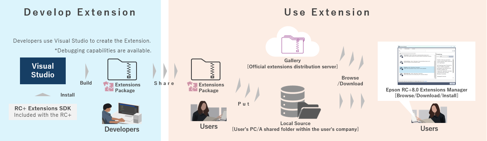
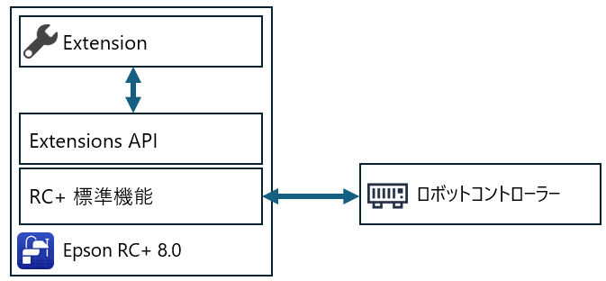
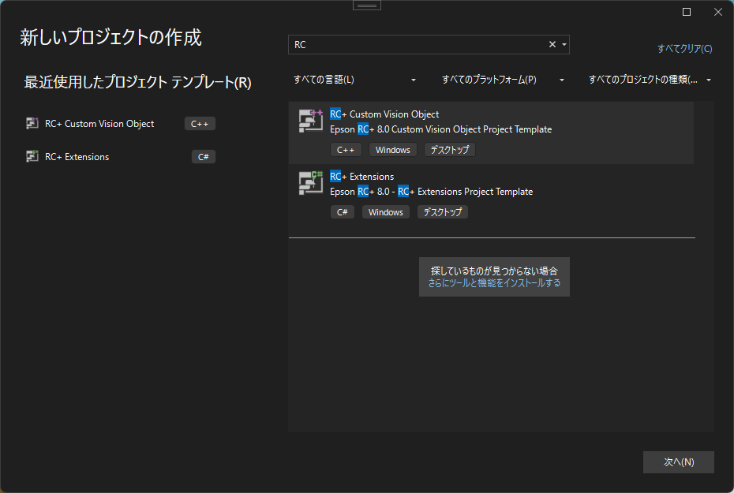
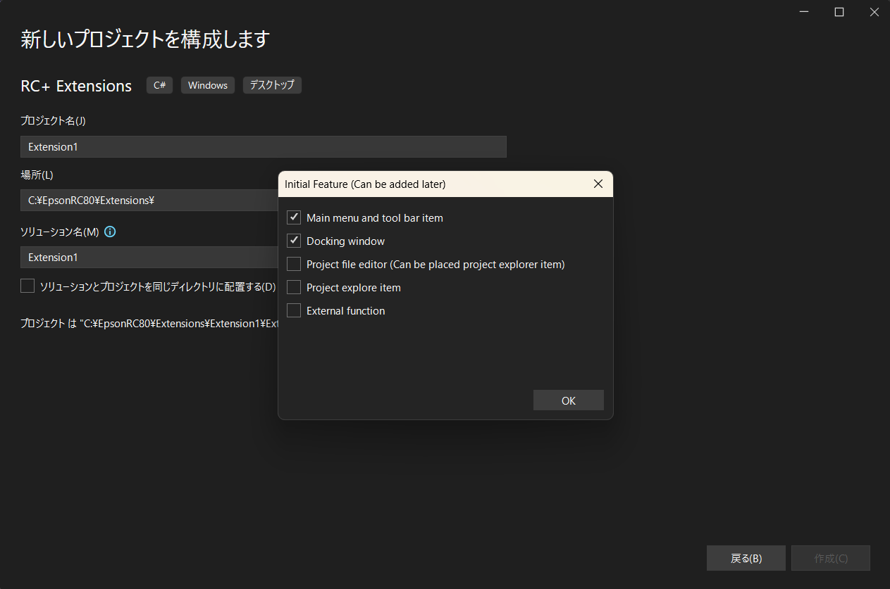
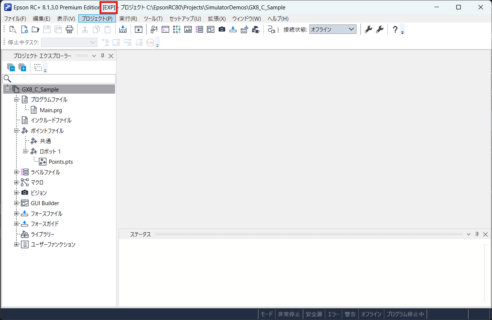
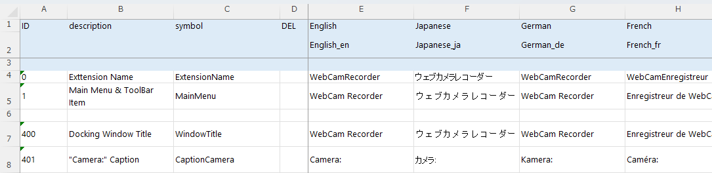
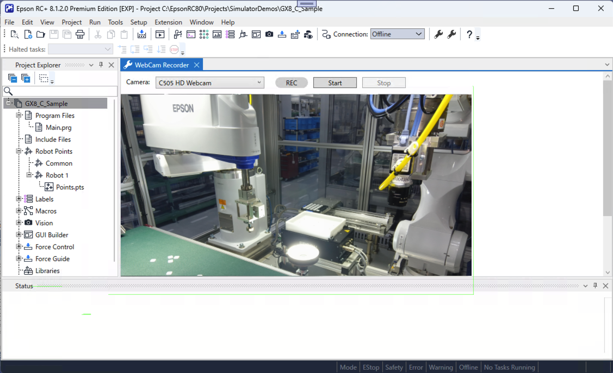
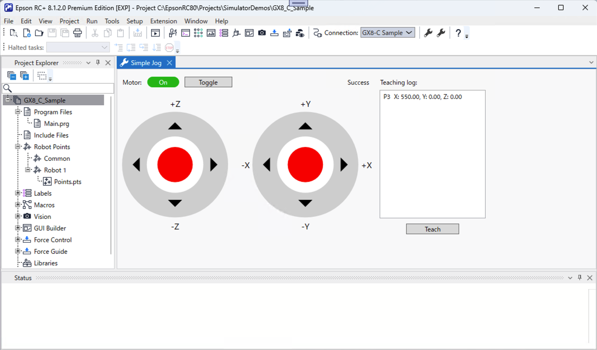
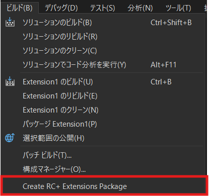

# Epson RC+ 8.0<br/>RC+ Extensions

[日本語](./readme_ja.md) / [English](./readme.md)

## 1. RC+ Extensions について

RC+ Extensionsは、ユーザーの用途や業務プロセスに合わせて、Epson RC+ 8.0をカスタマイズしたり、外部機器・システムと連携することで柔軟に拡張できるプラットフォームです。

エプソンが提供する拡張機能(Extension)を利用できるほか、ユーザー自身がVisual Studioを使って独自の拡張機能(Extension)を開発し、Epson RC+ 8.0にインストールして利用できます。  
これにより、Epson RC+ 8.0を継続的かつ柔軟に進化させることができ、作成した拡張機能(Extension)は組織内での再利用や共有も容易になります。

RC+ Extensionsでできること:

* 拡張機能の利用：エプソンが配信提供する拡張機能(Extension)、もしくはユーザーが作成した拡張機能(Extension)をインストールして利用可能
* 拡張機能の開発：Visual StudioとRC+ Extensions SDKを用いて、独自の拡張機能(Extension)を作成可能

※Epson RC+ 8.0 Ver8.1.3.0 以降、およびEpson RC+ Premium Edition のライセンスが必要です。

以下図は、RC+ Extensionsの利用方法と開発手順を示しています。

* ユーザー: Epson RC+の拡張機能マネージャーを使って、エプソンが公開しているギャラリーから拡張機能(Extension)を参照・ダウンロード・インストールできます。ローカルソースを指定すれば、開発者が作成した拡張機能(Extension)も同様に利用することができます。
* 開発者: Visual Studio と RC+ Extensions SDKを使って、拡張機能(Extension)を作成し、パッケージ化して共有できます。



RC+ Extensionsの利用に関しては、以下のマニュアルを参照してください。  
"Epson RC+ 8.0 拡張機能 RC+ Extensions 8.0 - RC+ Extensionsの利用"
詳細なAPI仕様に関しては、以下のRC+ Extensions APIリファレンスを参照してください。  
<https://epson-robots.github.io/rcplus-extensions>

## 2. RC+ Extensionsの開発

### 2.1 概要

RC+ Extensionsでは、次の種類の拡張機能を開発できます。それぞれ、対象とする機能や開発手法が異なります。

| Extension種類 | 主な使用言語 / 技術 | 概要 |
| --- | --- | --- |
| **RC+カスタム**:<br/>Epson RC+のUIおよび処理をカスタマイズ | C#, WPF, XAML | Epson RC+に独自の操作画面を追加できます。またSDKが提供する標準機能と外部ソフトウェア・ハードウェアを連携することで、新しい機能を実現できます。 |
| **PCビジョン カスタムビジョンオブジェクト**:<br/>ビジョンオブジェクトをカスタマイズ | C++, (画像処理の知識) | VisionGuideのPCビジョン機能に対して、独自のビジョンオブジェクトを追加できます。これにより、独自の画像処理や検出ロジックを組み込むことが可能です。 |

※Epson RC+ 8.0 Ver8.1.3.0 以降、およびEpson RC+ Premium Edition のライセンスが必要です。

開発の流れは次の通りです：

1. 開発環境の準備: [インストール](#32-インストール) 参照
2. RC+ Extensionsプロジェクトの作成: [利用開始](#33-利用開始) 参照
3. 実装、デバッグ: [チュートリアル](#34-チュートリアル) 参照
4. パッケージ化、共有: [Extensionの配布](#35-extensionの配布) 参照

### 3 RC+カスタムの開発

#### 3.1 概要

RC+カスタムは、Epson RC+の標準機能を超えて、ユーザー固有のニーズに応えるための拡張を可能にします。以下のような拡張を実現できます。

* **UI拡張**:Epson RC+の画面に独自のウィンドウを追加
* **標準機能呼び出し**:ポイント編集、コントローラー接続などEpson RC+の標準機能を呼び出し。
* **SPEL+連携**:DeclareステートメントによりExtension機能をSPEL+プログラムから呼び出し。
* **Webコンテンツ統合**:C# WPFのWebView2を利用し、Epson RC+上にWebページを表示。さらに、ExtensionとWeb間で双方向メッセージ通信が可能。

下図はシステム構造を示します。



Extensionは、RC+本体プロセス内(インプロセス)で動作します。Extensionは必ず、RC+ Extensions SDKのExtensions APIの公開インターフェースを経由して、RC+標準機能にアクセスし、RC+内部に直接アクセスできない設計です。これにより、RC+標準機能の整合性を担保しつつ、拡張によるUI追加や機能連携を安全に実現できます。

#### 3.2 インストール

開発を始めるには、以下の準備が必要です。

1. Epson RC+ 8.0をインストールします。
    * バージョン: 8.1.3.0 以降
    * 必須ライセンス: Epson RC+ Premium Edition
    * インストールパスは任意。本マニュアルでは C:\EpsonRC80 を想定。
1. Visual Studioをインストールします。
    * バージョン: Visual Studio 2022 17.14以降 (Enterprise、Professional、またはCommunityエディションを含む)
    * 必須コンポーネント: .NET デスクトップ開発、C++ によるデスクトップ開発
1. .NET 8 SDKをインストールします。
    * バージョン: 8.0.307 以降
1. Visual Studioへ拡張機能(VSIX)をインストールします。
    * C:\EpsonRC80\Extensions\SDKs\ExtensionsGenerator.vsix をダブルクリックします。VSIX インストーラーが起動するので、画面の指示に従ってインストールしてください。    
        ※VSIX のご利用には Premium Edition が必要です。Premium Edition で認証した RC+ を起動すると、VSIX は自動的に上記パスへ展開されます。
    * この拡張機能は、Visual Studio に RC+ Extensions 用の「プロジェクトテンプレート」と「ファイルテンプレート」を登録します。以降の手順では、これらのテンプレートを用いてプロジェクトの作成を行います。

#### 3.3 利用開始

以下の手順で、RC+ Extensionsプロジェクトを作成します。

1. Visual Studioで[新しいプロジェクトの作成]を選択します。
1. [RC+ Extensions]のプロジェクトテンプレートを選択します。  
    
1. [Initial Feature]ウィンドウにて利用する機能を選択します。  
    
    * **Main menu and tool bar item**: Epson RC+のメインウィンドウのメニューおよびツールバーにExtension専用のメニューを追加できます。
    * **Docking window**: Epson RC+のメインウィンドウにExtension専用のドッキングウィンドウを追加できます。
    * **Project file editor**: プロジェクト管理下にExtension専用の独自ファイルを追加できます。
    * **Project explore item**: プロジェクトエクスプローラーにExtension専用の項目を追加できます。
    * **External function**: SPEL+からDeclareステートメントでExtension専用の処理を呼び出すことができます。
    * ※後から必要な機能のファイルテンプレートは追加可能です。ソリューションエクスプローラーを右クリックし、[追加]-[新しい項目]を選択して[RC+]で検索して追加します。

作成されたプロジェクトはそのままビルドし、RC+にインストールした状態でデバッグが可能です。  
メニュー-[デバッグ]-[デバッグの開始]を選択することで、Extensionをビルドし、完了後にEpson RC+が起動します。Epson RC+が起動した後、選択した機能(ウィンドウやメニュー)が表示されることを確認してください。メインウィンドウのタイトルにはExtensionのデバッグ状態を示す[EXP]が表示されます。  
  
RC+が起動する際、既存のRC+インスタンスがある場合は終了してください。

#### 3.4 チュートリアル

ここでは手順を踏んで具体的なExtensionを作成します。  
読みやすさのため、編集するファイルの内容は、一部だけを載せている場合があります。ファイルの全体の内容は、samples フォルダに格納しているソースコード一式をご参照ください。

チュートリアルで作成できるExtension:

* [ウェブカメラレコーダー](#341-ウェブカメラレコーダー)
* [簡易ジョグ](#342-簡易ジョグ)

##### 3.4.1 ウェブカメラレコーダー

ここでは、PC に繋ぐことができる周辺機器の一つである、ウェブカメラを活用する RC+ Extension を作成してみましょう。

まず、RC+ のドッキングウィンドウで、ウェブカメラの画像をプレビューできるようにします(初級編)。

続いて、画像の録画機能を追加します(中級編)。SPEL+ プログラムの開始とともに録画を開始させ、終了とともに録画を終了させます。プログラムが長時間動くことを想定し、5 秒ごとに新しいファイルを作成して録画し、最新の 2 ファイルだけを残すようにします。

これは、車のドライブレコーダーと同じような機能を、システムに追加しようとするものです。装置立ち上げの過程などで、ロボットによる作業を監視しておくと、プログラムが予期せずに停止した場合に、録画された映像から何が起こったのかを、後から目視確認することが可能になります。

PC がネットワークに接続されている場合には、録画データとともに、異常を知らせる通知を送信する等の応用もできるでしょう。

それでは始めましょう。

###### 初級編

1. [利用開始](#33-利用開始)の手順に従って、RC+ Extension の新しいプロジェクトを作成します。
    * 名前は、WebCamRecorder とします。
    * 初期機能は、**Main menu and tool bar item** および **Docking window** をチェックします。
    * ARM64 版 Windows では、構成を x64 にしてください。

1. ビルド、デバッグして、動作することを確認します。
    * メニュー項目に `WebCamRecorder (xx)`(xx は表示言語名)が追加され、メニュー項目を選択して、ドッキングウィンドウが表示されれば OK です。

1. いったん RC+ を終了します。

1. Visual Studio のソリューションエクスプローラーで、WebCamRecorder プロジェクトをダブルクリックし、以下の変更を行います。
    * TargetFramework を、net8.0-windows10.0.19041.0 に変更します。
        * これにより、Windows Media Foundation の API が使えるようになります。以下の変更も、これに関連するものです。Windows Media Foundation は、DirectShow の後継として、Windows Vista 以降の OS に標準搭載されている COM ベースの API セットです。現時点では、.NET の標準ライブラリには取り込まれていませんが、次に述べる Microsoft.Windows.CsWin32 などを用いることで、標準ライブラリと同様に利用できます。
    * `<EnableWindowsTargeting>true</EnableWindowsTargeting>` の行を追加します。
    * `<AllowUnsafeBlocks>true</AllowUnsafeBlocks>` の行を追加します。

1. 「ツール」> 「NuGet パッケージマネージャー」 > 「ソリューションの NuGet パッケージの管理」を選択し、画面を開きます。
    * 「参照」タブから、Microsoft.Windows.CsWin32 パッケージを探し、最新の安定版(執筆時点で 0.3.264)をインストールします。
        * Microsoft.Windows.CsWin32 は、C# から Windows API を簡単に呼び出すためのライブラリです。詳細は、<https://github.com/microsoft/CsWin32> をご覧ください。

1. プロジェクトに、NativeMethods.txt および NativeMethods.json ファイルを追加します。
    * これらは、Microsoft.Windows.CsWin32 を使って Windows API を利用するために必要なファイルです。
    * NativeMethods.txt

        ```txt
        MFStartup
        MFShutdown
        MFCreateAttributes
        MFEnumDeviceSources
        MFCreateSourceReaderFromMediaSource
        MFCreateMediaType
        MFCreateSinkWriterFromURL
        MFCreateSample
        MFCreateAlignedMemoryBuffer

        (中略)

        CoInitializeEx
        CoTaskMemFree

        COINIT
        ```

    * NativeMethods.json

        ```JSON
        {
            "$schema": "https://aka.ms/CsWin32.schema.json",
            "public": true
        }
        ```

1. プロジェクトに、以下のファイルを追加します。
    * CameraInfo.cs
        * この Extension で、カメラを表すクラス CameraInfo を記述しているファイルです。

        ```C#
        (前略)

        namespace WebCamRecorder
        {
            /// <summary>
            /// Camera information
            /// </summary>
            public class CameraInfo
            {
                /// <summary>
                /// Friendly name (may not be unique)
                /// </summary>
                public string FriendlyName { get; }

                /// <summary>
                /// Unique symbolic link
                /// </summary>
                public string SymbolicLink { get; }

                /// <summary>
                /// Constructor
                /// </summary>
                /// <param name="friendlyName">Friendly name</param>
                /// <param name="symbolicLink">Symbolic link</param>
                public CameraInfo(
                    string friendlyName,
                    string symbolicLink
                )
                {
                    FriendlyName = friendlyName;
                    SymbolicLink = symbolicLink;
                }
            }
        }
        ```

    * CameraInfoCollection.cs
        * カメラの一覧を表し、指定したカメラのメディアソース(Windows Media Foundation で、データ処理の入り口となるオブジェクト)を取得するためのクラス CameraInfoCollection を記述しているファイルです。

        ```C#
        (前略)

        namespace WebCamRecorder
        {
            (中略)

            /// <summary>
            /// Camera collection object
            /// </summary>
            public sealed class CameraInfoCollection : IDisposable
            {
                /// <summary>
                /// Camera information
                /// </summary>
                public List<CameraInfo> CameraInfos = [];

                /// <summary>
                /// Source activates
                /// </summary>
                private unsafe IMFActivate_unmanaged** _sourceActivates;

                /// <summary>
                /// Constructor
                /// </summary>
                /// <param name="sourceActivates">Source activates</param>
                public unsafe CameraInfoCollection(
                    IMFActivate_unmanaged** sourceActivates
                )
                {
                    _sourceActivates = sourceActivates;
                }

                /// <summary>
                /// Create media source for the specified camera
                /// </summary>
                /// <param name="cameraInfo">Selected camera</param>
                /// <returns>Media source object</returns>
                public unsafe IMFMediaSource? GetMediaSource(
                    CameraInfo cameraInfo
                )
                {
                    var index = CameraInfos.FindIndex(
                        (x) => (
                            x != null
                            && x.FriendlyName == cameraInfo.FriendlyName
                            && x.SymbolicLink == cameraInfo.SymbolicLink
                        )
                    );
                    if (index < 0)
                    {
                        return null;
                    }
                    else
                    {
                        if (Marshal.GetObjectForIUnknown((nint)_sourceActivates[index]) is not IMFActivate managedSourceActivate)
                        {
                            return null;
                        }

                        var mediaSource = managedSourceActivate.ActivateObject(typeof(IMFMediaSource).GUID) as IMFMediaSource;

                        Marshal.ReleaseComObject(managedSourceActivate);

                        return mediaSource;
                    }
                }

                (後略)
        ```

    * IFrameProcessor.cs
        * カメラから取得した画像を処理するためのインターフェイス IFrameProcessor を記述するファイルです。

        ```C#
        (前略)

        namespace WebCamRecorder
        {
            /// <summary>
            /// Frame processor interface
            /// </summary>
            public interface IFrameProcessor
            {
                /// <summary>
                /// Initialize the processor
                /// </summary>
                /// <param name="width">Frame width</param>
                /// <param name="height">Frame height</param>
                /// <param name="stride">Frame stride</param>
                /// <param name="bitRate">Bit rate</param>
                public void Initialize(
                    uint width,
                    uint height,
                    uint stride,
                    uint bitRate
                );

                /// <summary>
                /// Termniate the processor
                /// </summary>
                public void Terminate();

                /// <summary>
                /// Process the frame
                /// </summary>
                /// <param name="frame">Frame data</param>
                /// <param name="duration">Duration</param>
                public void Process(
                    byte[] frame,
                    long duration
                );

                /// <summary>
                /// Request stopping
                /// </summary>
                public void Stop();

                /// <summary>
                /// The processing is currently stopping or not
                /// </summary>
                public bool IsStopped { get; }
            }
        }
        ```

    * CameraManager.cs
        * 撮像を行い、画像処理器(上記 IFrameProcessor を実装するクラスのインスタンス)に順に画像データを渡す CameraManager クラスを記述するファイルです。

        ```C#
        (前略)

        namespace WebCamRecorder
        {
            (中略)

            /// <summary>
            /// Camera manager
            /// </summary>
            public class CameraManager
            {
                /// <summary>
                /// List of frame processors
                /// </summary>
                public List<IFrameProcessor> FrameProcessors { get; } = [];

                (中略)

                /// <summary>
                /// List available cameras
                /// </summary>
                /// <returns>Collection object</returns>
                public unsafe CameraInfoCollection? ListCameras()
                {

                (中略)

                /// <summary>
                /// Read a frame from source
                /// </summary>
                /// <param name="sourceReader">Source reader object</param>
                /// <param name="frame">Buffer</param>
                /// <param name="duration">Variable to get duration</param>
                /// <returns>1: got it, 0: not got, -1: error</returns>
                private static unsafe int ReadFrame(
                    IMFSourceReader sourceReader,
                    byte[] frame,
                    out long duration
                )
                {
                (中略)

                /// <summary>
                /// Start the processings
                /// </summary>
                /// <param name="cameraInfo">Selected camera</param>
                /// <returns>Task</returns>
                public async Task Start(
                    CameraInfo cameraInfo
                )
                {
                    while (!_done)
                    {
                        const int _waitMSec = 10;

                        await Task.Delay(_waitMSec);
                    }

                    await Task.Run(() =>
                    {
                        HRESULT hr;

                        hr = PInvoke.CoInitializeEx(COINIT.COINIT_MULTITHREADED);
                        if (hr.Failed)
                        {
                            return;
                        }

                        hr = PInvoke.MFStartup(PInvoke.MF_VERSION, PInvoke.MFSTARTUP_FULL);
                        if (hr.Succeeded)
                        {
                            _done = false;

                            var sourceReader = CreateSourceReader(cameraInfo);
                            if (sourceReader != null)
                            {
                                GetVideoInfos(
                                    sourceReader,
                                    out var width,
                                    out var height,
                                    out var stride,
                                    out var bitRate
                                );

                                var frame = new byte[stride * height];

                                foreach (var frameProcessor in FrameProcessors)
                                {
                                    frameProcessor.Initialize(width, height, stride, bitRate);
                                }

                                _stopping = false;
                                while (true)
                                {
                                    var status = ReadFrame(sourceReader, frame, out var duration);
                                    if (status < 0)
                                    {
                                        break;
                                    }
                                    else if (status > 0)
                                    {
                                        foreach (var frameProssor in FrameProcessors)
                                        {
                                            frameProssor.Process(frame, duration);
                                        }
                                    }

                                    if (_stopping && FrameProcessors.All(x => x.IsStopped))
                                    {
                                        break;
                                    }
                                }

                                foreach (var frameProcessor in FrameProcessors)
                                {
                                    frameProcessor.Terminate();
                                }

                                Marshal.ReleaseComObject(sourceReader);
                            }

                            _ = PInvoke.MFShutdown();

                            _done = true;
                            _stoppedAction?.Invoke();
                        }
                    });
                }

                (後略)
        ```

    * Previewer.cs
        * カメラ画像のプレビューを行うためのクラス Previewer を記述するファイルです。
            * PreviewImage が、ウィンドウに画像を表示するための Image コントロールです。初期化時に、ビットマップデータを作成して、PreviewImage の Source に設定し、以降、CameraManager から渡された画像データを、ビットマップに書き込んでいます。

        ```C#
        (前略)

        namespace WebCamRecorder  
        {
            (中略)

            /// <summary>
            /// Image previewer for the camera
            /// </summary>
            public class Previewer : IFrameProcessor
            {
                /// <summary>
                /// Image control
                /// </summary>
                public Image? PreviewImage;

                /// <summary>
                /// Bitmap
                /// </summary>
                private WriteableBitmap? _bitmap;

                (中略)

                /// <inheritdoc />
                public void Initialize(
                    uint width,
                    uint height,
                    uint stride,
                    uint bitRate
                )
                {
                    _width = (int)width;
                    _height = (int)height;
                    _stride = (int)stride;

                    Application.Current.Dispatcher.Invoke(() =>
                    {
                        _bitmap = new(
                            _width, _height,
                            96, 96,
                            PixelFormats.Bgr32,
                            null
                        );

                        if (PreviewImage != null)
                        {
                            PreviewImage.Source = _bitmap;
                        }
                    });
                }

                (中略)

                /// <inheritdoc />
                public void Process(
                    byte[] frame,
                    long duration
                )
                {
                    if (_bitmap == null)
                    {
                        return;
                    }

                    Application.Current.Dispatcher.Invoke(() =>
                    {
                        _bitmap.WritePixels(
                            new Int32Rect(0, 0, _width, _height),
                            frame,
                            _stride,
                            0
                        );
                    });
                }

                (後略)
        ```

1. DockingWindow フォルダの DockingWindowContent.xaml ファイルを編集します。
    * 画像がウィンドウより大きい場合を考慮し、ScrollViewer を配置して、その中に DockPanel を移動します。
    * 元からある TextBlock と Grid は削除します。
    * Label と ComboBox を持つ StackPanel を追加します。
        * この Extension では、ComboBox のドロップダウンメニューを表示させるタイミングで、(もし行われていれば)撮像処理を中止し、接続されているカメラの一覧を取得します。ドロップダウンメニューからカメラが選択されたら、撮像処理を開始します。これらの処理は、後ほど記述しますが、以下のプロパティやコマンドをビューモデル追加する想定で、これらを該当箇所にバインドしておきます。
            * カメラ一覧を表す Cameras(`ReactiveCollection<CameraInfo>`)
            * 選択されているカメラの、カメラ一覧でのインデックスを表す SelectedCameraIndex(`ReactivePropertySlim<int>`)
            * カメラ一覧を(再)取得するコマンド RefreshCamerasCommand(ReactiveCommand)
        * Label の Content に注目してください。Captions[CaptionCamera].Value にバインドしています。 Extension では、RC+ の表示言語に従ってローカライズしたい文字列を Captions.xlsx に記述します。詳細は後述しますが、Captions.xlsx の symbol 列で定義した名前(この場合は CaptionCamera)を使って、同様にバインドすることで、RC+ の表示言語に従ったローカライズを行うことができます。
    * PreviewImage と名付けた Image を追加します。

        ```XML
        <UserControl x:Class="WebCamRecorder.DockingWindow.DockingWindowContent"
                    xmlns="http://schemas.microsoft.com/winfx/2006/xaml/presentation"
                    xmlns:x="http://schemas.microsoft.com/winfx/2006/xaml"
                    xmlns:mc="http://schemas.openxmlformats.org/markup-compatibility/2006"
                    xmlns:d="http://schemas.microsoft.com/expression/blend/2008"
                    xmlns:i="http://schemas.microsoft.com/xaml/behaviors"
                    xmlns:local="clr-namespace:WebCamRecorder.DockingWindow"
                    mc:Ignorable="d"
                    d:DesignHeight="450" d:DesignWidth="800">

            <UserControl.DataContext>
                <local:DockingWindowContentViewModel />
            </UserControl.DataContext>

            <ScrollViewer
                VerticalScrollBarVisibility="Auto"
                HorizontalScrollBarVisibility="Auto">

                <DockPanel
                    Background="White"
                    LastChildFill="True">

                    <StackPanel
                        DockPanel.Dock="Top"
                        Orientation="Horizontal"
                        Margin="10">

                        <Label
                            Content="{Binding Captions[CaptionCamera].Value}" />
                        <ComboBox
                            ItemsSource="{Binding Cameras}"
                            SelectedIndex="{Binding SelectedCameraIndex.Value}"
                            IsReadOnly="True"
                            DisplayMemberPath="FriendlyName"
                            MinWidth="200"
                            Margin="10,0,0,0">
                            <i:Interaction.Triggers>
                                <i:EventTrigger
                                    EventName="DropDownOpened">
                                    <i:InvokeCommandAction
                                        Command="{Binding RefreshCamerasCommand}" />
                                </i:EventTrigger>
                            </i:Interaction.Triggers>
                        </ComboBox>

                    </StackPanel>

                    <Image
                        x:Name="PreviewImage"
                        Width="640"
                        Height="480"
                        Stretch="UniformToFill"
                        HorizontalAlignment="Left" />

                </DockPanel>
            </ScrollViewer>

        </UserControl>
        ```

1. DockingWindow フォルダの DockingWindowContentViewModelAddition.cs を編集します。
    * DockingWindow フォルダには、DockingWindowContentViewModel.cs ファイルも存在し、これら 2 つのファイルで DockingWindowContentViewModel クラスを記述します。
        * DockingWindowContentViewModel.cs には、クローズや保存などの他、コピーやカット、ペーストなどのコンテンツ編集用のメソッドがあり、必要に応じて処理を記述します。
            * この Extension では、ウィンドウクローズ時に、撮像処理を停止する処理だけを加えます。

                ```C#
                (前略)

                /// <inheritdoc />
                public Task<bool> CloseAsync()
                {
                    _cameraManager.Stop();

                    return Task.FromResult(true);
                }

                (後略)
                ```

        * DockingWindowContentViewModelAddition.cs には、ビューモデルのコンストラクタと、ウィンドウ生成後に一度だけ呼ばれる WindowCreated メソッドがあります。ウィンドウ独自のプロパティやコマンド、およびそれらに関係する API の呼び出しは、このファイルにまとめることで、ビューモデル全体を見通しよく記述できます。

            ```C#
            (前略)

            namespace WebCamRecorder.DockingWindow
            {
                (中略)

                /// <summary>
                /// Extension : Docking Window (Specific Part)
                /// </summary>
                internal partial class DockingWindowContentViewModel
                {
                    /// <summary>
                    /// Camera list
                    /// </summary>
                    public ReactiveCollection<CameraInfo> Cameras { get; } = [];

                    /// <summary>
                    /// Index of the selected camera
                    /// </summary>
                    public ReactivePropertySlim<int> SelectedCameraIndex { get; } = new(-1);

                    /// <summary>
                    /// Refresh camera list command
                    /// </summary>
                    public ReactiveCommand RefreshCamerasCommand { get; } = new();

                    (中略)

                    /// <summary>
                    /// Camera manager
                    /// </summary>
                    private readonly CameraManager _cameraManager = new();

                    /// <summary>
                    /// Previewer
                    /// </summary>
                    private readonly Previewer _previewer = new();

                    (中略)

                    /// <summary>
                    /// Refresh camera list
                    /// </summary>
                    private void OnRefreshCameras()
                    {
                        SelectedCameraIndex.Value = -1;

                        Cameras.Clear();
                        var cameraInfoCollection = _cameraManager.ListCameras();
                        if (cameraInfoCollection != null)
                        {
                            foreach (var cameraInfo in cameraInfoCollection.CameraInfos)
                            {
                                Cameras.Add(cameraInfo);
                            }
                            cameraInfoCollection.Dispose();
                        }
                    }

                    /// <summary>
                    /// Change camera
                    /// </summary>
                    /// <param name="index">The index of the selected camera</param>
                    /// <returns>Task</returns>
                    private async Task OnSelectedCameraChanged(
                        int index
                    )
                    {
                        _cameraManager.Stop();

                        if (index >= 0)
                        {
                            await _cameraManager.Start(Cameras[index]);
                        }
                    }

                    /// <summary>
                    /// Set image control for previewer
                    /// </summary>
                    /// <param name="previewImage">Image control for previewing</param>
                    public void SetPreviewImage(
                        Image previewImage
                    )
                    {
                        _previewer.PreviewImage = previewImage;
                    }

                    /// <summary>
                    /// Constructor
                    /// </summary>
                    public DockingWindowContentViewModel()
                    {
                        _cameraManager.FrameProcessors.Add(_previewer);

                        RefreshCamerasCommand.Subscribe(OnRefreshCameras).AddTo(_disposables);

                        SelectedCameraIndex.Subscribe(async (index) =>
                        {
                            await OnSelectedCameraChanged(index);
                        })
                        .AddTo(_disposables);
                    }

                    (後略)
            ```

1. DockinwWindow フォルダの DockingWindowContent.xaml.cs ファイルを編集します。
    * プレビュー用の Image コントロールへの参照を、ビューモデルに渡します。

        ```C#
        (前略)

        if (DataContext is DockingWindowContentViewModel viewModel)
        {
            viewModel.SetPreviewImage(PreviewImage);
        }

        (後略)
        ```

1. Captions.xlsx ファイルを開いて編集します。
    * 前述したように、RC+ の表示言語に従ってローカライズしたい文字列は、このファイルに記述します。
        
        * ID は、キャプション番号です。このファイル内で重複しないように採番してください。
        * description は、コメントです。自由に書くことができます。
        * symbol は、Extension のソースコード(.xaml、.cs)で参照するための名前です。Captions.xlsx ファイルを編集してプロジェクトをビルドすると、symbol と ID を紐づけた定数定義が Captions.cs ファイルとして生成されます。このファイルは直接編集しないでください。

            ```C#
            // <auto-generated>

            namespace WebCamRecorder
            {
                using System.Reflection;

                internal class Constants
                {
                    internal class Caption
                    {
                        (中略)

                        public const int ExtensionName = 0;
                        public const int MainMenu = 1;
                        public const int WindowTitle = 400;
                        public const int CaptionCamera = 401;
                    }
                }
            }
            ```

        * English、Japanese、… の各列には、その言語で表示したい文字列を記述します。

1. ビルド、デバッグします。
    * PC にウェブカメラを接続して、WebCamRecorder のウィンドウを表示し、カメラを選択して、画像が表示されれば成功です。

###### 中級編

初級編では、生成されたソリューションに使われているものを除いて、Extensions API を利用していません。

中級編では、次の機能を提供する Extensions API を使ってみます。

* 開かれているプロジェクトの、プロジェクトフォルダのパス名を取得する(プロジェクト API)。
* SPEL+ のタスク一覧を取得する(プログラム実行 API)。

.NET の豊富なライブラリや Windows API を活用しつつ、必要な Extensions API を使うことで、RC+ や SPEL+ プログラムと緊密に連携する独自のアプリケーションを Extension として作成し、利用することができます。

それでは、進めましょう。

1. RC+ が起動していたら終了させ、Visual Studio を起動して、初級編で作成したソリューションを開きます。

1. Recorder.cs を追加します。
    * Recorder クラスは、Previewer クラスと同様に、IFrameProcessor を実装しています。Recorder では、CameraManager から渡された画像データから、H.264 形式の動画ファイルを生成します。
    * 動画ファイルは、およそ 5 秒ごとに、Recorder インスタンスにパスを設定したフォルダの下に、`Video_N.mp4`(N は、000 〜 999 で、999 に達した後は 000 に戻ります)という名前で新たに作成されますが、PC のストレージを圧迫しないよう、最新の 2 ファイルだけを残すことにします。
        * この Extension では、新たに録画を開始するときは、フォルダ内の動画はすべて削除します。
    * また、ドライブレコーダー的な動作をさせるために、録画の停止を指示してからも、そこから 2 秒間は録画を続けるようにします。(つまり、最後に保存される動画は、最大 7 秒程度となります。)
    * 録画は、SPEL+ プログラムの開始・終了に連動するモード(Auto)の他に、任意のタイミングで開始・停止できるモード(Manual)も用意することとします。
    * カメラ画像のプレビューには、特に明示的な開始が必要なかったこともあり(カメラを選んだ時点で開始します)、IFrameProcessor には、停止を指示する Stop メソッドしか用意されていません。このため、Recorder には、上記の録画モードを Mode プロパティとして持たせ、Mode の設定で録画が開始されるようにします。さらに、Mode の変更で PropertyChanged イベントを発生するようにして、録画が実際に停止したタイミングもプログラムで捕まえられるようにします。

        ```C#
        (前略)

        namespace WebCamRecorder
        {
            (中略)

            /// <summary>
            /// Recorder
            /// </summary>
            public class Recorder : IFrameProcessor, INotifyPropertyChanged
            {
                /// <summary>
                /// Recording mode definitions
                /// </summary>
                public enum RecordingMode
                {
                    Stop,
                    Auto,
                    Manual,
                }

                /// <inheritdoc />
                public event PropertyChangedEventHandler? PropertyChanged;

                /// <summary>
                /// Recording mode
                /// </summary>
                public RecordingMode Mode
                {
                    get
                    {
                        return _mode;
                    }
                    set
                    {
                        if (_sinkWriter == null)
                        {
                            _shouldStop = false;

                            _mode = value;
                            RaisePropertyChanged();
                        }
                    }
                }

                /// <summary>
                /// Folder for video files
                /// </summary>
                public string VideoFolder
                {
                    get
                    {
                        return _videoFolder;
                    }
                    set
                    {
                        if (_sinkWriter == null)
                        {
                            try
                            {
                                Directory.CreateDirectory(value);
                                _videoFolder = value;
                            }
                            catch (Exception)
                            {
                                // EMPTY
                            }
                        }
                    }
                }

                (中略)

                /// <inheritdoc />
                public void Process(
                    byte[] frame,
                    long duration
                )
                {
                    if (_sinkWriter == null)
                    {
                        if (_mode == RecordingMode.Stop)
                        {
                            return;
                        }

                        _sinkWriter = CreateSinkWriter(GetNextSegmentFile());

                        _recordTime = 0;
                        _segmentSpan = _initialSegmentSpan;
                    }

                    if (_sinkWriter != null && _sample != null)
                    {
                        SetFlippedFrame(frame);

                        _sample.SetSampleTime(_recordTime);
                        _sample.SetSampleDuration(duration);

                        _sinkWriter.WriteSample(_streamIndex, _sample);

                        _recordTime += duration;
                        if (_recordTime > _segmentSpan)
                        {
                            _sinkWriter.Finalize();
                            Marshal.ReleaseComObject(_sinkWriter);
                            _sinkWriter = null;

                            if (_shouldStop)
                            {
                                Mode = RecordingMode.Stop;
                            }
                        }
                    }
                }

                /// <inheritdoc />
                public void Stop()
                {
                    const long _minAdditionalTime = 20_000_000;

                    if (_segmentSpan - _recordTime < _minAdditionalTime)
                    {
                        _segmentSpan = _recordTime + _minAdditionalTime;
                    }

                    _shouldStop = true;
                }

                (後略)
        ```

1. DockingWindow フォルダの DockingWindowContent.xaml ファイルを編集します。
    * 画面に、録画中であることを示すインジケータの表示と、手動(Manual モード)で録画を開始、停止できるようにするボタンを追加します。
    * ビューモデルには、以下のプロパティとコマンドを後で追加します。
        * 録画中を示す IsRecording(`ReactivePropertySlim<bool>`)
        * 録画が開始可能であることを示す CanStartRecording(`ReactivePropertySlim<bool>`)と、録画開始を指示する StartRecordingCommand(`ReactiveCommand`)
        * 録画が停止可能であることを示す CanStopRecording(`ReactivePropertySlim<bool>`)と、録画停止を指示する StopRecordingCommand(`ReactiveCommand`)
        * この Extension では、Auto モードでの録画中は、手動での録画開始・停止はできないようにし、逆に Manual モードでの録画中は、Auto モードでの録画は機能させないようにします。
            * ただし、どちらの場合も、ドッキングウィンドウを閉じることで、録画停止となります。

        ```XML
        (前略)

        </ComboBox>
        <Border
            CornerRadius="10"
            Width="60"
            Height="20"
            Margin="20,0,0,0"
            VerticalAlignment="Center">
            <TextBlock
                Text="REC"
                HorizontalAlignment="Center"
                VerticalAlignment="Center">
                <TextBlock.Style>
                    <Style
                        TargetType="TextBlock">
                        <Style.Triggers>
                            <DataTrigger
                                Binding="{Binding IsRecording.Value}"
                                Value="True">
                                <Setter
                                    Property="Foreground"
                                    Value="White" />
                            </DataTrigger>
                            <DataTrigger
                                Binding="{Binding IsRecording.Value}"
                                Value="False">
                                <Setter
                                    Property="Foreground"
                                    Value="Black" />
                            </DataTrigger>
                        </Style.Triggers>
                    </Style>
                </TextBlock.Style>
            </TextBlock>
            <Border.Style>
                <Style
                    TargetType="Border">
                    <Style.Triggers>
                        <DataTrigger
                            Binding="{Binding IsRecording.Value}"
                            Value="True">
                            <Setter
                                Property="Background"
                                Value="Red" />
                        </DataTrigger>
                        <DataTrigger
                            Binding="{Binding IsRecording.Value}"
                            Value="False">
                            <Setter
                                Property="Background"
                                Value="LightGray" />
                        </DataTrigger>
                    </Style.Triggers>
                </Style>
            </Border.Style>
        </Border>
        <Button
            Command="{Binding StartRecordingCommand}"
            IsEnabled="{Binding CanStartRecording.Value}"
            Content="{Binding Captions[LabelStart].Value}"
            Width="80"
            VerticalAlignment="Center"
            Margin="10,0,0,0" />
        <Button
            Command="{Binding StopRecordingCommand}"
            IsEnabled="{Binding CanStopRecording.Value}"
            Content="{Binding Captions[LabelStop].Value}"
            Width="80"
            VerticalAlignment="Center"
            Margin="10,0,0,0" />
        ```

1. DockingWindow フォルダの DockingWindowContentViewModelAddition.cs ファイルを編集します。
    * ビュー側(.xaml)でバインドしたプロパティやコマンドを追加します。
    * Recorder クラスのインスタンスも CameraManager に追加します。
    * WindowCreated メソッドにご注目ください。ここで、Extensions API の、プロジェクト API を使って、開かれているプロジェクトのプロジェクトフォルダ(のパス名)を取得しています。
        * API オブジェクトは、Main.GetAPI メソッドで取得します。
        * プロジェクト API オブジェクトの ProjectFolder プロパティは、開いているプロジェクトの、プロジェクトフォルダのパス名です。プロジェクトが開かれていないときは null です。
            * プロジェクトが開かれていなかった場合は、プロジェクトフォルダのかわりに、Windows のログインユーザーの「ビデオ」フォルダを使うことにします。
        * 録画ファイルは、プロジェクトフォルダまたはログインユーザーの「ビデオ」フォルダに、サブフォルダ WebCamRecorder を作成して、その中に保存するよう、Recorder に設定しています。

        ```C#
        (前略)
        /// <summary>
        /// Recording in progress or not
        /// </summary>
        public ReactivePropertySlim<bool> IsRecording { get; } = new(false);

        /// <summary>
        /// Can start recording or not
        /// </summary>
        public ReactivePropertySlim<bool> CanStartRecording { get; } = new(false);

        /// <summary>
        /// Start recording command
        /// </summary>
        public ReactiveCommand StartRecordingCommand { get; }

        /// <summary>
        /// Can stop recording or not
        /// </summary>
        public ReactivePropertySlim<bool> CanStopRecording { get; } = new(false);

        /// <summary>
        /// Stop recording command
        /// </summary>
        public ReactiveCommand StopRecordingCommand { get; }

        (中略)

        /// <summary>
        /// Recorder
        /// </summary>
        private readonly Recorder _recorder = new();

        (中略)

        /// <summary>
        /// Change camera
        /// </summary>
        /// <param name="index">The index of the selected camera</param>
        /// <returns>Task</returns>
        private async Task OnSelectedCameraChanged(
            int index
        )
        {
            EnableOrDisableRecordingCommands();

            _cameraManager.Stop();

            if (index >= 0)
            {
                await _cameraManager.Start(Cameras[index]);
            }
        }

        (中略)

        /// <summary>
        /// Update recording command possibilities
        /// </summary>
        private void EnableOrDisableRecordingCommands()
        {
            CanStartRecording.Value = (SelectedCameraIndex.Value >= 0 && _recorder.Mode == Recorder.RecordingMode.Stop);
            CanStopRecording.Value = (_recorder.Mode == Recorder.RecordingMode.Manual);
        }
        /// <summary>
        /// Start recording
        /// </summary>
        private void OnStartRecording(
            bool isAuto
        )
        {
            if (_recorder.Mode == Recorder.RecordingMode.Stop)
            {
                try
                {
                    var files = Directory.EnumerateFiles(
                        _recorder.VideoFolder,
                        $"*{Recorder.VideoFileExtension}"
                    );
                    foreach (var file in files)
                    {
                        File.Delete(file);
                    }
                }
                catch (Exception)
                {
                    // IGNORE
                }
                _recorder.Mode = isAuto ? Recorder.RecordingMode.Auto : Recorder.RecordingMode.Manual;

                EnableOrDisableRecordingCommands();
            }
        }

        /// <summary>
        /// Stop recording
        /// </summary>
        private void OnStopRecording()
        {
            _recorder.Stop();

            CanStopRecording.Value = false;
        }

        /// <summary>
        /// Constructor
        /// </summary>
        public DockingWindowContentViewModel()
        {
            _cameraManager.FrameProcessors.Add(_previewer);
            _cameraManager.FrameProcessors.Add(_recorder);

            (中略)

            _recorder.PropertyChanged += (_, _) =>
            {
                IsRecording.Value = (_recorder.Mode != Recorder.RecordingMode.Stop);
                EnableOrDisableRecordingCommands();
            };

            (中略)

        }

        /// <inheritdoc />
        public Task WindowCreated()
        {
            string videoFolder;

            var projectAPI = Main.GetAPI<IRCXProjectAPI>();
            if (projectAPI != null && projectAPI.ProjectFolder != null)
            {
                videoFolder = projectAPI.ProjectFolder;
            }
            else
            {
                videoFolder = Environment.GetFolderPath(Environment.SpecialFolder.MyVideos);    
            }
            _recorder.VideoFolder = Path.Combine(videoFolder, "WebCamRecorder");

            (後略)
        ```

1. ビルド、デバッグします。
    * ドッキングウィンドウを開いて、カメラを選択し、録画開始と停止を試してください。
    * 
    * 所定のフォルダー※に、動画ファイルが保存されており、再生できれば成功です。  
        ※プロジェクトを開いている場合は、プロジェクトフォルダ内の「WebCamRecorder」フォルダ      　プロジェクトを開いていない場合は、Windows ログインユーザーの「ビデオ」フォルダ
1. DockingWindow フォルダの DockingWindowContentViewModelAddition.cs ファイルを編集します。
    * Auto モードでの録画機能を追加します。このためには、Extension で、SPEL+ プログラムの実行開始と、実行終了のタイミングを捉える必要があります。
        * SPEL+ プログラムは、マルチタスクです。この Extension では、SPEL+ プログラムの開始・終了は、通常タスクの開始・終了であるとします。
        * タスクの一覧は、プログラム実行 API オブジェクトの Tasks プロパティで取得します。
            * Tasks は `IEnumerable<IRCXTask>` 型のコレクションで、IRCXTask インスタンスは、タスク状態を示す State と、タスク種別を示す Kind プロパティを持っています。
            * SPEL+ のタスクに何らかの変更があると、Tasks プロパティの PropertyChanged イベントが発生するようになっています。
    * WindowCreated メソッドに、実行中の通常タスクの有無を監視して、`ReactivePropertySlim<bool>` の _isProgramRunning を更新する以下のコードを追加します。

        ```C#
        (前略)

        /// <summary>
        /// Program execution API object
        /// </summary>
        private IRCXProgramExecutionAPI? _programExecutionAPI;

        /// <summary>
        /// Program running state
        /// </summary>
        private readonly ReactivePropertySlim<bool> _isProgramRunning = new(false, ReactivePropertyMode.DistinctUntilChanged);

        (中略)

        /// <inheritdoc />
        public Task WindowCreated()
        {
            (中略)

            _programExecutionAPI = Main.GetAPI<IRCXProgramExecutionAPI>();

            _programExecutionAPI?.ObserveProperty(x => x.Tasks).Subscribe((tasks) =>
            {
                _isProgramRunning.Value = tasks
                .Any(
                    x => (
                        x.Kind == IRCXProgramExecutionAPI.IRCXTask.RCXTaskKind.Normal
                        && x.State == IRCXProgramExecutionAPI.IRCXTask.RCXTaskState.Run
                    )
                );
            })
            .AddTo(_disposables);

        (後略)
        ```

    * さらに、上記で更新される _isProgramRunning プロパティの変更を検知して、録画の開始、終了を呼び出すコードをコンストラクタに加えます。

        ```C#
        (前略)

        /// <summary>
        /// Constructor
        /// </summary>
        public DockingWindowContentViewModel()
        {

        (中略)
            _isProgramRunning.Subscribe((isRunning) =>
            {
                if (SelectedCameraIndex.Value >= 0)
                {
                    if (isRunning)
                    {
                        OnStartRecording(isAuto: true);
                    }
                    else
                    {
                        OnStopRecording();
                    }

                    EnableOrDisableRecordingCommands();
                }
            })
            .AddTo(_disposables);
        }

        (後略)
        ```

1. ビルド、デバッグします。
    * Extension のウィンドウを開いて、カメラを選択し、プレビュー画像が表示されるのを確認します。
    * Run ウィンドウを開いてプログラムを実行します。
        * プログラムの開始とともに録画が開始され、終了の約 2 秒後に録画が停止され、所定のフォルダに動画ファイルが保存されていれば成功です。

##### 3.4.2 簡易ジョグ

RC+ には、ロボットマネージャー等から呼び出せるフル機能の「ジョグ＆ティーチ」が装備されていますが、RC+ Extension を作成すると、この「ジョグ＆ティーチ」の必要な機能だけを呼び出す、カスタムジョグパネル(ウィンドウ)を実現することができます。  
利用シーンによって、カスタムジョグパネルを作成することで、ティーチの効率化が行える可能性があります。  
また、カスタムジョグパネルに限らず、RC+ Extensions を通じて RC+ をカスタマイズすることで、自分だけの RC+ を作って、より快適に作業できるようになることが期待されます。

このチュートリアルの初級編では、以下の簡単なジョグパネルを作成して、機能の呼び出し方を説明します。

* モーターの「切換」ボタンをクリックすると、モーターのオン／オフを切り換えます。
* パネルは、マウスのドラッグで動かす、ゲームパッドの「スティック」風なコントロールを左右に一つずつ持ちます。
  * 左のスティックでは、上下で Z 座標に沿ったジョグを行います。
  * 右のスティックでは、上下で Y 座標、左右で X 座標に沿ったジョグを行います。
* 「ティーチ」ボタンをクリックすると、ロボットの現在の位置姿勢を、対象としたポイントファイルで、まだ未定義なポイントを選んで順次ティーチします。
  * ポイントには、この Extension でティーチしたことと、ティーチした日時を示すコメントを入れます。
  * パネルには、ティーチしたポイントを示すログを表示します。

中級編では、実際にゲームパッドが接続されている場合に、そのゲームパッドで操作が行えるようにします。

* モーターの「切換」は、左のバンバーボタン(Shoulder ともいいます)に割り当てます。
* 左右の「スティック」風なコントロールは、実際のスティックで操作できるようにします。
* 「ティーチ」は A ボタンに割り当てます。

---
**＜注意＞**

ロボットの実機でこの Extension を試す場合は、**安全に配慮した設計の上、必ず安全柵の外側で操作する**ようにしてください。

---

それでは始めましょう。

###### 初級編

1. [利用開始](#33-利用開始)の手順に従って、RC+ Extensions の新しいプロジェクトを作成します。
    * 名前は、SimpleJog とします。
    * 初期機能は、**Main menu and tool bar item** および **Docking window** をチェックします。
    * ARM64 版 Windows では、構成を x64 に変更してください。

1. ビルド、デバッグして、動作することを確認します。
    * メニュー項目に `SimpleJog (xx)`(xx は表示言語名)が追加され、メニュー項目を選択して、ドッキングウィンドウが表示されれば OK です。

1. いったん RC+ を終了します。

1. DockingWindow フォルダに、以下のファイルを追加します。
    * Stick.xaml
        * 「スティック」風な見た目を実現したユーザーコントロールのファイルです。
            * コントロールが有効されている場合は、中央の「ノブ」が赤色になり、マウスのドラッグで動かすことができます。
        * 

        ```XML
        <UserControl x:Class="SimpleJog.DockingWindow.Stick"
                    xmlns="http://schemas.microsoft.com/winfx/2006/xaml/presentation"
                    xmlns:x="http://schemas.microsoft.com/winfx/2006/xaml"
                    xmlns:mc="http://schemas.openxmlformats.org/markup-compatibility/2006" 
                    xmlns:d="http://schemas.microsoft.com/expression/blend/2008"
                    xmlns:i="http://schemas.microsoft.com/xaml/behaviors"
                    xmlns:local="clr-namespace:SimpleJog.DockingWindow"
                    mc:Ignorable="d" 
                    d:DesignHeight="300" d:DesignWidth="300">

            <Canvas
                Width="300"
                Height="300">

                (中略)

            </Canvas>

        </UserControl>
        ```

    * Stick.xaml.cs
        * Stick コントロールの「ノブ」をマウスで動かすためのコードを追加したコードビハインドのファイルです。

        ```C#
        (前略)

        namespace SimpleJog.DockingWindow
        {
            (中略)

            /// <summary>
            /// Stick.xaml interaction logic
            /// </summary>
            public partial class Stick : UserControl
            {
                (中略)

                /// <summary>
                /// Constructor
                /// </summary>
                public Stick()
                {
                    InitializeComponent();

                    Knob.Loaded += (_, _) =>
                    {
                        _radius = Math.Min(KnobRange.RenderSize.Width, KnobRange.Height) / 2.0 * _limitFactor;
                        _deadZone = _radius * _deadZoneFactor;
                        _center = new Point(KnobRange.RenderSize.Width / 2.0, KnobRange.RenderSize.Height / 2.0);
                    };

                    Knob.MouseLeftButtonDown += (_, ev) =>
                    {
                        Knob.CaptureMouse();

                        _dragging = true;

                        _offset = ev.GetPosition(KnobRange) - _center;
                        _smoothed = new Vector();
                    };

                    (中略)
                }

                /// <summary>
                /// Update knob position
                /// </summary>
                /// <param name="mousePosInRange">Relative mouse position in knob range</param>
                private void UpdateKnobPosition(
                    Point mousePosInRange
                )
                {
                    var x = mousePosInRange.X - _center.X;
                    var y = mousePosInRange.Y - _center.Y;

                    var distanceFromCenter = Math.Sqrt(x * x + y * y);
                    if (distanceFromCenter < _deadZone)
                    {
                        Position = _smoothed = new Vector();
                    }
                    else if (distanceFromCenter < _radius)
                    {
                        _smoothed = new Vector(
                            _smoothed.X * (1 - _smoothingFactor) + (x / _radius) * _smoothingFactor,
                            _smoothed.Y * (1 - _smoothingFactor) + (y / _radius) * _smoothingFactor
                        );
                        Position = new Vector(_smoothed.X, -_smoothed.Y);
                    }
                }
            }
        }
        ```

    * StickProperties.cs
        * Stick コントロールに、「ノブ」位置を示す Vector 型の Position プロパティを追加するためのファイルです。
            * Vector の各要素(X および Y)は、-1.0 から +1.0 の値を取るように正規化されます。

        ```C#
        (前略)

        namespace SimpleJog.DockingWindow
        {
            using System.Windows;

            /// <summary>
            /// Stick.xaml dependency properties
            /// </summary>
            public partial class Stick
            {
                /// <summary>
                /// Normalized position
                /// </summary>
                public Vector Position
                {
                    get => (Vector)GetValue(PositionProperty);
                    set => SetValue(PositionProperty, value);
                }

                /// <summary>
                /// Field of the "Position"
                /// </summary>
                public static readonly DependencyProperty PositionProperty =
                    DependencyProperty.Register(
                        nameof(Position),
                        typeof(Vector),
                        typeof(Stick),
                        new FrameworkPropertyMetadata(
                            default(Vector),
                            (FrameworkPropertyMetadataOptions.BindsTwoWayByDefault
                            | FrameworkPropertyMetadataOptions.AffectsRender),
                            OnPositionChanged,
                            CoercePositionNormalized
                        )
                    );

                /// <summary>
                /// Position changed event handler
                /// </summary>
                /// <param name="d">The object</param>
                /// <param name="ev">The event</param>
                private static void OnPositionChanged(
                    DependencyObject d,
                    DependencyPropertyChangedEventArgs ev
                )
                {
                    if (d is Stick stick)
                    {
                        stick.UpdateRawPosition();
                    }
                }

                /// <summary>
                /// Coerce value of the "Position"
                /// </summary>
                /// <param name="d">The object</param>
                /// <param name="value">The value</param>
                /// <returns>Corrected value</returns>
                private static object CoercePositionNormalized(
                    DependencyObject d,
                    object value
                )
                {
                    var vector = (Vector)value;

                    vector.X = Math.Clamp(vector.X, -1.0, 1.0);
                    vector.Y = Math.Clamp(vector.Y, -1.0, 1.0);

                    return vector;
                }

                /// <summary>
                /// Field key of the "RawPosition"
                /// </summary>
                private static readonly DependencyPropertyKey RawPositionPropertyKey =
                    DependencyProperty.RegisterReadOnly(
                        nameof(RawPosition),
                        typeof(Vector),
                        typeof(Stick),
                        new PropertyMetadata(default(Vector))
                    );

                /// <summary>
                /// Field of the "RawPosition"
                /// </summary>
                public static readonly DependencyProperty RawPositionProperty =
                    RawPositionPropertyKey.DependencyProperty;

                /// <summary>
                /// Raw (pixel) position
                /// </summary>
                public Vector RawPosition => (Vector)GetValue(RawPositionProperty);

                /// <summary>
                /// Set raw position
                /// </summary>
                private void UpdateRawPosition()
                {
                    var rawPosition = new Vector(Position.X * _radius, -(Position.Y * _radius));

                    SetValue(RawPositionPropertyKey, rawPosition);
                }
            }
        }
        ```

1. ここでビルドして、.xaml のデザインビューに Stick が表示されるようにします。

1. DockingWindow フォルダの DockingWindowContent.xaml ファイルを編集します。
    * 元からある DockPanel は削除します。
    * かわりに、3 行 3 列の Grid を配置し、各セルには以下を配置します。以下、0 オリジンとして、R 行 C 列は、(R, C) で示します。
        * 3 行目、3 列目は、Height、Width を * とします。これらは余白で、Grid は実質 2 行 2 列です。
        * (0, 0): DockPanel を配置し、中に Label「Motor:」、Border、Button、TextBlock を入れます。
            * Border は、IsMotorOn(`ReactivePropertySlim<bool>`)と MotorState(`ReactivePropertySlim<string>`)を参照して、モーター状態を示すインジケータです。モーターがオンのときは、緑地に白抜きの ON、オフのときは、ライトグレーに黒文字の OFF を表示します。
            * Button は、モーターオン／オフの切り換え用です。
                * Content は、Captions[LabelToggle].Value にバインドします。
                * Command は、MotorToggleCommand(ReactiveCommand) にバインドします。
                * IsEnabled は、IsOnline.Value にバインドします。IsOnline(`ReactivePropertySlim<bool>`)は、ロボットコントローラーとの接続が確立されている場合に true となるフラグです。
            * TextBlock の Text は、APIResult.Value にバインドします。APIResult(`ReactivePropertySlim<string>`)は、この Extension のデバッグ用で、呼び出した Extensions API コールのステータス(RCXResult 型)の文字列表現です。API によっては、ステータス以外に情報を返すものがあるので、その場合の付帯情報を示すために、APIResultAux(ReactivePropertySlim&lt;string&gt;)を用意して、APIResultAux.Value を ToolTip にバインドしておきます。
        * (1. 0): 3 行 4 列の Grid を配置し、中に座標方向を示す Label 6 つと、Stick 2 つを入れます。
            * Stick は、サイズを変更できるようにするため、Viewbox で包みます。
                * IsEnabled は、IsMotorOn.Value にバインドします。
                * Position は、左 Stick については、LeftStickPosition.Value にバインドします。LeftStickPosition(`ReactivePropertySlim<Vector>`)は、左 Stick の「ノブ」位置です。右 Stick についても同様です。
        * (0, 1): Label です。Content を Captions[CaptionLogHeader].Value にバインドします。
        * (1, 1): DockPanel を配置し、中に Button と ListBox を入れます。
            * Button は、ティーチ用です。
                * Content は、Captions[LabelTeach].Value にバインドします。
                * Command は、TeachCommand(ReactiveCommand)にバインドします。
                * IsEnabled は、CanTeach.Value にバインドします。CanTeach(`ReactivePropertySlim<bool>`)は、ティーチ可能か否かを示すフラグです。
            * ListBox は、ティーチしたポイントの情報を記録するログです。
                * ItemsSource を LogItems(`ReactiveCollection<LogItem>`)にバインドします。LogItem は、この後作成します。
                * 末尾に追加される最新のログ情報が表示されるよう、AutoScrollBehavior を設定します。AutoScrollBehavior もこのあと作成します。

        ```XML
        <UserControl x:Class="SimpleJog.DockingWindow.DockingWindowContent"
                    xmlns="http://schemas.microsoft.com/winfx/2006/xaml/presentation"
                    xmlns:x="http://schemas.microsoft.com/winfx/2006/xaml"
                    xmlns:mc="http://schemas.openxmlformats.org/markup-compatibility/2006"
                    xmlns:d="http://schemas.microsoft.com/expression/blend/2008"
                    xmlns:i="http://schemas.microsoft.com/xaml/behaviors"
                    xmlns:local="clr-namespace:SimpleJog.DockingWindow"
                    mc:Ignorable="d"
                    d:DesignHeight="450" d:DesignWidth="800">

            <UserControl.DataContext>
                <local:DockingWindowContentViewModel />
            </UserControl.DataContext>

            <Grid
                Margin="10">

                <Grid.RowDefinitions>
                    <RowDefinition Height="30" />
                    <RowDefinition Height="Auto" />
                    <RowDefinition Height="*" />
                </Grid.RowDefinitions>

                <Grid.ColumnDefinitions>
                    <ColumnDefinition Width="Auto" />
                    <ColumnDefinition Width="Auto" />
                    <ColumnDefinition Width="*" />
                </Grid.ColumnDefinitions>
                    
                <DockPanel
                    Grid.Row="0" Grid.Column="0"
                    LastChildFill="True">

                    <Label
                        Content="Motor:"
                        VerticalAlignment="Center" />

                    <Border
                        CornerRadius="10"
                        Width="60"
                        Height="20"
                        Margin="10,0,0,0"
                        VerticalAlignment="Center">
                        <TextBlock
                            Text="{Binding MotorState.Value}"
                            HorizontalAlignment="Center"
                            VerticalAlignment="Center">
                            <TextBlock.Style>
                                <Style
                                    TargetType="TextBlock">
                                    <Style.Triggers>
                                        <DataTrigger
                                            Binding="{Binding IsMotorOn.Value}"
                                            Value="True">
                                            <Setter
                                                Property="Foreground"
                                                Value="White" />
                                        </DataTrigger>
                                        <DataTrigger
                                            Binding="{Binding IsMotorOn.Value}"
                                            Value="False">
                                            <Setter
                                                Property="Foreground"
                                                Value="Black" />
                                        </DataTrigger>
                                </Style.Triggers>
                                </Style>
                            </TextBlock.Style>
                        </TextBlock>
                        <Border.Style>
                            <Style
                                TargetType="Border">
                                <Style.Triggers>
                                    <DataTrigger
                                        Binding="{Binding IsMotorOn.Value}"
                                        Value="True">
                                        <Setter
                                            Property="Background"
                                            Value="#00bb00" />
                                    </DataTrigger>
                                    <DataTrigger
                                        Binding="{Binding IsMotorOn.Value}"
                                        Value="False">
                                        <Setter
                                            Property="Background"
                                            Value="LightGray" />
                                    </DataTrigger>
                                </Style.Triggers>
                            </Style>
                        </Border.Style>
                    </Border>

                    <Button
                        Command="{Binding MotorToggleCommand}"
                        IsEnabled="{Binding IsOnline.Value}"
                        Content="{Binding Captions[LabelToggle].Value}"
                        Width="90"
                        Margin="10,0,0,0"
                        VerticalAlignment="Center" />

                    <TextBlock
                        Text="{Binding APIResult.Value}"
                        ToolTip="{Binding APIResultAux.Value}"
                        TextAlignment="Right"
                        VerticalAlignment="Center"
                        Margin="10,0,20,0" />

                </DockPanel>

                <Grid
                    Grid.Row="1" Grid.Column="0"
                    Margin="0,10,0,0">

                    <Grid.Resources>
                        <Style
                            TargetType="Label">
                            <Setter
                                Property="FontSize"
                                Value="16" />
                        </Style>
                    </Grid.Resources>

                    <Grid.RowDefinitions>
                        <RowDefinition Height="Auto" />
                        <RowDefinition Height="Auto" />
                        <RowDefinition Height="Auto" />
                    </Grid.RowDefinitions>

                    <Grid.ColumnDefinitions>
                        <ColumnDefinition Width="Auto" />
                        <ColumnDefinition Width="Auto" />
                        <ColumnDefinition Width="Auto" />
                        <ColumnDefinition Width="Auto" />
                    </Grid.ColumnDefinitions>

                    <Label
                        Grid.Row="0" Grid.Column="0"
                        Content="+Z"
                        HorizontalAlignment="Center" />
                    <Label
                        Grid.Row="2" Grid.Column="0"
                        Content="-Z"
                        HorizontalAlignment="Center" />
                    <Viewbox
                        Grid.Row="1" Grid.Column="0"
                        Width="200">
                        <local:Stick
                            IsEnabled="{Binding IsMotorOn.Value}"
                            Position="{Binding InputService.LeftStickPosition.Value}" />
                    </Viewbox>

                    <Label
                        Grid.Row="1" Grid.Column="1"
                        Content="-X"
                        Margin="20,0,0,0"
                        VerticalAlignment="Center" />
                    <Label
                        Grid.Row="1" Grid.Column="3"
                        Content="+X"
                        Margin="0,0,10,0"
                        VerticalAlignment="Center" />
                    <Label
                        Grid.Row="0" Grid.Column="2"
                        Content="+Y"
                        HorizontalAlignment="Center" />
                    <Label
                        Grid.Row="2" Grid.Column="2"
                        Content="-Y"
                        HorizontalAlignment="Center" />
                    <Viewbox
                        Grid.Row="1" Grid.Column="2"
                        Width="200">
                        <local:Stick
                            IsEnabled="{Binding IsMotorOn.Value}"
                            Position="{Binding InputService.RightStickPosition.Value}" />
                    </Viewbox>

                </Grid>

                <Label
                    Grid.Row="0" Grid.Column="1"
                    Content="{Binding Captions[CaptionLogHeader].Value}"
                    VerticalAlignment="Center" />

                <DockPanel
                    Grid.Row="1" Grid.Column="1"
                    LastChildFill="True">

                    <Button
                        DockPanel.Dock="Bottom"
                        Command="{Binding TeachCommand}"
                        IsEnabled="{Binding CanTeach.Value}"
                        Content="{Binding Captions[LabelTeach].Value}"
                        Width="100"
                        Margin="0,10,0,0"
                        HorizontalAlignment="Center" />

                    <ListBox
                        x:Name="TeachingLog"
                        ItemsSource="{Binding LogItems}"
                        Width="200">
                        <i:Interaction.Behaviors>
                            <local:AutoScrollBehavior />
                        </i:Interaction.Behaviors>
                    </ListBox>

                </DockPanel>

            </Grid>

        </UserControl>
        ```

1. DockingWindow フォルダに、LogItem.cs ファイルを作成します。
    * この Extension では、ティーチのログとして、ポイント番号と、ワールド座標での X, Y, Z の値を示すことにします。

        ```C#
        (前略)

        namespace SimpleJog.DockingWindow
        {
            using static Epson.RoboticsShared.ExtensionsAPI.IRCXRobotManagerAPI;

            /// <summary>
            /// Teaching log list box item
            /// </summary>
            public class LogItem
            {
                /// <summary>
                /// Point number
                /// </summary>
                public int PointNumber { get; }

                /// <summary>
                /// Point position
                /// </summary>
                public IDictionary<RCXJogCartesianAxis, double>? WorldPosition { get; }

                /// <inheritdoc />
                public override string ToString()
                {
                    if (WorldPosition == null)
                    {
                        return $"P{PointNumber}";
                    }
                    else
                    {
                        var x = WorldPosition[RCXJogCartesianAxis.X];
                        var y = WorldPosition[RCXJogCartesianAxis.Y];
                        var z = WorldPosition[RCXJogCartesianAxis.Z];

                        return $"P{PointNumber}  X: {x:f2}, Y: {y:f2}, Z: {z:f2}";
                    }
                }

                (後略)
        ```

1. DockingWindow フォルダに、AutoScrollBehavior.cs ファイルを作成します。
    * 純粋に WPF だけに関連しますので、詳細は省きます。

1. DockingWindow フォルダの DockingWindowContentViewModelAddition.cs ファイルを編集します。
    * .xaml でバインドしたプロパティとコマンドを追加します。
    * ロボットコントローラーと接続されているか否かは、コントローラー接続 API の IsOnline プロパティを参照します。IsOnline は、接続が確立されている場合は true、切断されている場合は false で、それ以外(接続を確立しようとしている等の中間状態)は null です。接続状態が変更された場合は、PropertyChanged イベントが発生します。
        * ObserveProperty(x => x.PropName).Subscribe(...) は、PropName という名前のプロパティを持つ API オブジェクトの、プロパティ変更を監視する定番の方法です。この Extension でも、活用されています。
    * モーター状態は、コントローラー API の IsMotorOn プロパティを参照します。IsMotorOn は、コントローラーがエラー状態になっている等の理由で null になる場合があります。モーター状態の変更に伴って、PropertyChanged イベントが発生します。
    * ジョグを行うには、Jogger オブジェクトを使います。ロボットマネージャー API オブジェクトを取得して、CreateJoggerAsync メソッドを呼び出すと、Jogger オブジェクトが得られます。Jogger オブジェクトには IsValid フラグがあり、これが true の場合のみ、機能が実行可能です。Jogger オブジェクトのメソッドを呼び出す際は、このフラグを確認するようにしてください。コントローラー切断等で Jogger オブジェクトが無効になった場合は、Jogger オブジェクトを再度生成してください。
        * ジョグに関するパラメーター(ジョグ移動距離、速度など)は、RC+ 全体で共有されています。RC+ 本体の「ジョグ＆ティーチ」での変更は、基本的には SimpleJog にも適用されます。今回は、SimpleJog でのパラメーター変更は実装しませんので、必要に応じて本体の「ジョグ＆ティーチ」を併用してください。
            * スティック位置に応じて、ジョグ移動距離を設定する(小さく動かすと短い距離の移動、大きく動かすと長い距離の移動、など)という拡張も考えられます。
        * ゲームパッドを使う場合、スティックの操作は、左右同時に行うことができます。現在の API では、複数の方向を指定してジョグを行う機能はありません。したがって、この Extension では、Jogger オブジェクトの生成と同時にタイマーを起動し、タイマーの周期で取得したスティック位置に基づいて、各軸方向のジョグを順次行う、ラウンドロビンアルゴリズムを用いています。複数のジョグタスクを同時に実行することは禁止されているため、前の周期で開始されたジョグが終了していない場合は、新しいジョグ開始がエラーとなります。
            * 継続中のジョグをキャンセルして、新たなジョグを開始する、という実装もあり得ます。
    * ポイントファイルは、ポイント API オブジェクトの PointFileDescriptors プロパティから得ることができます。この Extension では、現在のロボットの位置姿勢をティーチしたいため、コントローラーに複数のロボットが接続されている場合は、基本的には現在のロボットに紐づくか、共通のポイントファイルにティーチする必要があります。
        * この Extension では、現在のロボットのデフォルトポイントファイルか、それが得られない場合は、共通のポイントファイルのどれかを対象としてティーチを行います。対象のポイントファイルが見つからなかった場合、CanTeach.Value を false として、ティーチボタンとコマンドを無効化します。
        * 現在のロボットのロボット番号は、ロボットマネージャー API の CurrentRobotNumber プロパティで取得します。現在のロボットを切り替えた場合は、このプロパティの PropertyChanged イベントが発生しますので、そのタイミングで対象のポイントファイルを選び直します。

        ```C#
        (前略)

        namespace SimpleJog.DockingWindow
        {
            (中略)

            /// <summary>
            /// Extension : Docking Window (Specific Part)
            /// </summary>
            internal partial class DockingWindowContentViewModel
            {
                /// <summary>
                /// The controller is online or not
                /// </summary>
                public ReactivePropertySlim<bool> IsOnline { get; } = new(false);

                /// <summary>
                /// Motors are powered or not
                /// </summary>
                public ReactivePropertySlim<bool> IsMotorOn { get; } = new(false);

                /// <summary>
                /// Motor state expression
                /// </summary>
                public ReactivePropertySlim<string> MotorState { get; } = new("Off");

                /// <summary>
                /// Toggle motor state command
                /// </summary>
                public AsyncReactiveCommand MotorToggleCommand { get; }

                /// <summary>
                /// TeachCommand feasibility
                /// </summary>
                public ReactivePropertySlim<bool> CanTeach { get; } = new(false);

                /// <summary>
                /// Teach command
                /// </summary>
                public AsyncReactiveCommand TeachCommand { get; }

                /// <summary>
                /// Teached points information for log
                /// </summary>
                public ReactiveCollection<LogItem> LogItems { get; } = [];

                /// <summary>
                /// API result expression
                /// </summary>
                public ReactivePropertySlim<string> APIResult { get; } = new();

                /// <summary>
                /// Auxiliary information for API result (Error message etc.)
                /// </summary>
                public ReactivePropertySlim<string> APIResultAux { get; } = new();

                /// <summary>
                /// Controller connection API object
                /// </summary>
                private IRCXControllerConnectionAPI? _connectionAPI;

                /// <summary>
                /// Controller API object
                /// </summary>
                private IRCXControllerAPI? _controllerAPI;

                /// <summary>
                /// Robot manager API object
                /// </summary>
                private IRCXRobotManagerAPI? _robotManagerAPI;

                /// <summary>
                /// Point API object
                /// </summary>
                private IRCXPointAPI? _pointAPI;

                /// <summary>
                /// Jogger object
                /// </summary>
                private IRCXRobotManagerAPI.IRCXJogger? _jogger;

                /// <summary>
                /// Polling timer
                /// </summary>
                private PeriodicTimer? _pollingTimer;

                /// <summary>
                /// Polling task
                /// </summary>
                private Task? _pollingTask;

                /// <summary>
                /// Next axis to jog
                /// </summary>
                private IRCXRobotManagerAPI.RCXJogCartesianAxis _targetAxis = IRCXRobotManagerAPI.RCXJogCartesianAxis.Z;

                /// <summary>
                /// Polling interval
                /// </summary>
                private const long _pollingMSec = 10;

                /// <summary>
                /// Target point file for teaching
                /// </summary>
                private string? _targetPointFile;

                /// <summary>
                /// Toggles the motor state
                /// </summary>
                /// <returns>Task</returns>
                private async Task OnMotorToggleAsync()
                {
                    if (_controllerAPI != null)
                    {
                        if (_controllerAPI.IsMotorOn == true)
                        {
                            var result = await _controllerAPI.MotorOffAsync();
                            APIResult.Value = result.ToString();
                            APIResultAux.Value = string.Empty;
                        }
                        else if (_controllerAPI.IsMotorOn == false)
                        {
                            var result = await _controllerAPI.MotorOnAsync();
                            APIResult.Value = result.ToString();
                            APIResultAux.Value = string.Empty;
                        }
                    }
                }

                /// <summary>
                /// Jog along specified axis
                /// </summary>
                /// <param name="axis">Axis</param>
                /// <param name="position">Stick position</param>
                /// <returns>Task</returns>
                private async Task Jog(
                    IRCXRobotManagerAPI.RCXJogCartesianAxis axis,
                    double position
                )
                {
                    if (_jogger != null && _jogger.IsValid)
                    {
                        var oppositeDirection = (position > 0);
                        var (result, message) = await _jogger.StartCartesianJogAsync(axis, oppositeDirection);
                        APIResult.Value = result.ToString() + (string.IsNullOrEmpty(message) ? string.Empty : " *");
                        APIResultAux.Value = message;
                    }
                }

                /// <summary>
                /// Check the stick positions and jog
                /// </summary>
                /// <returns>Task</returns>
                private async Task CheckStickPosition()
                {
                    switch (_targetAxis)
                    {
                        case IRCXRobotManagerAPI.RCXJogCartesianAxis.X:
                            if (Math.Abs(RightStickPosition.Value.X) >= _positionThreshold)
                            {
                                await Jog(_targetAxis, RightStickPosition.Value.X);
                            }
                            _targetAxis = IRCXRobotManagerAPI.RCXJogCartesianAxis.Y;
                            break;

                        case IRCXRobotManagerAPI.RCXJogCartesianAxis.Y:
                            if (Math.Abs(RightStickPosition.Value.Y) >= _positionThreshold)
                            {
                                await Jog(_targetAxis, RightStickPosition.Value.Y);
                            }
                            _targetAxis = IRCXRobotManagerAPI.RCXJogCartesianAxis.Z;
                            break;

                        case IRCXRobotManagerAPI.RCXJogCartesianAxis.Z:
                            if (Math.Abs(LeftStickPosition.Value.Y) >= _positionThreshold)
                            {
                                await Jog(_targetAxis, LeftStickPosition.Value.Y);
                            }
                            _targetAxis = IRCXRobotManagerAPI.RCXJogCartesianAxis.X;
                            break;
                    }
                }

                /// <summary>
                /// Set target point file
                /// </summary>
                /// <param name="robotNumber">Robot number</param>
                private void SetTargetPointFile(
                    int? robotNumber
                )
                {
                    _targetPointFile = null;

                    if (_pointAPI != null)
                    {
                        var descriptors = _pointAPI.PointFileDescriptors;

                        _targetPointFile = descriptors
                            .Where(x => x.RobotNumber == robotNumber && x.IsDefault)
                            .Select(x => x.FileName)
                            .FirstOrDefault();

                        if (_targetPointFile == null)
                        {
                            _targetPointFile = descriptors
                                .Where(x => x.RobotNumber == null)
                                .Select(x => x.FileName)
                                .FirstOrDefault();
                        }
                    }

                    CanTeach.Value = (IsOnline.Value && !string.IsNullOrEmpty(_targetPointFile));
                }

                /// <summary>
                /// Teach point
                /// </summary>
                /// <returns>Task</returns>
                private Task OnTeachAsync()
                {
                    if (_pointAPI != null && _targetPointFile != null)
                    {
                        var (result, points) = _pointAPI.GetPoints(_targetPointFile);
                        if (result == RCXResult.Success && points != null)
                        {
                            var pointNumbers = points.Select(x => (int)x["Number"].Value).ToHashSet();
                            var pointNumberRange = Enumerable.Range(
                                _pointAPI.PointNumberMin,
                                _pointAPI.PointNumberMax - _pointAPI.PointNumberMin + 1
                            );
                            foreach (var number in pointNumberRange)
                            {
                                if (!pointNumbers.Contains(number))
                                {
                                    var stamp = DateTime.Now.ToString("yyyy-MM-dd HH:mm:ss");

                                    var teachResult = _pointAPI.TeachPoint(
                                        _targetPointFile,
                                        number,
                                        description: $"SimpleJog: {stamp}",
                                        shouldSave: true
                                    );
                                    APIResult.Value = teachResult.ToString();
                                    APIResultAux.Value = string.Empty;

                                    if (teachResult == RCXResult.Success)
                                    {
                                        LogItems.Add(new(number, _robotManagerAPI?.WorldPosition));
                                    }
                                    break;
                                }
                            }
                        }
                    }

                    return Task.CompletedTask;
                }

                /// <summary>
                /// Constructor
                /// </summary>
                public DockingWindowContentViewModel()
                {
                    MotorToggleCommand = IsOnline
                    .ToAsyncReactiveCommand()
                    .WithSubscribe(OnMotorToggleAsync)
                    .AddTo(_disposables);

                    TeachCommand = CanTeach
                    .ToAsyncReactiveCommand()
                    .WithSubscribe(OnTeachAsync)
                    .AddTo(_disposables);
                }

                /// <inheritdoc />
                public Task WindowCreated()
                {
                    _connectionAPI = Main.GetAPI<IRCXControllerConnectionAPI>();

                    _connectionAPI?.ObserveProperty(x => x.IsOnline).Subscribe((isOnline) =>
                    {
                        IsOnline.Value = (isOnline == true);

                        CanTeach.Value = (IsOnline.Value && !string.IsNullOrWhiteSpace(_targetPointFile));
                    })
                    .AddTo(_disposables);

                    _controllerAPI = Main.GetAPI<IRCXControllerAPI>();
                    _robotManagerAPI = Main.GetAPI<IRCXRobotManagerAPI>();
                    _pointAPI = Main.GetAPI<IRCXPointAPI>();

                    _controllerAPI?.ObserveProperty(x => x.IsMotorOn).Subscribe(async (isMotorOn) =>
                    {
                        IsMotorOn.Value = (isMotorOn == true);
                        MotorState.Value = (isMotorOn == true) ? "On" : "Off";

                        if (_robotManagerAPI != null)
                        {
                            if (isMotorOn == true)
                            {
                                _jogger = await _robotManagerAPI.CreateJoggerAsync();
                                _pollingTimer = new PeriodicTimer(TimeSpan.FromMilliseconds(_pollingMSec));
                                _pollingTask = Task.Factory.StartNew(async () =>
                                {
                                    while (await _pollingTimer.WaitForNextTickAsync())
                                    {
                                        await CheckStickPosition();
                                    }
                                });
                            }
                            else
                            {
                                if (_jogger != null)
                                {
                                    await _jogger.DisposeAsync();
                                    _jogger = null;
                                }
                                _pollingTask?.Dispose();
                                _pollingTimer?.Dispose();
                            }

                        }
                    })
                    .AddTo(_disposables);

                    _robotManagerAPI?.ObserveProperty(x => x.CurrentRobotNumber).Subscribe((robotNumber) =>
                    {
                        SetTargetPointFile(robotNumber);
                    })
                    .AddTo(_disposables);

                    return Task.CompletedTask;
                }
            }
        }
        ```

1. MainMenuItem.cs ファイルを編集します。
    * ジョグは、ロボットコントローラー(仮想または実機)との接続が確立している状態を前提としています。そこで、ツールバーからウィンドウを開く場合に、接続がなければコントローラー接続を行うようにしてみます。
        * コントローラーに接続するには、コントローラー接続 API を用います。ConnectControllerAsync メソッドは、RC+本体でコントローラー接続されるのと同様で、自動接続の場合は、前回接続したコントローラーに接続しようとします。自動接続でない場合は、「PC とコントローラー接続」画面が表示されます。

        ```C#
        (前略)
                /// <inheritdoc />
                public async Task ExecuteMainMenuItemCommandAsync(
                    string commandName,
                    bool fromToolBar
                )
                {
                    if (fromToolBar)
                    {
                        var controllerConnectionAPI = Main.GetAPI<IRCXControllerConnectionAPI>();
                        if (controllerConnectionAPI?.IsOnline == false)
                        {
                            _ = await controllerConnectionAPI.ConnectControllerAsync().ConfigureAwait(true);
                        }
                    }

                    await DockingWindowContentViewModel.Show();
                }
        (後略)
        ```

1. Captions.xlsx ファイルを編集します。
    * 

1. ビルド、デバッグします。
    * Extenion の画面と、ロボットマネージャーの「ジョグ＆ティーチ」、さらに「シミュレーター」画面を開いて、ロボットが動くかをお試しください。
        * ロボットの位置姿勢によっては、直交座標に沿ったジョグができない場合があります。その場合は、他の方法でロボットの位置姿勢を変更してから操作してみてください。
    * 

###### 中級編

中級編では、入力デバイスとして、ゲームパッドを使えるようにします。(Xbox Wireless Controller で動作確認しています。)

1. Visual Studio のソリューションエクスプローラーで、SimpleJog プロジェクトをダブルクリックし、以下の変更を行います。
    * TargetFramework を、net8.0-windows10.0.19041.0 に変更します。
        * これにより、Windows ランタイム(WinRT)にある Windows.Gaming.Input API を使って、簡単にゲームパッドが取り扱えるようになります。

2. install.json ファイルを編集します。
    * このファイルは、以下を指定するものです。
        * ビルド出力フォルダ以外で、別にコピーする必要がある Extension が使うコンテンツ等のフォルダ
        * Extension 本体とともに明示的に読み込む必要があるアセンブリ
    * ここでは、以下の内容とします。

        ```JSON
        {
            "Contents": [
            ],
            "Dependents": [
                "Microsoft.Windows.SDK.NET.dll",
                "WinRT.Runtime.dll"
            ]
        }
        ```

3. DockingWindow フォルダに、以下のファイルを追加します。
    * GamepadInfo.cs
        * ゲームパッドを識別するための情報である GamepadInfo クラスを記述するファイルです。
            * Windows.Gaming.Input の Gamepad クラス単体では、仕様上の制約として、人間にわかりやすい名前などを取得することができません。そのため、この Extension では、単に見つかった順番で、ゲームパッドが識別できるようにします。

            ```C#
            (前略)

            namespace SimpleJog.DockingWindow
            {
                using Windows.Gaming.Input;

                /// <summary>
                /// Gamepad information
                /// </summary>
                public class GamepadInfo
                {
                    /// <summary>
                    /// Gamepad object
                    /// </summary>
                    public Gamepad Gamepad { get; }

                    /// <summary>
                    /// Gamepad number
                    /// </summary>
                    public int Number { get; }

                    /// <summary>
                    /// Gamepad name
                    /// </summary>
                    public string Name => $"Gamepad #{Number}";

                    /// <summary>
                    /// Constructor
                    /// </summary>
                    /// <param name="gamepad">Gamepad object</param>
                    /// <param name="number">Gamepad number</param>
                    public GamepadInfo(
                        Gamepad gamepad,
                        int number
                    )
                    {
                        Gamepad = gamepad;
                        Number = number;
                    }
                }
            }
            ```

    * IGamepadInputService.cs
        * この Extension で用いる、ゲームパッド入力のインターフェイス IGamepadInputService を記述するファイルです。

            ```C#
            (前略)

            namespace SimpleJog.DockingWindow
            {
                using Reactive.Bindings;
                using Windows.Gaming.Input;

                /// <summary>
                /// Interface of gamepad input service
                /// </summary>
                public interface IGamepadInputService
                {
                    /// <summary>
                    /// Property for current reading
                    /// </summary>
                    public IReadOnlyReactiveProperty<GamepadReading> CurrentReading { get; }

                    /// <summary>
                    /// Set target gamepad
                    /// </summary>
                    /// <param name="gamepad">Gamepad object</param>
                    public void SetGamepad(
                        Gamepad gamepad
                    );

                    /// <summary>
                    /// Start service
                    /// </summary>
                    public void Start();

                    /// <summary>
                    /// Stop service
                    /// </summary>
                    public void Stop();
                }
            }
            ```

    * GamepadInputService.cs
        * IGamepadInputService インターフェースを実装する GamepadInputService クラスを記述するファイルです。
            * タイマーを使って、ポーリングし、入力を更新しています。ただし、マウスボタンが押されているときは、更新をスキップします。DispatcherTimer の Tick は、UI スレッドで呼ばれるため、System.Windows.Input の Mouse インスタンスにアクセスできます。

            ```C#
            (前略)

            namespace SimpleJog.DockingWindow
            {
                using Reactive.Bindings;
                using System.Windows.Threading;
                using Windows.Gaming.Input;

                /// <summary>
                /// Implementation of gamepad input service
                /// </summary>
                public class GamepadInputService : IGamepadInputService
                {
                    /// <inheritdoc />
                    public IReadOnlyReactiveProperty<GamepadReading> CurrentReading => _reading;

                    /// <summary>
                    /// The substance of CurrentReading
                    /// </summary>
                    private readonly ReactivePropertySlim<GamepadReading> _reading = new(mode: ReactivePropertyMode.None);

                    /// <summary>
                    /// Target gamepad
                    /// </summary>
                    private Gamepad? _gamepad;

                    /// <summary>
                    /// Timer for polling
                    /// </summary>
                    private DispatcherTimer _timer;

                    /// <summary>
                    /// Polling interval
                    /// </summary>
                    private const int _pollingIntervalMSec = 16;

                    /// <summary>
                    /// Constructor
                    /// </summary>
                    public GamepadInputService()
                    {
                        _timer = new()
                        {
                            Interval = TimeSpan.FromMilliseconds(_pollingIntervalMSec),
                        };

                        _timer.Tick += (_, _) =>
                        {
                            if (_gamepad != null)
                            {
                                if (Mouse.LeftButton == MouseButtonState.Pressed)
                                {
                                    return;
                                }

                                _reading.Value = _gamepad.GetCurrentReading();
                            }
                        };
                    }

                    /// <inheritdoc />
                    public void SetGamepad(
                        Gamepad? gamepad
                    )
                    {
                        _gamepad = gamepad;
                    }

                    /// <inheritdoc />
                    public void Start()
                    {
                        _timer.Start();
                    }

                    /// <inheritdoc />
                    public void Stop()
                    {
                        _timer.Stop();
                    }
                }
            }
            ```

    * InputService.cs
        * ゲームパッドの入力を、この Extension 用の入力に変換するサービスである InputService クラスを記述するファイルです。
            * Stick のマウス処理にも同様の記述がありますが、デッドゾーンとスムージングの処理もここで行います。ゲームパッドのスティックは、ニュートラルの位置でも、値としてはゼロになっていない場合があります。特定の範囲で、これをゼロとみなすのがデッドゾーンの処理です。また、スティックの動きが急でも、値としては多少緩やかに変化するように調整するのがスムージングの処理です。

            ```C#
            (前略)

            namespace SimpleJog.DockingWindow
            {
                (中略)

                /// <summary>
                /// Input service
                /// </summary>
                public class InputService : IDisposable
                {
                    /// <summary>
                    /// State of gamepad buttons
                    /// </summary>
                    public ReactivePropertySlim<GamepadButtons> Buttons { get; } = new(GamepadButtons.None);

                    /// <summary>
                    /// Left stick position
                    /// </summary>
                    public ReactivePropertySlim<Vector> LeftStickPosition { get; } = new();

                    /// <summary>
                    /// Right stick position
                    /// </summary>
                    public ReactivePropertySlim<Vector> RightStickPosition { get; } = new();

                    /// <summary>
                    /// Stores the most recently calculated smoothed position for the left stick.
                    /// </summary>
                    private Vector _leftSmoothedPosition;

                    /// <summary>
                    /// Stores the most recently calculated smoothed position for the right stick.
                    /// </summary>
                    private Vector _rightSmoothedPosition;

                    /// <summary>
                    /// Dead zone definition
                    /// </summary>
                    private const double _deadZoneFactor = 0.05;

                    /// <summary>
                    /// Represents the smoothing factor used in calculations that require exponential smoothing.
                    /// </summary>
                    /// <remarks>This constant determines the weight given to new data points versus historical data
                    /// in smoothing algorithms. A lower value results in smoother output but slower response to changes.</remarks>
                    private const double _smoothingFactor = 0.2;

                    /// <summary>
                    /// Disposables
                    /// </summary>
                    private readonly CompositeDisposable _disposables = [];

                    /// <summary>
                    /// Constructor
                    /// </summary>
                    /// <param name="gamepadInputService">Gamepad input service</param>
                    public InputService(
                        IGamepadInputService gamepadInputService
                    )
                    {
                        gamepadInputService.CurrentReading.Subscribe((reading) =>
                        {
                            Buttons.Value = reading.Buttons;

                            _leftSmoothedPosition = AdjustPosition(
                                new Vector(reading.LeftThumbstickX, reading.LeftThumbstickY),
                                _leftSmoothedPosition
                            );
                            _rightSmoothedPosition = AdjustPosition(
                                new Vector(reading.RightThumbstickX, reading.RightThumbstickY),
                                _rightSmoothedPosition
                            );

                            LeftStickPosition.Value = _leftSmoothedPosition;
                            RightStickPosition.Value = _rightSmoothedPosition;
                        })
                        .AddTo(_disposables);
                    }

                    /// <summary>
                    /// Dead zone check and smoothing
                    /// </summary>
                    /// <param name="currentPosition">Current stick position</param>
                    /// <param name="lastPosition">Last stick position</param>
                    /// <returns>Adjusted stick position</returns>
                    private Vector AdjustPosition(
                        Vector currentPosition,
                        Vector lastPosition
                    )
                    {
                        var distance = Math.Sqrt(
                            Math.Pow(currentPosition.X, 2.0)
                            + Math.Pow(currentPosition.Y, 2.0)
                        );

                        if (distance < _deadZoneFactor)
                        {
                            return new Vector();
                        }
                        else
                        {
                            return new Vector(
                                lastPosition.X * (1.0 - _smoothingFactor) + currentPosition.X * _smoothingFactor,
                                lastPosition.Y * (1.0 - _smoothingFactor) + currentPosition.Y * _smoothingFactor
                            );
                        }
                    }

                    /// <inheritdoc />
                    public void Dispose()
                    {
                        _disposables.Dispose();
                    }
                }
            }
            ```

4. DockingWindow フォルダの DockingWindowContent.xaml ファイルを編集します。
    * 最上位の Grid に列を追加し、ゲームパッドを選択するための ComboBox を配置します。
        * ItemsSource は、Gamepads(`ReactiveCollection<GamepadInfo>`)にバインドします。
        * SelectedIndex は、SelectedGamepadIndex.Value にバインドします。SelectedGamepadIndex は `ReactivePropertySlim<int>` です。
    * Stick にバインドしていた LeftStickPosition および RightStickPosition を、InputService.LeftStickPosition および InputService.RightStickPosition にそれぞれ変更します。

        ```XML
        (前略)

                <StackPanel
                    Grid.Row="2" Grid.Column="0"
                    Orientation="Horizontal">

                    <Label
                        Content="Gamepads:"
                        VerticalAlignment="Center" />
                    <ComboBox
                        ItemsSource="{Binding Gamepads}"
                        SelectedIndex="{Binding SelectedGamepadIndex.Value}"
                        DisplayMemberPath="Name"
                        IsReadOnly="True"
                        MinWidth="100"
                        VerticalAlignment="Center"
                        Margin="10,0,0,0" />

                </StackPanel>
        
        (後略)
        ```

5. DockingWindow フォルダの DockingWindowContentViewModelAddition.cs ファイルを編集します。
    * CheckStickPosition メソッドの LeftStickPosition 等は、InputService.LeftStickPosition 等に書き換えます。
    * ウィンドウ表示中にゲームパッドの付け外しがあると、GamepadAdded や GamepadRemoved イベントが発生します。ウィンドウ表示前に、すでにゲームパッドが接続されている場合は、これらのイベントが発生しないため、別途接続されているゲームパッドを調べる必要があります(ScanGamepads メソッド)。
    * ゲームパッドのボタン押下は、InputService インスタンスの Buttons プロパティを監視して、該当するコマンドを呼び出すようにします。

        ```C#
        (前略)
                /// <summary>
                /// Input service object
                /// </summary>
                public InputService InputService { get; }

                (中略)

                /// <summary>
                /// List of connected game pads
                /// </summary>
                public ReactiveCollection<GamepadInfo> Gamepads { get; } = new();

                /// <summary>
                /// Selected game pad index
                /// </summary>
                public ReactivePropertySlim<int> SelectedGamepadIndex { get; } = new(-1);

                (中略)

                /// <summary>
                /// Gamepad input service object
                /// </summary>
                private GamepadInputService _gamepadInputService = new();

                (中略)

                /// <summary>
                /// Scans for connected gamepads
                /// </summary>
                private void ScanGamepads()
                {
                    SelectedGamepadIndex.Value = -1;

                    Gamepads.Clear();

                    const int _waitMSec = 100;
                    const int _maxRetryCount = 30;

                    for (var retryCount = 0; retryCount < _maxRetryCount; retryCount++)
                    {
                        if (Gamepad.Gamepads.Count <= 0)
                        {
                            Thread.Sleep(_waitMSec);
                        }
                        else
                        {
                            foreach (var (gamepad, index) in Gamepad.Gamepads.Select((x, index) => (x, index)))
                            {
                                Gamepads.Add(new GamepadInfo(gamepad, 1 + index));
                            }
                            SelectedGamepadIndex.Value = 0;
                            break;
                        }
                    }
                }

                /// <summary>
                /// Constructor
                /// </summary>
                public DockingWindowContentViewModel()
                {
                    InputService = new(_gamepadInputService);

                    (中略)

                    InputService.Buttons.Subscribe((buttons) =>
                    {
                        if ((buttons & GamepadButtons.LeftShoulder) != 0)
                        {
                            MotorToggleCommand.Execute();
                        }

                        if ((buttons & GamepadButtons.A) != 0)
                        {
                            TeachCommand.Execute();
                        }
                    })
                    .AddTo(_disposables);

                    SelectedGamepadIndex.Subscribe((index) =>
                    {
                        if (index >= 0)
                        {
                            _gamepadInputService.SetGamepad(Gamepads[index].Gamepad);
                        }
                    })
                    .AddTo(_disposables);

                    Gamepad.GamepadAdded += (_, gamepad) =>
                    {
                        Gamepads.AddOnScheduler(new GamepadInfo(gamepad, Gamepads.Count));
                    };

                    Gamepad.GamepadRemoved += (_, gamepad) =>
                    {
                        var target = Gamepads.FirstOrDefault(x => ReferenceEquals(x.Gamepad, gamepad));
                        if (target != null)
                        {
                            Gamepads.RemoveOnScheduler(target);
                        }
                    };

                    ScanGamepads();

                    _gamepadInputService.Start();
                }

                (後略)
        ```

6. DockingWindow フォルダの DockingWindowContentViewMode.cs ファイルを編集します。
    * ウィンドウを閉じるときには、GamepadInputService も停止させます。

        ```C#
        (前略)

        /// <inheritdoc />
        public Task<bool> CloseAsync()
        {
            _gamepadInputService.Stop();

            return Task.FromResult(true);
        }

        (後略)
        ```

7. ビルド、デバッグします。
    * 初級編と同様に各ウィンドウを開き、ゲームパッドでの操作が行えるか確認しましょう。
    * この Extension でのゲームパッド対応には、以下の制約があります。
        * Extension のウィンドウにフォーカスがないと、ゲームパッドの入力は拾われません。
        * 特に、API 呼び出しで確認ダイアログ等が開かれると、ダイアログのボタンをゲームパッドでクリックすることができないため、ゲームパッドでの処理を中断して、PC のマウスまたはキーボードを使わなければなりません。
            * この Extension では、モーターをオンにする場合の確認ダイアログが該当します。確認ダイアログの表示を省略してもよいと判断できるケース(慎重に考慮してください)では、モーターオンの API のかわりに、SPEL+ コマンドの "Motor On" を実行することで、確認をバイパスできます。最終的なコードでは、これが実装されていますので、興味のある方はお調べください。

#### 3.5 Extensionの配布

開発したExtensionを他の環境で利用するためには、パッケージ化を行います。RC+ Extensionsでは、Visual Studioのビルドメニューから簡単にパッケージを作成できます。

以下の手順で、パッケージ化を行います。

1. Visual Studioでプロジェクトを開き、メニュー-[ビルド]-[ソリューションのビルド] を選択します。
    * ビルドが正常に完了すると、プロジェクト直下の`bin`フォルダにDLLなどの成果物が生成されます。
1. メニュー-[ビルド]-[Create RC+ Extensions Package] を選択します。
    * 下図のように、Visual Studioのビルドメニューに専用項目が追加されています。
        
    * 実行すると、プロジェクト直下の`bin\Release` または `bin\Debug` フォルダに `.rcxpkg`ファイルが生成されます。
    * `.rcxpkg`ファイルは、Epson RC+の拡張機能マネージャーでインストール可能な形式です。

作成した`.rcxpkg`は以下手順でEpson RC+にインストールすることができます。

1. `.rcxpkg`ファイルをPC内の任意のフォルダや組織内の共有フォルダに配置します。
1. Epson RC+を起動し、[拡張]メニューから[拡張機能マネージャー]を選択します。
1. 画面右上のローカルソースの設定ボタンから、先ほど配置したフォルダのパスをローカルソースとして追加します。これにより拡張機能マネージャーの参照タブに作成したExtensionが表示されダウンロード・インストールができるようになります。
    * RC+ Extensionsの利用に関しては、以下のマニュアルを参照してください。<br/>"Epson RC+ 8.0 拡張機能 RC+ Extensions 8.0 - Extensionの利用"

---
**＜補足＞**

Extension の派生開発を行う場合、Extension の識別子として利用される ID（GUID を含む）が他の Extension と重複しないよう変更する必要があります。

Extension の ID は以下の箇所に含まれており、いずれも新しい ID に置き換える必要があります：

* `PackageItems/manifest.rcxmanifest` 内の `id`  
  （例）`id: SimpleJog_d2525b11-6852-4164-bba0-1a0469afa2d1`
* `Main.CommonId` に定義された ID 文字列
* プロジェクトファイル（.csproj）の `<AssemblyName>`

これらの ID が他 Extension と同一の場合、拡張機能マネージャーに表示されない、Extension の誤認識などの問題につながる可能性があります。

ID に使用する GUID は、Visual Studio の [ツール] – [GUID の作成] で生成できます。

---

#### 3.6 API解説

RC+ Extensionプロジェクトでは、Extensions APIを利用してEpson RC+ 8.0の機能を呼び出すことができます。  
主なAPIを以下に示します。より詳細な内容はAPIリファレンスを参照ください。  <https://epson-robots.github.io/rcplus-extensions>

| API | 概要 |
| --- | --- |
|IRCXProjectAPI|SPEL+プロジェクトに関するAPI群です。[プロジェクト](#361-プロジェクト)参照|
|IRCXPointAPI|ポイントデータの操作に関するAPI群です。[ポイント](#362-ポイント)参照|
|IRCXProgramEditorAPI|Epson RC+ 8.0のプログラムエディター操作に関するAPI群です。[プログラムエディター](#363-プログラムエディター)参照|
|IRCXControllerConnectionAPI|コントローラーの接続に関するAPI群です。[コントローラー接続](#364-コントローラー接続)参照|
|IRCXControllerAPI|コントローラーの情報を取得したり、コントローラーに設定をしたりするためのAPI群です。[コントローラー設定](#365-コントローラー設定)参照|
|IRCXIOAPI|I/O操作に関するAPI群です。[I/O](#366-io)参照|
|IRCXRobotManagerAPI|ロボット操作に関するAPI群です。[ロボット操作](#367-ロボット操作)参照|
|IRCXProgramExecutionAPI|Epson RC+ 8.0のプログラム実行操作に関するAPI群です。[プログラム実行](#368-プログラム実行)参照|
|IRCXPreferencesAPI|Epson RC+ 8.0の開発環境設定に関するAPI群です。[開発環境設定](#369-開発環境設定)参照|

Extensions APIを利用するには、以下のように記述し、APIインスタンスを取得します。

```C#
var extensionAPI = Main.GetAPI<IRCXProjectAPI>();
```

##### 3.6.1 プロジェクト

プロジェクト操作に関するAPI群です。

```C#
// Retrieves the API instance.
IRCXProjectAPI api = Main.GetAPI<IRCXProjectAPI>()!;  

// Opens the specified project.
var ret = await api.OpenAsync("C:\\EpsonRC80\\projects\\SimulatorDemos\\C4_Sample", false);

// Opens the specified project file.
ret = await api.OpenProjectFileAsync("Main.prg");

// Builds the project.
ret = await api.BuildAsync();

// Closes the specified project file.
ret = await api.CloseProjectFileAsync("Main.prg");

// Closes the project.
ret = await api.CloseAsync();
```

##### 3.6.2 ポイント

ポイントデータの操作に関するAPI群です。

```C#
// Retrieves the API instance.
IRCXPointAPI api = Main.GetAPI<IRCXPointAPI>()!;  

// Retrieves the list of point file names included in the project.
var pointFileNames = api.PointFileDescriptors.Select(x => x.FileName);  
if (pointFileNames.Count() == 0) return;

var pointFileName = pointFileNames.ElementAt(0);

// Retrieves the list of point data defined in the specified point file.
var (ret, points) = api.GetPoints(pointFileName);

// Adds a point.
Dictionary<string, IRCXPointAPI.RCXPointElement> point = new() {
    ["Number"] = new(typeof(int), 10),
    ["Label"] = new(typeof(string), "MyPointLabel"),
    ["X"] = new(typeof(double), 100.0),
    ["Hand"] = new(typeof(IRCXPointAPI.RCXPointElement.Hand), IRCXPointAPI.RCXPointElement.Hand.Lefty)
};
var addResult = api.AddPoint(pointFileName, point);

// Deletes a point.
var deleteResult = api.DeletePoint(pointFileName, 10);
```

##### 3.6.3 プログラムエディター

プログラムエディター操作に関するAPI群です。

```C#
// Retrieves the API instance.
IRCXProgramEditorAPI api = Main.GetAPI<IRCXProgramEditorAPI>()!;  

// List of program editors currently opened in Epson RC+ 8.0.
var programEditors = api.ProgramEditors;  
if (programEditors == null || programEditors.Count() <= 0) return;

var editor = programEditors.ElementAt(0)!;

// Retrieves the content of the specified line number.
var (ret, content) = await editor.GetLineContentAsync(1);

// Sets a breakpoint at the specified line number.
ret = await editor.SetBreakpointAsync(1);

// Clears the breakpoint set at the specified line number.
ret = await editor.ClearBreakpointAsync(1);

// Clears all breakpoints set in the program editor.
ret = await editor.ClearAllBreakpointsAsync();
```

##### 3.6.4 コントローラー接続

コントローラーの接続に関するAPI群です。

```C#
// Retrieves the API instance.
IRCXControllerConnectionAPI? api = Main.GetAPI<IRCXControllerConnectionAPI>();  

// Retrieves the connection information of the controller last connected.
IRCXControllerConnectionAPI.IRCXConnection? lastConnection = api?.GetLastConnection();  
if (lastConnection == null) return;

// The controller number last connected.
int number = lastConnection.Number;  

// Connects to the controller.  
// Specify the controller number to connect to as the first argument.
bool connectResult = await api?.ConnectionControllerAsync(lastConnection).ConfigureAwait(false);

if (connectResult) {
    // Process executed when the connection succeeds.
} else {
    // Process executed when the connection fails.
}

bool? isConnected = api?.IsOnline;  // The current connection state of the controller.
if (isConnected == true) {
    // Disconnects from the controller.
    await api?.DisconnectControllerAsync().ConfigureAwait(false);  
}
```

##### 3.6.5 コントローラー設定

コントローラーの情報を取得したり、コントローラーに設定をしたりするためのAPI群です。  
コントローラーに接続している必要があります。コントローラー接続に関しては[コントローラー接続](#364-コントローラー接続)を参照ください。

```C#
// Retrieves the API instance.
IRCXControllerAPI api = Main.GetAPI<IRCXControllerAPI>()!;

// Retrieves the list of controller setting categories.
var categoryNames = api.GetControllerSettingsCategoryNames(); 
var categoryName = categoryNames.ElementAt(1); // "Configuration" category.

// Retrieves the controller settings for the specified category.
var (result, settings) = api.GetControllerSettings(null, categoryName); 

// Procedure for applying new values to the controller.
// Initiates a controller settings update session.
var (ret, id) = await api.StartSetControllerSettingsAsync(); 

// Updates the controller name.
settings["Name"].Value = "MyController"; 

// Submits the updated values for the specified category.
var result = await api.SetControllerSettingsAsync(id, categoryName, settings); 

// Commits the changes and applies them to the controller.
var setResult = await api.CommitSetControllerSettingsAsync(id); 
```

##### 3.6.6 I/O

I/O操作に関するAPI群です。  
コントローラーに接続している必要があります。コントローラー接続に関しては[コントローラー接続](#364-コントローラー接続)を参照ください。

```C#
// Retrieves the API instance.
IRCXIOAPI api = Main.GetAPI<IRCXIOAPI>()!;  

var ioLabels = api.IOLabels;  // List of I/O label objects.

// Adds a new I/O label.
_ = api.AddIOLabel("MyLabel", IRCXIOAPI.RCXIOKind.Input, typeof(bool), 0, "MyComment");  
if (ioLabels?.FirstOrDefault(i => i.Label == "MyLabel") is IRCXIOAPI.IRCXIOLabel ioLabel) {
    // Updates the existing I/O label.
    _ = api.AddIOLabel("MyLabel", IRCXIOAPI.RCXIOKind.Input, typeof(bool), 0, "MyComment2");  
}

// Creates an object that monitors the I/O state.
var ret = api.CreateWatcher<bool>(IRCXIOAPI.RCXIOKind.Input, 0, (watcher, oldData, newData) => {
    // Called when the I/O state changes.
});

// To stop monitoring the I/O state, dispose of the watcher object.
if (ret != null) {
    IRCXIOAPI.IRCXIOWatcher? watcher = ret.Value.Item2;
    _watcher?.Dispose();
}
```

##### 3.6.7 ロボット操作

ロボット操作に関するAPI群です。

```C#
// Retrieves the API instance.
IRCXRobotManagerAPI api = Main.GetAPI<IRCXRobotManagerAPI>()!;  

// Retrieves the current robot number.
var currentRobotNumber = api.CurrentRobotNumber;

// Sets the current robot.
var ret = await api.SetCurrentRobotAsync(1);

// Retrieves the current joint position of the current robot.
var currentJointPosition = api.JointPosition;

// Monitors changes in the current robot’s joint position and performs processing when it changes.
api.ObserveProperty(x => x.JointPosition).Subscribe(position => {
    // Do something
});

// Retrieves the jogger object.
var jogger = await api.CreateJoggerAsync();

// Executes a jog operation.
// When using an actual robot, ensure the emergency stop button can be pressed before executing.
var _ = jogger.StartJointJogAsync(IRCXRobotManagerAPI.RCXJogJointAxis.J1);
```

##### 3.6.8 プログラム実行

プログラム実行操作に関するAPI群です。

```C#
// Retrieves the API instance.
IRCXProgramExecutionAPI api = Main.GetAPI<IRCXProgramExecutionAPI>()!;  

// Retrieves the list of user-defined functions registered in Epson RC+ 8.0.
var userFunctions = api.UserFunctions;  
if (userFunctions == null || userFunctions.Count() <= 0) return;

// Executes the specified user function.
await api.StartFunctionAsync(userFunctions.ElementAt(0), false, false, Id);

// Executes a SPEL command.
await api.ExecuteSpelCommandAsync("Motor ON");
```

##### 3.6.9 開発環境設定

開発環境設定に関するAPI群です。

```C#
// Retrieves the API instance.
IRCXPreferencesAPI api = Main.GetAPI<IRCXPreferencesAPI>();  

// Retrieves the list of preference category names.
var preferenceCategories = api.GetPreferencesCategoryNames();  

// Retrieves the preference values for the specified category.
var (ret, preferences) = api.GetPreferences(preferenceCategories.ElementAt(0));  
if (preferences == null) return;

// Modifies the development environment settings.
preferences["IsAutoSave"].Value = false;
await api.SetPreferencesAsync(preferenceCategories.ElementAt(0), preferences);
```

##### 3.6.10 ウィンドウ

ドッキングウィンドウやメッセージボックスを表示する等のAPI群です。

```C#
// Retrives the API instance.
IRCXWindowAPI? api = Main.GetAPI<IRCXWindowAPI>();

// Show message box.
var response = api?.ShowMessageBox(
    new RCXCaption(Main.CommonId, Caption.ExtensionName),
    new RCXCaption("Are you OK?"),
    IRCXWindowAPI.ButtonType.Yes_No,
    IRCXWindowAPI.IconType.Question
);
if (response == IRCXWindowAPI.ResponseType.OK)
{
    // Process when the response is OK.
}
```

WPF の WebView2 コントロールをホストするドッキングウィンドウ用の API もあります。
- 以下の URI を扱うことができます。
    - 外部（インターネット、イントラネット）のサイト
    - RC+ を動かす PC のローカルに配置した静的サイト
        - JavaScript モジュールの動的インポートを行うために、専用の HTTP サーバーを起動することも可能です。
    - RC+ を動かす PC のローカルで動作する Web アプリケーション
        - アプリケーションの起動コマンド（node など）と、パラメーターが指定できます。
            - パラメーターとして、\${port}、\${lang} を与えると、それぞれポート番号（自動割り当て）、表示言語名に置き換えます。
- Web 技術（HTML, CSS, JavaScript など）を用いて、機能を実装することができます。
    - ウィンドウクローズ、コンテンツ保存時のスクリプト実行
    - コンテンツ編集
        - 選択されている文字列の取得およびクリップボードへの転送
        - 編集メニューに対応したメッセージ（"RCX.Clear", "RCX.Paste", "RCX.SelectAll", "RCX.Undo", "RCX.Redo"）の送信
    - F10 キーによるヘルプ表示に対応したメッセージ（"RCX.ShowHelp"）の送信
- ホストオブジェクトを作成すると、C# 側とやりとりすることができます。
    - 以下の関数を実装した組み込みのホストオブジェクト chrome.webview.hostObjects.BuiltinBridge も使えます。
        - string GetCaption(int number): 指定番号のキャプション文字列を取得する。
        - string ReadConfiguration(bool global): Extension の設定データを、Base64 エンコード文字列として読み出す。
        - string WriteConfiguration(bool global): Base64 エンコード文字列で与えた Extension の設定データを書き込む。
            - global フラグが true の場合、設定データは、Windows のログインユーザーに共通となり、false の場合は、ログインユーザーごととなります。

```C#
// Retrives the API instance.
IRCXWindowAPI? api = Main.GetAPI<IRCXWindowAPI>();

if (api != null)
{
    // Show "Epson Global Portal" site in a docking window
    var webVewInfo = new IRCXWindowAPI.WebViewInfo(
        (_, _, _) => new Uri("https://epson.com/"),
        Id,
        $"{Id}.External",
        new RCXCaption(CommonId, Caption.WindowTitle_External),
        Main.CommonIcon
    );

    await api.ShowDockingWebViewWindowAsync(webViewInfo).ConfigureAwait(true);
}
```
#### 3.7 拡張ポイント解説

Extension(RC+カスタム)では、メニュー項目の追加、プロジェクトファイルの管理、ドッキングウィンドウの表示など、Epson RC+ に独自の機能を組み込むための仕組み（拡張ポイント）を提供しています。  
これらは、Extensions API が用意する拡張ポイントのためのインターフェースを、
.NET の組み込み拡張フレームワークである Managed Extensibility Framework（MEF）の Export として実装することで動作します。  
Extension プロジェクト作成時には、利用したい拡張ポイントを Initial Feature として選択でき、プロジェクト作成後でも新しい項目として追加することが可能です。

ここでは、各拡張ポイントの実装方法について説明します。

##### 3.7.1 メインメニュー項目およびツールバーボタン
Extension は、メインメニューに、Extension 用のメニュー項目を追加できます。メニュー項目は、サブメニューを使って階層化することもできます。

また、各メニュー項目について、対応するツールバーボタンの追加もできます。（ツールバーボタンのみの追加はサポートされていません。）

メニュー項目を選択するか、ツールバーボタンをクリックすると、Extension のコマンドが呼び出されます。呼び出されるコマンドは、メニュー項目とツールバーボタンとで同じものですが、ツールバーボタンから呼び出されたかどうかは区別することができます。

この拡張ポイントを使うには、インターフェイス IRCXMainMenuItemProvider を実装したクラスを作成し、エクスポートします。

```C#
[Export(typeof(IRCXMainMenuItemProvider))]
public class MainMenuItem : IRCXMainMenuItemProvider
{
    /// <inheritdoc />
    public string Id => Main.CommonId;

    /// <inheritdoc />
    public string MenuItemId => "MyExtension.MainMenuItem";

    /// <inheritdoc />
    public IRCXMainMenuItemProvider.MenuItem MainMenuRootItem
    {
        get
        {
            return new IRCXMainMenuItemProvider.MenuItem
            {
                Caption = new RCXCaption(Main.CommonId, Caption.MainMenu),
                Icon = Main.CommonIcon,
                CommandName = "Main",
                ToolTip = new RCXCaption(Main.CommonId, Caption.MainMenu),
            };
        }
    }

    /// <inheritdoc />
    public IRCXMainMenuItemProvider.TopLevelMenu TopLevel => IRCXMainMenuItemProvider.TopLevelMenu.Default;

    /// <inheritdoc />
    public Task ExecuteMainMenuItemCommandAsync(
        string commandName,
        bool fromToolBar
    )
    {
        // (Code here)
        return Task.CompletedTask;
    }
}
```

複数のメニュー項目を持つ場合、MenuItemId は他と重複しないようにしてください。

以下は、サブメニューを持たせる場合の例です。

```C#
    public IRCXMainMenuItemProvider.MenuItem MainMenuRootItem
    {
        get
        {
            return new IRCXMainMenuItemProvider.MenuItem
            {
                Caption = new RCXCaption(Main.CommonId, Caption.MainMenu),
                Icon = Icon,
                CommandName = "Main",
                Children =
                [
                    new()
                    {
                        Caption = new RCXCaption(Main.CommonId, Caption.MainMenu_Sub1),
                        Icon = Icon,
                        CommandName = "Sub1",
                        ToolTip = new RCXCaption(Main.CommonId, Caption.ToolTip_Sub1),
                    },
                    new()
                    {
                        Caption = new RCXCaption(Main.CommonId, Caption.MainMenu_Sub2),
                        Icon = Icon,
                        CommandName = "Sub2",
                        ToolTip = null,
                    },
                ]
            };
        }
    }
```

ToolTip を null にすると、そのメニュー項目に対するツールバーボタンは表示しません。

今のところ、メニュー項目に表示する文字列等を、動的に変更する手段は用意されていません。

##### 3.7.2 ドッキングウィンドウ
Extension は、コンテンツとなるユーザーコントロールと、そのビューモデルを提供することで、ドッキングウィンドウを表示できます。

ダイアログウィンドウ（モーダルまたはモードレス）は、WPF の標準機能で表示させることが可能ですので、API でのサポートはありません。

ユーザーコントロール用のビューモデルクラスは、インターフェイス IRCXUserControlViewModel を実装する必要があります。

```C#
internal partial class DockingWindowContentViewModel : IRCUserControlViewModel
{
    /// <inheritdoc />
    public string Id => Main.CommonId;

    /// <inheritdoc />
    public string ViewModelId => $"MyExtension.DockingWindow";

    /// <inheritdoc />
    public bool KeepOpenWhenProjectClosing => false;

    /// <summary>
    /// Captions
    /// </summary>
    public static IRCXCaptionGetter Captions { get; } = Main.Captions!;

    /// <inheritdoc />
    public RCXCaption WindowCaption { get; set; } = new(Main.CommonId, Caption.WindowTitle);

    /// <inheritdoc />
    public ImageSource? WindowIcon { get; set; } = Main.CommonIcon;

    /// <inheritdoc />
    public Task<bool> CloseAsync()
    {
        return Task.FromResult(true);
    }

    /// <inheritdoc />
    public Task<bool> SaveAsync()
    {
        return Task.FromResult(true);
    }

    /// <inheritdoc />
    public void Reload()
    {
    }

    /// <inheritdoc />
    public void Copy()
    {
    }

    /// <inheritdoc />
    public void Cut()
    {
    }

    /// <inheritdoc />
    public void Paste()
    {
    }

    /// <inheritdoc />
    public void SelectAll()
    {
    }

    /// <inheritdoc />
    public void Undo()
    {
    }

    /// <inheritdoc />
    public void Redo()
    {
    }

    /// <inheritdoc />
    public void ShowHelp()
    {
    }

    /// <summary>
    /// Show docking window
    /// </summary>
    /// <returns>Task</returns>
    public static async Task Show()
    {
        DockingWindowContent control = new();

        if (control.DataContext is DockingWindowContentViewModel controlViewModel)
        {
            await Main.GetAPI<IRCXWindowAPI>().ShowDockingWindowAsync(controlViewModel, control);
        }
    }
}
```

編集コマンド（Copy, Cut, Paste, SelectAll, Undo, Redo）は、メインウィンドウの編集メニューの、該当項目の選択で呼び出されます。

これらの各メニュー項目の有効／無効を取得または設定するには、ウィンドウ API の GetContentState または SetContentState メソッドを用います。

以下は、上記 DockingWindowContentViewModel の中で、Undo を有効にする例です。
```C#
var api = Main.GetAPI<IRCXWindowAPI>();

var state = api.GetContentState(this);
api.SetContentState(this, state | ContentState.CanUndo);
```

ウィンドウ表示中に、F10 キーを押すと、ShowHelp メソッドが呼び出されます。

以下は、ShowHelp で、Extension が持つ PDF マニュアルを表示させる例です。（この例では、PDF マニュアルのファイルは、プロジェクトの Resources フォルダにあるものとします。ファイルを Extension に含めるには、Visual Studio で、ファイルのプロパティの「ビルドアクション」を「コンテンツ」とし、「出力ディレクトリにコピー」を「常にコピーする」か「新しい場合はコピーする」に設定します。）

```C#
public void ShowHelp()
{
    try
    {
        var helpFilePath = Path.Combine(
            Path.GetDirectoryName(Assembly.GetExecutingAssembly().Location)!,
            "Resources",
            "Manual.pdf"
        );

        ProcessStartInfo processStartInfo = new()
        {
            FileName = helpFilePath,
            UseShellExecute = true,
        };
        Process.Start(processStartInfo);
    }
    catch (Exception)
    {
        // Error handling
    }
}
```

##### 3.7.3 プロジェクトファイル
RC+ のプロジェクトに、Extension が管理する独自のファイルを追加することができます。

この拡張ポイントを使うには、インターフェイス IRCXProjectFileProvider を実装したクラスを作成し、エクスポートします。

```C#
[Export(typeof(IRCXProjectFileProvider))]
public partial class ProjectFileEditorProjectFile : IRCXProjectFileProvider
{
    /// <inheritdoc />
    public string Id => Main.CommonId;

    /// <inheritdoc />
    public string FileTypeName => "MyExtensionFiles";

    /// <inheritdoc />
    public string Extension => ".ext";

    /// <inheritdoc />
    public bool UseDefaultProjectExplorerItem => true;

    /// <inheritdoc />
    public RCXCaption ProjectExplorerRootItemCaption => new(Main.CommonId, Caption.FileCategory);

    /// <inheritdoc />
    public ImageSource? ProjectExplorerRootItemIconData => Main.CommonIcon;

    /// <inheritdoc />
    public ImageSource? FileIcon => Main.CommonIcon;

    /// <inheritdoc />
    public RCXCaption FileTypeNameCaption => new(Main.CommonId, Caption.FileTypeName);

    /// <inheritdoc />
    public async Task OpenAsync(
        string fileName
    )
    {
        // Open project file editor window
        ProjectFileEditor editorControl = new();

        if (editorControl.DataContext is ProjectFileEditorViewModel editorViewModel)
        {
            editorViewModel.FileName = fileName;
            editorViewModel.LoadContent();
            await Main.GetAPI<IRCXWindowAPI>().ShowDockingWindowAsync(editorViewModel, editorControl);
        }
    }

    /// <inheritdoc />
    public void WriteInitialContent(
        FileStream fileStream
    )
    {
        try
        {
            // Write initial content of the file (optional)
            using var writer = new StreamWriter(fileStream, Encoding.UTF8);
            writer.WriteLine("ProjectFile Initial Content");
        }
        catch (Exception)
        {
            // Handle Error
        }
    }
}
```

Extension では、以下の処理を記述します。
1. ファイルを「開く」処理（OpenAsync）
    - 独自のプロジェクトファイルの提供は、通常そのファイルを編集するエディターの提供とセットで行います。ドッキングウィンドウを使うエディターについては、先に述べたドッキングウィンドウの実装方法とほとんど同じです。典型的な実装は、上記の例のように、エディターコントロールを作成して、そのビューモデルにファイルから読み込んだ内容を渡し、エディターウィンドウを表示する、というものです。
1. ファイル作成時に初期内容を書き込む処理（WriteInitialContent）
    - このメソッドの呼び出し時、ファイルは空の状態で作成され、ファイルに紐づく FileStream が渡されます。初期内容が空でよい場合は、このメソッドで特段の処理は必要ありません。

UseDefaultProjectExplorerItem フラグを true にすると、プロジェクトエクスプローラーに、Extension のツリー項目を追加することができます（この機能を使わない場合は、次節で述べる拡張ポイントを併用しなければなりません）。

この場合のツリー項目は、以下で構成されます。
- Extension のファイル種類を示す親項目
  - サブメニューとして「新しいファイル...」「既存のファイル...」の２項目からなる「新しいアイテムの追加」コンテキストメニューを持ちます。
- 追加されているファイルの、ファイル名を示す子項目
  - 「開く」「プロジェクトから除外」「削除」の３項目からなるコンテキストメニューを持ちます。

##### 3.7.4 プロジェクトエクスプローラーのツリー項目
Extension は、開いている RC+ プロジェクトの、プロジェクトエクスプローラーに、独自のツリー項目を追加できます。ツリー項目が、独自のファイルに紐づく場合は、前述の「プロジェクトファイル」拡張ポイントを用いてください。

ツリー項目は、複数追加でき、それぞれの項目が階層化できます。

ツリー項目のダブルクリックは、
- 親項目の場合、子項目の展開または折込となります。
- 末端の子項目の場合、Extension のコマンドが呼び出されます。

ツリー項目は、コンテキストメニューを持つことができます。コンテキストメニュー項目を選択すると、Extension のコマンドが呼び出されます。

この拡張ポイントを使うには、インターフェイス IRCXProjectExplorerItemProvide を実装したクラスを作成し、エクスポートします。

```C#
[Export(typeof(IRCXProjectExplorerItemProvider))]
public partial class ProjectExplorerItem : IRCXProjectExplorerItemProvider
{
    /// <inheritdoc />
    public string Id => Main.CommonId;

    /// <inheritdoc />
    public IRCXProjectExplorerItemProvider.Item ProjectExplorerRootItem
    {
        get
        {
            return new()
            {
                Caption = new(Main.CommonId, Caption.PECategory),
                Icon = Main.CommonIcon,
                Children =
                [
                    new()
                    {
                        Caption = new(Main.CommonId, Caption.PEItem),
                        Icon = Main.CommonIcon,
                        CommandName = "ItemCommand",
                        CommandParameter = "ItemCommandParameter",
                        ContextMenuItems =
                        [
                            new()
                            {
                                Caption = new(Main.CommonId, Caption.PEItemMenu),
                                CommandName = "ContextMenuCommand",
                                CommandParameter = "ContextMenuCommandParameter",
                            }
                        ]
                    }
                ]
            };
        }
    }

    /// <inheritdoc />
    public Task ExecuteProjectExplorerItemCommandAsync(
        string commandName,
        object? commandParameter = null
    )
    {
        // (Code here)
        return Task.CompletedTask;
    }
}
```

##### 3.7.5 外部ファンクション
SPEL+ プログラムは、Declare ステートメントを使って、DLL で定義されている外部ファンクションを実行することができます。この仕組みは、以前のバージョンの RC+ から存在するもので、DLL には 32 ビットネイティブでなければならないという制約があります。

Extension の開発キットでは、ブリッジ DLL を提供し、SPEL+ プログラムが、64 ビットアセンブリである Extension の内部関数を呼び出せる仕組みを用意しました。これが Extension の「外部ファンクション」拡張ポイントです。

この「外部ファンクション」の呼び出しは、以下の形式となります。
- SPEL+ プログラムに、以下の Declare ステートメントを挿入する。

    ```
    Declare CallExternal, "C:\EpsonRC80\ExternalFunctionBridge.dll", "CallExternal",(commandLine$ As String, ByRef output$ As String) As Int32
    ```
    - commandLine$ は、ファンクション名と引数を空白で区切って与える、コマンド行を格納した文字列
    - output$ は、ファンクションの出力を格納する文字列変数
    - 戻り値は、ファンクション実行の結果コード
      - 0 は、正常終了（成功）
      - 非 0 は、エラー
    - （例）
      ```
      Int32 ret
      String output$
      ret = CallExternal("CubeRoot 10.0", ByRef output$)
      Print output$
      ```

      - Run ウィンドウに 2.154434690031884 と出力されます。

この拡張ポイントを使うには、デリゲート RCXExternalFunction を実装して、エクスポートし、かつメタデータとして、ファンクション名をエクスポートします。

```C#
[Export(typeof(RCXExternalFunction))]
[ExportMetadata("Name", "CubeRoot")]
public RCXExternalFunction CubeRoot = (command, parameters) =>
{
    if (parameters.Count == 0 || !double.TryParse(parameters[0], out var input))
    {
        return ValueTuple.Create(RCXResult.BadArgument, string.Empty);
    }

    double output = Math.Cbrt(input);

    return ValueTuple.Create(RCXResult.Success, output.ToString());
};
```

この拡張ポイントにより、Extension で実装可能なさまざまな関数を、SPEL+ プログラムから呼び出せるようになるでしょう。

なお、以下は、組み込みの「外部ファンクション」として、Extension をサポートしているエディションの RC+ では常に利用できます。
1. 外部プログラム実行（終了を待って、出力の１行目を返します）
    ```
    ret = CallExternal("Execute program [arg(s)]", output$)
    ```
1. 外部プログラム起動（終了を待ちません）
    ```
    ret = CallExternal("ExecuteNoWait program [arg(s)]", output$)
    ```
1. CallExternal の結果コードに対応する文字列の取得
    ```
    ret = CallExternal("ErrorStr Str$(retCode)" output$)
    ```
    - 例
      ```
      Int32 ret
      String output$
      ret = CallExternal("ErrorStr 0", ByRef output$)
      Print output$
      ```
      - Run ウィンドウに Success と出力されます。

（上級者向け）

このほか、ブリッジ DLL には、外部ファンクションの動作を制御するための関数があります（CallExternal と同様な Declare ステートメントが必要です）。
1. GetTimeout(ByRef timeout As Int32) As Int32
    - CallExternal のタイムアウト時間を取得します。単位はミリ秒で、初期値は 30,000 です。
1. SetTimeout(timeout As Int32) As Int32
    - CallExternal のタイムアウト時間を設定します。単位はミリ秒です。


## 4. PCビジョン カスタムビジョンオブジェクトの開発

### 4.1 概要

カスタムビジョンオブジェクトとはRC+80 Vision Guideシステムに拡張機能としてインストール可能なカスタムなビジョンオブジェクトです。  
Epson RC+ 8.0 Ver8.1.3.0 以降のバージョンでは、PCビジョンでカスタムビジョンオブジェクトが利用可能となります。

カスタムビジョンオブジェクトを使用することで、独自の画像処理機能をRC+80 Vision Guideシステムに組み込めるようになります。カスタムビジョンオブジェクトには、ImageOpのような画像変換や、Geometricのような位置検出処理を実装できます。OepnCVなど外部のライブラリを利用するなどして既存のオブジェクトにはない画像処理を組み込めます。

本章では、カスタムビジョンオブジェクトの実装からパッケージ作成までの開発方法を説明します。  
※開発されたカスタムビジョンオブジェクトの利用方法については、「Epson RC+ 8.0 拡張機能 RC+ Extensions 8.0 - RC+ Extensionsの利用」や「Vision Guide 8.0 ソフトウェア編 カスタムビジョンオブジェクト」を参照ください。

### 4.2 利用開始

拡張機能はWindows DLLであり、Visual C++で開発するためVisualStudioが必要です。
事前にRC+ Extensions共通のVSIXをインストールしてください。詳細は[インストール](#32-インストール)を参照ください。

samples フォルダにサンプルプログラムを用意しております。プログラムの実装方法などについてはこちらも参考にしてください。

### 5.3 チュートリアル

以下の手順を行うことによりカスタムビジョンオブジェクトを作成することができます。

#### 5.3.1 プロジェクトの作成

RC+ Extensions共通のVSIXにはカスタムビジョンオブジェクトのVisual Studioのプロジェクトテンプレート「RC+ Custom Vision Object」が含まれています。
このテンプレートを使用してVisual Studioのプロジェクトを作成してください。
プロジェクトウィザードの作成時には「RC+ Custom Vision Object Feature」画面が表示されますので、あなたのカスタムビジョンオブジェクトのプロファイル情報を入力してください。
ここでの設定はこの後説明する実装で変更することが可能です。

#### 5.3.2 実装

プロジェクトが作成されましたら。dllmain.cppに実装を行っていただきます。
このファイルにはあらかじめ必要がAPI(エキスポートする関数)が実装されているため、関数内部の実装を行っていただくことになります。

#### 5.3.3 デバッグ

対象プロジェクトをスタートアッププロジェクトにしてデバッグで実行してください。カスタムビジョンオブジェクト開発用のツールが起動して、あなたのカスタムビジョンオブジェクトの動作確認が行えます。また、ブレークポイントを設定することでデバッグ実行を行うことも可能です。

#### 5.3.4 パッケージ作成

対象プロジェクトをリリースビルドしてください。ソリューションフォルダ下にPackagesフォルダが作成され、この下に、拡張子rcxpkgのカスタムビジョンオブジェクトのパッケージが作成されます。このパッケージを、拡張機能マネージャーからインストールすることで、あなたのカスタムビジョンオブジェクトがRC+で利用できるようになります。

### 5.4 APIの説明

APIは4つの関数から構成されています。  
以下の説明を参考に実装を行ってください。  
APIの詳細については、GitHubに「RC+ Extension カスタムビジョンオブジェクトAPIリファレンス」を用意しております。APIの詳細については、こちらに記載されています。あわせてご確認ください。

<https://epson-robots.github.io/rcplus-extensions>  

#### 5.4.1 CVOGetAPIVersion

この関数はパッケージを読み込むときにAPIのバージョンを確認するためにコールされます。
この関数の実装は変更せずこのまま利用ください。

```c
CVOAPI int32_t CVOGetAPIVersion()
{
    return CVO_API_VERSION;
}
```

#### 5.4.2 CVOGetProfile

この関数はRC+起動時にコールされます。
あなたのカスタムビジョンオブジェクトのプロファイル情報をCVO_PROFILE構造体に設定して返却ください。  
それぞれの設定は、APIリファレンスを参照してください。Properties、ResultPropertiesは、カンマ区切りでプロパティを文字列で指定しますが、設定可能なプロパティについては「6.3.6 プロパティ」の章を参照してください。

```c
CVOAPI int32_t CVOGetProfile(CVO_PROFILE* profile)
{
    strcpy_s(profile->Name, CVO_VALUE_MAX_LENGTH, "InvertColor");
    strcpy_s(profile->NamePrefix, CVO_VALUE_MAX_LENGTH, "Invert");
    strcpy_s(profile->IconFileName, CVO_VALUE_MAX_LENGTH, "InvertColor.ico");
    profile->GrayscaleOnly = true;
    profile->UpdateImage = true;
    profile->DetectItems = true;
    profile->HasTeach = false;
    profile->SaveModelFileInProjectFolder = false;
    strcpy_s(profile->Properties, CVO_VALUE_MAX_LENGTH, "");
    strcpy_s(profile->ResultProperties, CVO_VALUE_MAX_LENGTH, "");

    return CVO_NOERROR;
}
```

#### 5.4.3 CVOTeach

この関数はオブジェクトのティーチでコールされます。
ティーチが不要であれば実装は不要です。

```c
CVOAPI int32_t CVOTeach(CVO_PARAMS* inParams, CVO_PARAMS* outParams, CVO_IMG* img, CVO_MODEL* mdl)
{
    return CVO_NOERROR;
}
```

CVO_IMGにモデルウィンドウの画像情報を渡します。モデル情報として利用ください。
ティーチしたモデル情報をRC+側で管理することも可能です。
RC+側で管理させたい場合はCVO_MODELにバイナリ情報を返却ください。

```c
CVOAPI int32_t CVOTeach(CVO_IMG* img, CVO_MODEL* mdl)
{
    int32_t width = img->Width;
    int32_t height = img->Height;
    int32_t stride = img->Stride;

    mdl->Size = 4 + 4 + 4 + stride * height;
    memcpy(mdl->pBuffer + 0, &width, 4);
    memcpy(mdl->pBuffer + 4, &height, 4);
    memcpy(mdl->pBuffer + 8, &stride, 4);
    memcpy(mdl->pBuffer + 12, img->pBuffer, stride * height);

    return CVO_NOERROR;
}
```

#### 5.4.4 CVORun

この関数はオブジェクトが実行されるときにコールされます。
サーチウィンドウの画像情報がCVO_IMGで渡されます。
画像変換を行う場合は、このCVO_IMGの情報を書き替えてください。

```c
CVOAPI int32_t CVORun(CVO_PARAMS* inParams, CVO_PARAMS* outParams, CVO_DETECT_ITEMS* detectItems, CVO_IMG* img, CVO_MODEL* mdl)
{
    for (int y = 0; y < img->Height; y++)
    {
        for (int x = 0; x < img->Width; x++)
        {
            int idx = img->Stride * y + img->BytesPerPixel * x;

            if (img->BytesPerPixel == 3)
            {
                img->pBuffer[idx + 0] = 255 - img->pBuffer[idx + 0];
                img->pBuffer[idx + 1] = 255 - img->pBuffer[idx + 1];
                img->pBuffer[idx + 2] = 255 - img->pBuffer[idx + 2];
            }
            else if (img->BytesPerPixel == 1)
            {
                img->pBuffer[idx] = 255 - img->pBuffer[idx];
            }
        }
    }

    return CVO_NOERROR;
}
```

検出位置情報を提供する場合は、CVO_DETECT_ITEMSに情報を設定してください。

```c
CVOAPI int32_t CVORun(CVO_PARAMS* inParams, CVO_PARAMS* outParams, CVO_DETECT_ITEMS* detectItems, CVO_IMG* img, CVO_MODEL* mdl)
{
    detectItems->Count = 10;

    for (auto i = 0; i < detectItems->Count; i++)
    {
        detectItems->Items[i].PixelX = rand() % img->Width;
        detectItems->Items[i].PixelY = rand() % img->Height;
    }

    return CVO_NOERROR;
}
```

#### 5.4.5 プロパティ

Vision Guide画面で表示できるプロパティは、カスタムビジョンオブジェクトのプロファイル情報の設定状況によって変化します。以下を確認ください。

##### 5.4.5.1 プロパティ

|Property|Extension Accessible|Display Always|Display DetectItems|Display HasTeach|Display by Extension Profile Settings|
|-|:-:|:-:|:-:|:-:|:-:|
|AbortSeqOnFail| |X| | | |
|Accept|X| | | |X|
|Caption| |X| | | |
|CurrentResult| | |X| | |
|Description|X|X| | | |
|Enabled| |X| | | |
|FailColor| |X| | | |
|Graphics| |X| | | |
|LabelBackColor| |X| | | |
|ModelWinCenterX| | | |X| |
|ModelWinCenterY| | | |X| |
|ModelWinHeight| | | |X| |
|ModelWinLeft| | | |X| |
|ModelWinTop| | | |X| |
|ModelWinWidth| | | |X| |
|Name| |X| | | |
|NumberToFind|X| |X| | |
|PassColor| |X| | | |
|PassType| | |X| | |
|SearchWinCenterX| |X| | | |
|SearchWinCenterY| |X| | | |
|SearchWinHeight| |X| | | |
|SearchWinLeft| |X| | | |
|SearchWinTop| |X| | | |
|SearchWinWidth| |X| | | |
|Sort| | |X| | |
|ThresholdHigh|X| | | |X|
|ThresholdLow|X| | | |X|

プロファイル情報のPropertiesで設定できるプロパティは以下です。

* Accept
* ThresholdHigh
* ThresholdLow

##### 5.4.5.2 リザルトプロパティ

|Property|Extension Accessible|Display Always|Display DetectItems|Display HasTeach|Display by Extension Profile Settings|
|-|:-:|:-:|:-:|:-:|:-:|
|Angle|X| |X *1| |X|
|CameraX| | |X| | |
|CameraY| | |X| | |
|Found| | |X| | |
|MaxX|X| |X *1| |X|
|MaxY|X| |X *1| |X|
|MinX|X| |X *1| |X|
|MinY|X| |X *1| |X|
|NumberFound| | |X| | |
|Passed| |X| | | |
|PixelX|X| |X| | |
|PixelY|X| |X| | |
|RobotX| | |X| | |
|RobotY| | |X| | |
|RobotU| | |X| | |
|Scale|X| |X *1| |X|
|Score|X| | | |X|
|Text|X| | | |X|
|Time| |X| | | |

*1 DetectItemsとResultProperties両方の設定がされている場合に表示されます。

プロファイル情報のResultProperties設定できるプロパティ情報は以下です。

* Angle
* MaxX/MaxY/MinX/MinY
* Scale
* Score
* Text
