# IntegratedJogPanel

Rev.1  
ENM266S8784F  

[日本語](./readme_ja.md) / [English](./readme.md)  

## 1. Overview

This Extension provides the IntegratedJogPanel for Epson RC+ 8.0.  
This readme describes the installation procedure and basic usage.

The main functions of the IntegratedJogPanel are as follows:  
You can create and edit continuous points on a single screen while checking the point positions in the 2D view.

- Controller operation
- I/O operation
- Jog
- Point 2D view display
- Edit points

We assume the IntegratedJogPanel will be used for the following types or tasks:

- Creating a point group where the alignment matters
- First, determine the approximate points, then make adjustments or add/insert points
- Creating a point while operating the I/O

## 2. System Requirements

### 2.1 Supported Environments

The Extension is supported in the following environments:

- Epson RC+ 8.0
  - Version 8.1.4.0 or later
  - Premium Edition

## 3. Installation

\* There are no special installation requirements for using the IntegratedJogPanel.

## 4. Setup

### 4.1 Installation

Install the "IntegratedJogPanel" from the Epson RC+ Extensions Manager.  
For details on installation methods, refer to the following manual.  
"Epson RC+ 8.0 Extensions RC+ Extensions 8.0"

### 4.2 Operation Verification

From the Epson RC+ menu, select the following menu to display the IntegratedJogPanel.

- [Extension]-[IntegratedJogPanel]

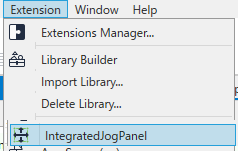

## 5. GUI

### 5.1 Overview

The IntegratedJogPanel consists of the following areas:

- [a] Jog area
- [b] 2D view area
- [c] Points area  
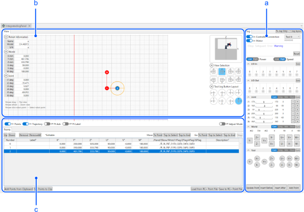

### 5.2 Jog Area

In the Jog area, you can connect to Controllers, operate I/O, jog, and add points.  
It is also possible to display and use only the jog area.  
It is also convenient when used in combination with other screens, such as simulators, because it minimizes the display area.  
It can be switched via [to Jog only] button.  

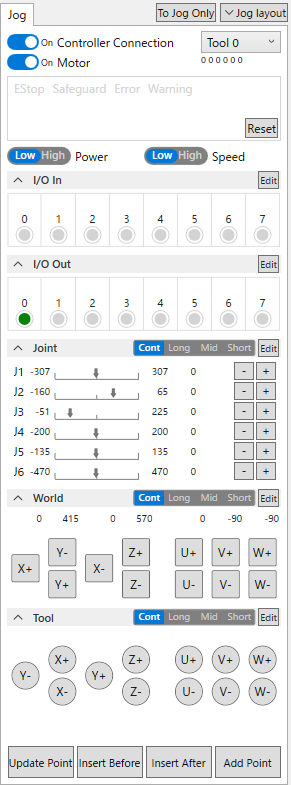

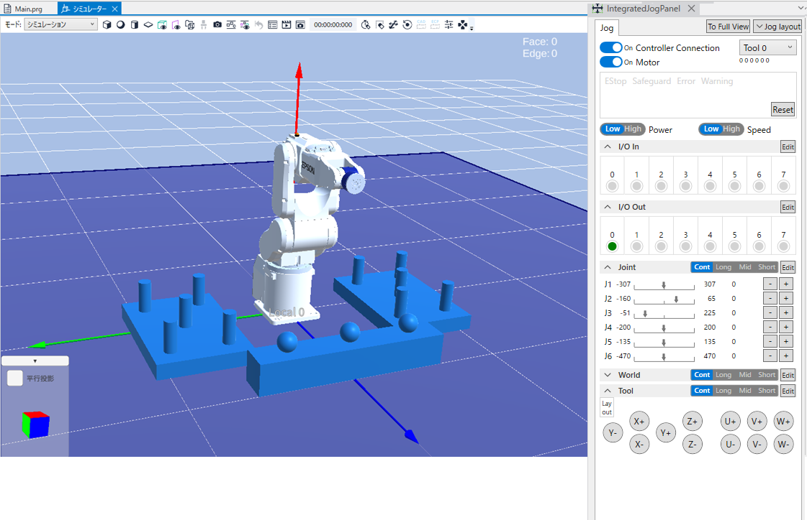

The following panels can be visible/hidden and their layout (display order) can be set.  
Make your desired settings in the panel that appears when you click the [Jog Layout] button.

- Input I/O panel
- Output I/O panel
- Joint jog panel
- World jog panel
- Tool jog panel

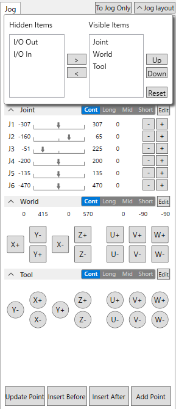

#### 5.2.1 Controller panel

The following Controller operations are possible:

- Controller connection/disconnection
- Motor on/off
- Reset
- Tool selection
- Power Low/High
- Speed Low/High

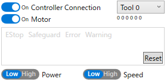  

#### 5.2.2 Input I/O Panel

This enables you to check the on/off state of the input I/O bit.  
The I/O bit displayed can be set from the screen accessed from the upper right button.  
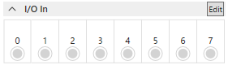

#### 5.2.3 Output I/O Panel

This enables you to check the on/off state of the output I/O bit.  
The I/O bit displayed can be set from the screen accessed from the upper right button.  
Double-clicking the circular mark enables you to switch the output I/O bit on/off.  
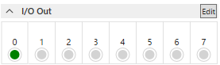

#### 5.2.4 Joint Jog Panel

This enables you to jog by joints.  
You can check the range and current position of the joint in the form of a slider.  
\* You cannot jog by moving the slider.  
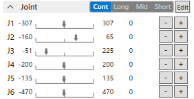

#### 5.2.5 World Jog Panel

This enables you to jog by world.  
The X, Y, and Z jog buttons will change their position to match the view in the view area, in conjunction with the view switching buttons.  
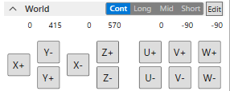

#### 5.2.6 Tool Jog Panel

This enables you to jog by tool.  
The X, Y, and Z jog buttons will change their position to match the view in the view area, in conjunction with the view switching buttons.  
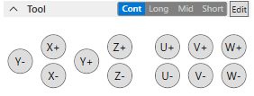

#### 5.2.7 Add Points

By using the button on the bottom side, you can update, insert (before/after), and add the current position of the robot as points.  
Only the points that are selected can be updated and inserted. Points can be selected in the 2D view or the points mentioned in the later section.  
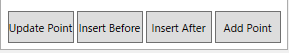

### 5.3 2D View Area

In the 2D view area, the locations of the points can be viewed in 2D view.  
The following information is displayed: Visible/Hidden can be switched from the buttons on the lower left side.

- Points: Display the number in the red circle. Selecting this with the mouse will select the point.
- Locus: Locus where points are connected in a straight line
- Pt Adv: Depth position and end effector orientation of points
- Pt Tool/Tool Point: Tool coordinate point

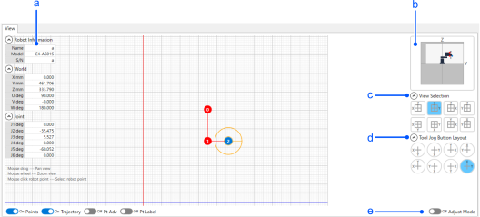

#### 5.3.1 Information Displayed
[a] The following information can be viewed:

- Robot information (name, model, serial number)
- Current world position
- Current joint position  
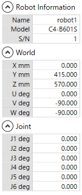

#### 5.3.2 View Display State

[b] The current view display state can be viewed as an image.  
This helps identify the following states:

- From what view is the currently displayed plane being viewed
- The area in which the view is currently displaying
- Areas with points  
  

#### 5.3.3 View Direction Button

[c] Views for the plane can be selected from 8 types.  
In conjunction with this view direction, the X, Y, and Z button layouts on the world jog will change to match the selected view.  
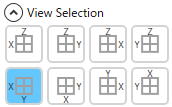  

#### 5.3.4 Tool Jog Button Layout Button

[d] The X, Y, Z button layout of Tool Jog can be selected from 8 types.  
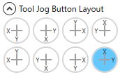  

#### 5.3.5 Adjust Mode

[e] By turning on the Adjust Mode, it will turn into one where points can be edited in the 2D view.

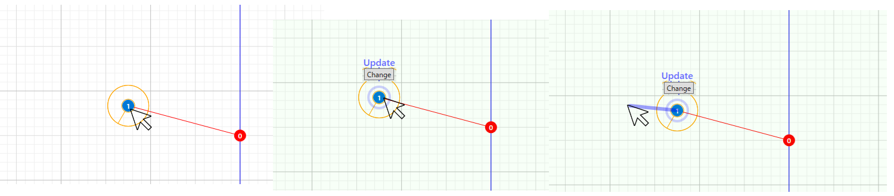

1. By selecting points with a mouse in the 2D view, the robot moves to that position.
2. When a point is dragged within 50 mm, the robot moves accordingly. You will also be able to update/add points. (Can be selected by GUI before dragging points.)

\* Be careful of operating in this mode because the robot operates based on the mouse operation in 2D view.

### 5.4 Points Area

This area allows you to check and edit the points added using the add point operation in the jog area.  
Among the labels displayed in the list, label X, Y, Z, U, V, W can be edited manually.  

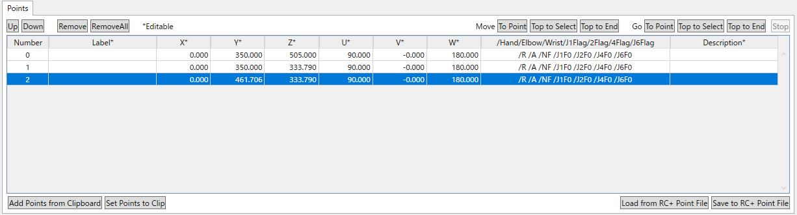  

#### 5.4.1 Edit Points

The following can be done from the buttons on the upper left side:

- Rearrange the selected point one position up.
- Rearrange the selected point one position down.
- Remove selected point
- Remove all points

#### 5.4.2 Check Operation

With the Move and Go button on the upper right side, the following operations can be verified:  
\* Similar to the robot manager, the operating speed changes depending on the Low/High settings of Speed. The speed value is also the same specification as the robot manager.

- Move to the selected singular point
- Move sequentially from the head to the selected point
- Move sequentially from the head to tail

\* The points and the view display of the selected point will turn blue.  
\* To move sequentially, execute Go or Move.

#### 5.4.3 Paste and Copy Points

The following can be done using the buttons on the bottom left side:  
By using these buttons, you can transfer the point editor and point data of the Epson RC+ between Epson RC+; and the IntegratedJogPanel.

- Add points from Clipboard
- Set the points information to Clipboard

#### 5.4.4 Load and Save the RC+ Point File

The following can be done using the buttons on the bottom right side:

##### 5.4.4.1 Load Points from the Epson RC+ Point File

The point file can be selected and loaded from the selection screen.

##### 5.4.4.2 Save Points of IntegratedJogPanel to Epson RC+ Point File

The points of IntegratedJogPanel can be saved to the point file by entering a file name in the file addition screen to RC+.

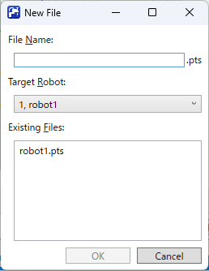

You can also overwrite an existing point file.

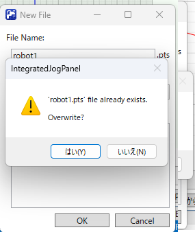  

\* Adding or editing points using the IntegratedJogPanel will not synchronize them with the point file on the Epson RC+. Use this saving function when using the points created with IntegratedJogPanel in Epson RC+. For existing files, it will be overwritten.