# 統合Jogパネル

Rev.1  
JAM266S8783F  

[日本語](./readme_ja.md) / [English](./readme.md)  

## 1. 概要

本Extensionは、Epson RC+ 8.0に統合Jogパネルを提供します。  
本readmeでは、インストールおよび基本的な使用方法について説明します。

統合Jogパネルの主な機能は以下のとおりです。  
ポイント位置を2Dビューで確認しながら、連続したポイント一覧の作成、編集を一画面で行うことができます。

- コントローラー操作
- I/O操作
- ジョグ
- ポイント2Dビュー表示
- ポイント一覧編集

以下のような作業での活用を想定しています。

- 並びに意味があるポイント群を作成する
- はじめに、おおよそのポイントを決めたあとに微調整やポイントの追加挿入をする
- I/Oを操作しながらポイントを作成する

## 2. システム要件

### 2.1 対応環境

以下の環境での使用に対応しています。

- Epson RC+ 8.0
  - バージョン 8.1.4.0 以降
  - Premium Edition

## 3. 設置

\* 統合Jogパネルを使用するための特別な設置要件はありません。

## 4. インストール

### 4.1 インストール

Epson RC+の拡張機能マネージャーから「統合Jogパネル」をインストールします。  
インストール方法の詳細については、以下のマニュアルを参照してください。  
"Epson RC+ 8.0 拡張機能 RC+ Extensions 8.0"

### 4.2 動作確認

Epson RC+のメニューから、以下を選択して統合Jogパネルを表示します。

- [拡張]-[統合Jogパネル]

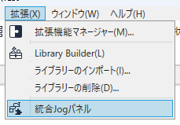

## 5. GUI

### 5.1 概要

統合Jogパネルは以下のエリアで構成されています。

- [a] ジョグエリア
- [b] 2Dビューエリア
- [c] ポイント一覧エリア  
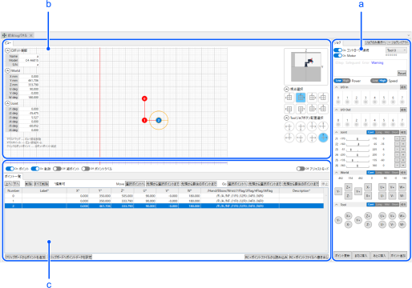

### 5.2 ジョグエリア

ジョグエリアではコントローラー接続、I/O操作、ジョグ、ポイントの追加ができます。  
ジョグエリアのみを表示して利用することも可能です。  
シミュレーターなど他の画面と組み合わせて使用する場合でも、表示領域を抑えられるため便利です。  
[ジョグのみ表示へ] ボタンから切り替えが可能です。  

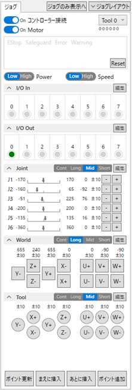

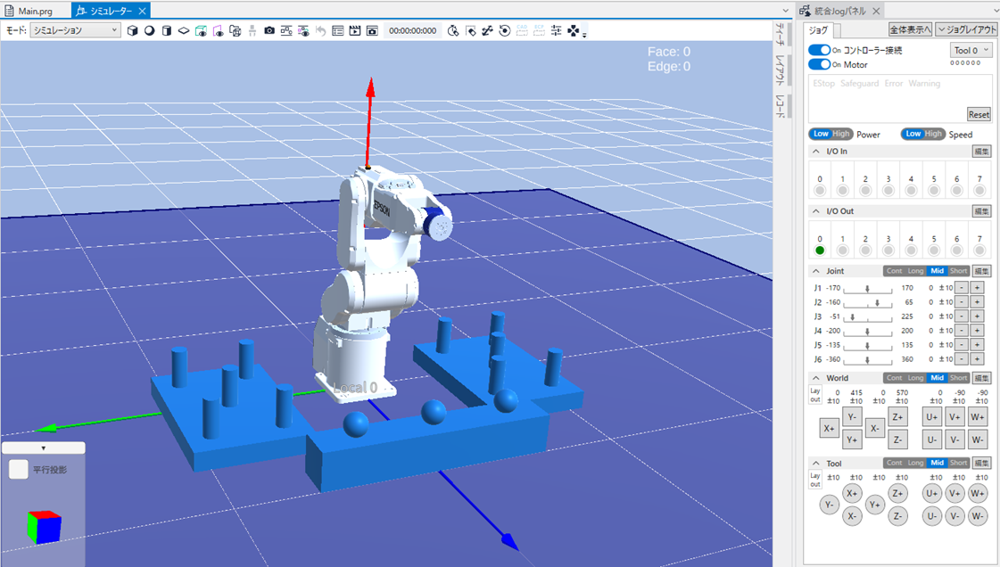

以下のパネルは、表示/非表示およびレイアウト(表示順)の設定が可能です。  
［ジョグレイアウト］ボタンから表示されるパネルで、任意の設定を行ってください。

- 入力I/Oパネル
- 出力I/Oパネル
- Jointジョグパネル
- Worldジョグパネル
- Toolジョグパネル

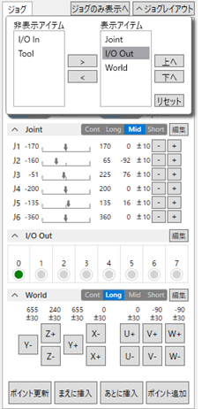

#### 5.2.1 コントローラーパネル

以下のコントローラー操作ができます。

- コントローラー接続/切断
- Motor on/off
- リセット
- Tool選択
- Power Low/High
- Speed Low/High

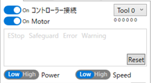  

#### 5.2.2 入力I/Oパネル

入力I/Oビットのオン/オフ状態を確認できます。  
表示するI/Oのビットは、右上のボタンから表示される画面で設定できます。  
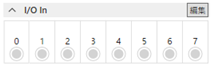

#### 5.2.3 出力I/Oパネル

出力I/Oビットのオン/オフ状態を確認できます。  
表示するI/Oのビットは、右上のボタンから表示される画面で設定できます。  
円形のマークをダブルクリックすると、出力I/Oビットのオン/オフを切り替えることができます。  
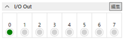

#### 5.2.4 Jointジョグパネル

Jointのジョグができます。  
Jointのレンジと現在位置をスライダーの形式で確認できます。  
\* スライダーを動かしてのジョグはできません。  
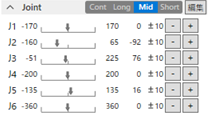

#### 5.2.5 Worldジョグパネル

Worldのジョグができます。  
X,Y,Zのジョグボタンは、ビューエリアの視点切り替えボタンと連動して視点と合致する配置に変わります。  
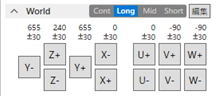

#### 5.2.6 Toolジョグパネル

Toolのジョグができます。  
X,Y,Zのジョグボタンは、ビューエリアのToolジョグボタン配置選択ボタンとにより配置を変えることができます。  
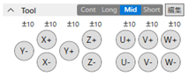

#### 5.2.7 ポイント追加

下部のボタンでロボットの現在位置をポイントとして更新、挿入(まえ/うしろ)、追加することができます。  
更新、挿入は選択状態にあるポイントに対して行います。後述の2Dビューもしくはポイント一覧でポイントを選択できます。  
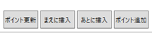

### 5.3 2Dビューエリア

2Dビューエリアでは、ポイントの位置を2D表示で確認できます。  
以下の情報を表示します。表示/非表示は、左下のボタン群で切り替えができます。

- Points/ポイント: 赤丸に番号を表示。これをマウスで選択するとポイントを選択状態とする。
- Locus/軌跡: ポイント間を直線でつないだ軌跡
- Pt Adv/凝ポイント: ポイントの奥行位置や手先の向き
- Pt Tool/Toolポイント: ツール座標のポイント

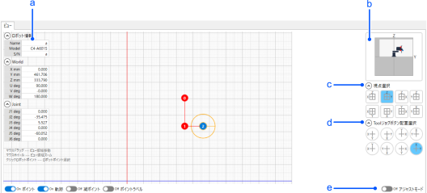

#### 5.3.1 情報表示
[a] 以下の情報が確認できます。

- ロボット情報(名前、モデル、シリアルナンバー)
- 現在のWorld位置
- 現在のJoint位置  
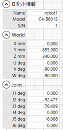

#### 5.3.2 ビュー表示状態

[b] 現在のビュー表示状態がイラストで確認できます。  
以下の状態の把握に役立ちます。

- 現在表示している平面はどの視点からのものなのか
- 現在ビューの表示している領域
- ポイントがある領域  
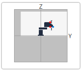  

#### 5.3.3 視点選択ボタン

[c] 平面に対する視点を8種類から選択できます。  
この視点選択と連動してWorldジョグのX,Y,Zのボタン配置が視点と合致するものに変わります。  
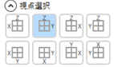  

#### 5.3.4 Toolジョグボタン配置選択ボタン

[d] ToolジョグのX,Y,Zのボタン配置を8種類から選択できます。  
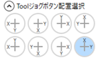  

#### 5.3.5 Adjust Mode/アジャストモード

[e] Adjust Mode/アジャストモードをオンにすると、2Dビュー上でポイントを編集できるモードになります。

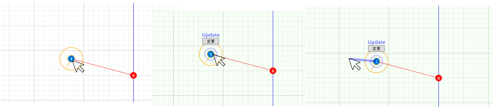

1. 2Dビュー上でポイントをマウスで選択すると、ロボットはその位置へ移動します
2. その状態でポイントをマウスドラッグすると、ドラッグした距離が50 mm以内であればその位置へロボットが移動し、ポイントの更新/追加(ドラッグ前にGUIで選択が可能)を行えます。

\* 2Dビュー上のマウス操作によりロボットが動作するため、本モードの操作には十分注意してください。

### 5.4 ポイント一覧エリア

ジョグエリアのポイント追加操作から追加されたポイントが一覧で確認、編集できます。  
一覧の表示している列のうちLabel,X,Y,Z,U,V,Wについては手入力で編集ができます。  

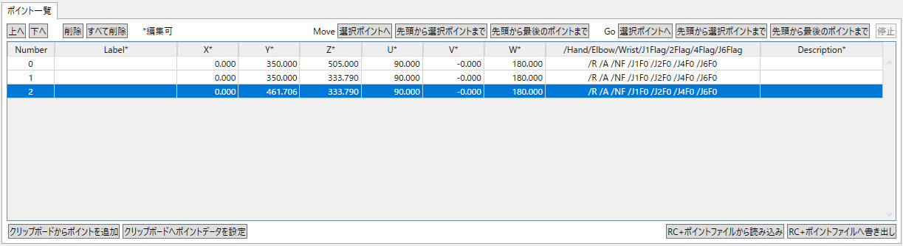  

#### 5.4.1 ポイント一覧編集

左上のボタン群で以下ができます。

- 選択ポイントを一つ上に並びかえる
- 選択ポイントを一つ下に並びかえる
- 選択ポイントを削除する
- すべてのポイントを削除する

#### 5.4.2 動作確認

右上のボタン群でMoveとGoそれぞれで以下の動作確認ができます。  
\* 動作速度は、ロボットマネージャーと同様に、SpeedのLow/Highの設定によって変化します。速度の値もロボットマネージャーと同じ仕様です。

- 選択されている単一ポイントへ移動する
- 先頭から選択ポイントまで順次移動する
- 先頭から最後のポイントまで順次移動する

\* 選択したポイントは、ポイント一覧およびビュー表示が青色になります。  
\* 順次移動する場合は、それぞれGoまたはMoveを実行します。

#### 5.4.3 ポイントの貼り付け、コピー

左下のボタン群で以下ができます。  
これを利用すること、Epson RC+本体のポイントエディタとポイントデータをEpson RC+と統合Jogパネル間で行き来させることができます。

- クリップボードからのポイント一覧へのポイントを追加する
- ポイント一覧の情報をクリップボードへ設定する

#### 5.4.4 RC+本体ポイントファイルの読み込みと書き出し

右下のボタン群で以下ができます。

##### 5.4.4.1 Epson RC+本体のポイントファイルから、ポイントの一覧を読み込む

本体のポイントファイルを選択画面から選択して読み込むことができます。

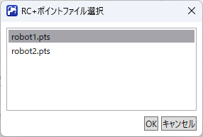

##### 5.4.4.2 Epson RC+本体のポイントファイルに、統合Jogパネルのポイント一覧を書き出す

RC+へのファイル追加画面でファイル名を入力し、本体のポイントファイルに統合Jogパネルのポイント一覧を書き出すことができます。

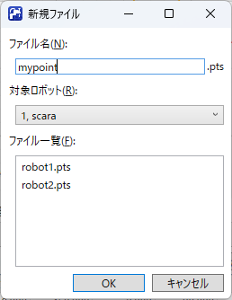

既存のポイントファイルに対して上書きすることも可能です。

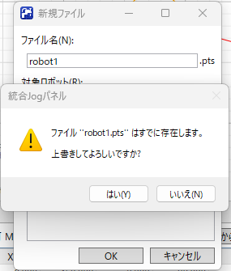  

\* 統合Jogパネルでポイントを追加・編集しても、Epson RC+本体のポイントファイルとは連動しません。Epson RC+本体で統合Jogパネルで作成したポイントを使用する場合は、本書き出し機能を利用してください。すでにあるファイルに対しては上書きとなります。