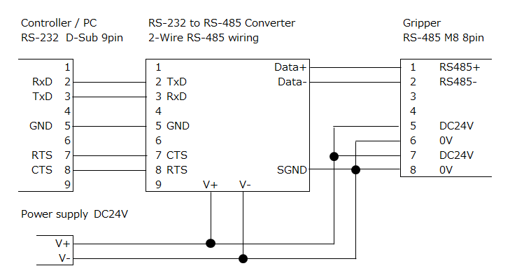
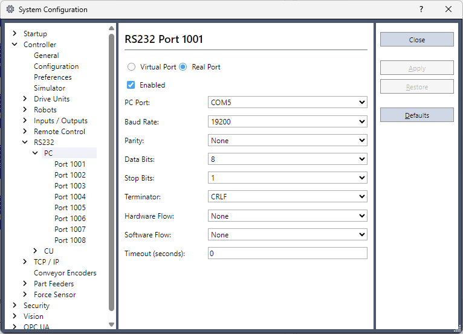
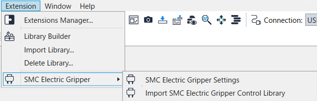
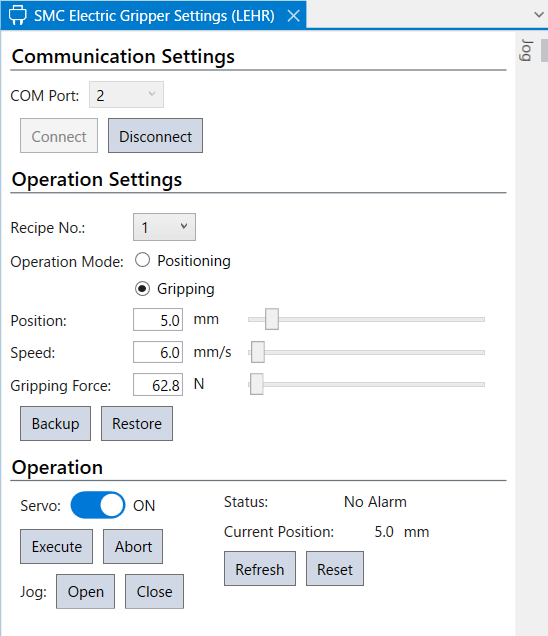
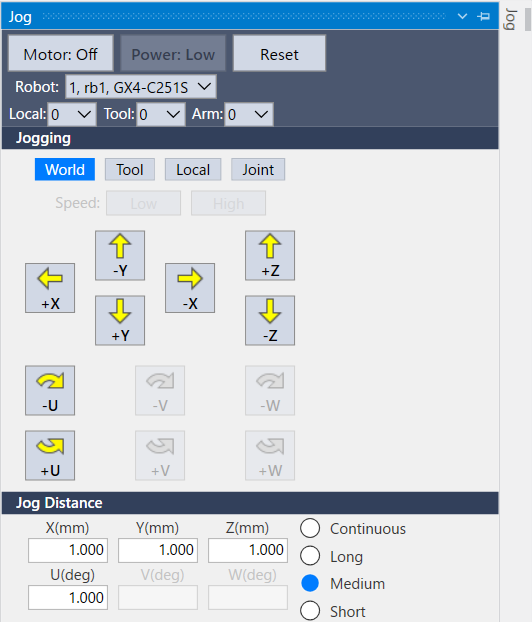

# SMC Electric Gripper

Rev.1  
ENM266S8786F  

[日本語](./readme_ja.md) / [English](./readme.md)   

## 1. Overview

This is an extension feature for configuring and controlling the LEHR series SMC electric gripper (hereinafter referred to as “SMC gripper”) in Epson RC+ 8.0.

The main functions are as follows:

- Connecting and disconnecting the SMC gripper
- Registering the operation settings (operation mode, position, speed, gripping force)
- Run or abort operation
- Verifying operation with the open/close jog operation
- Backing up and restoring the operation settings
- Controlling from a SPEL+ program (via control library)

This readme describes the installation procedure, initialization, and basic usage.  
For details on information related to the hardware such as the structure of the SMC LEHR series, its functions, and mounting procedures, refer to the manual and specifications provided by SMC Corporation.  
When using the Extension, the Epson RC+ Software License Agreement is applied.

## 2. System Requirements

### 2.1 Supported Environments

The Extension is supported in the following environments:

- Epson robot controller
  - RC800 series\*1
  - RC700 series\*2
  - RC90 series \*2
  - T/VT series\*3

  
  \*1: If you want to use the Controller on its own, the RS-232 extension board is required. It can also be operated from a control PC  
  \*2: RS-232 port of the Controller can be used. It can also be operated from a control PC  
  \*3: A control PC is required because RS-232 port cannot be added to the Controller.

- Epson RC+ 8.0
  - Version 8.1.4.0 or later
  - Premium Edition

- SMC Electric Gripper LEHR Series  
For each controller (or each CU in a CU/DU configuration), one SMC gripper can be connected. Even if multiple COM ports are available, only one gripper can be connected.


### 2.2 Required Equipment

The following devices need to be prepared:

- Control PC (commercially available products)
  - This PC is for installing Epson RC+ 8.0.
  - This is required to use the GUI.

- USB/RS-232 conversion adapter (commercially available products)
  - This is needed to directly connect the SMC gripper with the control PC.
  - This is not required if you are to connect the SMC gripper with the Controller’s RS-232 port.

- RS-232 to RS-485 converter (commercially available product)
  - This is needed to convert the SMC gripper’s RS-485 to RS-232.
  - Use a converter that supports 2-line communication.

## 3. Installation

### 3.1 Wiring

The SMC gripper has the RS-485 equipped as an interface. To communicate with the Controller or PC, a commercially available RS-232 to RS-485 converter is required.  
Also, to operate the SMC gripper, a commercially available 24V power is required. When selecting, consider the maximum power consumption (48W) of the SMC gripper. Furthermore, to connect the SMC gripper to the RS-232 to RS-485 converter and power, a commercially available M8 8 pin cable (female) is required.

Connection example (signal names and pin numbers are for reference only)



### 3.2 Mounting to Robot

Mount the SMC gripper to the robot using ISO flange.  
ISO flanges are available for SCARA robots and some 6-Axis robots.  
For models for which ISO flanges are not available, you will need to use a commercially available flange or make one on your own. For details on dimensions, refer to the SMC gripper manual.

### 3.3 Communication Settings

From the Epson RC+ [Setup] menu, select [System Configuration]-[Controller]-[RS-232]-[PC] or [CU].  
Set the following items:

- PC port: To use the control PC, select COM Port of PC
- Baud rate: 19200
- Others: Use default values



## 4. Installation and Initialization

The following steps are described with the assumption that the SMC gripper has already been installed and wired. Install the Extension to Epson RC+, and check whether it can communicate with the SMC gripper correctly and that it can perform basic operations.

### 4.1 Installation

From the Epson RC+ Extensions Manager, install “SMC Electric Gripper”.  
For details on installation methods, refer to the following manual.  
"Epson RC+ 8.0 Extensions RC+ Extensions 8.0"

### 4.2 Library Registration

The communication control of SMC gripper is done via the control library.  
In the GUI and SPEL+ program of the Extension, this library is used to control the SMC gripper.

Register the control library to the project using the following steps:

1. Open the project to use the SMC gripper’s control library.
2. From the [Extension] menu, select [SMC Electric Gripper]-[Import SMC Electric Gripper Control Library].  
    
    - The library is imported to `C:\EpsonRC80\Libraries` .
3. Register "SMC_LEHR.lib” to the project.
    - For details on the library’s registration method, refer to the following manual.  
    "RC 8.0+ Extensions Library Builder 8.0"  
    \* If the project is opened while running step 2, the library will be automatically registered to the project. In that case, this procedure can be omitted.

### 4.3 Operation Verification

#### 4.3.1 Display the Configuration Screen

From the Epson RC+ menu, select the following to display the configuration screen.

- [Extensions]-[SMC Electric Gripper]-[SMC Electric Gripper Settings]


#### 4.3.2 Confirming Connection with the SMC Gripper

In the setting screen’s “Communication Settings” area, connect to the SMC gripper.

1. Specify the RS-232C port number, which is used to connect the SMC gripper and the Controller, as the COM Port.
2. Press the [Connection] button.

When connected correctly, the status display will be refreshed, allowing you to check the state of the SMC gripper.  
If the connection fails, check the following:
- The SMC gripper is powered
- Wiring and communication converter is connected correctly
- The correct COM Port is selected

#### 4.3.3 Checking Basic Operation

After connecting to the SMC gripper, check the following basic operations in the [Operation] area:

- The servo can be turned ON/OFF
- Open/Close operation can be performed using Jog operation

Check that the operations described above can be done correctly.

If an alarm or warning is displayed during an operation, check the content of the status, eliminate the cause, and perform a reset operation.  
For details on the alarm, refer to the “Status” section.

## 5. GUI

### 5.1 Overview

In Epson RC+, there is a setting screen where you can set and control the SMC gripper.  
From the Epson RC+ menu, select the following to display the configuration screen.  
- [Extensions]-[SMC Electric Gripper]-[SMC Electric Gripper Settings]  

The setting screen mainly consists of the following area and tabs:

- Communication settings area  
- Operation settings area  
- Operation area
- Jog tab



### 5.2 Communication Settings Area

The “Communication Settings” area allows you to connect and disconnect with the SMC gripper.

The main operations are as follows:

- Selecting the RS-232C port number (COM Port) used to connect the SMC gripper and Controller
- Connecting/Disconnecting with the SMC gripper

Once connected with the gripper, other areas can be operated.

### 5.3 Operation Settings Area

The “Operation Settings” area allows you to set the operation of the SMC gripper.

The operation settings can be stored in the SMC gripper as 10 recipes.  
The following items can be set for each recipe:

- Operation mode
  - Positioning: Select to release a workpiece
  - Gripping: Select to grip a workpiece
- Position: Set the position of the SMC gripper
  - Minimum value: 0 mm
  - Maximum value: 50 mm
- Speed
  - For positioning:
    - Minimum value: 5 mm/s
    - Maximum value: 100 mm/s
  - For gripping:
    - Minimum value: 5 mm/s
    - Maximum value: 30 mm/s
- Gripping Force *Enabled only when gripping
  - Minimum value: 60 N
  - Maximum value: 140 N  
Regarding gripping force, there may be a difference of approximately ±5N between the set value and the value saved. This is the specification.

### 5.4 Operation Area

The “Operation” area allows you to operate the SMC gripper based on the settings set in the “Operation Settings” area.

The main operations are as follows:

- Servo ON/OFF
- Reset alarm
- Run the operation of the selected recipe
- Abort operation
- Jog operation (Open/Close)　　
  - The minimum jog increment is approximately 0.1 mm.  
  - Holding down the button will result in continuous movement after five jog steps.
- Display status
  - Status of the SMC gripper
  - Current position

If an alarm or warning occurs, check the status display, and reset if necessary.  
For details on the alarm, refer to the “Status” section.

### 5.5 Jog Tab

The jog tab allows you to perform jog operation on the robot to check the operation of the SMC gripper.  
The jog tab provides the same function as the jog tab available in the robot manager’s jog & teach panel, Vision Guide, and Force Guide.

For details on the operation method, refer to the respective manuals of Epson RC+.  


## 6. How to Use it from SPEL+ Program

The SMC gripper can be controlled from SPEL+ program by using the functions from the control library.  
Here are some basic usage examples.

### 6.1 Preparation

Before controlling the SMC gripper from SPEL+ program, the following items need to be completed:

- A project is registered in the SMC gripper control library
- The SMC gripper is installed and wired correctly
- The COM Port is set correctly

For details, refer to sections three and four.

### 6.2 Basic Usage Example

The following is a basic example of connecting to the SMC gripper using COM Port 1, waiting for recipe 1 operation to finish running after the servo is turned On, and then disconnecting it.

```
SMC_LEHR_Connect 1

SMC_LEHR_Servo 1
SMC_LEHR_Execute 1, 0

SMC_LEHR_Disconnect
```

### 6.3 Precautions During Usage

When an alarm or warning occurs, you may not be able to run the operation.  
When an error occurs, check the function’s return value, as well as the SMC_LEHR_STATUS function status.

For details on the function’s detailed specifications and arguments in the library, refer to the “Library Reference” section.

## 7. Library Reference

This section provides a function reference for the SMC gripper control library "SMC_LEHR.lib."

### 7.1 Interface for the Extension (Information for Extension Developers)

This section contains information for the Extension developers. For those who wish to only use the the Extension, skip this section.  

The library includes interface intended to be used in the Extension.  
These interfaces consists of functions and global variables for the Extension and is defined by names with an `_` (underscore) at the end.

Due to the specification of the Extension, you cannot run functions with reference arguments (`ByRef`) and the return value of functions cannot be received directly.  
Therefore, a combination of a dedicated function that can be used from the Extension and a global variable that saves the processed result are defined.

These interfaces for the Extension is developed with the assumption that it will be used within the Extension and will not be described in the subsequent function reference.

### 7.2 Recipe No.  
A maximum of 16 recipes can be registered in the SMC electric gripper.Of these, the last six recipes (No. 11 to 16) are reserved for internal operations.  
Although recipes 11 to 16 can be accessed from functions, they should not be used, as this may cause unexpected behavior.  

### 7.3 Function List

#### SMC\_LEHR\_Connect

Start communication with the SMC gripper using the specified COM Port.

**Format**  
SMC_LEHR_Connect COM Port number

**Parameter**  
COM Port number: Specify the RS-232C port number (1 to 8, 1001 to 1008) used to connect the SMC gripper and Controller using an integer value.

**Return value**  
Result after running the function.  
For details, refer to “Function Error Code.”

**Description**  
After running this function, the task will remain running to maintain the communication status with the SMC gripper.  
To end communication, run SMC_LEHR_Disconnect.

#### SMC\_LEHR\_Disconnect

Disconnect communication with the SMC gripper.

**Format**  
SMC_LEHR_Disconnect

**Parameter**  
None

**Return value**  
Result after running the function.  
For details, refer to “Function Error Code.”

#### SMC\_LEHR\_Reset

This resets the alarm and warning that is occurring.

**Format**  
SMC_LEHR_Reset

**Parameter**  
None

**Return value**  
Result after running the function.  
For details, refer to “Function Error Code.”

#### SMC\_LEHR\_SetMode

Set the operation mode of the specified recipe.

**Format**  
SMC_LEHR_SetMode Recipe No, Operation mode

**Parameter**  
Recipe No: Specify the recipe number (1 to 10) using an integer value.  
Operation mode: Specify the operation mode using an integer value.  
- 0: Positioning
- 2: Gripping

**Return value**  
Result after running the function.  
For details, refer to “Function Error Code.”

#### SMC\_LEHR\_GetMode

Get the specified recipe’s operation mode.

**Format**  
SMC_LEHR_GetMode recipe No, ByRef operation mode

**Parameter**  
Recipe No: Specify the recipe number (1 to 10) using an integer value.  
Operation mode: Specify the operation mode using an integer value. The result is assigned when passing by reference using ByRef.
- 0: Positioning
- 2: Gripping

**Return value**  
Result after running the function.  
For details, refer to “Function Error Code.”

#### SMC\_LEHR\_SetPos

Specify the position of the specified recipe.

**Format**  
SMC_LEHR_SetPos recipe No, position

**Parameter**  
Recipe No: Specify the recipe number (1 to 10) using an integer value.  
Position: Specify the position using an integer value (0.0 to 50.0) (unit: mm).

**Return value**  
Result after running the function.  
For details, refer to “Function Error Code.”

#### SMC\_LEHR\_GetPos

**Overview**  
Get the position of the specified recipe.

**Format**  
SMC_LEHR_GetPos recipe No, ByRef position

**Parameter**  
Recipe No: Specify the recipe number (1 to 10) using an integer value.  
Position: Specify the position using an integer value (0.0 to 50.0) (unit: mm). The result is assigned when passing by reference using ByRef.

**Return value**  
Result after running the function.  
For details, refer to “Function Error Code.”

#### SMC\_LEHR\_SetSpeed

Set the speed of the specified recipe.

**Format**  
SMC_LEHR_SetSpeed recipe No, speed

**Parameter**  
Recipe No: Specify the recipe number (1 to 10) using an integer value.  
Speed: Specify the speed using a real value (unit: mm/s).
- Positioning: 5.0 to 100.0 mm/s
- Gripping: 5.0 to 30.0 mm/s  
Although setting a value that is higher than 30.0 mm/s will not result in an error, keep in mind that the feed screw may jam.

**Return value**  
Result after running the function.  
For details, refer to “Function Error Code.”

#### SMC\_LEHR\_GetSpeed

Get the specified recipe’s speed.

**Format**  
SMC_LEHR_GetSpeed recipe No, ByRef speed

**Parameter**  
Recipe No: Specify the recipe number (1 to 10) using an integer value.  
Speed: Specify the speed using a real value (unit: mm/s). The result is assigned when passing by reference using ByRef.  
There may be a difference of approximately ±0.2 between the value set with SMC_LEHR_SetSpeed and the value obtained with SMC_LEHR_GetSpeed. This is the specification.  

**Return value**  
Result after running the function.  
For details, refer to “Function Error Code.”

#### SMC\_LEHR\_SetForce

Set the specified recipe’s gripping force.

**Format**  
SMC_LEHR_SetForce recipe No, gripping force

**Parameter**  
Recipe No: Specify the recipe number (1 to 10) using an integer value.  
Gripping force: Specify the gripping force using a real value (60.0 to 140.0) (unit: N).

**Return value**  
Result after running the function.  
For details, refer to “Function Error Code.”

#### SMC\_LEHR\_GetForce

Get the specified recipe’s gripping force.

**Format**  
SMC_LEHR_GetForce recipe No, ByRef gripping force

**Parameter**  
Recipe No: Specify the recipe number (1 to 10) using an integer value.  
Gripping force: Specify the gripping force using a real value (60.0 to 140.0) (unit: N). The result is assigned when passing by reference using ByRef.  
There may be a difference of approximately ±5 between the value set with SMC_LEHR_SetForce and the value obtained with SMC_LEHR_GetForce. This is the specification.

**Return value**  
Result after running the function.  
For details, refer to “Function Error Code.”

#### SMC\_LEHR\_Servo

Turn the gripper’s servo ON/OFF.

**Format**  
SMC_LEHR_Servo Servo ON/OFF

**Parameter**  
Servo ON/OFF: Specify the servo ON/OFF using a real value.
- Servo OFF: 0
- Servo ON: 1

**Return value**  
Result after running the function.  
For details, refer to “Function Error Code.”

#### SMC\_LEHR\_Execute

Run the specified recipe’s motion.

**Format**  
SMC_LEHR_Execute recipe No, waiting for operation completion

**Parameter**  
Recipe No: Specify the recipe number (1 to 10) using an integer value.  
Waiting for operation completion: Specify whether to wait for operation completion using an integer value.
- Return control after waiting for operation completion: 0
- Return control without waiting for operation completion: other than 0

**Return value**  
Result after running the function.  
For details, refer to “Function Error Code.”

#### SMC\_LEHR\_Abort

Abort the operation that is currently running.

**Format**  
SMC_LEHR_Abort

**Parameter**  
None

**Return value**  
Result after running the function.  
For details, refer to “Function Error Code.”

#### SMC\_LEHR\_Status

Get the SMC gripper’s status.

**Format**  
SMC_LEHR_Status ByRef status

**Parameter**  
Status: Specify the status using an integer value. The result is assigned when passing by reference using ByRef.  
For details on the meaning of the status value, refer to the “Status” section.

**Return value**  
Result after running the function.  
For details, refer to “Function Error Code.”

#### SMC\_LEHR\_GetCurPos

Get the SMC gripper’s current position.

**Format**  
SMC_LEHR_GetCurPos ByRef current position

**Parameter**  
Current position; Specify the current position using a real value. The result is assigned when passing by reference using ByRef.  

- When closing operation is continued from the zero position, the value may become negative.  
- To get the value while the hand is operating, set the parameter of SMC_LEHR_Execute to a value other than zero (asynchronous execution). When set to zero (asynchronous execution), the value obtained will be the value after SMC_LEHR_Execute has finished. This will also happen when running from a different task, because communication will be excluded due to SMC_LEHR_Execute.

**Return value**  
Result after running the function.  
For details, refer to “Function Error Code.”

#### SMC\_LEHR\_GetCurSpeed

Get the SMC gripper’s current speed.

**Format**  
SMC_LEHR_GetCurSpeed ByRef current speed

**Parameter**  
Current speed: Specify the current speed using a real value. The result is assigned when passing by reference using ByRef.  

- The value will turn negative during closing operation.
- To get the value while the hand is operating, set the parameter of SMC_LEHR_Execute to a value other than zero (asynchronous execution). When set to zero (asynchronous execution), the value obtained will be the value after SMC_LEHR_Execute has finished. This will also happen when running from a different task, because communication will be excluded due to SMC_LEHR_Execute.

**Return value**  
Result after running the function.  
For details, refer to “Function Error Code.”

#### SMC\_LEHR\_GetCurForce

Get the SMC gripper’s current gripping force.

**Format**  
SMC_LEHR_GetCurForce ByRef current gripping force

**Parameter**  
Current gripping force: Specify the current gripping force using a real value. The result is assigned when passing by reference using ByRef.  
- The value will turn negative during closing operation.
- To get the value while the hand is operating, set the parameter of SMC_LEHR_Execute to a value other than zero (asynchronous execution). When set to zero (asynchronous execution), the value obtained will be the value after SMC_LEHR_Execute has finished. This will also happen when running from a different task, because communication will be excluded due to SMC_LEHR_Execute.

**Return value**  
Result after running the function.  
For details, refer to “Function Error Code.”

### 7.4 Function Error Code

| Value (integer value) | Constant name | Description |
| --- | --- | --- |
| 0 | NOERR | Normal |
| 1 | ERR_ARGUMENT | Argument out of range or incorrect value |
| 2 | ERR_COM_OPEN | Unable to open COM Port |
| 3 | ERR_COMMUNICATION | Unable to communicate with hand |
| 4 | ERR_SERVO_OFF | Unable to run recipe because servo is OFF |

## 8. Status

When a warning or alarm occurs, you can check them in the status display of the SMC gripper’s LED or the SMC gripper setting screen of the Extension.  
For details on the SMC gripper’s LED display pattern, refer to the manual and specifications provided by SMC Corporation.

\*“Status value” indicates the status value obtained from the SMC_LEHR_Status function.

| Status | Content | Countermeasures for alarm and warning | Status value |
| --- | --- | --- | --- |
| No Alarm | Including unclear situations such as the SMC gripper not being connected or when it is unable to communicate with the SMC gripper | - | 0 |
| OverLoad Alarm | Occurs after a certain period of time passes when an overload alarm occurs. | Eliminate the cause of the overload alarm. | 100 |
| OverCurrent Alarm | Occurs when an excessive current exceeding the rated current value flows. | Check what is preventing the SMC gripper’s operation and whether external force is added to the finger. | 101 |
| OverTemperature Alarm | Occurs when the motor’s internal temperature exceeds 110℃. | Check whether the ambient temperature of the operating environment does not exceed 40℃. | 102 |
| OverVoltage Alarm | Occurs when the input voltage exceeds 30V. | Check the voltage of the power supply provided to the SMC gripper. | 103 |
| UnderVoltage Alarm | Occurs when the input voltage is below 18V. | ^^ | 104 |
| OverFlow Alarm | Occurs when deviation in position exceeds a certain value. | Check what is preventing the SMC gripper’s operation and whether external force is added to the finger. | 105 |
| Gripper failed Warning | Occurs when the workpiece cannot be gripped. | Check whether the position is set correctly. | 200 |
| Workpiece lost Warning | Occurs when the gripped workpiece is dropped. | Check the gripping force, gripping position, weight of the workpiece and whether an external force is added to the finger. | 201 |
| OverLoad Warning | Occurs when the load set during positioning exceeds a certain value. | Check what is preventing the SMC gripper’s operation and whether external force is added to the finger. | 202 |
| Temperature Warning | Occurs when the motor’s internal temperature exceeds 80℃. | Check whether the ambient temperature of the operating environment does not exceed 40℃. | 203 |
