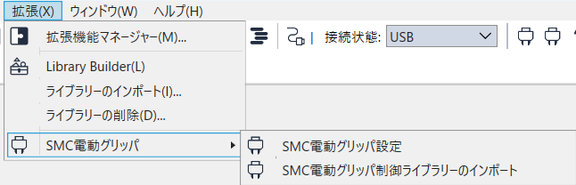
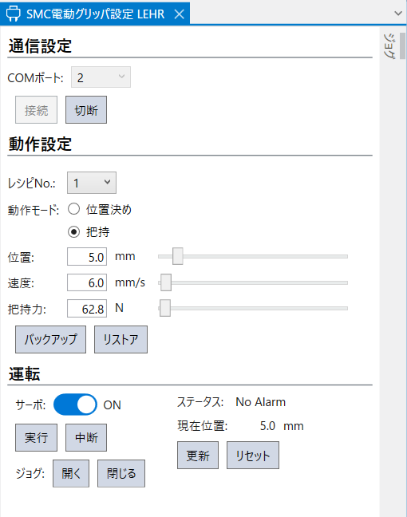
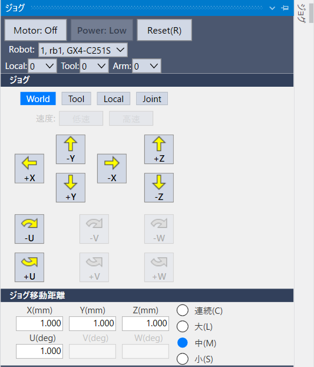

# SMC電動グリッパ

Rev.1  
JAM266S8785F  

[日本語](./readme_ja.md) / [English](./readme.md)   

## 1. 概要

本Extensionは、Epson RC+ 8.0からSMC電動グリッパ LEHRシリーズ(以下「SMCグリッパ」と称します)の設定および制御を行うための拡張機能です。

主な機能は以下のとおりです。

- SMCグリッパとの接続および切断
- 動作設定(動作モード、位置、速度、把持力)の登録
- 動作設定の実行および中断
- 開く/閉じるジョグ操作による動作確認
- 動作設定のバックアップおよびリストア
- SPEL+ プログラムからの制御(制御ライブラリー経由)

本readmeでは、インストール、初期設定および基本的な使用方法について説明します。  
SMC LEHRシリーズ本体の構造、性能、取付手順などのハードウェアに関する内容については、SMC株式会社が提供する取扱説明書・仕様書を参照してください。  
Extensionの利用にあたっては、Epson RC+のソフトウェア使用許諾契約書が適用されます。

## 2. システム要件

### 2.1 対応環境

以下の環境での使用に対応しています。

- Epsonロボットコントローラー
  - RC800シリーズ\*1
  - RC700シリーズ\*2
  - RC90シリーズ \*2
  - T/VTシリーズ\*3

  
  \*1: コントローラー単体で使用したい場合は、拡張RS-232基板が必要です。制御用PCによる操作も可能です。  
  \*2: コントローラーのRS-232ポートが利用できます。制御用PCによる操作も可能です。  
  \*3: コントローラーにRS-232ポートを追加できないため、制御用PCが必要です。

- Epson RC+ 8.0
  - バージョン 8.1.4.0 以降
  - Premium Edition

- SMC 電動グリッパ LEHRシリーズ  
1台のコントローラー(CU/DU構成の場合は、CU1台)に1台まで、SMCグリッパを接続することができます。コントローラー/PUに複数のCOMポートがある場合でも、1台に制限されます。


### 2.2 用意していただくもの

以下の機器を用意していただく必要があります。

- 制御用PC(市販品)
  - Epson RC+ 8.0をインストールするPCです。
  - GUIを使用する場合に必要です。

- USB/RS-232変換アダプタ(市販品)
  - SMCグリッパを制御用PCと直接接続する場合に必要です。
  - SMCグリッパをコントローラーのRS-232ポートと接続する場合は不要です。

- RS-232 to RS-485コンバーター(市販品)
  - SMCグリッパのRS-485をRS-232に変換するために必要です。
  - 2線式に対応したものをご用意ください。

## 3. 設置

### 3.1 電気的配線

SMCグリッパは、インタフェースとしてRS-485を備えています。コントローラーまたはPCと通信するには、市販のRS-232 to RS-485コンバーターが必要です。  
また、SMCグリッパを動作させるためには、市販の24V電源が必要です。SMCグリッパ本体の最大消費電力(48W)を考慮して選定します。さらに、SMCグリッパとRS-232 to RS-485コンバーター、および電源を接続するために、市販のM8 8pinケーブル(メス)が必要です。

接続例(信号名、ピン番号は参考)


### 3.2 ロボットへの取りつけ

ISOフランジを使用して、SMCグリッパをロボットに取りつけます。  
ISOフランジは、スカラロボットおよび一部の6軸ロボット用に用意されています。  
ISOフランジが用意されていない機種では、市販のフランジを使用するか、フランジを自作する必要があります。寸法についてはSMCグリッパのマニュアルを参照してください。

### 3.3 通信設定

Epson RC+の[セットアップ]メニューから[システム設定]-[コントローラー]-[RS-232]-[PC]または[CU]を選択します。  
以下の項目を設定します。

- PCポート：　制御用PCを使用する場合に、PCのCOMポートを選択
- ボーレート： 19200
- その他：　デフォルト値を使用


## 4. インストールと初期設定

本手順は、SMCグリッパの設置および配線が完了していることを前提とします。Epson RC+にExtensionをインストールし、SMCグリッパと正常に通信できること、ならびに基本動作が行えることを確認します。

### 4.1 インストール

Epson RC+の拡張機能マネージャーから「SMC電動グリッパ」をインストールします。  
インストール方法の詳細については、以下のマニュアルを参照してください。  
"Epson RC+ 8.0 拡張機能 RC+ Extensions 8.0"

### 4.2 ライブラリー登録

SMCグリッパの通信制御は、制御ライブラリーを介して行います。  
ExtensionのGUIおよびSPEL+プログラムでは、このライブラリーを使用して SMCグリッパを制御します。

以下の手順で、プロジェクトに制御ライブラリーを登録してください。

1. SMCグリッパの制御ライブラリーを使用するプロジェクトを開きます。
2. [拡張]メニューから[SMC電動グリッパ]-[SMC電動グリッパ制御ライブラリーのインポート]を選択します。  
    
    - ライブラリーは`C:\EpsonRC80\Libraries` フォルダーにインポートされます。
3. プロジェクトに "SMC_LEHR.lib" を登録します。
    - ライブラリーの登録方法の詳細は以下のマニュアルを参照してください。  
    "Epson RC+ 8.0 拡張機能 Library Builder 8.0"  
    \* 手順2実行時にプロジェクトを開いている場合、ライブラリーは自動的にプロジェクトへ登録されます。その場合、本手順は省略できます。

### 4.3 動作確認

#### 4.3.1 設定画面の表示

Epson RC+のメニューから、以下を選択して設定画面を表示します。

- [拡張]-[SMC電動グリッパ]-[SMC電動グリッパ設定]


#### 4.3.2 SMCグリッパとの接続確認

設定画面の「通信設定」エリアで、SMCグリッパとの接続を行います。

1. SMCグリッパとコントローラーとの接続に使用しているRS-232Cポート番号を、COMポートに指定します。
2. [接続] ボタンを押します。

正常に接続されると、ステータス表示が更新され、SMCグリッパの状態を確認できるようになります。  
接続に失敗する場合は、以下を確認してください。
- SMCグリッパに電源が供給されていること
- 配線および通信コンバーターが正しく接続されていること
- 正しいCOMポートを選択していること

#### 4.3.3 基本動作の確認

SMCグリッパと接続後、「運転」エリアで以下の基本動作を確認します。

- サーボのON/OFF操作が行えること
- ジョグ操作による開閉動作が行えること

上記の操作が正常にできることを確認してください。

動作中にアラームまたは警告が表示された場合は、ステータス内容を確認し、原因を取り除いてからリセット操作を行ってください。  
アラームの詳細については「ステータス」章を参照してください。

## 5. GUI

### 5.1 概要

Epson RC+上でSMCグリッパを設定・制御するための設定画面があります。  
Epson RC+のメニューから、以下を選択して設定画面を表示します。  
- [拡張]-[SMC電動グリッパ]-[SMC電動グリッパ設定]  

設定画面は、主に以下のエリア・タブで構成されています。

- 通信設定エリア  
- 動作設定エリア  
- 運転エリア
- ジョグタブ



### 5.2 通信設定エリア

「通信設定」エリアでは、SMCグリッパとの接続および切断を行います。

主な操作は以下のとおりです。

- SMCグリッパとコントローラー間の接続に使用しているRS-232Cポート番号(COMポート)の選択
- SMCグリッパとの接続/切断

グリッパとの接続が確立すると、他のエリアが操作可能になります。

### 5.3 動作設定エリア

「動作設定」エリアでは、SMCグリッパの動作設定をします。

動作設定は10個分のレシピとして、SMCグリッパに記憶することができます。  
レシピごとに、以下の項目を設定できます。

- 動作モード
  - 位置決め: ワークをリリースする場合に選択します。
  - 把持: ワークを把持する場合に選択します。
- 位置：SMCグリッパの位置を設定します。
  - 最小値: 0 mm
  - 最大値: 50 mm
- 速度
  - 位置決めの場合:
    - 最小値: 5 mm/s
    - 最大値: 100 mm/s
  - 把持の場合:
    - 最小値: 5 mm/s
    - 最大値: 30 mm/s
- 把持力 *把持の場合のみ有効
  - 最小値: 60 N
  - 最大値: 140 N  
把持力については、設定値に対して保存される値に±5N程度の差が生じる場合があります。これは仕様です。

### 5.4 運転エリア

「運転」エリアでは、「動作設定」エリアで設定した内容に基づいてSMCグリッパを動作させます。

主な操作は以下のとおりです。

- サーボON/OFF
- アラームのリセット
- 選択しているレシピの動作実行
- 動作中断
- ジョグ動作(開/閉)
  - ジョグの最小移動量は、約0.1mmです。  
  - ボタンを押し続けると、5回ジョグ操作の後に連続で移動します。

- ステータス表示
  - SMCグリッパのステータス
  - 現在位置

アラームや警告が発生した場合は、ステータス表示を確認し、必要に応じてリセット操作を行ってください。  
アラームの詳細は「ステータス」章を参照してください。

### 5.5 ジョグタブ

ジョグタブでは、SMCグリッパの動作確認を行うために、ロボットをジョグ操作することができます。  
ジョグタブは、ロボットマネージャーのジョグ&ティーチパネルや、Vision Guide、Force Guideに用意されているジョグタブと同等の機能を提供します。

操作方法の詳細については、Epson RC+の各種マニュアルを参照してください。  


## 6. SPEL+プログラムからの使用方法

SMCグリッパは、制御ライブラリーのファンクションを使用することでSPEL+プログラムから制御することができます。  
ここでは、基本的な使用例を示します。

### 6.1 事前準備

SPEL+プログラムからSMCグリッパを制御する前に、以下の項目が完了している必要があります。

- SMCグリッパ制御ライブラリーがプロジェクトに登録されていること
- SMCグリッパが正しく設置および配線されていること
- COMポート設定が正しく行われること

詳しくは3章、 4章を参照してください。

### 6.2 基本的な使用例

以下は、COMポート1を使用してSMCグリッパと接続し、サーボをOnにした後、レシピ1の動作を実行完了まで待ち、最後に切断する基本的な例です。

```
SMC_LEHR_Connect 1

SMC_LEHR_Servo 1
SMC_LEHR_Execute 1, 0

SMC_LEHR_Disconnect
```

### 6.3 使用時の注意事項

アラームや警告が発生している状態では、動作を実行できない場合があります。  
エラーが発生した場合は、ファンクションの戻り値、ならびにSMC_LEHR_Statusファンクションのステータスを確認してください。

ライブラリーの各ファンクションの詳細な仕様や引数については、「ライブラリーリファレンス」章を参照してください。

## 7. ライブラリーリファレンス

SMCグリッパの制御ライブラリー "SMC_LEHR.lib" のファンクションのリファレンスを示します。

### 7.1 Extension向けインターフェースについて(Extension開発者向け情報)

本章は、Extension開発者向けの情報です。Extensionを利用されるのみの方は、本章を読み飛ばしてください。  

ライブラリーには、Extensionからの利用を目的としたインターフェースが含まれています。  
これらのインターフェースには、Extension向けのファンクションおよびグローバル変数で構成されており、末尾に `_`(アンダースコア)が付いた名称で定義されています。

Extensionの仕様上、参照引数(`ByRef`)を持つファンクションの実行や、ファンクションの戻り値を直接受け取ることができません。  
そのため、Extensionから利用可能な専用のファンクションと、処理結果を保持するグローバル変数を組み合わせたインターフェースを定義しています。

これらの Extension向けインターフェースは、Extension内部での利用を想定したものであり、以降のファンクションリファレンスには記載していません。

### 7.2 レシピNo.
SMCグリッパには、最大で16個のレシピを登録できます。このうち、後半の6個(11～16)は、内部動作用に使用されます。ファンクションからレシピ11～16を操作することは可能ですが、予期しない動作を引き起こす可能性があるため、操作は避けてください。

### 7.3 ファンクション一覧

#### SMC\_LEHR\_Connect

指定したCOMポートで、SMCグリッパとの通信を開始します。

**書式**  
SMC_LEHR_Connect COMポート番号

**パラメーター**  
COMポート番号: SMCグリッパとコントローラーとの接続に使用しているRS-232Cポート番号(1～8, 1001～1008)を整数値で指定します。

**戻り値**  
実行結果。  
詳細は「ファンクションエラーコード」参照してください。

**解説**  
本ファンクション実行後は、SMCグリッパとの通信状態を維持するため、タスクが実行中の状態になります。  
通信を終了する場合は、SMC_LEHR_Disconnect を実行してください。

#### SMC\_LEHR\_Disconnect

SMCグリッパとの通信を切断します。

**書式**  
SMC_LEHR_Disconnect

**パラメーター**  
なし

**戻り値**  
実行結果。  
詳細は「ファンクションエラーコード」参照してください。

#### SMC\_LEHR\_Reset

発生しているアラームおよび警告を解除します。

**書式**  
SMC_LEHR_Reset

**パラメーター**  
なし

**戻り値**  
実行結果。  
詳細は「ファンクションエラーコード」参照してください。

#### SMC\_LEHR\_SetMode

指定したレシピの動作モードを設定します。

**書式**  
SMC_LEHR_SetMode レシピNo, 動作モード

**パラメーター**  
レシピNo: 対象のレシピ番号(1～10)を整数値で指定します。  
動作モード: 動作モードを整数値で指定します。  
- 0: 位置決め
- 2: 把持

**戻り値**  
実行結果。  
詳細は「ファンクションエラーコード」参照してください。

#### SMC\_LEHR\_GetMode

指定したレシピの動作モードを取得します。

**書式**  
SMC_LEHR_GetMode レシピNo, ByRef 動作モード

**パラメーター**  
レシピNo: 対象のレシピ番号(1～10)を整数値で指定します。  
動作モード: 動作モードを整数値で指定します。ByRefで参照渡しすることで取得結果が代入されます。
- 0: 位置決め
- 2: 把持

**戻り値**  
実行結果。  
詳細は「ファンクションエラーコード」参照してください。

#### SMC\_LEHR\_SetPos

指定したレシピの位置を設定します。

**書式**  
SMC_LEHR_SetPos レシピNo, 位置

**パラメーター**  
レシピNo: 対象のレシピ番号(1～10)を整数値で指定します。  
位置: 位置を実数値(0.0～50.0)で指定します(単位: mm)。

**戻り値**  
実行結果。  
詳細は「ファンクションエラーコード」参照してください。

#### SMC\_LEHR\_GetPos

**概要**  
指定したレシピの位置を取得します。

**書式**  
SMC_LEHR_GetPos レシピNo, ByRef 位置

**パラメーター**  
レシピNo: 対象のレシピ番号(1～10)を整数値で指定します。  
位置: 位置を実数値(0.0～50.0)で指定します(単位: mm)。ByRefで参照渡しすることで取得結果が代入されます。

**戻り値**  
実行結果。  
詳細は「ファンクションエラーコード」参照してください。

#### SMC\_LEHR\_SetSpeed

指定したレシピの速度を設定します。

**書式**  
SMC_LEHR_SetSpeed レシピNo, 速度

**パラメーター**  
レシピNo: 対象のレシピ番号(1～10)を整数値で指定します。  
速度: 速度を実数値で指定します(単位: mm/s)。
- 位置決め：5.0～100.0 mm/s
- 把持：5.0～30.0 mm/s  
30.0 mm/s以上の値を設定してもエラーにはなりませんが、把持時に送りねじのかみ込みが発生する可能性がありますので、ご注意ください。

**戻り値**  
実行結果。  
詳細は「ファンクションエラーコード」参照してください。

#### SMC\_LEHR\_GetSpeed

指定したレシピの速度を取得します。

**書式**  
SMC_LEHR_GetSpeed レシピNo, ByRef 速度

**パラメーター**  
レシピNo: 対象のレシピ番号(1～10)を整数値で指定します。  
速度: 速度を実数値で指定します(単位: mm/s)。ByRefで参照渡しすることで取得結果が代入されます。  
SMC_LEHR_SetSpeedで設定した値と、SMC_LEHR_GetSpeedで取得した値には、±0.2程度の差が生じることがあります。これは仕様です。  

**戻り値**  
実行結果。  
詳細は「ファンクションエラーコード」参照してください。

#### SMC\_LEHR\_SetForce

指定したレシピの把持力を設定します。

**書式**  
SMC_LEHR_SetForce レシピNo, 把持力

**パラメーター**  
レシピNo: 対象のレシピ番号(1～10)を整数値で指定します。  
把持力: 把持力を実数値(60.0～140.0)で指定します(単位: N)。

**戻り値**  
実行結果。  
詳細は「ファンクションエラーコード」参照してください。

#### SMC\_LEHR\_GetForce

指定したレシピの把持力を取得します。

**書式**  
SMC_LEHR_GetForce レシピNo, ByRef 把持力

**パラメーター**  
レシピNo: 対象のレシピ番号(1～10)を整数値で指定します。  
把持力: 把持力を実数値(60.0～140.0)で指定します(単位: N)。ByRefで参照渡しすることで取得結果が代入されます。  
SMC_LEHR_SetForceで設定した値と、SMC_LEHR_GetForceで取得した値には、±5程度の差が生じる場合があります。これは仕様です。

**戻り値**  
実行結果。  
詳細は「ファンクションエラーコード」参照してください。

#### SMC\_LEHR\_Servo

グリッパのサーボをON/OFFします。

**書式**  
SMC_LEHR_Servo サーボON/OFF

**パラメーター**  
サーボON/OFF: サーボON/OFFを整数値で指定します。
- サーボOFF: 0
- サーボON: 1

**戻り値**  
実行結果。  
詳細は「ファンクションエラーコード」参照してください。

#### SMC\_LEHR\_Execute

指定したレシピの動作を実行します。

**書式**  
SMC_LEHR_Execute レシピNo, 動作完了待ち有無

**パラメーター**  
レシピNo: 対象のレシピ番号(1～10)を整数値で指定します。  
動作完了待ち有無: 動作完了待ち有無を整数値で指定します。
- 動作完了を待ってから制御を返す: 0
- 動作完了を待たずに制御を返す: 0以外

**戻り値**  
実行結果。  
詳細は「ファンクションエラーコード」参照してください。

#### SMC\_LEHR\_Abort

実行中の動作を中断します。

**書式**  
SMC_LEHR_Abort

**パラメーター**  
なし

**戻り値**  
実行結果。  
詳細は「ファンクションエラーコード」参照してください。

#### SMC\_LEHR\_Status

SMCグリッパのステータスを取得します。

**書式**  
SMC_LEHR_Status ByRef ステータス

**パラメーター**  
ステータス: ステータスを整数値で指定します。ByRefで参照渡しすることで取得結果が代入されます。  
ステータスの値の意味は、「ステータス」章を参照してください。

**戻り値**  
実行結果。  
詳細は「ファンクションエラーコード」参照してください。

#### SMC\_LEHR\_GetCurPos

SMCグリッパの現在位置を取得します。

**書式**  
SMC_LEHR_GetCurPos ByRef 現在位置

**パラメーター**  
現在位置: 現在位置を実数値で指定します。ByRefで参照渡しすることで取得結果が代入されます。  

- 位置0からさらに閉動作を続けた場合、値が負になることがあります。  
- ハンドの動作中に値を取得したいときは、SMC_LEHR_Executeのパラメータparaを0以外(非同期実行)にしてください。0(同期実行)にした場合、SMC_LEHR_Execute終了後の値が取得されます。別タスクから実行する場合でも、SMC_LEHR_Executeによって通信が排他されるため、同様です。

**戻り値**  
実行結果。  
詳細は「ファンクションエラーコード」参照してください。

#### SMC\_LEHR\_GetCurSpeed

SMCグリッパの現在速度を取得します。

**書式**  
SMC_LEHR_GetCurSpeed ByRef 現在速度

**パラメーター**  
現在速度: 現在速度を実数値で指定します。ByRefで参照渡しすることで取得結果が代入されます。  

- 閉動作時には負の値となります。
- ハンドの動作中に値を取得したいときは、SMC_LEHR_Executeのパラメータparaを0以外(非同期実行)にしてください。0(同期実行)にした場合、SMC_LEHR_Execute終了後の値が取得されます。別タスクから実行する場合でも、SMC_LEHR_Executeによって通信が排他されるため、同様です。

**戻り値**  
実行結果。  
詳細は「ファンクションエラーコード」参照してください。

#### SMC\_LEHR\_GetCurForce

SMCグリッパの現在把持力を取得します。

**書式**  
SMC_LEHR_GetCurForce ByRef 現在把持力

**パラメーター**  
現在把持力: 現在把持力を実数値で指定します。ByRefで参照渡しすることで取得結果が代入されます。  
- 閉動作時には負の値となります。
- ハンドの動作中に値を取得したいときは、SMC_LEHR_Executeのパラメータparaを0以外(非同期実行)にしてください。0(同期実行)にした場合、SMC_LEHR_Execute終了後の値が取得されます。別タスクから実行する場合でも、SMC_LEHR_Executeによって通信が排他されるため、同様です。

**戻り値**  
実行結果。  
詳細は「ファンクションエラーコード」参照してください。

### 7.4 ファンクションエラーコード

| 値(整数) | 定数名 | 説明 |
| --- | --- | --- |
| 0 | NOERR | 正常 |
| 1 | ERR_ARGUMENT | 引数が範囲外または不正な値 |
| 2 | ERR_COM_OPEN | COMポートをOpenできない |
| 3 | ERR_COMMUNICATION | ハンドと通信できない |
| 4 | ERR_SERVO_OFF | サーボがOFFのため、レシピを実行できない |

## 8. ステータス

警告・アラームの発生は、SMCグリッパ本体のLED、または本ExtensionのSMCグリッパ設定画面のステータス表示で確認できます。  
SMCグリッパ本体の LED 表示パターンは、SMC株式会社が提供する取扱説明書・仕様書を参照してください。

\*「ステータス値」は、SMC_LEHR_Statusファンクションによって取得されるステータスの値を示します。

| ステータス | 内容 | アラーム・警告の対策 | ステータス値 |
| --- | --- | --- | --- |
| No Alarm | SMCグリッパ未接続などSMCグリッパと通信できていない不明な状態も含む | - | 0 |
| OverLoad Alarm | 負荷警告が発生してから一定時間経過後に発生 | 負荷警告の要因を取り除いてください。 | 100 |
| OverCurrent Alarm | 定格電流値を超える過大な電流が流れると発生 | SMCグリッパの動作を妨げる要因やフィンガに外力が加わっていないか確認してください。 | 101 |
| OverTemperature Alarm | モーター内部温度が110℃を超えた際に発生 | 使用環境の周囲温度が 40℃を超えていないか確認してください。 | 102 |
| OverVoltage Alarm | 入力電圧が 30V を超えると発生 | SMCグリッパに供給される電源の電圧を確認してください。 | 103 |
| UnderVoltage Alarm | 入力電圧が 18V を下回ると発生 | ^^ | 104 |
| OverFlow Alarm | 位置偏差が一定値以上を超えると発生 | SMCグリッパの動作を妨げる要因やフィンガに外力が加わっていないか確認してください。 | 105 |
| Gripper failed Warning | ワークを把持できず、空振りをした場合に発生 | 位置の設定が正しいか確認してください。 | 200 |
| Workpiece lost Warning | 把持中にワークが落下した場合に発生 | 把持力、把持位置、ワーク重量の確認およびフィンガに外力が加わっていないか確認してください。 | 201 |
| OverLoad Warning | 位置決め時の負荷が規定値以上になると発生 | SMCグリッパの動作を妨げる要因やフィンガに外力が加わっていないか確認してください。 | 202 |
| Temperature Warning | モーター内部温度が 80℃を超えた際に発生 | 使用環境の周囲温度が 40℃を超えていないか確認してください。 | 203 |
