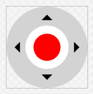
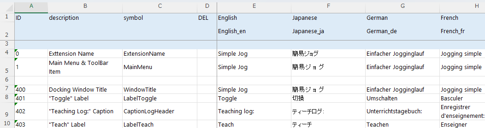

# 簡易ジョグ

Rev.1  
JAM266S8781F  

[日本語](./readme_ja.md) / [English](./readme.md)  
 

本readmeでは、エプソンが配信/提供している「簡易ジョグ」の実際のソースコードを題材に実装内容を解説します。  
RC+ Extensions のテンプレートからプロジェクトを作成し、機能を構築していく過程に沿って、主要なクラスの役割やExtensions APIの利用方法を説明します。

記載しているコードは一部を抜粋したものです。  
全体の構成や完全な実装については、samplesフォルダ内のソースコード一式をあわせて参照してください。

## 1. 概要

Epson RC+ には、ロボットマネージャー等から呼び出せるフル機能の「ジョグ＆ティーチ」が装備されていますが、RC+ Extension を作成すると、この「ジョグ＆ティーチ」の必要な機能だけを呼び出す、カスタムジョグパネル(ウィンドウ)を実現することができます。  
利用シーンによって、カスタムジョグパネルを作成することで、ティーチの効率化が行える可能性があります。  
また、カスタムジョグパネルに限らず、RC+ Extensions を通じて、Epson RC+ をカスタマイズすることで、自分だけのEpson RC+ を作って、より快適に作業できるようになることが期待されます。

初級編では、以下の簡単なジョグパネルを作成して、機能の呼び出し方を説明します。

- モーターの「切換」ボタンをクリックすると、モーターのオン/オフを切り換えます。
- パネルは、マウスのドラッグで動かす、ゲームパッドの「スティック」風なコントロールを左右に一つずつ持ちます。
  - 左のスティックでは、上下で Z 座標に沿ったジョグを行います。
  - 右のスティックでは、上下で Y 座標、左右で X 座標に沿ったジョグを行います。
- 「ティーチ」ボタンをクリックすると、ロボットの現在の位置姿勢を、対象としたポイントファイルで、まだ未定義なポイントを選んで順次ティーチします。
  - ポイントには、この Extension でティーチしたことと、ティーチした日時を示すコメントを入れます。
  - パネルには、ティーチしたポイントを示すログを表示します。

中級編では、実際にゲームパッドが接続されている場合に、そのゲームパッドで操作が行えるようにします。

- モーターの「切換」は、左のバンバーボタン(Shoulder ともいいます)に割り当てます。
- 左右の「スティック」風なコントロールは、実際のスティックで操作できるようにします。
- 「ティーチ」は A ボタンに割り当てます。

---
**＜注意＞**

ロボットの実機でこの Extension を試す場合は、**安全に配慮した設計の上、必ず安全柵の外側で操作する**ようにしてください。

---

それでは始めましょう。

## 2. 実装解説

### 2.1 初級編

1. RC+ Extensions の新しいプロジェクトを作成します。
    - 名前は、SimpleJogとします。
    - 初期機能は、**Main menu and tool bar item** および **Docking window** をチェックします。
    - ARM64 版 Windowsでは、構成を x64 に変更してください。

2. ビルド、デバッグして、動作することを確認します。
    - メニュー項目に `SimpleJog (xx)`(xx は表示言語名)が追加され、メニュー項目を選択して、ドッキングウィンドウが表示されれば OK です。

3. 一旦、Epson RC+ を終了します。

4. DockingWindowフォルダに、以下のファイルを追加します。
    - Stick.xaml
        - 「スティック」風な見た目を実現したユーザーコントロールのファイルです。
            - コントロールが有効化されている場合は、中央の「ノブ」が赤色になり、マウスのドラッグで動かすことができます。  
            

        ```XML
        <UserControl x:Class="SimpleJog.DockingWindow.Stick"
                    xmlns="http://schemas.microsoft.com/winfx/2006/xaml/presentation"
                    xmlns:x="http://schemas.microsoft.com/winfx/2006/xaml"
                    xmlns:mc="http://schemas.openxmlformats.org/markup-compatibility/2006" 
                    xmlns:d="http://schemas.microsoft.com/expression/blend/2008"
                    xmlns:i="http://schemas.microsoft.com/xaml/behaviors"
                    xmlns:local="clr-namespace:SimpleJog.DockingWindow"
                    mc:Ignorable="d" 
                    d:DesignHeight="300" d:DesignWidth="300">

            <Canvas
                Width="300"
                Height="300">

                (中略)

            </Canvas>

        </UserControl>
        ```

    - Stick.xaml.cs
        - Stick コントロールの「ノブ」をマウスで動かすためのコードを追加したコードビハインドのファイルです。

        ```C#
        (前略)

        namespace SimpleJog.DockingWindow
        {
            (中略)

            /// <summary>
            /// Stick.xaml interaction logic
            /// </summary>
            public partial class Stick : UserControl
            {
                (中略)

                /// <summary>
                /// Constructor
                /// </summary>
                public Stick()
                {
                    InitializeComponent();

                    Knob.Loaded += (_, _) =>
                    {
                        _radius = Math.Min(KnobRange.RenderSize.Width, KnobRange.Height) / 2.0 * _limitFactor;
                        _deadZone = _radius * _deadZoneFactor;
                        _center = new Point(KnobRange.RenderSize.Width / 2.0, KnobRange.RenderSize.Height / 2.0);
                    };

                    Knob.MouseLeftButtonDown += (_, ev) =>
                    {
                        Knob.CaptureMouse();

                        _dragging = true;

                        _offset = ev.GetPosition(KnobRange) - _center;
                        _smoothed = new Vector();
                    };

                    (中略)
                }

                /// <summary>
                /// Update knob position
                /// </summary>
                /// <param name="mousePosInRange">Relative mouse position in knob range</param>
                private void UpdateKnobPosition(
                    Point mousePosInRange
                )
                {
                    var x = mousePosInRange.X - _center.X;
                    var y = mousePosInRange.Y - _center.Y;

                    var distanceFromCenter = Math.Sqrt(x * x + y * y);
                    if (distanceFromCenter < _deadZone)
                    {
                        Position = _smoothed = new Vector();
                    }
                    else if (distanceFromCenter < _radius)
                    {
                        _smoothed = new Vector(
                            _smoothed.X * (1 - _smoothingFactor) + (x / _radius) * _smoothingFactor,
                            _smoothed.Y * (1 - _smoothingFactor) + (y / _radius) * _smoothingFactor
                        );
                        Position = new Vector(_smoothed.X, -_smoothed.Y);
                    }
                }
            }
        }
        ```

    - StickProperties.cs
        - Stick コントロールに、「ノブ」位置を示す Vector 型の Position プロパティを追加するためのファイルです。
            - Vector の各要素(X および Y)は、-1.0 から +1.0 の値を取るように正規化されます。

        ```C#
        (前略)

        namespace SimpleJog.DockingWindow
        {
            using System.Windows;

            /// <summary>
            /// Stick.xaml dependency properties
            /// </summary>
            public partial class Stick
            {
                /// <summary>
                /// Normalized position
                /// </summary>
                public Vector Position
                {
                    get => (Vector)GetValue(PositionProperty);
                    set => SetValue(PositionProperty, value);
                }

                /// <summary>
                /// Field of the "Position"
                /// </summary>
                public static readonly DependencyProperty PositionProperty =
                    DependencyProperty.Register(
                        nameof(Position),
                        typeof(Vector),
                        typeof(Stick),
                        new FrameworkPropertyMetadata(
                            default(Vector),
                            (FrameworkPropertyMetadataOptions.BindsTwoWayByDefault
                            | FrameworkPropertyMetadataOptions.AffectsRender),
                            OnPositionChanged,
                            CoercePositionNormalized
                        )
                    );

                /// <summary>
                /// Position changed event handler
                /// </summary>
                /// <param name="d">The object</param>
                /// <param name="ev">The event</param>
                private static void OnPositionChanged(
                    DependencyObject d,
                    DependencyPropertyChangedEventArgs ev
                )
                {
                    if (d is Stick stick)
                    {
                        stick.UpdateRawPosition();
                    }
                }

                /// <summary>
                /// Coerce value of the "Position"
                /// </summary>
                /// <param name="d">The object</param>
                /// <param name="value">The value</param>
                /// <returns>Corrected value</returns>
                private static object CoercePositionNormalized(
                    DependencyObject d,
                    object value
                )
                {
                    var vector = (Vector)value;

                    vector.X = Math.Clamp(vector.X, -1.0, 1.0);
                    vector.Y = Math.Clamp(vector.Y, -1.0, 1.0);

                    return vector;
                }

                /// <summary>
                /// Field key of the "RawPosition"
                /// </summary>
                private static readonly DependencyPropertyKey RawPositionPropertyKey =
                    DependencyProperty.RegisterReadOnly(
                        nameof(RawPosition),
                        typeof(Vector),
                        typeof(Stick),
                        new PropertyMetadata(default(Vector))
                    );

                /// <summary>
                /// Field of the "RawPosition"
                /// </summary>
                public static readonly DependencyProperty RawPositionProperty =
                    RawPositionPropertyKey.DependencyProperty;

                /// <summary>
                /// Raw (pixel) position
                /// </summary>
                public Vector RawPosition => (Vector)GetValue(RawPositionProperty);

                /// <summary>
                /// Set raw position
                /// </summary>
                private void UpdateRawPosition()
                {
                    var rawPosition = new Vector(Position.X * _radius, -(Position.Y * _radius));

                    SetValue(RawPositionPropertyKey, rawPosition);
                }
            }
        }
        ```

5. ここでビルドして、.xaml のデザインビューに Stick が表示されるようにします。

6. DockingWindowフォルダのDockingWindowContent.xamlファイルを編集します。
    - 元からある DockPanel は削除します。
    - 代わりに、3 行 3 列の Grid を配置し、各セルには以下を配置します。以下、0 オリジンとして、R 行 C 列は、(R, C) で示します。
        - 3 行目、3 列目は、Height、Width を \* とします。これらは余白で、Grid は実質 2 行 2 列です。
        - (0, 0): DockPanel を配置し、中に Label「Motor:」、Border、Button、TextBlockを入れます。
            - Border は、IsMotorOn(`ReactivePropertySlim<bool>`)と MotorState(`ReactivePropertySlim<string>`)を参照して、モーター状態を示すインジケータです。モーターがオンのときは、緑地に白抜きの ON、オフのときは、ライトグレーに黒文字の OFF を表示します。
            - Button は、モーターオン／オフの切り換え用です。
                - Content は、Captions[LabelToggle].Value にバインドします。
                - Command は、MotorToggleCommand(ReactiveCommand) にバインドします。
                - IsEnabled は、IsOnline.Value にバインドします。IsOnline(`ReactivePropertySlim<bool>`)は、ロボットコントローラーとの接続が確立されている場合に true となるフラグです。
            - TextBlock の Text は、APIResult.Value にバインドします。APIResult(`ReactivePropertySlim<string>`)は、この Extension のデバッグ用で、呼び出した Extensions API コールのステータス(RCXResult 型)の文字列表現です。API によっては、ステータス以外に情報を返すものがあるので、その場合の付帯情報を示すために、APIResultAux(ReactivePropertySlim&lt;string&gt;)を用意して、APIResultAux.Value を ToolTip にバインドしておきます。
        - (1. 0): 3 行 4 列の Grid を配置し、中に座標方向を示す Label 6 つと、Stick 2 つを入れます。
            - Stick は、サイズを変更できるようにするため、Viewbox で包みます。
                - IsEnabled は、IsMotorOn.Value にバインドします。
                - Position は、左 Stick については、LeftStickPosition.Value にバインドします。LeftStickPosition(`ReactivePropertySlim<Vector>`)は、左 Stick の「ノブ」位置です。右 Stick についても同様です。
        - (0, 1): Label です。Content を Captions[CaptionLogHeader].Value にバインドします。
        - (1, 1): DockPanel を配置し、中に Button と ListBox を入れます。
            - Button は、ティーチ用です。
                - Content は、Captions[LabelTeach].Value にバインドします。
                - Command は、TeachCommand(ReactiveCommand)にバインドします。
                - IsEnabled は、CanTeach.Value にバインドします。CanTeach(`ReactivePropertySlim<bool>`)は、ティーチ可能か否かを示すフラグです。
            - ListBox は、ティーチしたポイントの情報を記録するログです。
                - ItemsSource を LogItems(`ReactiveCollection<LogItem>`)にバインドします。LogItem は、この後作成します。
                - 末尾に追加される最新のログ情報が表示されるよう、AutoScrollBehavior を設定します。AutoScrollBehavior もこのあと作成します。

        ```XML
        <UserControl x:Class="SimpleJog.DockingWindow.DockingWindowContent"
                    xmlns="http://schemas.microsoft.com/winfx/2006/xaml/presentation"
                    xmlns:x="http://schemas.microsoft.com/winfx/2006/xaml"
                    xmlns:mc="http://schemas.openxmlformats.org/markup-compatibility/2006"
                    xmlns:d="http://schemas.microsoft.com/expression/blend/2008"
                    xmlns:i="http://schemas.microsoft.com/xaml/behaviors"
                    xmlns:local="clr-namespace:SimpleJog.DockingWindow"
                    mc:Ignorable="d"
                    d:DesignHeight="450" d:DesignWidth="800">

            <UserControl.DataContext>
                <local:DockingWindowContentViewModel />
            </UserControl.DataContext>

            <Grid
                Margin="10">

                <Grid.RowDefinitions>
                    <RowDefinition Height="30" />
                    <RowDefinition Height="Auto" />
                    <RowDefinition Height="*" />
                </Grid.RowDefinitions>

                <Grid.ColumnDefinitions>
                    <ColumnDefinition Width="Auto" />
                    <ColumnDefinition Width="Auto" />
                    <ColumnDefinition Width="*" />
                </Grid.ColumnDefinitions>
                    
                <DockPanel
                    Grid.Row="0" Grid.Column="0"
                    LastChildFill="True">

                    <Label
                        Content="Motor:"
                        VerticalAlignment="Center" />

                    <Border
                        CornerRadius="10"
                        Width="60"
                        Height="20"
                        Margin="10,0,0,0"
                        VerticalAlignment="Center">
                        <TextBlock
                            Text="{Binding MotorState.Value}"
                            HorizontalAlignment="Center"
                            VerticalAlignment="Center">
                            <TextBlock.Style>
                                <Style
                                    TargetType="TextBlock">
                                    <Style.Triggers>
                                        <DataTrigger
                                            Binding="{Binding IsMotorOn.Value}"
                                            Value="True">
                                            <Setter
                                                Property="Foreground"
                                                Value="White" />
                                        </DataTrigger>
                                        <DataTrigger
                                            Binding="{Binding IsMotorOn.Value}"
                                            Value="False">
                                            <Setter
                                                Property="Foreground"
                                                Value="Black" />
                                        </DataTrigger>
                                </Style.Triggers>
                                </Style>
                            </TextBlock.Style>
                        </TextBlock>
                        <Border.Style>
                            <Style
                                TargetType="Border">
                                <Style.Triggers>
                                    <DataTrigger
                                        Binding="{Binding IsMotorOn.Value}"
                                        Value="True">
                                        <Setter
                                            Property="Background"
                                            Value="#00bb00" />
                                    </DataTrigger>
                                    <DataTrigger
                                        Binding="{Binding IsMotorOn.Value}"
                                        Value="False">
                                        <Setter
                                            Property="Background"
                                            Value="LightGray" />
                                    </DataTrigger>
                                </Style.Triggers>
                            </Style>
                        </Border.Style>
                    </Border>

                    <Button
                        Command="{Binding MotorToggleCommand}"
                        IsEnabled="{Binding IsOnline.Value}"
                        Content="{Binding Captions[LabelToggle].Value}"
                        Width="90"
                        Margin="10,0,0,0"
                        VerticalAlignment="Center" />

                    <TextBlock
                        Text="{Binding APIResult.Value}"
                        ToolTip="{Binding APIResultAux.Value}"
                        TextAlignment="Right"
                        VerticalAlignment="Center"
                        Margin="10,0,20,0" />

                </DockPanel>

                <Grid
                    Grid.Row="1" Grid.Column="0"
                    Margin="0,10,0,0">

                    <Grid.Resources>
                        <Style
                            TargetType="Label">
                            <Setter
                                Property="FontSize"
                                Value="16" />
                        </Style>
                    </Grid.Resources>

                    <Grid.RowDefinitions>
                        <RowDefinition Height="Auto" />
                        <RowDefinition Height="Auto" />
                        <RowDefinition Height="Auto" />
                    </Grid.RowDefinitions>

                    <Grid.ColumnDefinitions>
                        <ColumnDefinition Width="Auto" />
                        <ColumnDefinition Width="Auto" />
                        <ColumnDefinition Width="Auto" />
                        <ColumnDefinition Width="Auto" />
                    </Grid.ColumnDefinitions>

                    <Label
                        Grid.Row="0" Grid.Column="0"
                        Content="+Z"
                        HorizontalAlignment="Center" />
                    <Label
                        Grid.Row="2" Grid.Column="0"
                        Content="-Z"
                        HorizontalAlignment="Center" />
                    <Viewbox
                        Grid.Row="1" Grid.Column="0"
                        Width="200">
                        <local:Stick
                            IsEnabled="{Binding IsMotorOn.Value}"
                            Position="{Binding InputService.LeftStickPosition.Value}" />
                    </Viewbox>

                    <Label
                        Grid.Row="1" Grid.Column="1"
                        Content="-X"
                        Margin="20,0,0,0"
                        VerticalAlignment="Center" />
                    <Label
                        Grid.Row="1" Grid.Column="3"
                        Content="+X"
                        Margin="0,0,10,0"
                        VerticalAlignment="Center" />
                    <Label
                        Grid.Row="0" Grid.Column="2"
                        Content="+Y"
                        HorizontalAlignment="Center" />
                    <Label
                        Grid.Row="2" Grid.Column="2"
                        Content="-Y"
                        HorizontalAlignment="Center" />
                    <Viewbox
                        Grid.Row="1" Grid.Column="2"
                        Width="200">
                        <local:Stick
                            IsEnabled="{Binding IsMotorOn.Value}"
                            Position="{Binding InputService.RightStickPosition.Value}" />
                    </Viewbox>

                </Grid>

                <Label
                    Grid.Row="0" Grid.Column="1"
                    Content="{Binding Captions[CaptionLogHeader].Value}"
                    VerticalAlignment="Center" />

                <DockPanel
                    Grid.Row="1" Grid.Column="1"
                    LastChildFill="True">

                    <Button
                        DockPanel.Dock="Bottom"
                        Command="{Binding TeachCommand}"
                        IsEnabled="{Binding CanTeach.Value}"
                        Content="{Binding Captions[LabelTeach].Value}"
                        Width="100"
                        Margin="0,10,0,0"
                        HorizontalAlignment="Center" />

                    <ListBox
                        x:Name="TeachingLog"
                        ItemsSource="{Binding LogItems}"
                        Width="200">
                        <i:Interaction.Behaviors>
                            <local:AutoScrollBehavior />
                        </i:Interaction.Behaviors>
                    </ListBox>

                </DockPanel>

            </Grid>

        </UserControl>
        ```

7. DockingWindowフォルダに、LogItem.cs ファイルを作成します。
    - この Extension では、ティーチのログとして、ポイント番号と、ワールド座標での X, Y, Z の値を示すことにします。

        ```C#
        (前略)

        namespace SimpleJog.DockingWindow
        {
            using static Epson.RoboticsShared.ExtensionsAPI.IRCXRobotManagerAPI;

            /// <summary>
            /// Teaching log list box item
            /// </summary>
            public class LogItem
            {
                /// <summary>
                /// Point number
                /// </summary>
                public int PointNumber { get; }

                /// <summary>
                /// Point position
                /// </summary>
                public IDictionary<RCXJogCartesianAxis, double>? WorldPosition { get; }

                /// <inheritdoc />
                public override string ToString()
                {
                    if (WorldPosition == null)
                    {
                        return $"P{PointNumber}";
                    }
                    else
                    {
                        var x = WorldPosition[RCXJogCartesianAxis.X];
                        var y = WorldPosition[RCXJogCartesianAxis.Y];
                        var z = WorldPosition[RCXJogCartesianAxis.Z];

                        return $"P{PointNumber}  X: {x:f2}, Y: {y:f2}, Z: {z:f2}";
                    }
                }

                (後略)
        ```

8. DockingWindowフォルダに、AutoScrollBehavior.csファイルを作成します。
    - 純粋にWPFだけに関連しますので、詳細は省きます。

9. DockingWindowフォルダのDockingWindowContentViewModelAddition.cs ファイルを編集します。
    - .xaml でバインドしたプロパティとコマンドを追加します。
    - ロボットコントローラーと接続されているか否かは、コントローラー接続APIのIsOnlineプロパティを参照します。IsOnlineは、接続が確立されている場合は true、切断されている場合は false で、それ以外(接続を確立しようとしている等の中間状態)は null です。接続状態が変更された場合は、PropertyChanged イベントが発生します。
        - ObserveProperty(x => x.PropName).Subscribe(...) は、PropName という名前のプロパティを持つ API オブジェクトの、プロパティ変更を監視する定番の方法です。このExtensionでも、活用されています。
    - モーター状態は、コントローラーAPIのIsMotorOnプロパティを参照します。IsMotorOnは、コントローラーがエラー状態になっている等の理由で nullになる場合があります。モーター状態の変更に伴って、PropertyChanged イベントが発生します。
    - ジョグを行うには、Joggerオブジェクトを使います。ロボットマネージャー API オブジェクトを取得して、CreateJoggerAsync メソッドを呼び出すと、Jogger オブジェクトが得られます。Jogger オブジェクトには IsValidフラグがあり、これが true の場合のみ、機能が実行可能です。Jogger オブジェクトのメソッドを呼び出す際は、このフラグを確認するようにしてください。コントローラー切断等で Jogger オブジェクトが無効になった場合は、Jogger オブジェクトを再度生成してください。
        - ジョグに関するパラメーター(ジョグ移動距離、速度など)は、Epson RC+ 全体で共有されています。Epson RC+ 本体の「ジョグ＆ティーチ」での変更は、基本的には SimpleJog にも適用されます。今回は、SimpleJog でのパラメーター変更は実装しませんので、必要に応じて本体の「ジョグ＆ティーチ」を併用してください。
            - スティック位置に応じて、ジョグ移動距離を設定する(小さく動かすと短い距離の移動、大きく動かすと長い距離の移動、など)という拡張も考えられます。
        - ゲームパッドを使う場合、スティックの操作は、左右同時に行うことができます。現在の API では、複数の方向を指定してジョグを行う機能はありません。したがって、このExtensionでは、Jogger オブジェクトの生成と同時にタイマーを起動し、タイマーの周期で取得したスティック位置に基づいて、各軸方向のジョグを順次行う、ラウンドロビンアルゴリズムを用いています。複数のジョグタスクを同時に実行することは禁止されているため、前の周期で開始されたジョグが終了していない場合は、新しいジョグ開始がエラーとなります。
            - 継続中のジョグをキャンセルして、新たなジョグを開始する、という実装もあり得ます。
    - ポイントファイルは、ポイント API オブジェクトの PointFileDescriptors プロパティから得ることができます。この Extension では、現在のロボットの位置姿勢をティーチしたいため、コントローラーに複数のロボットが接続されている場合は、基本的には現在のロボットに紐づくか、共通のポイントファイルにティーチする必要があります。
        - この Extension では、現在のロボットのデフォルトポイントファイルか、それが得られない場合は、共通のポイントファイルのどれかを対象としてティーチを行います。対象のポイントファイルが見つからなかった場合、CanTeach.Value を false として、ティーチボタンとコマンドを無効化します。
        - 現在のロボットのロボット番号は、ロボットマネージャー API の CurrentRobotNumber プロパティで取得します。現在のロボットを切り替えた場合は、このプロパティの PropertyChanged イベントが発生しますので、そのタイミングで対象のポイントファイルを選び直します。

        ```C#
        (前略)

        namespace SimpleJog.DockingWindow
        {
            (中略)

            /// <summary>
            /// Extension : Docking Window (Specific Part)
            /// </summary>
            internal partial class DockingWindowContentViewModel
            {
                /// <summary>
                /// The controller is online or not
                /// </summary>
                public ReactivePropertySlim<bool> IsOnline { get; } = new(false);

                /// <summary>
                /// Motors are powered or not
                /// </summary>
                public ReactivePropertySlim<bool> IsMotorOn { get; } = new(false);

                /// <summary>
                /// Motor state expression
                /// </summary>
                public ReactivePropertySlim<string> MotorState { get; } = new("Off");

                /// <summary>
                /// Toggle motor state command
                /// </summary>
                public AsyncReactiveCommand MotorToggleCommand { get; }

                /// <summary>
                /// TeachCommand feasibility
                /// </summary>
                public ReactivePropertySlim<bool> CanTeach { get; } = new(false);

                /// <summary>
                /// Teach command
                /// </summary>
                public AsyncReactiveCommand TeachCommand { get; }

                /// <summary>
                /// Teached points information for log
                /// </summary>
                public ReactiveCollection<LogItem> LogItems { get; } = [];

                /// <summary>
                /// API result expression
                /// </summary>
                public ReactivePropertySlim<string> APIResult { get; } = new();

                /// <summary>
                /// Auxiliary information for API result (Error message etc.)
                /// </summary>
                public ReactivePropertySlim<string> APIResultAux { get; } = new();

                /// <summary>
                /// Controller connection API object
                /// </summary>
                private IRCXControllerConnectionAPI? _connectionAPI;

                /// <summary>
                /// Controller API object
                /// </summary>
                private IRCXControllerAPI? _controllerAPI;

                /// <summary>
                /// Robot manager API object
                /// </summary>
                private IRCXRobotManagerAPI? _robotManagerAPI;

                /// <summary>
                /// Point API object
                /// </summary>
                private IRCXPointAPI? _pointAPI;

                /// <summary>
                /// Jogger object
                /// </summary>
                private IRCXRobotManagerAPI.IRCXJogger? _jogger;

                /// <summary>
                /// Polling timer
                /// </summary>
                private PeriodicTimer? _pollingTimer;

                /// <summary>
                /// Polling task
                /// </summary>
                private Task? _pollingTask;

                /// <summary>
                /// Next axis to jog
                /// </summary>
                private IRCXRobotManagerAPI.RCXJogCartesianAxis _targetAxis = IRCXRobotManagerAPI.RCXJogCartesianAxis.Z;

                /// <summary>
                /// Polling interval
                /// </summary>
                private const long _pollingMSec = 10;

                /// <summary>
                /// Target point file for teaching
                /// </summary>
                private string? _targetPointFile;

                /// <summary>
                /// Toggles the motor state
                /// </summary>
                /// <returns>Task</returns>
                private async Task OnMotorToggleAsync()
                {
                    if (_controllerAPI != null)
                    {
                        if (_controllerAPI.IsMotorOn == true)
                        {
                            var result = await _controllerAPI.MotorOffAsync();
                            APIResult.Value = result.ToString();
                            APIResultAux.Value = string.Empty;
                        }
                        else if (_controllerAPI.IsMotorOn == false)
                        {
                            var result = await _controllerAPI.MotorOnAsync();
                            APIResult.Value = result.ToString();
                            APIResultAux.Value = string.Empty;
                        }
                    }
                }

                /// <summary>
                /// Jog along specified axis
                /// </summary>
                /// <param name="axis">Axis</param>
                /// <param name="position">Stick position</param>
                /// <returns>Task</returns>
                private async Task Jog(
                    IRCXRobotManagerAPI.RCXJogCartesianAxis axis,
                    double position
                )
                {
                    if (_jogger != null && _jogger.IsValid)
                    {
                        var oppositeDirection = (position > 0);
                        var (result, message) = await _jogger.StartCartesianJogAsync(axis, oppositeDirection);
                        APIResult.Value = result.ToString() + (string.IsNullOrEmpty(message) ? string.Empty : " *");
                        APIResultAux.Value = message;
                    }
                }

                /// <summary>
                /// Check the stick positions and jog
                /// </summary>
                /// <returns>Task</returns>
                private async Task CheckStickPosition()
                {
                    switch (_targetAxis)
                    {
                        case IRCXRobotManagerAPI.RCXJogCartesianAxis.X:
                            if (Math.Abs(RightStickPosition.Value.X) >= _positionThreshold)
                            {
                                await Jog(_targetAxis, RightStickPosition.Value.X);
                            }
                            _targetAxis = IRCXRobotManagerAPI.RCXJogCartesianAxis.Y;
                            break;

                        case IRCXRobotManagerAPI.RCXJogCartesianAxis.Y:
                            if (Math.Abs(RightStickPosition.Value.Y) >= _positionThreshold)
                            {
                                await Jog(_targetAxis, RightStickPosition.Value.Y);
                            }
                            _targetAxis = IRCXRobotManagerAPI.RCXJogCartesianAxis.Z;
                            break;

                        case IRCXRobotManagerAPI.RCXJogCartesianAxis.Z:
                            if (Math.Abs(LeftStickPosition.Value.Y) >= _positionThreshold)
                            {
                                await Jog(_targetAxis, LeftStickPosition.Value.Y);
                            }
                            _targetAxis = IRCXRobotManagerAPI.RCXJogCartesianAxis.X;
                            break;
                    }
                }

                /// <summary>
                /// Set target point file
                /// </summary>
                /// <param name="robotNumber">Robot number</param>
                private void SetTargetPointFile(
                    int? robotNumber
                )
                {
                    _targetPointFile = null;

                    if (_pointAPI != null)
                    {
                        var descriptors = _pointAPI.PointFileDescriptors;

                        _targetPointFile = descriptors
                            .Where(x => x.RobotNumber == robotNumber && x.IsDefault)
                            .Select(x => x.FileName)
                            .FirstOrDefault();

                        if (_targetPointFile == null)
                        {
                            _targetPointFile = descriptors
                                .Where(x => x.RobotNumber == null)
                                .Select(x => x.FileName)
                                .FirstOrDefault();
                        }
                    }

                    CanTeach.Value = (IsOnline.Value && !string.IsNullOrEmpty(_targetPointFile));
                }

                /// <summary>
                /// Teach point
                /// </summary>
                /// <returns>Task</returns>
                private Task OnTeachAsync()
                {
                    if (_pointAPI != null && _targetPointFile != null)
                    {
                        var (result, points) = _pointAPI.GetPoints(_targetPointFile);
                        if (result == RCXResult.Success && points != null)
                        {
                            var pointNumbers = points.Select(x => (int)x["Number"].Value).ToHashSet();
                            var pointNumberRange = Enumerable.Range(
                                _pointAPI.PointNumberMin,
                                _pointAPI.PointNumberMax - _pointAPI.PointNumberMin + 1
                            );
                            foreach (var number in pointNumberRange)
                            {
                                if (!pointNumbers.Contains(number))
                                {
                                    var stamp = DateTime.Now.ToString("yyyy-MM-dd HH:mm:ss");

                                    var teachResult = _pointAPI.TeachPoint(
                                        _targetPointFile,
                                        number,
                                        description: $"SimpleJog: {stamp}",
                                        shouldSave: true
                                    );
                                    APIResult.Value = teachResult.ToString();
                                    APIResultAux.Value = string.Empty;

                                    if (teachResult == RCXResult.Success)
                                    {
                                        LogItems.Add(new(number, _robotManagerAPI?.WorldPosition));
                                    }
                                    break;
                                }
                            }
                        }
                    }

                    return Task.CompletedTask;
                }

                /// <summary>
                /// Constructor
                /// </summary>
                public DockingWindowContentViewModel()
                {
                    MotorToggleCommand = IsOnline
                    .ToAsyncReactiveCommand()
                    .WithSubscribe(OnMotorToggleAsync)
                    .AddTo(_disposables);

                    TeachCommand = CanTeach
                    .ToAsyncReactiveCommand()
                    .WithSubscribe(OnTeachAsync)
                    .AddTo(_disposables);
                }

                /// <inheritdoc />
                public Task WindowCreated()
                {
                    _connectionAPI = Main.GetAPI<IRCXControllerConnectionAPI>();

                    _connectionAPI?.ObserveProperty(x => x.IsOnline).Subscribe((isOnline) =>
                    {
                        IsOnline.Value = (isOnline == true);

                        CanTeach.Value = (IsOnline.Value && !string.IsNullOrWhiteSpace(_targetPointFile));
                    })
                    .AddTo(_disposables);

                    _controllerAPI = Main.GetAPI<IRCXControllerAPI>();
                    _robotManagerAPI = Main.GetAPI<IRCXRobotManagerAPI>();
                    _pointAPI = Main.GetAPI<IRCXPointAPI>();

                    _controllerAPI?.ObserveProperty(x => x.IsMotorOn).Subscribe(async (isMotorOn) =>
                    {
                        IsMotorOn.Value = (isMotorOn == true);
                        MotorState.Value = (isMotorOn == true) ? "On" : "Off";

                        if (_robotManagerAPI != null)
                        {
                            if (isMotorOn == true)
                            {
                                _jogger = await _robotManagerAPI.CreateJoggerAsync();
                                _pollingTimer = new PeriodicTimer(TimeSpan.FromMilliseconds(_pollingMSec));
                                _pollingTask = Task.Factory.StartNew(async () =>
                                {
                                    while (await _pollingTimer.WaitForNextTickAsync())
                                    {
                                        await CheckStickPosition();
                                    }
                                });
                            }
                            else
                            {
                                if (_jogger != null)
                                {
                                    await _jogger.DisposeAsync();
                                    _jogger = null;
                                }
                                _pollingTask?.Dispose();
                                _pollingTimer?.Dispose();
                            }

                        }
                    })
                    .AddTo(_disposables);

                    _robotManagerAPI?.ObserveProperty(x => x.CurrentRobotNumber).Subscribe((robotNumber) =>
                    {
                        SetTargetPointFile(robotNumber);
                    })
                    .AddTo(_disposables);

                    return Task.CompletedTask;
                }
            }
        }
        ```

10. MainMenuItem.cs ファイルを編集します。
    - ジョグは、ロボットコントローラー(仮想または実機)との接続が確立している状態を前提としています。そこで、ツールバーからウィンドウを開く場合に、接続がなければコントローラー接続を行うようにしてみます。
        - コントローラーに接続するには、コントローラー接続 API を用います。ConnectControllerAsync メソッドは、Epson RC+本体でコントローラー接続されるのと同様で、自動接続の場合は、前回接続したコントローラーに接続しようとします。自動接続でない場合は、「PC とコントローラー接続」画面が表示されます。

        ```C#
        (前略)
                /// <inheritdoc />
                public async Task ExecuteMainMenuItemCommandAsync(
                    string commandName,
                    bool fromToolBar
                )
                {
                    if (fromToolBar)
                    {
                        var controllerConnectionAPI = Main.GetAPI<IRCXControllerConnectionAPI>();
                        if (controllerConnectionAPI?.IsOnline == false)
                        {
                            _ = await controllerConnectionAPI.ConnectControllerAsync().ConfigureAwait(true);
                        }
                    }

                    await DockingWindowContentViewModel.Show();
                }
        (後略)
        ```

11. Captions.xlsx ファイルを編集します。  
    

12. ビルド、デバッグします。
    - Extenion の画面と、ロボットマネージャーの「ジョグ＆ティーチ」、さらに「シミュレーター」画面を開いて、ロボットが動くかをお試しください。
        - ロボットの位置姿勢によっては、直交座標に沿ったジョグができない場合があります。その場合は、他の方法でロボットの位置姿勢を変更してから操作してみてください。  
     

### 2.2 中級編

中級編では、入力デバイスとして、ゲームパッドを使えるようにします。(Xbox Wireless Controller で動作確認しています。)

1. Visual Studio のソリューションエクスプローラーで、SimpleJog プロジェクトをダブルクリックし、以下の変更を行います。
    - TargetFramework を、net8.0-windows10.0.19041.0 に変更します。
        - これにより、Windows ランタイム(WinRT)にある Windows.Gaming.Input API を使って、簡単にゲームパッドが取り扱えるようになります。

2. install.json ファイルを編集します。
    - このファイルは、以下を指定するものです。
        - ビルド出力フォルダ以外で、別にコピーする必要がある Extension が使うコンテンツ等のフォルダ
        - Extension 本体とともに明示的に読み込む必要があるアセンブリ
    - ここでは、以下の内容とします。

        ```JSON
        {
            "Contents": [
            ],
            "Dependents": [
                "Microsoft.Windows.SDK.NET.dll",
                "WinRT.Runtime.dll"
            ]
        }
        ```

3. DockingWindow フォルダに、以下のファイルを追加します。
    - GamepadInfo.cs
        - ゲームパッドを識別するための情報である GamepadInfo クラスを記述するファイルです。
            - Windows.Gaming.Input の Gamepad クラス単体では、仕様上の制約として、人間にわかりやすい名前などを取得することができません。そのため、この Extension では、単に見つかった順番で、ゲームパッドが識別できるようにします。

            ```C#
            (前略)

            namespace SimpleJog.DockingWindow
            {
                using Windows.Gaming.Input;

                /// <summary>
                /// Gamepad information
                /// </summary>
                public class GamepadInfo
                {
                    /// <summary>
                    /// Gamepad object
                    /// </summary>
                    public Gamepad Gamepad { get; }

                    /// <summary>
                    /// Gamepad number
                    /// </summary>
                    public int Number { get; }

                    /// <summary>
                    /// Gamepad name
                    /// </summary>
                    public string Name => $"Gamepad #{Number}";

                    /// <summary>
                    /// Constructor
                    /// </summary>
                    /// <param name="gamepad">Gamepad object</param>
                    /// <param name="number">Gamepad number</param>
                    public GamepadInfo(
                        Gamepad gamepad,
                        int number
                    )
                    {
                        Gamepad = gamepad;
                        Number = number;
                    }
                }
            }
            ```

    - IGamepadInputService.cs
        - この Extension で用いる、ゲームパッド入力のインターフェイス IGamepadInputService を記述するファイルです。

            ```C#
            (前略)

            namespace SimpleJog.DockingWindow
            {
                using Reactive.Bindings;
                using Windows.Gaming.Input;

                /// <summary>
                /// Interface of gamepad input service
                /// </summary>
                public interface IGamepadInputService
                {
                    /// <summary>
                    /// Property for current reading
                    /// </summary>
                    public IReadOnlyReactiveProperty<GamepadReading> CurrentReading { get; }

                    /// <summary>
                    /// Set target gamepad
                    /// </summary>
                    /// <param name="gamepad">Gamepad object</param>
                    public void SetGamepad(
                        Gamepad gamepad
                    );

                    /// <summary>
                    /// Start service
                    /// </summary>
                    public void Start();

                    /// <summary>
                    /// Stop service
                    /// </summary>
                    public void Stop();
                }
            }
            ```

    - GamepadInputService.cs
        - IGamepadInputService インターフェースを実装する GamepadInputService クラスを記述するファイルです。
            - タイマーを使って、ポーリングし、入力を更新しています。ただし、マウスボタンが押されているときは、更新をスキップします。DispatcherTimer の Tick は、UI スレッドで呼ばれるため、System.Windows.Input の Mouse インスタンスにアクセスできます。

            ```C#
            (前略)

            namespace SimpleJog.DockingWindow
            {
                using Reactive.Bindings;
                using System.Windows.Threading;
                using Windows.Gaming.Input;

                /// <summary>
                /// Implementation of gamepad input service
                /// </summary>
                public class GamepadInputService : IGamepadInputService
                {
                    /// <inheritdoc />
                    public IReadOnlyReactiveProperty<GamepadReading> CurrentReading => _reading;

                    /// <summary>
                    /// The substance of CurrentReading
                    /// </summary>
                    private readonly ReactivePropertySlim<GamepadReading> _reading = new(mode: ReactivePropertyMode.None);

                    /// <summary>
                    /// Target gamepad
                    /// </summary>
                    private Gamepad? _gamepad;

                    /// <summary>
                    /// Timer for polling
                    /// </summary>
                    private DispatcherTimer _timer;

                    /// <summary>
                    /// Polling interval
                    /// </summary>
                    private const int _pollingIntervalMSec = 16;

                    /// <summary>
                    /// Constructor
                    /// </summary>
                    public GamepadInputService()
                    {
                        _timer = new()
                        {
                            Interval = TimeSpan.FromMilliseconds(_pollingIntervalMSec),
                        };

                        _timer.Tick += (_, _) =>
                        {
                            if (_gamepad != null)
                            {
                                if (Mouse.LeftButton == MouseButtonState.Pressed)
                                {
                                    return;
                                }

                                _reading.Value = _gamepad.GetCurrentReading();
                            }
                        };
                    }

                    /// <inheritdoc />
                    public void SetGamepad(
                        Gamepad? gamepad
                    )
                    {
                        _gamepad = gamepad;
                    }

                    /// <inheritdoc />
                    public void Start()
                    {
                        _timer.Start();
                    }

                    /// <inheritdoc />
                    public void Stop()
                    {
                        _timer.Stop();
                    }
                }
            }
            ```

    - InputService.cs
        - ゲームパッドの入力を、この Extension用の入力に変換するサービスであるInputService クラスを記述するファイルです。
            - Stick のマウス処理にも同様の記述がありますが、デッドゾーンとスムージングの処理もここで行います。ゲームパッドのスティックは、ニュートラルの位置でも、値としてはゼロになっていない場合があります。特定の範囲で、これをゼロとみなすのがデッドゾーンの処理です。また、スティックの動きが急でも、値としては多少緩やかに変化するように調整するのがスムージングの処理です。

            ```C#
            (前略)

            namespace SimpleJog.DockingWindow
            {
                (中略)

                /// <summary>
                /// Input service
                /// </summary>
                public class InputService : IDisposable
                {
                    /// <summary>
                    /// State of gamepad buttons
                    /// </summary>
                    public ReactivePropertySlim<GamepadButtons> Buttons { get; } = new(GamepadButtons.None);

                    /// <summary>
                    /// Left stick position
                    /// </summary>
                    public ReactivePropertySlim<Vector> LeftStickPosition { get; } = new();

                    /// <summary>
                    /// Right stick position
                    /// </summary>
                    public ReactivePropertySlim<Vector> RightStickPosition { get; } = new();

                    /// <summary>
                    /// Stores the most recently calculated smoothed position for the left stick.
                    /// </summary>
                    private Vector _leftSmoothedPosition;

                    /// <summary>
                    /// Stores the most recently calculated smoothed position for the right stick.
                    /// </summary>
                    private Vector _rightSmoothedPosition;

                    /// <summary>
                    /// Dead zone definition
                    /// </summary>
                    private const double _deadZoneFactor = 0.05;

                    /// <summary>
                    /// Represents the smoothing factor used in calculations that require exponential smoothing.
                    /// </summary>
                    /// <remarks>This constant determines the weight given to new data points versus historical data
                    /// in smoothing algorithms. A lower value results in smoother output but slower response to changes.</remarks>
                    private const double _smoothingFactor = 0.2;

                    /// <summary>
                    /// Disposables
                    /// </summary>
                    private readonly CompositeDisposable _disposables = [];

                    /// <summary>
                    /// Constructor
                    /// </summary>
                    /// <param name="gamepadInputService">Gamepad input service</param>
                    public InputService(
                        IGamepadInputService gamepadInputService
                    )
                    {
                        gamepadInputService.CurrentReading.Subscribe((reading) =>
                        {
                            Buttons.Value = reading.Buttons;

                            _leftSmoothedPosition = AdjustPosition(
                                new Vector(reading.LeftThumbstickX, reading.LeftThumbstickY),
                                _leftSmoothedPosition
                            );
                            _rightSmoothedPosition = AdjustPosition(
                                new Vector(reading.RightThumbstickX, reading.RightThumbstickY),
                                _rightSmoothedPosition
                            );

                            LeftStickPosition.Value = _leftSmoothedPosition;
                            RightStickPosition.Value = _rightSmoothedPosition;
                        })
                        .AddTo(_disposables);
                    }

                    /// <summary>
                    /// Dead zone check and smoothing
                    /// </summary>
                    /// <param name="currentPosition">Current stick position</param>
                    /// <param name="lastPosition">Last stick position</param>
                    /// <returns>Adjusted stick position</returns>
                    private Vector AdjustPosition(
                        Vector currentPosition,
                        Vector lastPosition
                    )
                    {
                        var distance = Math.Sqrt(
                            Math.Pow(currentPosition.X, 2.0)
                            + Math.Pow(currentPosition.Y, 2.0)
                        );

                        if (distance < _deadZoneFactor)
                        {
                            return new Vector();
                        }
                        else
                        {
                            return new Vector(
                                lastPosition.X * (1.0 - _smoothingFactor) + currentPosition.X * _smoothingFactor,
                                lastPosition.Y * (1.0 - _smoothingFactor) + currentPosition.Y * _smoothingFactor
                            );
                        }
                    }

                    /// <inheritdoc />
                    public void Dispose()
                    {
                        _disposables.Dispose();
                    }
                }
            }
            ```

4. DockingWindow フォルダの DockingWindowContent.xaml ファイルを編集します。
    - 最上位のGridに列を追加し、ゲームパッドを選択するための UI(Label と ComboBox)を配置します。
      - ComboBox は、接続されているゲームパッド一覧を表示するため、ItemsSource を Gamepads(`ReactiveCollection<GamepadInfo>`)にバインドします。
      - 選択されたゲームパッドを ViewModel 側で識別できるように、SelectedIndex を SelectedGamepadIndex.Value にバインドします。
      - 表示名はGamepadInfoのNameを使うため、DisplayMemberPathを "Name" に設定します。
    - 既存のStickのPositionバインドは、ゲームパッド入力と共通化するため、以下のように変更します。
      - LeftStickPosition.Value  →  InputService.LeftStickPosition.Value
      - RightStickPosition.Value →  InputService.RightStickPosition.Value

        ```XML
        (前略)

                <StackPanel
                    Grid.Row="2" Grid.Column="0"
                    Orientation="Horizontal">

                    <Label
                        Content="Gamepads:"
                        VerticalAlignment="Center" />
                    <ComboBox
                        ItemsSource="{Binding Gamepads}"
                        SelectedIndex="{Binding SelectedGamepadIndex.Value}"
                        DisplayMemberPath="Name"
                        IsReadOnly="True"
                        MinWidth="100"
                        VerticalAlignment="Center"
                        Margin="10,0,0,0" />

                </StackPanel>
        
        (後略)
        ```

5. DockingWindowフォルダのDockingWindowContentViewModelAddition.cs ファイルを編集します。
   - 前述のゲームパッド選択 UI(ComboBox)と連動するように、ゲームパッド入力に関するプロパティと初期化処理を追加します。
   - CheckStickPosition メソッド内で参照している LeftStickPosition / RightStickPosition は、InputService.LeftStickPosition / InputService.RightStickPositionに書き換えます。
   - ゲームパッド入力を扱うため、InputServiceとGamepadInputServiceを使用します。
     - コンストラクタでInputService = new(_gamepadInputService); として生成します。
   - ゲームパッド一覧と選択状態をViewModelで管理するため、次のプロパティを追加します。
     - Gamepads(`ReactiveCollection<GamepadInfo>`)
     - SelectedGamepadIndex(`ReactivePropertySlim<int>`)
   - SelectedGamepadIndexの変更を監視し、選択されたゲームパッドをGamepadInputServiceに設定します。
   - ウィンドウ表示中のゲームパッドの付け外しは、GamepadAdded / GamepadRemoved イベントで検知し、Gamepadsを更新します。
   - ウィンドウ表示前にすでに接続されているゲームパッドは、イベントでは検知できないため、ScanGamepads メソッドを用いて列挙します。
     - ScanGamepads はコンストラクタで呼び出し、初期表示時のゲームパッド一覧を構築します。
   - ゲームパッドのボタン入力は、InputService.Buttonsを監視してコマンドを呼び出します。
     - LeftShoulder ボタンで MotorToggleCommandを実行します。
     - A ボタンでTeachCommandを実行します。
   - 初期化処理として、コンストラクタで ScanGamepadsを実行し、_gamepadInputService.Start() を呼び出して入力のポーリングを開始します。
     - 停止処理(_gamepadInputService.Stop())は後述の手順で追加します。

        ```C#
        (前略)
                /// <summary>
                /// Input service object
                /// </summary>
                public InputService InputService { get; }

                (中略)

                /// <summary>
                /// List of connected game pads
                /// </summary>
                public ReactiveCollection<GamepadInfo> Gamepads { get; } = new();

                /// <summary>
                /// Selected game pad index
                /// </summary>
                public ReactivePropertySlim<int> SelectedGamepadIndex { get; } = new(-1);

                (中略)

                /// <summary>
                /// Gamepad input service object
                /// </summary>
                private GamepadInputService _gamepadInputService = new();

                (中略)

                /// <summary>
                /// Scans for connected gamepads
                /// </summary>
                private void ScanGamepads()
                {
                    SelectedGamepadIndex.Value = -1;

                    Gamepads.Clear();

                    const int _waitMSec = 100;
                    const int _maxRetryCount = 30;

                    for (var retryCount = 0; retryCount < _maxRetryCount; retryCount++)
                    {
                        if (Gamepad.Gamepads.Count <= 0)
                        {
                            Thread.Sleep(_waitMSec);
                        }
                        else
                        {
                            foreach (var (gamepad, index) in Gamepad.Gamepads.Select((x, index) => (x, index)))
                            {
                                Gamepads.Add(new GamepadInfo(gamepad, 1 + index));
                            }
                            SelectedGamepadIndex.Value = 0;
                            break;
                        }
                    }
                }

                /// <summary>
                /// Constructor
                /// </summary>
                public DockingWindowContentViewModel()
                {
                    InputService = new(_gamepadInputService);

                    (中略)

                    InputService.Buttons.Subscribe((buttons) =>
                    {
                        if ((buttons & GamepadButtons.LeftShoulder) != 0)
                        {
                            MotorToggleCommand.Execute();
                        }

                        if ((buttons & GamepadButtons.A) != 0)
                        {
                            TeachCommand.Execute();
                        }
                    })
                    .AddTo(_disposables);

                    SelectedGamepadIndex.Subscribe((index) =>
                    {
                        if (index >= 0)
                        {
                            _gamepadInputService.SetGamepad(Gamepads[index].Gamepad);
                        }
                    })
                    .AddTo(_disposables);

                    Gamepad.GamepadAdded += (_, gamepad) =>
                    {
                        Gamepads.AddOnScheduler(new GamepadInfo(gamepad, Gamepads.Count));
                    };

                    Gamepad.GamepadRemoved += (_, gamepad) =>
                    {
                        var target = Gamepads.FirstOrDefault(x => ReferenceEquals(x.Gamepad, gamepad));
                        if (target != null)
                        {
                            Gamepads.RemoveOnScheduler(target);
                        }
                    };

                    ScanGamepads();

                    _gamepadInputService.Start();
                }

                (後略)
        ```

6. DockingWindow フォルダのDockingWindowContentViewMode.csファイルを編集します。
   - ウィンドウを閉じるときには、ゲームパッド入力のポーリングを停止します。
   - CloseAsync メソッド内で、_gamepadInputService.Stop() を呼び出してください。
   - これにより、ウィンドウを閉じた後に不要なポーリング処理が継続することを防ぎます。

        ```C#
        (前略)

        /// <inheritdoc />
        public Task<bool> CloseAsync()
        {
            _gamepadInputService.Stop();

            return Task.FromResult(true);
        }

        (後略)
        ```

7. ビルド、デバッグします。
    - 初級編と同様に各ウィンドウを開き、ゲームパッドでの操作が行えるか確認しましょう。
    - この Extensionでのゲームパッド対応には、以下の制約があります。
        - Extensionのウィンドウにフォーカスがないと、ゲームパッドの入力は拾われません。
        - 特に、API 呼び出しで確認ダイアログ等が開かれると、ダイアログのボタンをゲームパッドでクリックすることができないため、ゲームパッドでの処理を中断して、PCのマウスまたはキーボードを使わなければなりません。
            - この Extensionでは、モーターをオンにする場合の確認ダイアログが該当します。確認ダイアログの表示を省略してもよいと判断できるケース(慎重に考慮してください)では、モーターオンの APIのかわりに、SPEL+ コマンドの "Motor On" を実行することで、確認をバイパスできます。最終的なコードでは、これが実装されていますので、興味のある方はお調べください。
