# SPEL Analysis Tool

Rev.1  
ENM269S9186F

[日本語](./readme_ja.md) / [English](./readme.md)   

## 1. FOREWORD

### 1.1 Overview

By using the SPEL analysis tool, you can easily generate and review a SPEL program log.  
In the SPEL analysis tool, a log output library is included. When this library’s API is integrated into the customer’s program, the following log is output.

- Profile information when outputting logs
- Cycle and section time information
- Motion information of the robot pose and position

The output logs can be checked in the table and graph on the dedicated screen.  
In addition to the function that allows you to check the log, the dedicated screen has the following functions:

- Target parameter: By setting the target value beforehand, you can visually check whether the cycle time is within the target.
- Adjustment parameter: Allows define values in the .inc file to be configured from the screen.

Use it for tuning the SPEL program.  

#### Definition of terms

|Term |Description|
|:- |:-|
|Cycle |A series of actions to be performed repeatedly|
|Section |A cohesive unit of operation within a cycle|

### 1.2 Safety Related Information

Be sure to read and comply with the safety related information. For details, refer to the following manuals.

“Controller manual”  
(For VT-B series, refer to the “Manipulator manual”)  
“Manipulator manual”  
“Epson RC+ 8.0 User’s Guide”  

### 1.3 Warranty and Disclaimer

The terms of the warranty and disclaimers for the extension are governed by the Software License Agreement of Epson RC+.

### 1.4 Contact Information

For inquiries on using the extension function, contact Epson.

## 2. System Requirements

The SPEL Analysis Tool is supported in the following environment:

- Epson RC+ 8.0
  - Version 8.2.0.0 or later
  - Premium Edition

## 3. Operation Procedure

This section describes the operation procedure.

### 3.1 Installation

Install “SPEL Analysis Tool” from the Extensions Manager of Epson RC+.  
For details on the installation method, refer to the “Epson RC+ 8.0 Extension RC+ Extensions 8.0”.  


### 3.2 From Displaying the SPEL Analysis Tool Screen to Checking Log Contents

After installation is complete, the SPEL analysis tool screen will be displayed.This section describes how to open the SPEL Analysis Tool screen and review log contents.

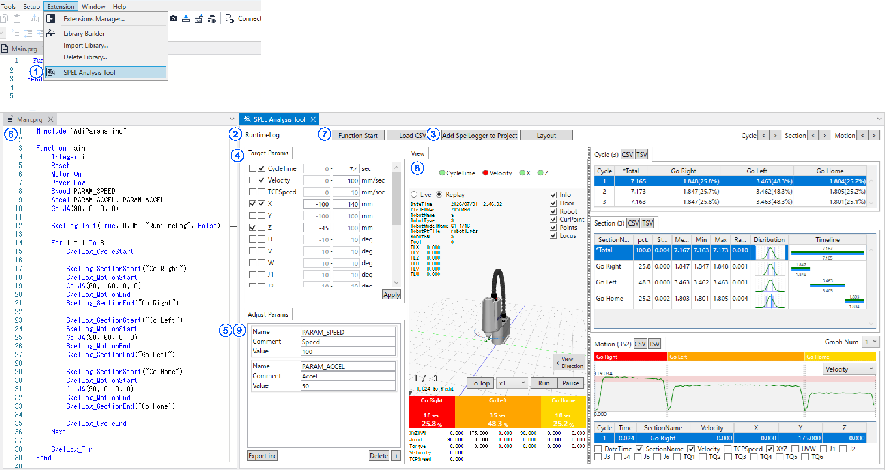  


1. Displaying the SPEL Analysis Tool Screen

      

   - From the Epson RC+ menu, select [Extensions] - [SPEL Analysis Tool] to display the SPEL Analysis Tool screen.

2. Configure the log name

    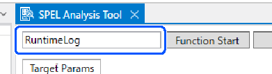  

   - Unless there is a special reason, make sure to use the initial value “RuntimeLog” for the log name. However, make sure to match it with the log name specified using the SpelLog_Init of the log output API.

3. Add the log output library to the project.

    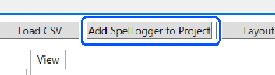  

   - Click on the [Add SpelLogger to Project] to add the log output library to the project.
   - The SpelLogger addition screen will be displayed. The SpelLogger format that is going to be added can be selected on this screen.

4. Set the target parameter

    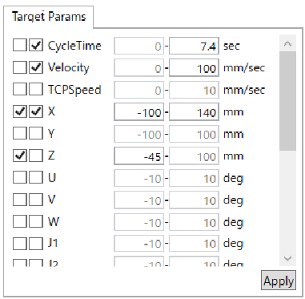  

   - The target value can be configured later.
   - This setting is not mandatory. If you are only going to check the log, this setting is not necessary. Use this when necessary.

5. Set the adjustment parameter

    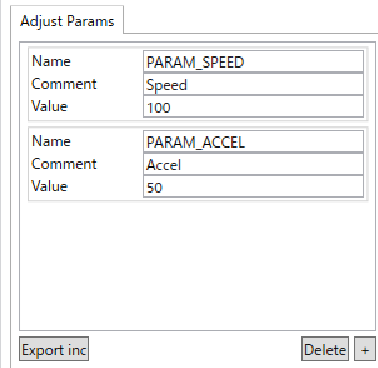  

   - Prepare any parameters you intend to tune, such as SPEED.
   - By clicking on the [write inc], the configured parameter will be added to the project as AdjParams.inc. Make sure to include this file in your program file.
   - This setting is not mandatory. If you are only going to check the log, this setting is not necessary. Use this when necessary.

6. Integrate the logging library API and tuning parameters into your SPEL program.

    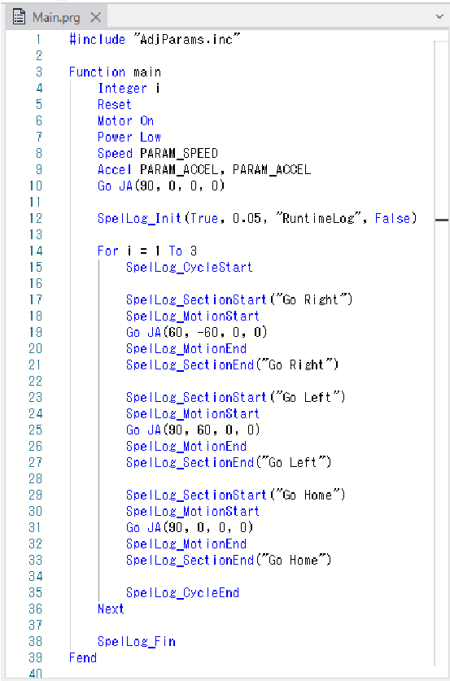  

   - Integrate the tuning parameter’s definition value to your program if necessary.

7. Start the function

    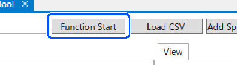  

   - Click the [Start Function] button to start the function.
   - The function starting screen will be displayed. Select [Function] and start.

8. Check the content of the log that is output

    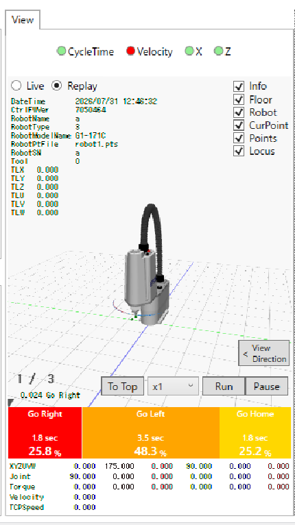  

   - After the SPEL program has finished running, the log will be displayed on the screen.

9. Adjust the parameter  

      

   - Change the value of the tuning parameter and try to start the function again.
   - Repeat this task if necessary and use it for tuning your SPEL program.

## 4. Log output library

This section describes the API of the log output library SpelLogger.prg/SpelLoggerLib and the log file that is output.

### 4.1 API

The API and argument structure are as follows:

#### SpelLog_Init

Initialize the log record and start.

```vb
Function SpelLog_Init(isEnabled As Boolean, interval As Real, filename$ As String, isCollectTorque As Boolean)
```

- isEnabled: enable/disable the log output
- interval: motion log interval (seconds)  
- filename: the log name
- isCollectTorque: whether to write the torque log or not

*Log names should be a maximum of 32 ASCII characters. Also, do not include characters such as commas, tabs, and double quotations.

#### SpelLog_Fin

End recording log.

```vb
Function SpelLog_Fin
```

#### SpelLog_CycleStart

Start the cycle.

```vb
Function SpelLog_CycleStart
```

#### SpelLog_CycleEnd

End the cycle.

```vb
Function SpelLog_CycleEnd
```

#### SpelLog_SectionStart

Start the section.

```vb
Function SpelLog_SectionStart(sectionName$ As String)
```

- sectionName: the section name

*Section names should be a maximum of 32 ASCII characters Also, do not include characters such as commas, tabs, and double quotations.

#### SpelLog_SectionEnd

End the section

```vb
Function SpelLog_SectionEnd(sectionName$ As String)

```

- sectionName: the section name

#### SpelLog_MotionStart

Start recording the motion log

```vb
Function SpelLog_MotionStart
```

*The library uses the P900 to temporarily hold point information in the motion log output.  
Make sure to either refrain from using P900 in your program, or use SpelLogger in file format and rewrite the relevant section.

#### SpelLog_MotionEnd

End recording the motion log

```vb
Function SpelLog_MotionEnd
```

#### Implementation example

For details on implementation such as calling the API in order, refer to the following example.

```vb
Function main
	Integer i
	Reset
	Motor On
	Power Low
	Speed PARAM_SPEED
	Accel PARAM_ACCEL, PARAM_ACCEL
	Go JA(90, 0, 0, 0)
	
	SpelLog_Init(True, "RuntimeLog", 0.05, False)
	
	For i = 1 To 3
		SpelLog_CycleStart
		
		SpelLog_SectionStart("Go Right")
		SpelLog_MotionStart
		Go JA(60, -60, 0, 0)
		SpelLog_MotionEnd
		SpelLog_SectionEnd("Go Right")
		
		SpelLog_SectionStart("Go Left")
		SpelLog_MotionStart
		Go JA(90, 60, 0, 0)
		SpelLog_MotionEnd
		SpelLog_SectionEnd("Go Left")
		
		SpelLog_SectionStart("Go Home")
		SpelLog_MotionStart
		Go JA(90, 0, 0, 0)
		SpelLog_MotionEnd
		SpelLog_SectionEnd("Go Home")
		
		SpelLog_CycleEnd
	Next
	
	SpelLog_Fin
Fend
```

### 4.2 Log Files

By executing a SPEL program that implements the API, a log file in CSV format will be output to the project folder.  
The line structure of the CSV file is as follows:  
The [Log Name] is a character string that is specified with the argument logname of SpelLog_Init.

#### [Log Name]_Info.csv

Records profile information at the time of log acquisition.

- Name: item <br>(LogName, Interval, IsCollectTorque, DateTime, CtrFWVer, RobotName, RobotType, RobotModelName, RobotSN, Tool, TLX, TLY, TLZ, TLU, TLV, TLW)
- Value: value

#### [Log Name]_Section.csv

Records the beginning and end of the log, cycle and section.

- DateTime: date and time
- ElapsedTime: elapsed time
- CycleNo: cycle number
- SectionName: section name
- Flag: section status flag <br>(LogStart, LogEnd, CycleStart, CycleEnd, SectionStart, SectionEnd)

#### [Log Name]_Motion.csv

Records the motion information of XYZUVW etc.

- DateTime: date and time
- ElapsedTime: elapsed time
- CycleNo: cycle number
- SectionName: section name
- X,Y,Z,U,V,W: X,Y,Z,U,V,W  
  *If Tool is specified, it is the coordinates of the Tool tip.
- J1 to J6: Joint angle
- Torque 1 to 6: Torque (values that can be acquired from the SPEL command Real Torque)
- TCPSpeed: CP motion speed (values that can be acquired from the SPEL command TCPSpeed)

## 5. SPEL Analysis Tool screen

This section describes the screen structure of the SPEL Analysis Tool.

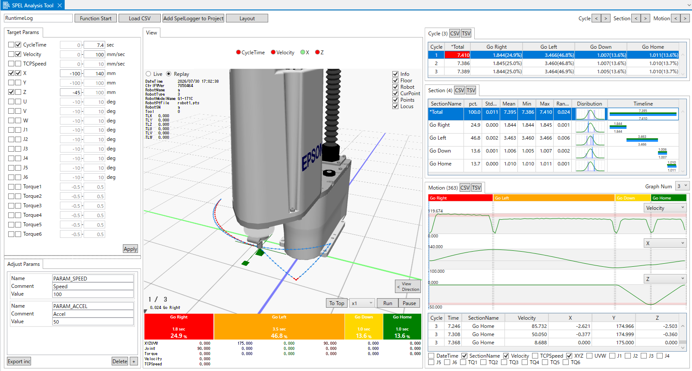

The SPEL Analysis Tool screen consists of the following areas:

- a Header area
- b Contents area

The following panes are displayed in the contents area:

- b1 Target parameter pane
- b2 Adjustment parameter pane
- b3 View pane
- b4 Cycle pane
- b5 Section pane
- b6 Motion pane

### 5.1 Header Area

The header area primarily contains buttons for basic operations related to checking log output.

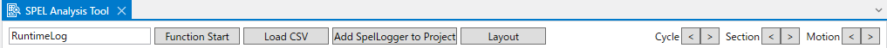

#### 5.1.1 Log Name Input

Input the log name. This is used to read the log CSV file.

*Enter a log name using ASCII characters, no more than 32 characters. Also, do not use characters such as commas, tabs, and double quotations.

#### 5.1.2 Start the Function

By clicking the [Function Start] button, the function starting screen will appear.  
Select the function from the drop down list and execute the function.  
Before starting, use the contents set in the adjustment parameter that will be later described to update AdjParams.inc.  
After the function is complete, the log content will be displayed.

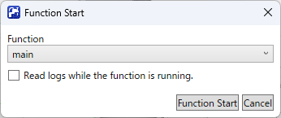

- Function combo box
  - Select the Function to execute.
- [Load logs from execution] check box
  - When you select this check box and start the function, the log will be loaded and displayed each time a cycle is completed while the SPEL program is operating.

#### 5.1.3 Load the CSV

When you click on the [Load CSV] button, the log in the project file will be loaded and displayed. Make sure to use this when you want to check the log and there is already a log file that was output before in the project folder.

#### 5.1.4 Adding the SpelLogger to a Project

By clicking on the [Add SpelLogger to project] button, the [Add SpelLogger to project] screen will be displayed.  
Add the SpelLogger, which outputs the log, to the project. SpelLogger can be selected from either the file format SpelLogger.prg or the library format SpelLoggerLib. Use the file format when you want to check the processing content of SpelLogger or when you want to tune the log output.

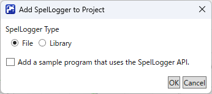

- Selecting the SpelLogger type
  - Select either the file format or the library format
- [Add sample program] check box
  - When this check box is selected and executed, the sample program SmpUsingSpelLogger.prg, which uses the SpelLoggerAPI, will be added.
  - The following functions are implemented in the sample program. Use this as a reference when implementing the SpelLoggerAPI in your program.
    - SmpUsingSpelLoggerForSCARA: for SCARA robots
    - SmpUsingSpelLoggerForSixAxes: for 6-Axis robots

#### 5.1.5 Layout

By clicking on the [Layout] button, the layout screen will be displayed.  
You can configure the display/hide status and placement of content items.  
This is useful if you want to change the layout to your liking, or if your monitor screen is small and you only want to display the necessary information.

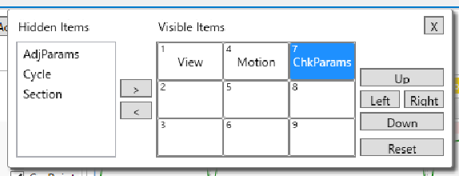

- [\>] button
  - Changes the selected hidden items to visible items.
- [\<] button
  - Changes the selected visible item to hidden items.
- [Up] button
  - Moves the item’s placement upward.
- [Left] button
  - Moves the item’s placement to the left.
- [Right] button
  - Moves the item’s placement to the right.
- [Down] button
  - Moves the item’s placement downward.
- [Reset] button
  - Resets the layout.

#### 5.1.6 Selecting the Cycle, Section, Motion Column

If you continue to press the button, you can move through the selected columns in the Cycle, Section, and Motion lists consecutively.  
This is useful when you want to check the displayed content while continuously switching between selections.

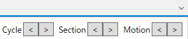

- [\<] button
  - Moves the selected column forward in sequence.
- [\>] button
  - Moves the selected column backward in sequence.

### 5.2 Contents Area

In the contents area, functions for checking parameter settings and log contents are provided

#### 5.2.1 Target Parameter Pane

When you select the Min and Max of the target value, you can check whether the log output results are within the range. You can check whether the target value is within the range from the background color of the view pane’s header area and the list’s cell.

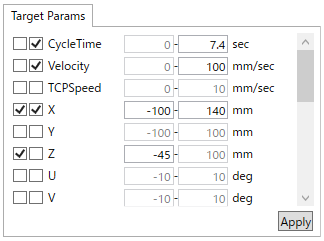

- Target parameter list
  - The CycleTime,Velocity (Calculated from X, Y, Z and time information), TCPSpeed, X, Y, Z, U, V, W, J1 to J6, Torque1 to Torque6 can be confirmed.
  - Decide whether to include it in the check and set a target value.
- [Apply] button
  - Updates the background color of the view pane’s header area and the cell list. You can check the comparison results with the target value even when not reading the logs.

#### 5.2.2 Adjustment Parameter Pane

Set the adjustment parameter.  
The values set here will be output to AdjParams.inc as define definitions.

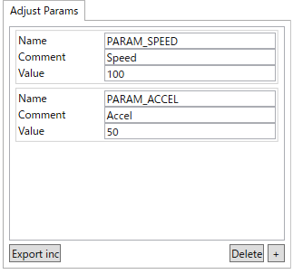

- Adjustment parameter list
  - Set the adjustment parameter’s name, comment, and definition value.
- [Output to inc] button
  - Updates the AdjParams.inc using the settings.
- [Delete] button
  - Deletes the items selected in the adjustment parameter list.
- [+] button
  - Add an item to the adjustment parameter list.

#### 5.2.3 View Pane

This allows you to visually confirm the target parameter’s results and robot pose. This feature displays information such as the robot's posture in conjunction with the column selection in the Motion pane.

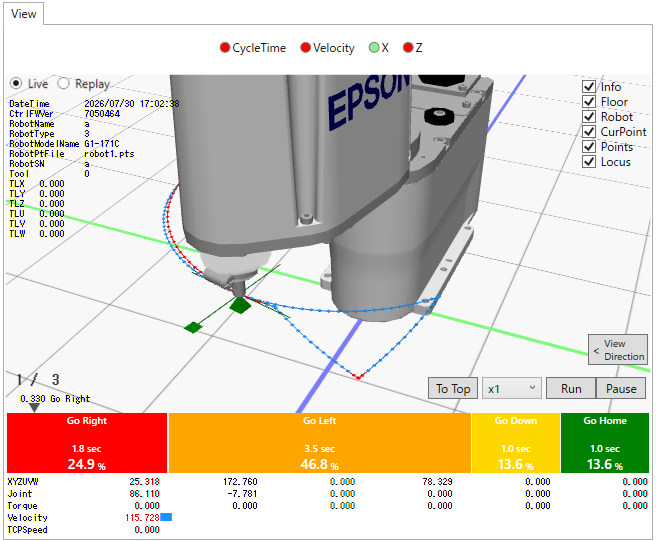

- Target value results

    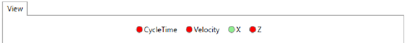  

  - This allows you to compare the results with the target value. A green circle will be displayed if it is within the range and a red circle will be displayed if it is outside of the range.

- 3D view area

    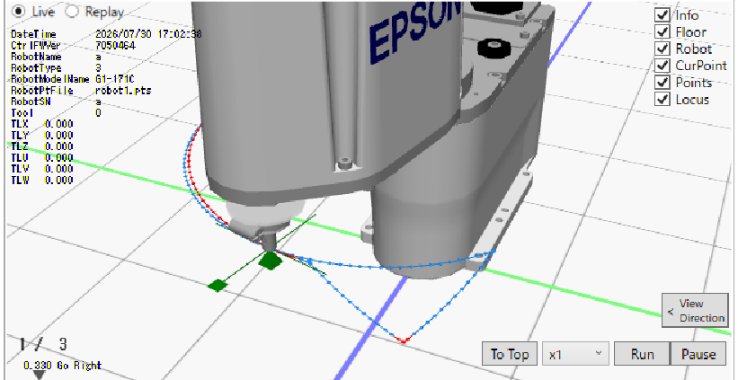  

  - The following information is displayed in the 3D view. You can switch between show and hide using the check box on the upper right side.
    - Info: displays the log’s profile information on the upper left side.
    - Floor: the horizontal plane on which the robot is placed is displayed using XY coordinate axes and a 10 cm scale.
    - Robot: displays the robot pose.
    - CurPoint: the current selection position in the Motion list is displayed as a cross shape using the XYZUVW coordinates.
    - Points: displays the XYZ points recorded in the Motion log.
    - Locus: displays the trajectory of points connected by straight lines.

- Live/Replay Switching

    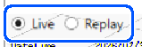  

  - When you select live, the robot that the Controller is currently connected to can be confirmed in the 3D view.

- [To Top] button

    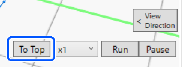  

  - Move the Motion selection column to the beginning. This is useful when you want to restart playback from the beginning after it has finished.

- Speed selection combo box

    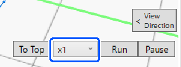  

  - This allows you to select the playback speed. Playback will not be at the actual playback speed.

- [Run] button

    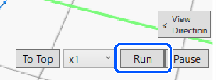  

  - Plays back the motion information in the log. Moves the selected Motion entry according to the playback position.
  - If you click on the [Run] button again after the playback has stopped, it will restart from the stopped position. It will not restart from the beginning.

- [Pause] button

    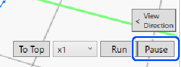  

  - Pauses the playback.

- Triangular slider

    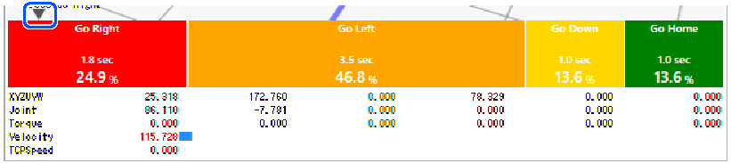  

  - The triangle displayed at the top of the Section Ratio bar indicates the current selection position in the Motion list.
  - You can move the current selection by dragging it.

- Section ratio bar

    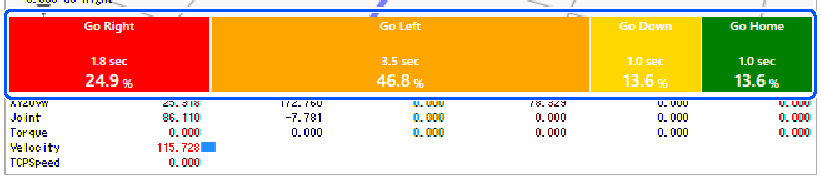  

  - You can see the ratio for each section in a bar graph.

- Motion information

    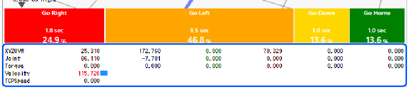  

  - You can confirm the Motion information (XYZUVW, Joint, Torque, Velocity, TCPSpeed) that is currently displayed in the 3D view.

#### 5.2.4 Cycle Pane

This allows you to check information for each Cycle.


- [CSV],[TSV] button
  - By clicking on the button, the information on the list can be copied to the clipboard in a CSV format or TSV format. This is convenient when using the information in other software. It is the same for the [CSV] and [TSV] button on the Section and Motion pane.
- Cycle list
  - The cycle information can be confirmed from the list.

#### 5.2.5 Section Pane

The Section information can be confirmed. You can view statistics and timelines for each section.

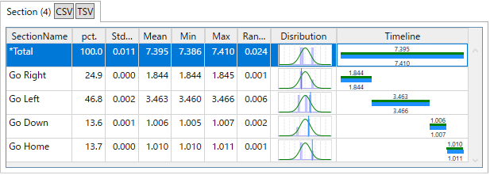

- Section list
  - The Section information can be confirmed in a list.
  - The Total information is displayed at the beginning of the list.
  - You can check the following information.
    - pct.: percentage of the total time required for the entire cycle
    - StdDev: standard deviation
    - Mean: average time (seconds)
    - Min: minimum time (seconds)
    - Max: maximum time (seconds)
    - Range: the difference between the maximum time and the minimum time.
    - Distribution: statistical distribution map The blue vertical line indicates the distribution location of the currently selected Cycle.
    - Timeline: timeline. The green on the top indicates the average value The blue on the bottom is the currently selected Cycle’s timeline.

#### 5.2.6 Motion Pane

The Motion log information can be confirmed.

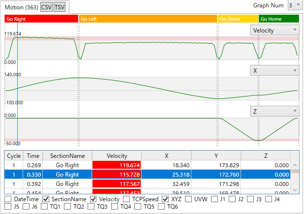

- Graph number combo box
  - Up to 10 graphs can be displayed. Select the number of graph to display
- Motion graph
  - The Motion information can be confirmed in a graph.
  - You can check the Velocity (Calculated from X, Y, Z and time information), TCPSpeed, X, Y, Z, U, V, W, J1 to J6, Torque1 to Torque6 information. Select the items to display from the combo box for each graph.
- Blue vertical cursor
  - The blue vertical cursor on the graph indicates the currently selected position of the Motion list.
  - You can move the current selection by dragging it.
- Motion list
  - The Motion information can be confirmed in a list.
  - When you select a column, the view pane's display will update accordingly.
- Column show/hide settings checkbox
  - You can set whether to show or hide columns in the Motion list.
