# SPEL分析ツール

Rev.1  
JAM269S9185F

[日本語](./readme_ja.md) / [English](./readme.md)   

## 1. はじめに

### 1.1 概要

SPEL分析ツールを使用すると、SPELプログラムのログ出力と確認を簡単に実施できます。  
SPEL分析ツールには、ログ出力ライブラリが含まれています。このライブラリのAPIをお客様のプログラムに実装すると、以下のログを出力できます。

- ログ出力時のプロファイル情報
- サイクルやセクションの時間情報
- ロボット姿勢や位置などのモーション情報

出力したログは、専用画面で表やグラフとして確認できます。  
この専用画面は、ログの確認をする機JAM269S9185F能に加えて、次の機能があります。

- 目標パラメーター: あらかじめ目標値を設定することでサイクルタイムなどが目標に収まっているかを視覚的に確認できます。
- 調整パラメーター: incファイルのdefine定義を画面上で設定できます。

SPELプログラムのチューニングにご活用ください。  

#### 用語の説明

|用語|説明|
|:-|:-|
|サイクル|繰り返し実行する一連の動作|
|セクション|サイクル内のまとまりのある動作単位|

### 1.2 安全に関する情報

安全に関する情報を必ず読み、守ってください。詳細は、次のマニュアルを参照してください。

"コントローラーマニュアル"  
(VT-Bシリーズの場合は、"マニピュレーターマニュアル")  
"マニピュレーターマニュアル"  
"RC+ 8.0 ユーザーズマニュアル"  

### 1.3 保証、免責

本Extensionの保証や免責については、Epson RC+のソフトウェア使用許諾契約書の内容が適用されます。

### 1.4 お問合せ

本Extensionのご利用にあたってのお問合わせは、弊社までお願いいたします。

## 2. システム要件

以下の環境での使用に対応しています。

- Epson RC+ 8.0
  - バージョン 8.2.0.0 以降
  - Premium Edition

## 3. 操作手順

操作手順について説明します。

### 3.1 インストール

Epson RC+の拡張機能マネージャーから「SPEL分析ツール」をインストールします。  
インストール方法の詳細については、マニュアル"Epson RC+ 8.0 拡張機能 RC+ Extensions 8.0"を参照してください。  


### 3.2 SPEL分析ツール画面表示からログ内容の確認まで

インストールを完了するとSPEL分析ツール画面を表示できます。SPEL分析ツール画面の表示からログ内容を確認するまでの手順を説明します。

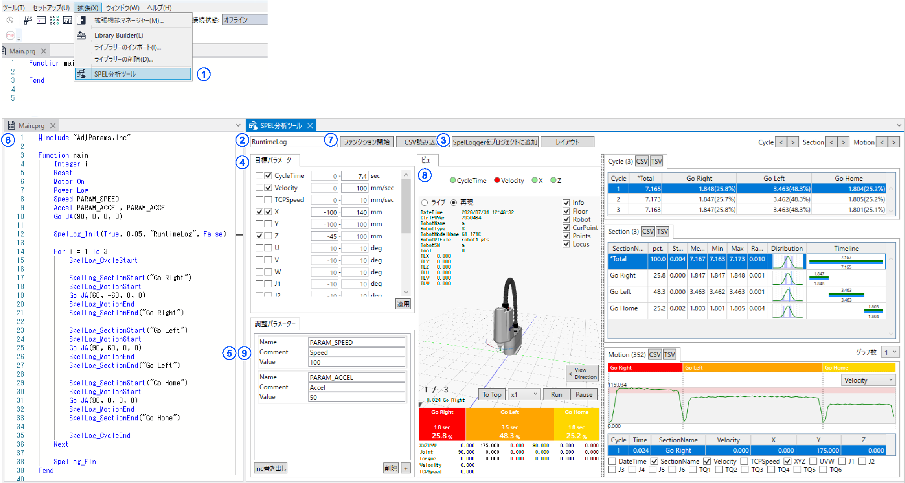  


1. SPEL分析ツール画面を表示する

      

   - Epson RC+のメニューから、[拡張] - [SPEL分析ツール]を選択し、SPEL分析ツール画面を表示します。

2. ログ名称を設定する

    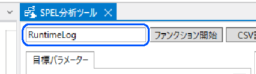  

   - 特別な理由がない限り、ログ名称には、初期値の"RuntimeLog"を使用してください。ただし、ログ出力APIのSpelLog_Initで指定するログ名称と一致させてください。

3. ログ出力ライブラリをプロジェクトに追加する

    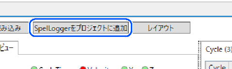

   - [SpelLoggerをプロジェクトに追加]ボタンをクリックし、ログ出力ライブラリをプロジェクトに追加します。
   - SpelLoggerの追加画面が表示されます。この画面で、追加するSpelLoggerの形式 (ファイル/ライブラリ) が選択できます。

4. 目標パラメーターを設定する

    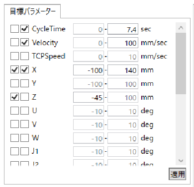  

   - 目標値は後から設定できます。
   - この設定は必須ではありません。ログを確認するだけの場合は設定不要です。必要に応じて使用してください。

5. 調整パラメーターを設定する

    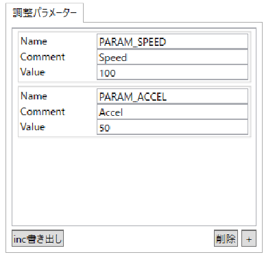  

   - SPEEDなど、お客様が変更して使用するパラメーターをあらかじめ準備してください。
   - [inc書き出し]ボタンをクリックすると、設定したパラメーターがAdjParams.incとしてプロジェクトに追加されます。お客様のprgファイル内で、このファイルをincludeして使用してください。
   - この設定は必須ではありません。ログを確認するだけの場合は設定不要です。必要に応じて使用してください。

6. SPELプログラムにログ出力ライブラリのAPIと調整パラメーターを組み込む

    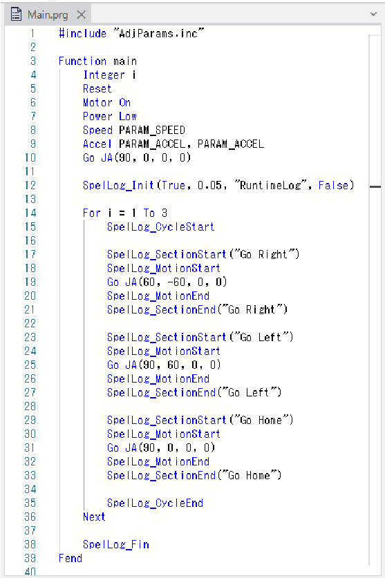  

   - 必要に応じて調整パラメーターの定義値をお客様のプログラムに組み込みます。

7. ファンクションを開始する

    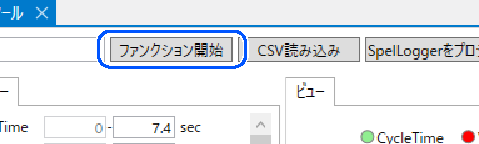  

   - [ファンクション開始]ボタンをクリックしてファンクションを開始します。
   - ファンクション開始画面が表示されます。[ファンクション]を選択し、開始してください。

8. 出力されたログ内容を確認する

    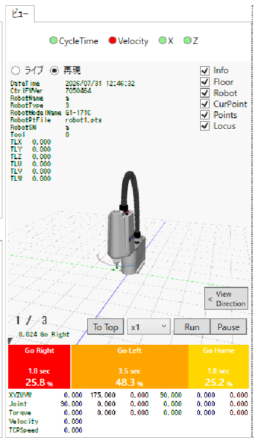  

   - SPELプログラムの終了後、ログが画面に表示されます。

9. パラメーターを調整する  

      

   - 調整パラメーターの値を変更し、再度ファンクションを開始します。
   - 必要に応じてこの作業を繰り返し、お客様のSPELプログラムのチューニングにご活用ください。

## 4. ログ出力ライブラリ

ログ出力ライブラリSpelLogger.prg/SpelLoggerLibのAPIと、出力するログファイルについて説明します。

### 4.1 API

APIと引数の構成は以下の通りです。

#### SpelLog_Init

ログ記録を初期化して開始します。

```vb
Function SpelLog_Init(isEnabled As Boolean, interval As Real, filename$ As String, isCollectTorque As Boolean)
```

- isEnabled: ログ出力有効無効
- interval: モーションログインターバル (秒)  
- filename: ログ名称
- isCollectTorque: トルクのログを書き出すかどうか

※ログ名称はASCII最大32文字としてください。また、カンマ、タブ、ダブルクォーテーションなどの特殊文字を含めないでください。

#### SpelLog_Fin

ログ記録を終了します。

```vb
Function SpelLog_Fin
```

#### SpelLog_CycleStart

サイクルを開始します。

```vb
Function SpelLog_CycleStart
```

#### SpelLog_CycleEnd

サイクルを終了します。

```vb
Function SpelLog_CycleEnd
```

#### SpelLog_SectionStart

セクションを開始します。

```vb
Function SpelLog_SectionStart(sectionName$ As String)
```

- sectionName: セクション名

※セクション名はASCII最大32文字としてください。また、カンマ、タブ、ダブルクォーテーションなどの特殊文字を含めないでください。

#### SpelLog_SectionEnd

セクションを終了します。

```vb
Function SpelLog_SectionEnd(sectionName$ As String)

```

- sectionName: セクション名

#### SpelLog_MotionStart

モーションログ記録を開始します。

```vb
Function SpelLog_MotionStart
```

※ライブラリは、モーションのログ出力でポイント情報を一時的に保持するためにP900を使用します。  
お客様のプログラムでP900を使用しないでいただくか、SpelLoggerをファイル形式で使用いただき、該当箇所を書き換えてください。

#### SpelLog_MotionEnd

モーションログ記録を終了します。

```vb
Function SpelLog_MotionEnd
```

#### 実装例

APIを呼び出す順序など、実装の仕方については以下の実装例を参考にしてください。

```vb
Function main
	Integer i
	Reset
	Motor On
	Power Low
	Speed PARAM_SPEED
	Accel PARAM_ACCEL, PARAM_ACCEL
	Go JA(90, 0, 0, 0)
	
	SpelLog_Init(True, "RuntimeLog", 0.05, False)
	
	For i = 1 To 3
		SpelLog_CycleStart
		
		SpelLog_SectionStart("Go Right")
		SpelLog_MotionStart
		Go JA(60, -60, 0, 0)
		SpelLog_MotionEnd
		SpelLog_SectionEnd("Go Right")
		
		SpelLog_SectionStart("Go Left")
		SpelLog_MotionStart
		Go JA(90, 60, 0, 0)
		SpelLog_MotionEnd
		SpelLog_SectionEnd("Go Left")
		
		SpelLog_SectionStart("Go Home")
		SpelLog_MotionStart
		Go JA(90, 0, 0, 0)
		SpelLog_MotionEnd
		SpelLog_SectionEnd("Go Home")
		
		SpelLog_CycleEnd
	Next
	
	SpelLog_Fin
Fend
```

### 4.2 ログファイル

APIを実装したSPELプログラムを実行すると、CSV形式のログファイルがプロジェクトフォルダーに出力されます。  
CSVファイルの列構成は以下の通りです。  
[ログ名称]はSpelLog_Initの引数lognameで指定した文字列です。

#### [ログ名称]_Info.csv

ログ取得時のプロファイル情報を記録します。

- Name: 項目<br>(LogName, Interval, IsCollectTorque, DateTime, CtrFWVer, RobotName, RobotType, RobotModelName, RobotSN, Tool, TLX, TLY, TLZ, TLU, TLV, TLW)
- Value: 値

#### [ログ名称]_Section.csv

ログ、サイクルおよびセクションの開始と終了を記録します。

- DateTime: 日時
- ElapsedTime: 経過時間
- CycleNo: サイクル番号
- SectionName: セクション名
- Flag: セクション状態フラグ<br>(LogStart, LogEnd, CycleStart, CycleEnd, SectionStart, SectionEnd)

#### [ログ名称]_Motion.csv

XYZUVWなどのモーション情報を記録します。

- DateTime: 日時
- ElapsedTime: 経過時間
- CycleNo: サイクル番号
- SectionName: セクション名
- X,Y,Z,U,V,W: X,Y,Z,U,V,W  
  ※Toolを指定している場合は、Tool先端の座標です。
- J1～J6: ジョイント角度
- Torque1～6: トルク(SPELコマンドRealTorqueで取得できる値)
- TCPSpeed: CP動作の速度(SPELコマンド TCPSpeedで取得できる値)

## 5. SPEL分析ツール画面

SPEL分析ツールの画面構成について説明します。

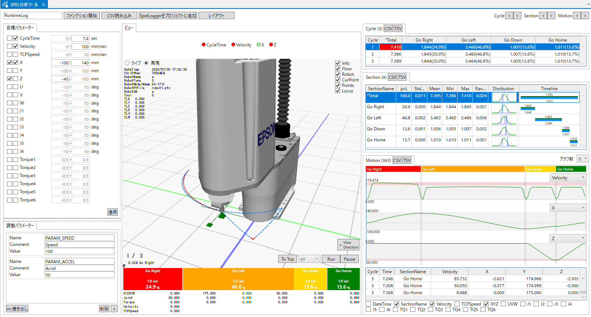

SPEL分析ツールの画面は、以下のエリアで構成されています。

- a ヘッダーエリア
- b コンテンツエリア

コンテンツエリアには、以下のペインを表示します。

- b1 目標パラメーターペイン
- b2 調整パラメーターペイン
- b3 ビューペイン
- b4 Cycleペイン
- b5 Sectionペイン
- b6 Motionペイン

### 5.1 ヘッダーエリア

ヘッダーエリアには、主にログを出力確認するための基本的な操作を行うボタンを配置しています。

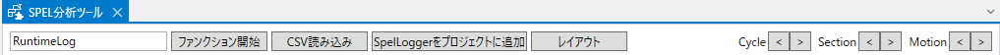

#### 5.1.1 ログ名称入力

ログ名称を入力してください。ログCSVファイルを読み込む際に使用します。

※ログ名称はASCII文字を32文字以内で入力してください。また、カンマ、タブおよびダブルクォーテーションなどの特殊文字は使用しないでください。

#### 5.1.2 ファンクション開始

[ファンクション開始]ボタンをクリックすると、ファンクション開始画面を表示します。  
Functionをドロップダウンリストから選択し、関数を実行してください。  
開始前に、後述の調整パラメーターで設定した内容を使用してAdjParams.incを更新します。  
関数終了後にログ内容を表示します。

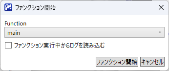

- Functionコンボボックス
  - 実行するFunctionを選択してください。
- [実行中からログを読み込む]チェックボックス
  - このチェックボックスを選択してファンクションを開始すると、SPELプログラムの実行中に1サイクルが完了するたびにログを読み込み、表示できます。

#### 5.1.3 CSV読み込み

[CSV読み込み]ボタンをクリックすると、プロジェクトフォルダ内にあるログを読み込んで表示します。プロジェクトフォルダに以前出力したログファイルがあり、ログを確認したい場合に利用してください。

#### 5.1.4 SpelLoggerをプロジェクトに追加

[SpelLoggerをプロジェクトに追加ボタン]をクリックすると、[SpelLoggerをプロジェクトに追加]画面を表示します。  
ログ出力を行うSpelLoggerをプロジェクトに追加します。SpelLoggerはファイル形式のSpelLogger.prgまたはライブラリ形式のSpelLoggerLibから選択できます。ファイル形式は、SpelLoggerの処理内容を確認する場合か、ログ出力をチューニングする場合に使用してください。

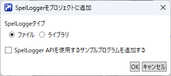

- SpelLoggerタイプ選択
  - ファイルまたはライブラリを選択してください。
- [サンプルプログラム追加]チェックボックス
  - このチェックボックスを選択して実行すると、SpelLoggerAPIを使用するサンプルプログラムSmpUsingSpelLogger.prgを追加します。
  - サンプルプログラムには以下の関数が実装されています。SpelLoggerAPIをお客様のプログラムに実装する際の参考にしてください。
    - SmpUsingSpelLoggerForSCARA：SCARAロボット用
    - SmpUsingSpelLoggerForSixAxes：6軸ロボット用

#### 5.1.5 レイアウト

[レイアウト]ボタンをクリックするとレイアウト画面を表示します。  
コンテンツアイテムの表示/非表示と配置を設定できます。  
好みの配置に変更したい場合や、モニターの画面サイズが小さく、必要な情報だけを表示したい場合に便利です。

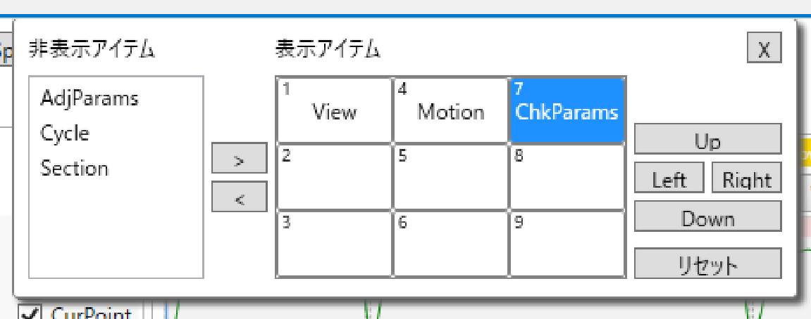

- [\>]ボタン
  - 選択した非表示アイテムを表示アイテムに変更します。
- [\<]ボタン
  - 選択した表示アイテムを非表示アイテムに変更します。
- [Up]ボタン
  - アイテムの配置位置を上へ移動します。
- [Left]ボタン
  - アイテムの配置位置を左へ移動します。
- [Right]ボタン
  - アイテムの配置位置を右へ移動します。
- [Down]ボタン
  - アイテムの配置位置を下へ移動します。
- [Reset]ボタン
  - レイアウトをリセットします。

#### 5.1.6 Cycle, Section, Motion行選択

ボタンを押し続けると、Cycle, Section, Motionの各一覧で選択行を連続して移動できます。  
連続して選択を切り替えながら表示内容を確認する場合に便利です。


- [\<]ボタン
  - 前へ行選択を連続して移動します。
- [\>]ボタン
  - 後へ行選択を連続して移動します。

### 5.2 コンテンツエリア

コンテンツエリアには、パラメーターの設定とログの内容を確認する機能を配置しています。

#### 5.2.1 目標パラメーターペイン

目標値のMin,Maxを設定すると、ログ出力結果が目標範囲内かどうかを確認できます。目標値が範囲外かどうかは、ビューペインのヘッダーエリアや一覧のセルの背景色で確認できます。

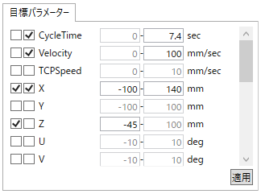

- 目標パラメーター一覧
  - CycleTime,Velocity (X,Y,Zと時間情報から算出), TCPSpeed, X, Y, Z, U, V, W, J1～J6, Torque1～Torque6を確認できます。
  - チェック対象にするかどうかと、目標値を設定してください。
- [適用]ボタン
  - ビューペインのヘッダーエリアや、一覧のセルの背景色などを更新します。ログの読み込み時以外でも、目標値との比較結果を確認できます。

#### 5.2.2 調整パラメーターペイン

調整パラメーターを設定してください。  
ここで設定した値をdefine定義としてAdjParams.incに出力します。

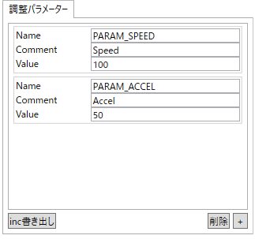

- 調整パラメーター一覧
  - 調整パラメーターの名前、コメントおよび定義値を設定してください。
- [inc書き出し]ボタン
  - 設定した内容でAdjParams.incを更新します。
- [削除]ボタン
  - 調整パラメーター一覧で選択した項目を削除します。
- [+]ボタン
  - 調整パラメーター一覧に項目を追加します。

#### 5.2.3 ビューペイン

目標パラメーターの判定結果やロボットの姿勢などを視覚的に確認できます。Motionペインの行選択と連動して、ロボットの姿勢などの情報を表示します。

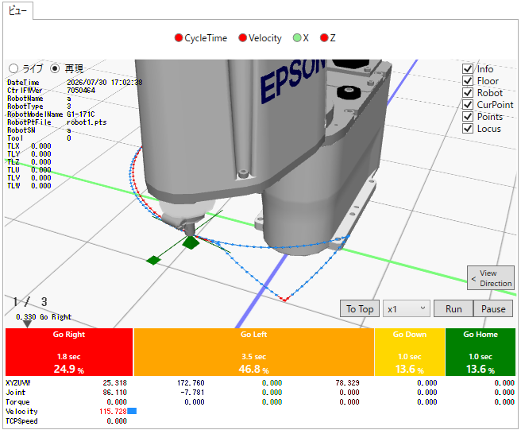

- 目標値判定結果  
    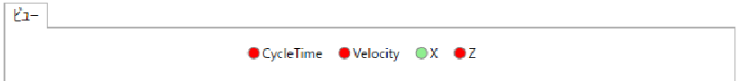  
  - 目標値との比較結果を確認できます。範囲内であれば緑、範囲外であれば赤の丸を表示します。

- 3Dビューエリア

    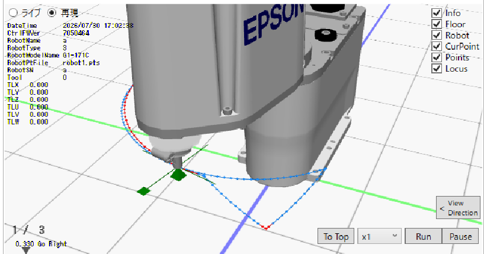  

  - 3Dビューには以下の情報を表示します。右上のチェックボックスで表示/非表示を切り替えできます。
    - Info: 左上にログのプロファイル情報を表示します。
    - Floor: ロボットが置かれている水平面をXYの座標軸と10cmの目盛りで表示します。
    - Robot: ロボットの姿勢を表示します。
    - CurPoint: Motion一覧の現在の選択の位置をXYZUVWを十字の図形で表示します。
    - Points: MotionログのXYZポイントを表示します。
    - Locus: ポイントを直線でつないだ軌跡を表示します。

- ライブ/再現切替

    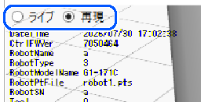  

  - ライブを選択すると、現在接続しているコントローラーのロボットを3Dビューで確認できます。

- [To Top]ボタン

    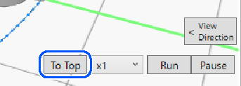  

  - Motion選択行を先頭へ移動します。再生完了後に先頭から再生し直す場合に便利です。

- スピード選択コンボボックス

    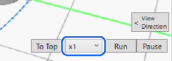  

  - 再生速度を選択できます。実際の再生速度では再生しません。

- [Run]ボタン

    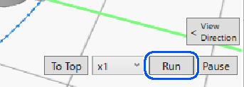  

  - ログのMotion情報を再生します。再生に合わせてMotionの選択行を移動します。
  - 再生を停止した後に再度[Run]ボタンをクリックすると、停止位置から再開します。先頭からは再生しません。

- [Pause]ボタン

    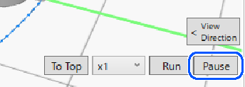  

  - 再生を停止します。

- 三角スライダー

    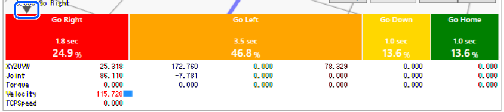  

  - Section比率バーの上部に表示される三角形は、Motion一覧の現在の選択位置を示します。
  - ドラッグすると、現在の選択位置を移動できます。

- Section比率バー

    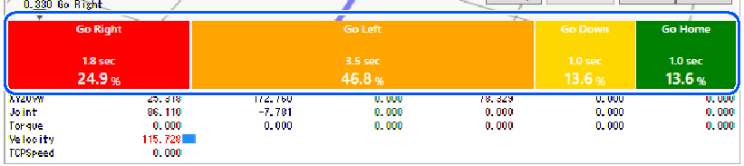  

  - Sectionごとの比率をバーグラフで確認できます。

- Motion情報

    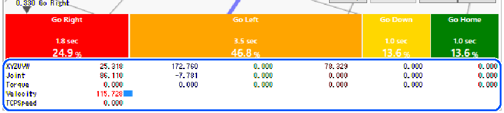  

  - 現在3Dビューに表示しているMotionの情報 (XYZUVW, Joint, Torque, Velocity, TCPSpeed) を確認できます。

#### 5.2.4 Cycleペイン

Cycleごとの情報を確認できます。

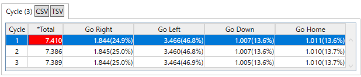

- [CSV],[TSV]ボタン
  - ボタンをクリックすると、一覧情報をそれぞれCSV形式またはTSV形式でクリップボードにコピーします。他のソフトウェアで情報を使用する場合などに便利です。SectionペインおよびMotionペインの[CSV]、[TSV]ボタンも同様です。
- Cycle一覧
  - Cycle情報を一覧で確認できます。

#### 5.2.5 Sectionペイン

Sectionの情報を確認できます。Sectionごとの統計情報およびタイムラインを確認できます。


- Section一覧
  - Section情報を一覧で確認できます。
  - 一覧の先頭にTotal情報を表示します。
  - 以下の情報が確認できます。
    - pct.: サイクル全体に対する所要時間のパーセンテージ
    - StdDev: 標準偏差
    - Mean: 平均時間 秒
    - Min: 最小時間 秒
    - Max: 最大時間 秒
    - Range: 最大時間と最小時間の差
    - Distribution: 統計分布図。青い縦線は、現在選択しているCycleの分布位置です。
    - Timeline: タイムライン。上部の緑色は平均値です。下部の青色は、現在選択しているCycleのタイムラインです。

#### 5.2.6 Motionペイン

Motionログの情報を確認できます。

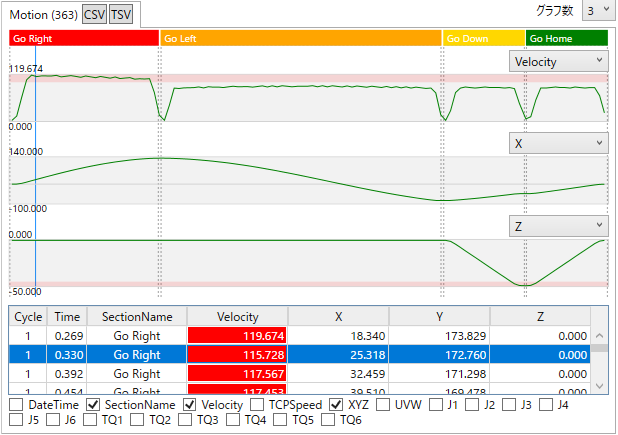

- グラフ数コンボボックス
  - グラフは最大10個まで表示できます。表示するグラフの数を選択してください。
- Motionグラフ
  - Motion情報をグラフで確認できます。
  - Velocity (X,Y,Zと時間情報から算出), TCPSpeed, X, Y, Z, U, V, W, J1～J6, Torque1～Torque6の情報を確認できます。表示項目はグラフごとにコンボボックスから選択してください。
- 青色縦線カーソル
  - グラフ上に表示される青い縦線は、Motion一覧の現在の選択位置を示します。
  - ドラッグすると、現在の選択位置を移動できます。
- Motion一覧
  - Motion情報を一覧で確認できます。
  - 行を選択すると、ビューペインの表示が連動して更新されます。
- 列表示/非表示設定チェックボックス
  - Motion一覧の列の表示/非表示を設定できます。
