# Vanguard Systems Screwdriver

Rev.1  
JAM269S9183F

[日本語](./readme_ja.md) / [English](./readme.md)   

## 1. Overview

### 1.1 FOREWORD

This Extension enables the configuration and control of the Vanguard Systems Screwdriver (hereinafter referred to as electric driver) from the Epson RC+ 8.0.

The main functions are as follows:

- Viewing and editing the operational settings (target torque, rotation speed, rotation direction)
- Displaying and saving screw tightening torque waveforms.
- Control from the SPEL+ Program (via control library)

This readme describes the installation, initial settings, and basic usage methods.  

### 1.2 Safety Related Information
Make sure to read and follow the safety related information. Refer to the following manuals:
  - Manuals provided by Vanguard SYSTEMS INC..
  - Manuals provided by Epson (robot controller, manipulator, Epson RC+ 8.0)

### 1.3 Warranty and Disclaimer
- The terms of the warranty and disclaimers for the extension are governed by the Software License Agreement of Epson RC+.
- The terms of the warranty and disclaimers for the PRO-FUSE series are governed by the Software License Agreement of Vanguard SYSTEMS INC..

### 1.4 Contact Information
- For inquiries regarding purchases of the PRO-FUSE series and hardware, contact Vanguard SYSTEMS INC.
- For inquiries regarding the use of the extension function, contact Epson. Vanguard SYSTEMS INC. does not support extension functions.


## 2. System Requirements

### 2.1 Supported Environment

Extension functions are supported in the following environment:

- Epson robot controller
  - RC800 series
  - RC700 series
  - RC90 series
  - T/VT series

- Epson RC+ 8.0
  - Version 8.2.0.0 or later
  - To use the GUI, the Premium Edition is required.
  - The library can be used regardless of the edition (The Library can be obtained from GitHub)

- Electric driver
  - Main unit
    - TYPE S (Power supply: 24V)
    - TYPE L (Power supply: 24V)
    - TYPE XL (Power supply: 24V)
    - TYPE GM (Power supply: 48V)
    - TYPE GX (Power supply: 48V)

  - Optional items
    - Bit
    - Mouthpiece
    - Power cable  
    *I/O cables will not be used


### 2.2. Preparation

Prepare the following devices:

- Epson robot and robot controller

- Epson RC+ 8.0

- Electric Driver
  - Main unit
  - Optional items

- Control PC (commercially available product)
  - PC to install Epson RC+ 8.0
  - One Ethernet port (100Base-T or higher)

- Ethernet hub (commercially available product)
  - Switching hub
  - 100Base-T or higher

- LAN cable (commercially available product)
  - RJ45 connector
  - 100Base-T or higher

- Vacuum equipment (commercially available product), or central vacuum system
  - Used for screw suction
  - \- 40 to 50 kPa

- Pneumatic tube (commercially available product)
  - Used for screw suction
  - ⌀4

- Power supply (commercially available product)
  - Power voltage 24V or 48V (refer to 2.1)
  - Electric current over 3A (common for each model)

- Z damper (Vanguard SYSTEMS INC.)：Optional

- Robot mounting jigs (commercially available product)
  - Standard products are not included
  - An example of a jig structure when mounting to a SCARA robot and Z damper is indicated

| Product name | Manufacturer | model number | Quantity |
| --- | --- | --- | --- |
| Flange | MISUMI Group Inc. | ATHWRL16 | 1 |
| L bracket | MISUMI Group Inc. | FANAS-SUD-T3-A90-B76-L60-X9.5-F41-H15-G65-N4-Y13.8-V32.6-S26.7-W32.5-NA5-CC1 | 1 |

**Note**

- For details on the most suitable screw and electric driver combination, contact Vanguard SYSTEMS INC..
- If high reliability is required for screw tightening operations, consider using our force guide system.


## 3. Setup

### 3.1 Wiring and Piping

An example connection is shown below.

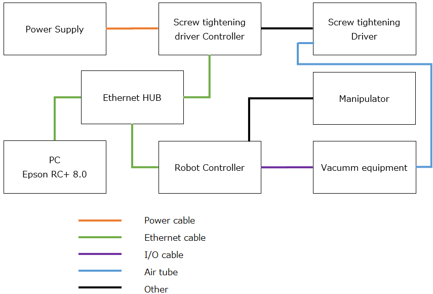

**Caution**

- The vacuum for screw suction cannot be controlled by the electric driver. The vacuum system should be configured to be controlled via the robot controller's I/O, for example.
- To use the GUI, you must connect the PC and Controller with Ethernet. USB connection will not allow you to communicate between GUI and the electric driver.

### 3.2 Installing the Electric driver to the Robot

An example of mounting the electric driver to a SCARA robot is indicated below.

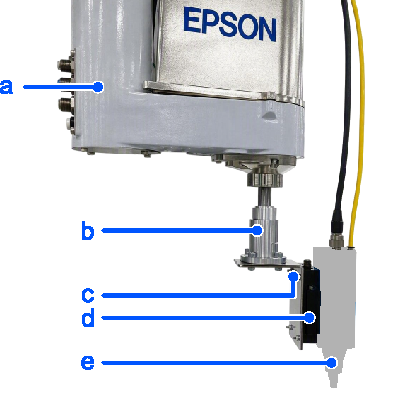

|Symbol|Item|
|---|---|
|a|Robot|
|b|Flange|
|c|L bracket|
|d|Z damper|
|e|Electric Driver|

### 3.3 Installation

From the Epson RC+ extensions manager, install “Vanguard Systems Screwdriver”.  
For details on the installation method, refer to the following manual.  
"Epson RC+ 8.0 Extensions RC+ Extensions 8.0"

## 4. Basic Usage  

This section describes the basic ways to use the electric driver and basic SPEL+ programs.  
For more details, refer to chapters 5 and 6.

**Prerequisites**

- Robot controller IP address: 192.168.0.1
- Electric driver IP address: 192.168.0.2 (the least significant octet is set using a rotary switch.)

### 4.1 Preparing the SPEL+ Project

Create an empty project and name it as “DemoScrewTight.”  
Right click the project explorer and select [Add Control Library].  
The control library “VanguardProFuseLib.lib” is added to the project.

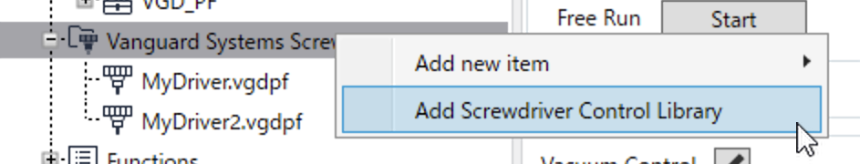

### 4.2 Extension Startup

Right click the project explorer, select [Add New Item] - [New File] to add the definition file.  
Name the definition file “MyDriver.vgdpf.”

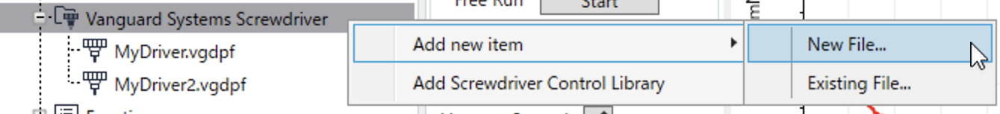

### 4.3 Communication Settings

Double click the project explorer’s definition file.  
Open the [Connect from PC] dialog, enter the IP address of CT-CONTS (a controller of the electric screw driver) and click on the [Connect] button.

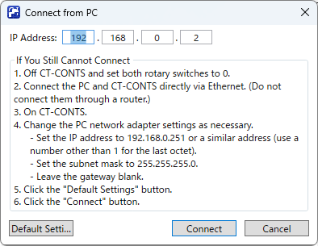

Click on the [Controller Configuration] button and open the dialog.

If the robot controller is not connected, the [PC to Controller Communications] dialog appears.  
Furthermore, if automatic connection is enabled, the dialog will not appear and connection will automatically start.

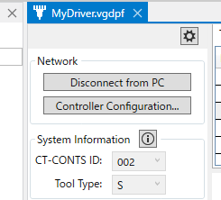

When the [Controller settings] is displayed, enter the parameters.

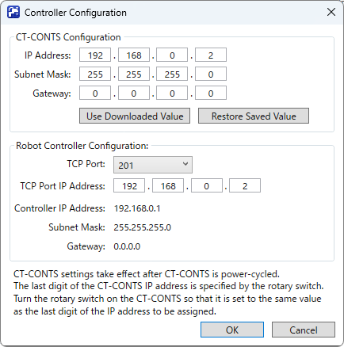

**CT-CONTS settings group**
| Setting items | Description | Value (Example) |
| --- | --- | --- |
| IP Address | Specify the IP address of the electric driver | 192.168.0.2 |
| Subnet mask | Specify the subnet mask of the electric driver | 255.255.255.0 |

**Robot controller settings group**
| Setting items | Description | Value (Example) |
| --- | --- | --- |
| TCP port | Specify the TCP port number of the robot controller | 201 |
| IP address for TCP port | An IP address for specifying the TCP port (IP address of the electric torque screw driver) | 192.168.0.2 |

If you changed the robot controller settings, the robot controller will automatically restart. Wait until the connection is re-established before performing any operations.

### 4.4 Program Settings

Select the program number to use and click on the [Edit Program] icon button (Ed).

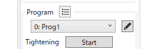

After opening the “Edit Program” dialog, enter the parameter.

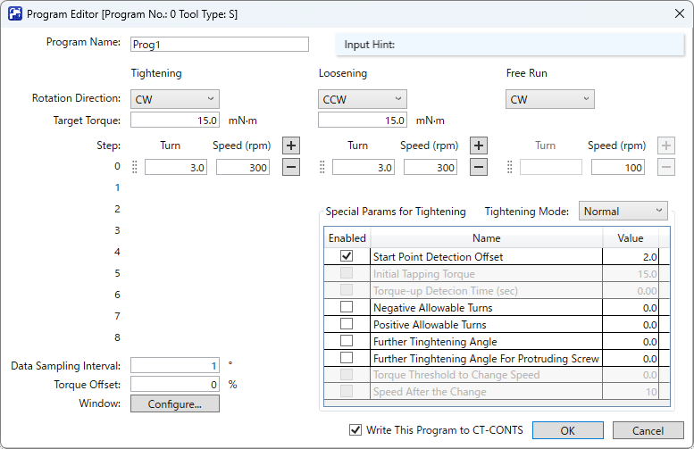

| Setting items | Description | Value (Example) |
| --- | --- | --- |
| Direction of rotation | Specify the direction of rotation (CW, CCW) | CW |
| Target torque | Specify the target torque | 50 |

Add the steps and enter the value (example).
| Steps | Number of turns | Speed |
| --- | --- | --- |
|0| 2 | 200 |
|1| 6 | 500 |
|2| 2 | 100 |

Once you have finished entering the values, upload the program to the electric driver. To upload a program that is still being edited, check the “Write this program to CT-CONTS” checkbox and click on the “OK” button. For details on how to upload all programs, refer to the “Program Settings.”

When executing SPEL+ program using the control library provided by this Extension, make sure the program has already been uploaded to the electric driver.

### 4.5 Log Settings

Click the icon button (Pr) of “Preferences.”

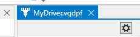

After opening the “Preferences” dialog, enter the parameter.

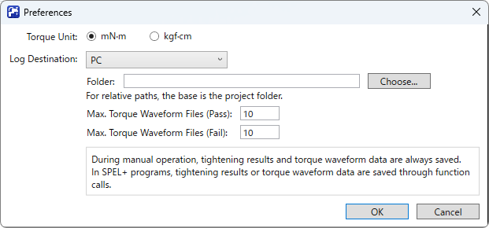

| Setting items | Description | Value (Example) |
| --- | --- | --- |
| Destination to save log | Specify the destination to save the log | PC |
| Folder | Specify the folder to save the log | C:\\ScrewTighteningLog |

### 4.6 Create the SPEL+ Program

#### Preparation

- Register the robot you will be using.
- Make sure to register the following point data:
  - P_ScrewSupply: Screw supplying position
  - P_ScrewTight: Screw tightening position
- Make sure to register the following I/O label (output bit)
  - Vacuum: ON/OFF
  - VacuumBreak: ON/OFF


#### CAUTION

The following process is omitted.
- Processing the error caused by the robot operation command
- Responding to an emergency stop/ safeguard open

#### Program

```vb
#define NO_ERR 0

Global Boolean G_Process

Function ScrewTighteningDemo As Integer
	
	Integer ret
	Integer cid
	String failmesg$
	Boolean isEnd, isBusy, isErr, canGet, isOK
	Integer errCode
	UShort retProgramNo
	Real numTurns, torque, timeElapsed
	UShort actualCount, samplingAngle

	ret = NO_ERR
	
	' Robot settings
	Motor On
	Power High
	Speed 100
	Accel 100, 100
	LimZ 0.0
	
	' Connect
	ret = VGD_PF_Connect("MyDriver", ByRef cid)
	If ret <> NO_ERR Then GoTo ErrProc
	
	' Loop for pick screw and tightening
	Do While G_Process = True

		' Move Robot to screw supply position
		Jump P_ScrewSupply
		
		' Vacuum On
		On Vacuum
		
		' Move Robot to screw tightening position
		Jump P_ScrewTight
		
		' Start tightening
		ret = VGD_PF_StartTightening(cid, 0)
		If ret <> NO_ERR Then GoTo ErrProc
		
		' Vacuum Off
		Off Vacuum
		On VacuumBreak
		Off VacuumBreak

		' Wait for finish tightening
		Do
			ret = VGD_PF_CheckStatus(cid, ByRef isEnd, ByRef isBusy, ByRef isErr, ByRef errCode)
			If ret <> NO_ERR Then GoTo ErrProc
			Wait 0.1
		Loop While isBusy

		' Get log when the tightening failed
		If isErr = True Then
		
			' Wait for preparing result
			Do
				ret = VGD_PF_CanGetTighteningResult(cid, ByRef canGet)
				If ret <> NO_ERR Then GoTo ErrProc
				Wait 0.01
			Loop Until canGet
			
			' Get latest result and save result to log file
			ret = VGD_PF_GetTighteningResult(cid, True, ByRef retProgramNo, ByRef numTurns, ByRef torque, ByRef timeElapsed, ByRef isOK, ByRef errCode)
			If ret <> NO_ERR Then GoTo ErrProc
			
			' Save latest torque waveform to file
			ret = VGD_PF_GetTorqueData(cid, ByRef actualCount, ByRef samplingAngle)
			If ret <> NO_ERR Then GoTo ErrProc

			' Generate fail message
			failmesg$ = "*** Tightening failed ***" + Chr$(13)
			failmesg$ = failmesg$ + "errCode = " + Str$(errCode) + Chr$(13)
			failmesg$ = failmesg$ + "programNo = " + Str$(retProgramNo) + Chr$(13)
			failmesg$ = failmesg$ + "numTurns = " + Str$(numTurns) + Chr$(13)
			failmesg$ = failmesg$ + "torque = " + Str$(torque) + Chr$(13)
			failmesg$ = failmesg$ + "actualCount = " + Str$(actualCount) + Chr$(13)
			failmesg$ = failmesg$ + "samplingAngle = " + Str$(samplingAngle)
			
			GoTo ErrProc
		
		EndIf

	Loop
	
	GoTo EndProc
		
ErrProc:

	If ret <> NO_ERR Then
		Print "*** Internal error *** (", ret, ")"
	Else
		Print failmesg$
	EndIf

EndProc:

	' Vacuum Off
	Off Vacuum
	On VacuumBreak
	Off VacuumBreak

	' Connection close
	VGD_PF_Stop(cid)
	VGD_PF_Disconnect(cid)
	
	ScrewTighteningDemo = ret

Fend

```

### 4.7 Operation Verification

Execute the ScrewTighteningDemo function and verify the operation.


## 5. GUI

This section describes each element of the GUI.

### 5.1 Main Window

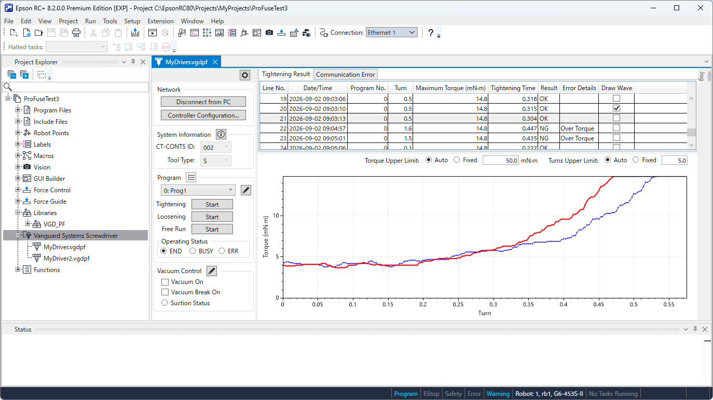

The main window consists of the following three areas and the [Jog] panel displayed from the right corner.

- Settings and adjustments (left side)
- Log (upper right)
- Graph (bottom right)

If changes are made to the contents loaded from the definition file based on the operation results, a “*” mark will be displayed on the right side of the file name displayed in the window title.  
If you are to save the changes to the definition file, execute [Save Files] (The file menu or tool bar icon).  
In addition, the contents of the definition file cannot be changed while the SPEL+ program is being executed.


### Settings and adjustments

#### “Preferences” button (tool bar)

When you click the icon button (pr), the “Preferences” dialog will appear.  
For details on the dialog, refer to the relevant section.  


#### “Network” group

When you click the “Connect from PC” button, the “Connect from PC” dialog will open.  
For details on the dialog, refer to the relevant section.  
While connected to CT-CONTS, the button label will change to “Disconnect from PC.”  
When you click on the “Disconnect from PC” button, communication with CT-CONTS ends.

While connected to CT-CONTS, the “Controller settings” button will be enabled.  
When you click on the “Controller settings” button, the “Controller settings” dialog will appear.  
For details on the dialog, refer to the relevant section.  

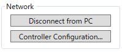  

#### “System information” group

The following indicates the electric driver settings.  
The “CT-CONTS ID” is a number that differentiates the CT-CONTS, and is also the rotary switch position of CT-CONTS.  
“Tool type” is the model of the electric driver.  

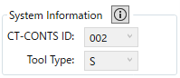  

When disconnected from CT-CONTS, the value saved in the definition file will be applied to the initial value. This can be changed in the combo box. However, note that when changing the “Tool type”, adjustments will be made automatically to suit the new tool type to the content of the program, which may change the contents of the program.

When connected to CT-CONTS, the contents of the combo box will be fixed and cannot be changed in order to match the actual settings and model. If the tool type in the definition file differs from the actual tool type during connection, a warning will appear. If you are to proceed connecting as it is, note that adjustments will be made automatically in order to suit the content of the program to the actual tool type which may change the contents of the program.

When you click the icon button on the right side of the group name, the “System information” dialog will appear. For details on the dialog, refer to the relevant section.  
 

#### “Program” group

You can perform manual operations such as tightening screws, loosening screws, or free run. You can also display and edit the contents of the program which determines the operation method and send and receive (download and upload) programs to and from the electric driver.

In the combo box below the group name, select the program which will be the target of manual operation and editing.

The icon button on the right side of the group name is the menu button.

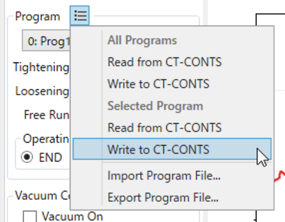

The following items are included in the menu:
| Menu name | Functions |
| ----- | ----- |
| (All Programs) <br>Read from CT-CONTS | Download all programs from CT-CONTS to the PC. |
| (All Programs) <br>Write to CT-CONTS | Upload all programs from the PC to CT-CONTS. |
| (Selected Program) <br>Read from CT-CONTS | Download the selected programs from CT-CONTS to the PC. |
| (Selected Program) <br>Write to CT-CONTS | Upload the selected programs from the PC to CT-CONTS. |
| Import program files | Read the XML format file saved in ProE-Export. |
| Export program files | Outputs the program that is currently edited in this Extension into an XML format file that can be read by ProE-Expert. |

When it is read and imported, the program being edited will be replaced with the content that has been loaded. To reflect the changed content onto the definition file, save the definition file.

When the “Start” button for “Tightening”, “Loosening”, and “Free Run” is clicked, the operation defined in the selected program will start. During operation, the button you clicked will change to the “Stop” button (the other buttons will be disabled) and the operation will stop if you click on the button.  
Screw tightening and screw loosening will automatically stop once all of the steps in the program are complete.  
The screwdriver rotation does not stop until you click on stop.

The “Operating status” group indicates the status of the electric driver in operation with a radio button. “BUSY” will be on until the data results which include the torque waveform during and after operation is stored in the designated area.  
In screw tightening, the “END” and “ERR” will remain on until all of the steps in the program are complete.  
"END" and "ERR" correspond to OK (success) and NG (failure) of screw tightening.  
In screw loosening, “END” will remain on until all of the steps in the program are complete.  
In screwdriver rotation, “END” and “ERR” will not be set.

If screw tightening automatically finishes, the log will be updated and the waveform data of the torque will be drawn.

When you click on the icon button on the right side of the program selection combo box, the [Edit Program] dialog will appear. For details on the dialog, refer to the relevant section.

#### “Vacuum control” group

An I/O label that supports the function is set. You can also operate and check the status of the I/O if the robot controller is connected.

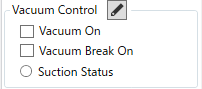  

When the “Vacuum on” and “Vacuum break on” checkbox is on the corresponding I/O output turns on.  
When the checkbox is off, the I/O output will turn off.

The "Suction Status" radio button switches its display depending on the status of the corresponding I/O input.

When you click on the icon button on the right side of the group name, the “Vacuum control setting” dialog will appear.  
For details on the dialog, refer to the relevant section.  

### Log area

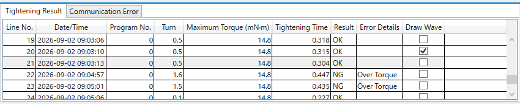  

#### “Tightening Result” tab

Indicates the screw tightening results in a table. The columns in the table are as follows:

| Column name | Content |
| ----- | ----- |
| Line number | This is the line position in the log file, with the first line being assigned the number 1. |
| Date and time | The date and time of when the screw was tightened. |
| Program number | The program number. |
| Number of turns | The number of rotations when screw tightening is completed. |
| Maximum torque value | The maximum value of the torque that was recorded when the screw was tightened. |
| Tightening time | The minutes/seconds it took to tighten the screw. |
| Results | The results of screw tightening. If it is a success, it will be displayed as “OK”, and if not, it will be displayed as “NG”. |
| Error details | Failure reason if the screw tightening fails. |
| Draw waveform | If the checkbox is enabled, there will be a corresponding torque waveform data. When it is enabled, it will continue to be drawn on the graph area. <br>If it is disabled, there will be no corresponding torque waveform data.|

When you select the column of the table, the graph area will be displayed if there is a torque waveform data corresponding to that line.  
The waveform data for the checked column will be displayed overlaid, allowing you to compare multiple waveform data.  
Also, the waveform data for the checked column will also be displayed in the “Window settings” dialog.

#### “Error (Communication, etc.)” tab

Displays the error that occurred. The columns in the table are as follows:  
In addition, information regarding the failure of tightening the screw will not be displayed in this table. It will be recorded in “Tightening results.”

| Column name | Content |
| ----- | ----- |
| Date and time | The date and time that the error occurred. |
| Content | The contents of the error. |

### Graph area

The torque waveform data of the line selected in the “tightening results” table and the line with the waveform display checked off will be displayed in the graph.  
The horizontal axis of the graph indicates the number of turns and the vertical axis indicates the torque.  
The horizontal and vertical axis’s graph range limit can be specified in the settings on the upper right side of the graph.  
When you select automatic, it will be automatically adjusted in a way where the entire waveform data will be displayed.  

  

### Jog panel

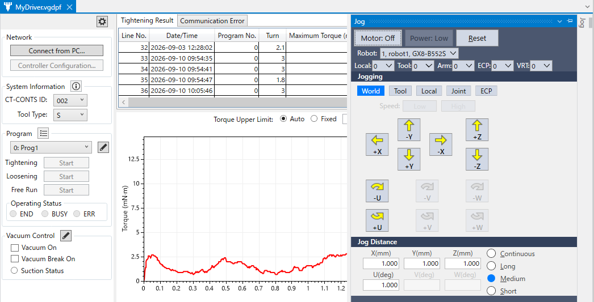

In this Extension, for improved convenience, the operation of the electric torque driver and the robot's jog control can be performed on the same screen.

The jog panel is the same as the one prepared in Vision Guide and Force Guide and is a subset of the “Jog & Teach” tab of the robot manager.  
For details on the operation method, refer to the following.  
"Epson RC+ 8.0 User’s Guide"  

### 5.2 “Connect from PC” Dialog


This is a dialog for connecting to CT-CONTS (the electric driver’s controller).

In the “IP address” section, enter the IP address of CT-CONTS.  
The subnet mask and gateway settings on the PC must be configured on the PC side.  
For more details, refer to your Windows Help or similar documentation.

If you are unable to connect, follow the instructions provided in the dialog box.


### 5.3 “Controller settings” Dialog


This is a dialog for configuring the robot controller to connect to CT-CONTS.

The settings on the CT-CONTS side can be viewed using both the values stored in the definition file and the values downloaded from the device. When you click on “OK”, the value you entered will be uploaded to the CT-CONTS side.

The connection parameters used by a robot controller to access equipment via Ethernet are called "TCP ports."  
Normally, TCP ports are configured in the "System Settings" dialog box, but this extension incorporates this configuration function for improved convenience.

Select the TCP port to use on the robot controller side and set the IP address of CT-CONTS. Normally, you would set it to the same value as the IP address configured in CT-CONTS.  
In special network environments that use routers, etc., follow the instructions of your network administrator for configuration.

For reference, the IP address on the robot controller side is displayed. In addition, if you are to change the IP address on the controller side, make sure to configure it in the “System Configuration” dialog.


### 5.4 “Program edit” Dialog


This is a dialog that configures the requirements for “tightening”, “loosening”, and free run.”

| Input/Selection | Setting value |
| ----- | ----- |
| Program name | The name that will be displayed in the program selection combo box can be set. Up to 16 alphanumeric characters are allowed.|
| Input hint | This shows the range of settings for input fields that are in edit mode. |

#### Screw tightening

| Input/Selection | Setting value |
| ----- | ----- |
| Direction of rotation | Select CW (clockwise) or CCW (counter clockwise) |
| Target torque | Set the target value of the torque. The range of value that can be set differs depending on the tool type. Refer to the input hint. |
| Steps | Up to nine steps can be added. <br>When you click on the + icon button, steps will be added. <br>- The icon button deletes the step. <br>By selecting and then dragging and dropping the “bar” on the left side of the step with a mouse, the order of the steps can be changed.<br> For details on the setting value’s range of the number of turns and speed, refer to the input hint. <br>It's important to note that the step with turn number 0 is not executed, and the program terminates there. The steps after will not be saved to the definition file.|
| Data sampling interval | The step size for acquiring torque waveform data is specified in degrees. <br>The maximum number of samples is 4,096, and the maximum torque is 700 mN·m.<br> Sampling will not happen if 0 ° is specified. |
| Torque Offset | The allowable torque deviation is set as a percentage. For details on the value range, refer to the input hint.|
| Window settings | When it is clicked, the “Window settings” dialog will open. For details on the dialog, refer to the relevant section. |

**Special parameters for screw tightening**

For each of the following tightening modes, you can set even more detailed conditions.

| Tightening mode | Description |
| ----- | ----- |
| Normal | The system automatically decelerates and tightens after reaching 80% of the target torque. |
| Tapping | Tightens faster than normal |
| High speed | Tightening that allows setting a faster rotation speed than usual at each step. |

The parameters that can be set for each mode are as follows. The ones where the “enable” line is checked will be used. Refer to the input hints for the range of values that can be set in the "Value" column. For details on the tightening mode and parameter, refer to the electric driver manual.

| Parameter (“name” column) | Normal | Tapping | High speed |
| ----- | ----- | ----- | ----- |
| Starting amount detected | o | o | o |
| Initial tapping torque | x | o | x |
| Torque up detection time | x | o | o |
| Negative Allowable Turns | o | o | o |
| Positive Allowable Turns | o | o | o |
| Further Tightening Angle | o | o | o |
| Further tightening angle after loosening of a screw | o | o | o |
| Speed switching torque threshold | x | o | o |
| Speed after switching | x | o | o |

(o means available, x means not available)

#### Loosen the screw

| Input/Selection | Setting value |
| ----- | ----- |
| Direction of rotation | Select CW (clockwise) or CCW (counter clockwise) <br>Normally, this is done in the opposite direction to tightening a screw. |
| Target torque | Set the target value of the torque. The range of value that can be set differs depending on the tool type. Refer to the input hint. |
| Steps | Up to two steps can be added. <br>When you click on the + icon button, steps will be added. <br>- The icon button deletes the step. <br>By selecting and then dragging and dropping the “bar” on the left side of the step with a mouse, the order of the steps can be changed.<br> For details on the number of turns and speed range, refer to the input hints. <br>It's important to note that the step with turn number 0 is not executed, and the program terminates there. The steps after will not be saved to the definition file.|

#### Free run

| Input/Selection | Setting value |
| ----- | ----- |
| Direction of rotation | Select CW (clockwise) or CCW (counter clockwise) |
| Steps | One step is fixed<br> You cannot set the number of turns. For details on the speed range, refer to the input hint.|

### 5.5 “Window Settings” Dialog

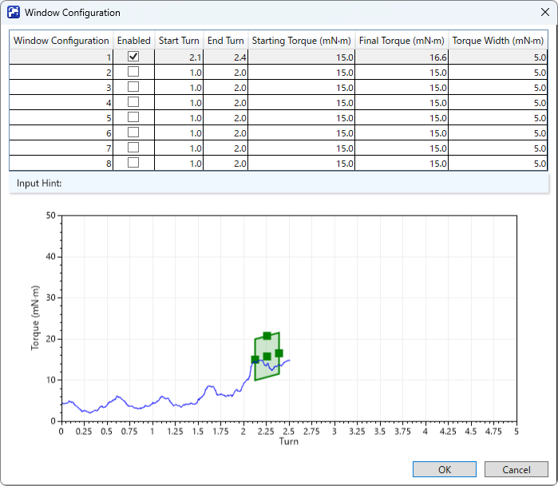

The window is the data that defines a rectangular range on the torque waveform graph.  
If the torque waveform crosses the left edge of the window, enters the rectangle, passes through the rectangle, crosses the right edge, and exits, it is determined as "pass (success)". Others are determined as “ fail (failure)”.

The window definition can be adjusted by changing the values in the table within the dialog, or by dragging the mouse on the graph to move or resize it.  
For details on the value range that can be set, refer to the input hint.

### 5.6 “System Information” Dialog

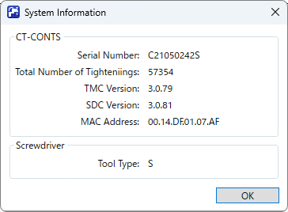

This is a dialog that displays information related to the electric driver.
Use this if you want to find out the serial number of the device or the total number of screw tightening cycles recorded on the device.


### 5.7 “Preferences” Dialog


This is a dialog that changes the following:
- Torque unit
- Destination to save log

When you change the torque unit, the item that displays or inputs the torque value is automatically converted based on the selected unit.  
Note that internal data and definition files store values in mN·m units.  
Select the unit that is easiest to use according to your needs.  

The logs in this Extension refers to the following files:
| Content | File name (line) | Format |
| ----- | ----- | ----- |
| Tightening result | VGD_PF_S_002_R.csv (S is the tool type, 002 is the ID number of CT-CONTS) | Comma-separated text |
| Error (Communication, etc.) | VGD_PF_S_002_E.csv | Comma-separated text |
| Screw tightening torque waveform data | VGD_PF_S_002_OK_00005.tw (when the screw is tightened successfully) <br>VGD_PF_S_002_NG_00001.tw (when screw tightening fails)| Binary (Epson’s proprietary format) |

You can choose the log storage location from the following options.
- PC
- External USB Controller
- Controller FLASH

On the PC, you can specify the folder where logs are saved.  
If you specify an absolute path, the file will be saved in that folder. If you specify a relative path, it will be treated as a path relative to the currently open project folder (if left blank, it will be saved within the project folder).

After setting up the electric driver, if you want to operate it using only the controller without connecting a PC and save the log, select a destination other than the PC. However, for the T/VT series, an external USB memory connected to a Controller is not supported.

For screw tightening torque waveform data (hereinafter referred to as waveform data), you can set the maximum number of data points to save for each storage location and for each OK/NG result. Waveform data files are assigned sequential numbers starting from 0. When the number of saved files reaches the maximum number, it returns to 0. Therefore, after the first cycle, the old files get overwritten in order.  
When saving waveform data to the Controller flash memory, note that there are limitations to the storage capacity, and frequent writes may affect the memory's lifespan.

The settings are saved to the definition file, and applied to the SPEL+ program.  
However, when saving to a log file in a SPEL+ program, you must explicitly save it using a function in the control library.  
Furthermore, if the data sampling interval is set to 0 in the screw tightening program, CT-CONTS will not generate waveform data.  
Regardless of the save location selected here, if you click the screw tightening button from the main window (manual operation), the log will always be saved to your PC.

### 5.8 “Vacuum Control Settings” Dialog

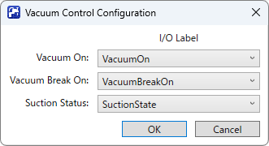

In the “vacuum control settings” dialog, the I/O port which will be used for vacuum control can be selected from the pre-defined I/O label.  
In the combo box for selecting I/O labels, the following types of labels are displayed.
| Functions | I/O label type |
| ----- | ----- |
| Vacuum on <br>Vacuum break on | I/O label set for bit output port |
| Suction status | I/O label set for bit input port |

Make sure to set the I/O label in the “I/O label editor” beforehand.  
Selecting a blank I/O label will clear the settings in the Extension.


### 5.9 Others

#### Regarding use in conjunction with ProE-Expert (Vanguard SYSTEMS INC.):

It can be used in conjunction with ProE-Expert  
However, do not perform the following operations.  
It may cause an unexpected operation.
- Switching connection from ProE-Expert to the Screw tightening Controller while the GUI is still displayed.
- Switching connection from ProE-Expert to the Screw tightening Controller while the SPEL+ program is still being executed.

#### Backing up and restoring the definition file

The definition file is stored as part of the project file (it appears as a child item of this Extension's tree item in the Project Explorer when you open the project) and is transferred to the Controller during the build process.

Therefore, when the robot controller is backed up or restored, the definition file will also be backed up and restored.

Also, you can copy the definition file to a folder in another project and add it as an existing file from the context menu of the Extension's tree item in the Project Explorer, making it usable in that project as well.  
However, the contents of the definition file must be edited to match the electric driver and the robot controller.

## 6. Library reference

This indicates the function reference for the "VanguardProFuseLib.lib" control library for electric torque drivers.

### 6.1 General Information  

### Processing errors

Even if the execution of a function fails, it will not result in an error, and the program will continue to execute.  
Therefore, make sure to always acquire the function's execution results and design the program so that it processes continuation/errors based on the results.  
The function’s execution results can be confirmed from the function’s return value and the VGD_PF_CheckStatus function's execution results.

### Handling Emergency Stop/Safeguard Open

In an emergency stop or safeguard open, the SPEL+ program will stop or pause according to the robot controller’s specification.  On the other hand, the electric driver will continue to operate until the recently requested operation is complete.  
Therefore, in order to secure safety, the following structures are recommended.
- Stop the electric drivers operation electrically (for example, shutdown the power)
- If it is unavoidable to handle the situation with the program, send a stop command by using commands such as TRAP.

### Multi task

Due to the specification of our robot controller’s TCP communication, a TCP port that was opened with another task cannot be used.  
Therefore, make sure to design the program so that the electric driver’s communication start, control, and termination can be done within the same task.

### 6.2 Command References

#### VGD_PF_Connect

Starts communication with the electric driver.

**Format**  

VGD_PF_Connect(definition file name, ByRef connection ID)

**Parameter**  

| | |
|----- |-----|
|Definition file name | Specifies a definition file name that does not include the file extension. |
|Connection ID | An ID for differentiating connection is returned. |

**Return value**  

Execution results.  
For details, refer to the “Function Error Code.”

**Description**

The connection ID is specified as an argument in the following functions in order to differentiate the electric driver to control.  
Make sure to keep the connection ID until communication with the electric driver is complete.

---
#### VGD_PF_Disconnect

Disconnects communication with the electric driver.

**Format**  

VGD_PF_Disconnect (Connection ID)

**Parameter**  

| | |
|----- |-----|
| Connection ID | Specifies the connection ID acquired from VGD_PF_Connect. |

**Return value**  

Execution results.  
For details, refer to the “Function Error Code.”

---
#### VGD_PF_StartTightening

Starts tightening screws.

**Format**  

VGD_PF_StartTightening (connection ID, program number)

**Parameter**  

| | |
|----- |-----|
| Connection ID | Specifies the connection ID acquired from VGD_PF_Connect. |
| Program number | Specifies the program number. (Range: 0 to 15) |


**Return value**  

Execution results.  
For details, refer to the “Function Error Code.”

**Description**

After it is executed, it will return to control without waiting for the screw to be tightened.  
You can check whether the screw has been tightened in the VGD_PF_CheckStatus.

---
#### VGD_PF_StartLoosening

Starts loosening screws.

**Format**  

VGD_PF_StartLoosening (connection ID, program number)

**Parameter**  

| | |
|----- |-----|
| Connection ID |  Specifies the connection ID acquired from VGD_PF_Connect. |
| Program number |  Specifies the program number. (Range: 0 to 15) |

**Return value**  

Execution results.  
For details, refer to the “Function Error Code.”

**Description**

After it is executed, it will return to control without waiting for the screw to be loosened.  
You can check whether the screw has been loosened in the VGD_PF_CheckStatus.

---
#### VGD_PF_StartFreeRun

Starts free run

**Format**  

VGD_PF_StartFreeRun (connection ID, program number)

**Parameter**  

| | |
|----- |-----|
| Connection ID |  Specifies the connection ID acquired from VGD_PF_Connect. |
| Program number |  Specifies the program number. (Range: 0 to 15) |

**Return value**  

Execution results.  
For details, refer to the “Function Error Code.”

**Description**

After it is executed, it immediately returns to control.  
To stop the operation, execute VGD_PF_Stop.

---
#### VGD_PF_Stop

Stops the execution of an operation.

**Format**  

VGD_PF_Stop (connection ID)

**Parameter**  

| | |
|----- |-----|
| Connection ID | Specifies the connection ID acquired from VGD_PF_Connect. |

**Return value**  

Execution results.  
For details, refer to the “Function Error Code.”

---
#### VGD_PF_CheckStatus

Acquires the results of a currently executed operation or the latest operation.

**Format**  

VGD_PF_CheckStatus (connection ID, ByRef END flag state, ByRef BUSY flag state, ByRef ERR flag state, ByRef error code)  

**Parameter**  

| | |
|----- |-----|
| Connection ID | Specifies the connection ID acquired from VGD_PF_Connect. |
| END flag state |  Returns the value of the END flag. If True is returned, the process is a success. |
| BUSY flag state |  Returns the value of the BUSY flag. If True is returned, it is still in operation. |
| ERR flag state |  Returns the value of the ERR flag. If True is returned, the process has failed. |
| Error code |  Returns the error code. Refer to the “Screw tightening error details”. |

**Return value**  

Execution results.  
For details, refer to the “Function Error Code.”

--
#### VGD_PF_CanGetTighteningResult

Acquires whether the screw tightening results and the torque waveform data can be acquired.

**Format**  

VGD_PF_CanGetTighteningResult (connection ID, ByRef acquirable)  

**Parameter**  

| | |
|----- |-----|
| Connection ID |  Specifies the connection ID acquired from VGD_PF_Connect. |
| Acquirable |  If it is True, it can be acquired. |

**Return value**  

Execution results.  
For details, refer to the “Function Error Code.”

**Description**

Even after screw tightening is complete and the END or ERR flag is set, the screw tightening results, including torque waveform data, cannot be read until they are stored in a designated area (BUSY state). This function is used to find out this state.

---
#### VGD_PF_GetTighteningResult

Acquires the latest screw tightening results and appends them to a log file as specified.

**Format**  

VGD_PF_GetTighteningResult (connection ID, specify record, ByRef program number, ByRef rotation number at the time of completion, ByRef maximum torque, ByRef operation time, ByRef results, ByRef error code)

**Parameter**  

| | |
|----- |-----|
| Connection ID | Specifies the connection ID acquired from VGD_PF_Connect. |
| Recording specification | If it is True, the results will be added to the log file. |
| Program number | Returns the program number. |
| Number of rotations when finished |  The number of rotations upon completion of the operation will be returned. (Unit: rotation, significant digits: first decimal place) |
| Maximum Torque |  Returns the maximum torque. (Units: Units specified in preferences; Significant digits: 1st decimal place for mN·m, 4th decimal place for kgf·cm) |
| Operation Time |  Return the operation time.|
| Results |  Returns whether it is a success or a failure. It is a success if it is True. |
| Error code |   Returns the error code. Refer to the “Screw tightening error details”. |

**Return value**  

Execution results.  
For details, refer to the “Function Error Code.”

**Description**

After execution, control will return once the log file recording is complete.

---
#### VGD_PF_GetTorqueData

Saves the torque waveform data to a new file.

**Format**

VGD_PF_GetTorqueData (connection ID, ByRef number of data, ByRef sampling angle)

**Parameter**  

| | |
|----- |-----|
| Connection ID | Specifies the connection ID acquired from VGD_PF_Connect. |
| Number of data |  Returns the number of data of the torque waveform. |
| Sample angle | Returns the sampling angle. |

**Return value**  

Execution results.  
For details, refer to the “Function Error Code.”

**Description**

The maximum number of waveform data files to retain is set via the GUI for each success/failure. If it exceeds the maximum limit, the oldest data files will be overwritten.  
After execution, control will return once the waveform data file recording is complete.

--
#### VGD_PF_GetVacuumIOLabels

Returns the Vacuum control I/O label name.

**Format**

VGD_PF_GetVacuumIOLabels (connection ID, ByRef for vacuum I/O label name,ByRef for vacuum break I/O label name, ByRef for suction status I/O label name)

**Parameter**  

| | |
|----- |-----|
| Connection ID | Specifies the connection ID acquired from VGD_PF_Connect. |
| Vacuum I/O Label Name | Returns the characters for the vacuum I/O label names.|
| Vacuum Break I/O Label Name |  Returns the characters for the vacuum break I/O label names. |
| Suction Status I/O Label Name |  Returns the characters for the suction status I/O label names.|

**Return value**  

Execution results.  
For details, refer to the “Function Error Code.”

**Description**

The I/O label name is set in the GUI.


### 6.3 Function Error Code

Define the constant on your program if necessary.

| Value (integer number) | Constant name (line) | Description |
| --- | --- | --- |
| 0 | NO_ERR | Normal |
| 1 | ERR_BAD_CONNECTION_ID | Failed to connect to the electric driver |
| 2 | ERR_FILE | File operation error |
| 3 | ERR_NETWORK | Network communication error |
| 4 | ERR_NO_MORE_CONNECTION | Unable to connect any further |
| 5 | ERR_BAD_OPERATION | Operation type error (internal error) |
| 6 | ERR_BAD_DEFINITION_FILE | Definition file error |
| 7 | ERR_MAX_IS_ZERO | The maximum number of the torque waveform data is zero |
| 8 | ERR_UNKNOWN_TOOL_TYPE | Unsupported model |

### 6.4 Error Codes for VGD_PF_CheckStatus

For details, refer to the electric driver manual.

| Code | Description |
| ----- | ----- |
| 0 | Loose screw |
| 1 | Spinning |
| 2 | Window 1 |
| 3 | Window 2 |
| 4 | Window 3 |
| 5 | Window 4 |
| 6 | Window 5 |
| 7 | Window 6 |
| 8 | Window 7 |
| 9 | Window 8 |
| 10 | Torque limit |
| 11 | Torque lower limit |
| 12 | Motor malfunction |
| 13 | Over torque |
| 14 | Configuration error |
| 15 | System error |

### 6.5 Detailed Screw Tightening Error Codes

For details, refer to the electric driver manual.

| Code | Description |
| ----- | ----- |
| 0 | Screw Protrusion |
| 1 | Screw Free-Spinning |
| 2 | Window 1 Torque Lower Limit |
| 3 | Window 1 Torque Upper Limit |
| 4 | Window 2 Torque Lower Limit |
| 5 | Window 2 Torque Upper Limit |
| 6 | Window 3 Torque Lower Limit |
| 7 | Window 3 Torque Upper Limit |
| 8 | Window 4 Torque Lower Limit |
| 9 | Window 4 Torque Upper Limit |
| 10 | Window 5 Torque Lower Limit |
| 11 | Window 5 Torque Upper Limit |
| 12 | Window 6 Torque Lower Limit |
| 13 | Window 6 Torque Upper Limit |
| 14 | Window 7 Torque Lower Limit |
| 15 | Window 7 Torque Upper Limit |
| 16 | Window 8 Torque Lower Limit |
| 17 | Window 8 Torque Upper Limit |
| 20 | Motor Error |
| 21 | Over Torque |
