# Vanguard Systems 電動ドライバー

Rev.1  
JAM269S9183F

[日本語](./readme_ja.md) / [English](./readme.md)  

## 1. 概要

### 1.1 はじめに

本Extensionは、セイコーエプソン株式会社 (以下、弊社) のEpson RC+ 8.0からVanguard Systems 電動ドライバー (株式会社バンガードシステムズの製品。以下、電動ドライバー) の設定および制御を行うための拡張機能です。


主な機能は以下のとおりです。

- 動作設定 (目標トルク、回転速度、回転方向など) の参照/編集
- ネジ締めトルク波形の表示および保存
- SPEL+ プログラムからの制御 (制御ライブラリー経由)

本readmeでは、インストール、初期設定および基本的な使用方法について説明します。  

### 1.2 安全に関する情報
安全に関する情報を必ず読み、守ってください。次のマニュアルをご参照ください。
  - 株式会社バンガードシステムズが提供する取扱説明書
  - 弊社が提供するマニュアル (ロボットコントローラー、マニピュレーター、Epson RC+ 8.0)

### 1.3 保証、免責
- 本Extensionの保証や免責事項については、Epson RC+ のソフトウェア使用許諾契約書の内容が適用されます。
- PRO-FUSE シリーズの保証や免責事項については、株式会社バンガードシステムズが提供する取扱説明書の内容が適用されます。

### 1.4 お問合せ
- 電動ドライバーのご購入、およびハードウエアに関するお問い合わせは、株式会社バンガードシステムズにお願いいたします。
- 本Extensionのご利用に関するお問い合わせは、弊社までお願いいたします。株式会社バンガードシステムズでは、本Extensionについてのサポートは行っておりません。


## 2. システム要件

### 2.1 対応環境

以下環境での使用に対応しています。

- Epson ロボットコントローラー
  - RC800 シリーズ
  - RC700 シリーズ
  - RC90 シリーズ
  - T/VT シリーズ

- Epson RC+ 8.0
  - バージョン 8.2.0.0 以降
  - GUIを利用する場合は、Premium Editionが必要
  - ライブラリの利用は、エディションを問わず可能 (ライブラリはGitHubから入手できます)

- 電動ドライバー  
  - 本体
    - TYPE S (電源: 24V)
    - TYPE L (電源: 24V)
    - TYPE XL (電源: 24V)
    - TYPE GM (電源: 48V)
    - TYPE GX (電源: 48V)

  - オプション品
    - ビット
    - マウスピース
    - 電源ケーブル  
    ※ I/O ケーブルは使用しません


### 2.2 用意していただくもの

以下の機器をご用意ください。

- Epson ロボット、およびロボットコントローラー

- Epson RC+ 8.0

- 電動ドライバー
  - 本体
  - オプション品

- 制御用PC (市販品)
  - Epson RC+ 8.0 をインストールするPC
  - Ethernet 1 ポート 100Base-T 以上

- Ethernetハブ (市販品)
  - スイッチングハブ
  - 100Base-T 以上

- LANケーブル (市販品)
  - RJ45 コネクター
  - 100Base-T 以上

- 真空装置 (市販品) 、または工場真空
  - ネジ吸着に使用
  - \- 40 ～ 50 kPa

- エアチューブ (市販品)
  - ネジ吸着に使用
  - Φ4

- 電源 (市販品)
  - 電圧 24V 、または 48V (2.1を参照)
  - 電流 3A 以上 (各機種共通)

- Zダンパー (株式会社バンガードシステムズ)

- ロボット取付治具 (市販品)
  - 標準品のご用意はありません
  - 参考として、スカラロボット、およびZダンパーに取りつけを行う場合の治具構成例を示します

| 品名 | メーカー | 型番 | 数量 |
| --- | --- | --- | --- |
| フランジ | (株)ミスミ | ATHWRL16 | 1 |
| Lブラケット | (株)ミスミ | FANAS-SUD-T3-A90-B76-L60-X9.5-F41-H15-G65-N4-Y13.8-V32.6-S26.7-W32.5-NA5-CC1 | 1 |

**備考**

- ネジと電動ドライバーの最適な組合せについては、株式会社バンガードシステムズにお問い合わせください。
- より高い信頼性でネジ締めを行う必要がある場合は、弊社の力覚システムの利用をご検討ください。


## 3. セットアップ

### 3.1 配線、配管

接続例を示します。


**注意**

- ネジ吸着用の真空は、電動ドライバーから制御できません。真空装置は、ロボットコントローラーのI/Oで制御するなどの構成としてください。
- GUIを使用する場合は、PCとロボットコントローラーをEthernetで接続する必要があります。USB接続では、GUIと電動ドライバー間の通信はできません。

### 3.2 ロボットへの電動ドライバーの設置

スカラロボットへの取付例を示します。


|記号|項目|
|---|---|
|a|ロボット|
|b|フランジ|
|c|L ブラケット|
|d|Z ダンパー|
|e|電動ドライバー|

### 3.3 インストール

Epson RC+ の本Extensionマネージャーから「Vanguard Systems 電動ドライバー」をインストールします。  
インストール方法の詳細については、以下のマニュアルをご参照ください。  
"Epson RC+ 8.0 本Extension RC+ Extensions 8.0"

## 4. 基本的な使い方  

ここでは、電動ドライバーの基本的な使い方と、基本的な SPEL+ プログラムを紹介します。  
より詳しい使い方については、5章および6章をご参照ください。

**前提条件**

- ロボットコントローラーのIPアドレス: 192.168.0.1
- 電動ドライバーのIPアドレス: 192.168.0.2 (最下位オクテットはロータリースイッチで設定)

### 4.1 SPEL+ プロジェクトの準備

空のプロジェクトとして、DemoScrewTightを作成します。  
プロジェクトエクスプローラーで右クリックし、[制御ライブラリーの追加]を選択します。  
制御ライブラリー "VanguardProFuseLib.lib" がプロジェクトに追加されます。

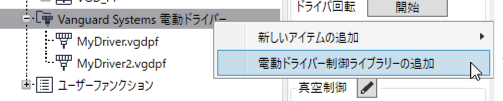

### 4.2 起動

プロジェクトエクスプローラーで右クリックし、[新しいアイテムの追加]-[新しいファイル]を選択して、定義ファイルを追加します。  
定義ファイルの名称は「MyDriver.vgdpf」とします。

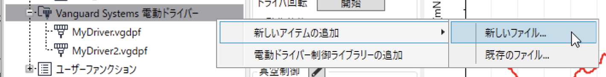

### 4.3 通信設定

プロジェクトエクスプローラーの定義ファイルをダブルクリックします。  
「PC から接続」ダイアログを開き、CT-CONTS(電動ドライバーのコントローラー)のIP アドレスを入力して、「接続」ボタンをクリックします。

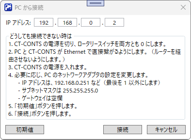

「コントローラー設定」ボタンをクリックして、ダイアログを開きます。

ロボットコントローラーにまだ接続していない場合は、「PC とコントローラーの接続」ダイアログが表示されます。  
なお、自動接続が有効な場合は、ダイアログは表示されず、自動的に接続が開始されます。

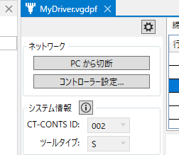

「コントローラー設定」ダイアログが表示されたら、パラメータを入力します。

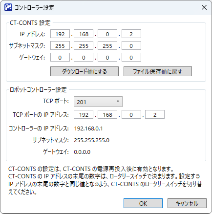

**CT-CONTS設定グループ**
| 設定項目 | 解説 | 値(例) |
| --- | --- | --- |
| IP アドレス | 電動ドライバーの IP アドレスを指定 | 192.168.0.2 |
| サブネットマスク | 電動ドライバーのサブネットマスクを指定 | 255.255.255.0 |

**ロボットコントローラー設定グループ**
| 設定項目 | 解説 | 値(例) |
| --- | --- | --- |
| TCP ポート | ロボットコントローラーの TCP ポート番号を指定 | 201 |
| TCP ポート用の IP アドレス | TCP ポートに指定する IP アドレス (電動ドライバーの IP アドレス) | 192.168.0.2 |

ロボットコントローラーの設定を変更した場合、ロボットコントローラーは自動的に再起動されます。接続が再度確立するまで、操作せずにお待ちください。

### 4.4 プログラム設定

使用するプログラム番号を選択し、［プログラム編集］のアイコンボタン (Ed) をクリックします。

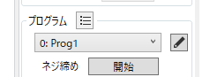

「プログラム編集」ダイアログが開いたら、パラメータを入力します。

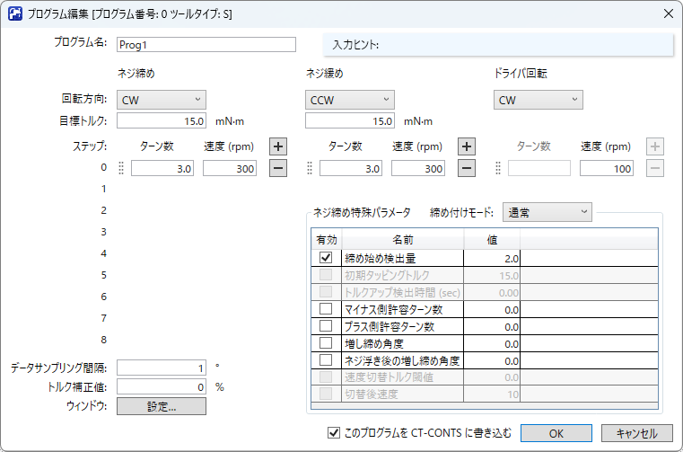

| 設定項目 | 解説 | 値(例) |
| --- | --- | --- |
| 回転方向 | 回転方向(CW、CCW)を指定 | CW |
| 目標トルク | 目標トルクを指定 | 50 |

ステップを追加し、値を入力します(例)。
| ステップ | ターン数 | 速度 |
| --- | --- | --- |
|0| 2 | 200 |
|1| 6 | 500 |
|2| 2 | 100 |

入力が完了したら、電動ドライバーに、プログラムをアップロードします。編集中のプログラムをアップロードするには、「このプログラムを CT-CONTS に書き込む」のチェックボックスにチェックして、「OK」ボタンをクリックします。すべてのプログラムをアップロードする方法については、「プログラム設定」の節をご覧ください。

本Extensionが提供する制御ライブラリーを使用してSPEL+ プログラムを実行する際は、電動ドライバーのプログラムがあらかじめアップロードされていることを前提としています。

### 4.5 ログ設定

「環境設定」のアイコンボタン (Pr) をクリックします。

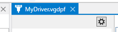

「環境設定」ダイアログを開いたら、パラメータを入力します。

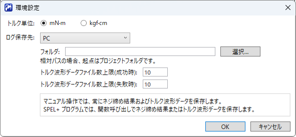

| 設定項目 | 解説 | 値(例) |
| --- | --- | --- |
| ログ保存先 | ログの保存先を指定 | PC |
| フォルダ | ログの保存先フォルダを指定 | C:\\ScrewTighteningLog |

### 4.6 SPEL+プログラムの作成

#### 事前準備

- 使用するロボットを登録します。
- 以下のポイントデータを登録しておきます。
  - P_ScrewSupply: ネジ供給位置
  - P_ScrewTight: ネジ締め位置
- 以下のI/Oラベル (出力ビット) を登録しておきます。
  - Vacuum: 真空 ON/OFF
  - VacuumBreak: 真空破壊 ON/OFF


#### 注意事項

以下処理は省略しています。
- ロボット動作命令で発生するエラーの処理
- 非常停止/安全扉開対応

#### プログラム

```vb
#define NO_ERR 0

Global Boolean G_Process

Function ScrewTighteningDemo As Integer
	
	Integer ret
	Integer cid
	String failmesg$
	Boolean isEnd, isBusy, isErr, canGet, isOK
	Integer errCode
	UShort retProgramNo
	Real numTurns, torque, timeElapsed
	UShort actualCount, samplingAngle

	ret = NO_ERR
	
	' Robot settings
	Motor On
	Power High
	Speed 100
	Accel 100, 100
	LimZ 0.0
	
	' Connect
	ret = VGD_PF_Connect("MyDriver", ByRef cid)
	If ret <> NO_ERR Then GoTo ErrProc
	
	' Loop for pick screw and tightening
	Do While G_Process = True

		' Move Robot to screw supply position
		Jump P_ScrewSupply
		
		' Vacuum On
		On Vacuum
		
		' Move Robot to screw tightening position
		Jump P_ScrewTight
		
		' Start tightening
		ret = VGD_PF_StartTightening(cid, 0)
		If ret <> NO_ERR Then GoTo ErrProc
		
		' Vacuum Off
		Off Vacuum
		On VacuumBreak
		Off VacuumBreak

		' Wait for finish tightening
		Do
			ret = VGD_PF_CheckStatus(cid, ByRef isEnd, ByRef isBusy, ByRef isErr, ByRef errCode)
			If ret <> NO_ERR Then GoTo ErrProc
			Wait 0.1
		Loop While isBusy

		' Get log when the tightening failed
		If isErr = True Then
		
			' Wait for preparing result
			Do
				ret = VGD_PF_CanGetTighteningResult(cid, ByRef canGet)
				If ret <> NO_ERR Then GoTo ErrProc
				Wait 0.01
			Loop Until canGet
			
			' Get latest result and save result to log file
			ret = VGD_PF_GetTighteningResult(cid, True, ByRef retProgramNo, ByRef numTurns, ByRef torque, ByRef timeElapsed, ByRef isOK, ByRef errCode)
			If ret <> NO_ERR Then GoTo ErrProc
			
			' Save latest torque waveform to file
			ret = VGD_PF_GetTorqueData(cid, ByRef actualCount, ByRef samplingAngle)
			If ret <> NO_ERR Then GoTo ErrProc

			' Generate fail message
			failmesg$ = "*** Tightening failed ***" + Chr$(13)
			failmesg$ = failmesg$ + "errCode = " + Str$(errCode) + Chr$(13)
			failmesg$ = failmesg$ + "programNo = " + Str$(retProgramNo) + Chr$(13)
			failmesg$ = failmesg$ + "numTurns = " + Str$(numTurns) + Chr$(13)
			failmesg$ = failmesg$ + "torque = " + Str$(torque) + Chr$(13)
			failmesg$ = failmesg$ + "actualCount = " + Str$(actualCount) + Chr$(13)
			failmesg$ = failmesg$ + "samplingAngle = " + Str$(samplingAngle)
			
			GoTo ErrProc
		
		EndIf

	Loop
	
	GoTo EndProc
		
ErrProc:

	If ret <> NO_ERR Then
		Print "*** Internal error *** (", ret, ")"
	Else
		Print failmesg$
	EndIf

EndProc:

	' Vacuum Off
	Off Vacuum
	On VacuumBreak
	Off VacuumBreak

	' Connection close
	VGD_PF_Stop(cid)
	VGD_PF_Disconnect(cid)
	
	ScrewTighteningDemo = ret

Fend

```

### 4.7. 動作確認

ScrewTighteningDemo ファンクションを実行して、動作確認を行います。


## 5. GUI

GUIの各要素について説明します。

### 5.1 メインウインドウ

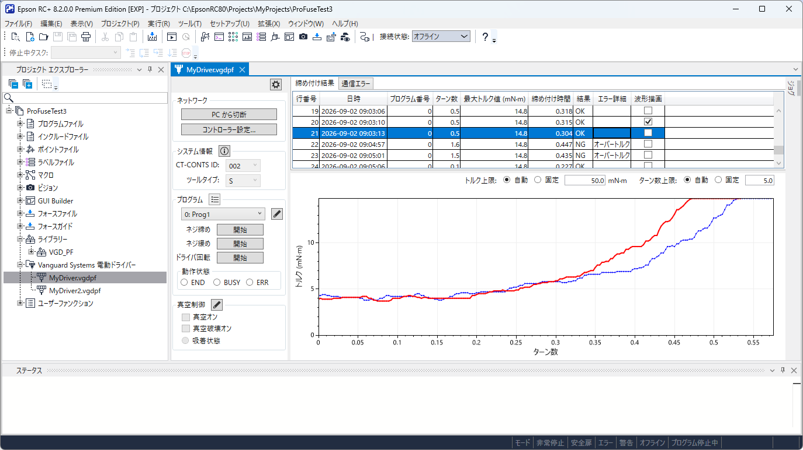

メインウィンドウは、以下の3つの領域と、右端から表示される［ジョグ］パネルで構成されています。

- 設定・調整 (左側)
- ログ (右上)
- グラフ (右下)

操作の結果、定義ファイルから読み出した内容に変更が行われると、ウィンドウのタイトルに表示されているファイル名の右側に「*」マークが表示されます。  
変更内容を定義ファイルに保存する場合は、［ファイルの保存］ (ファイルメニューまたはツールバーのディスクアイコン) を実行してください。  
なお、SPEL+プログラムの実行中は、定義ファイルの内容を変更する操作はできません。


### 設定・調整領域

#### 「環境設定」ボタン(ツールバー)

アイコンボタン (Pr) をクリックすると、「環境設定」ダイアログが表示されます。  
ダイアログの詳細は、当該の節をご覧ください。  


#### 「ネットワーク」グループ

「PC から接続」ボタンをクリックすると、「PC から接続」ダイアログを開きます。  
ダイアログの詳細については、該当する節を参照してください。  
CT-CONTSに接続中は、ボタンのラベルが「PC から切断」に変わります。  
「PC から切断」ボタンをクリックすると、CT-CONTS との通信を終了します。

CT-CONTS との接続中は、「コントローラー設定」ボタンが有効になります。  
「コントローラー設定」ボタンをクリックすると、「コントローラー設定」ダイアログが表示されます。  
ダイアログの詳細については、該当する節を参照してください。  

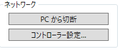  

#### 「システム情報」グループ

電動ドライバーの設定を示します。  
「CT-CONTS ID」は、CT-CONTS を識別する番号で、CT-CONTS のロータリースイッチのポジションです (CT-CONTS の IP アドレスの最下位オクテットでもあります)。  
「ツールタイプ」は、電動ドライバーの機種です。  

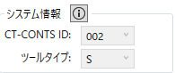  

CT-CONTS と接続されていない状態では、初期値は定義ファイルに保存されている値です。コンボボックスで変更することができます。ただし、「ツールタイプ」を変更する際は、プログラムの内容を新しいツールタイプに適合させるため、自動で調整が行われ、プログラムの内容が変わってしまう可能性がありますので、ご注意ください。

CT-CONTS と接続されている状態では、実際の設定および機種に合わせて、コンボボックスの内容は固定され、変更できなくなります。接続時に、定義ファイルのツールタイプと、実際のツールタイプが異なっていた場合は、その旨警告されます。そのまま接続する場合は、プログラムの内容を実際のツールタイプに適合させるため、自動で調整が行われ、プログラム内容が変わってしまう可能性がありますので、ご注意ください。

グループ名の右側にあるアイコンボタンをクリックすると、［システム情報］ダイアログが表示されます。ダイアログの詳細については、該当する節を参照してください。  
 

#### 「プログラム」グループ

ネジ締め、ネジ緩めまたはドライバ回転のマニュアル操作を行うことができます。また、それらの操作方法を決めるプログラムの内容を表示、編集し、電動ドライバーとの間でプログラムの送受信 (ダウンロードおよびアップロード) ができます。

グループ名の直下にあるコンボボックスでは、マニュアル操作および編集の対象となるプログラムを選択します。

グループ名の右側にあるアイコンボタンは、メニューボタンです。

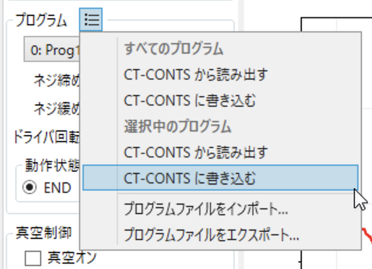

メニューには、以下の項目があります。
| メニュー名 | 機能 |
| ----- | ----- |
| (すべてのプログラム)<br>CT-CONTS から読み出す | CT-CONTS から PC に、すべてのプログラムをダウンロードします。 |
| (すべてのプログラム)<br>CT-CONTS に書き込む | PC から CT-CONTS へ、すべてのプログラムをアップロードします。 |
| (選択中のプログラム)<br>CT-CONTS から読み出す | CT-CONTS から PC に、選択中のプログラムをダウンロードします。 |
| (選択中のプログラム)<br>CT-CONTS に書き込む | PC から CT-CONTS へ、選択中のプログラムをアップロードします。 |
| プログラムファイルをインポート | ProE-Expert で保存した XML 形式のファイルを読み込みます。 |
| プログラムファイルをエクスポート | 本Extensionで編集中のプログラムを、ProE-Expert が読み込める XML 形式ファイルに出力します。 |

読み込み、およびインポートを実行すると、編集中のプログラムは読み込んだ内容で置き換えられます。変更内容を定義ファイルへ反映するには、定義ファイルを保存してください。

「ネジ締め」「ネジ緩め」「ドライバ回転」の「開始」ボタンは、クリックすると、選択されているプログラムで定義されたそれらの操作を開始します。操作中は、クリックしたボタンが「停止」ボタンになり(他のボタンは無効になります)、クリックすると操作を中止します。  
ネジ締めおよびネジ緩めは、プログラムのステップをすべて終了すると、自動的に停止します。  
ドライバ回転は、停止をクリックするまで停止しません。

「動作状態」グループは、操作中の電動ドライバーの状態をラジオボタンで示します。実行中、および終了後にトルク波形を含む結果データが所定の領域に格納されるまで「BUSY」はオンです。  
ネジ締めでは、プログラムのステップをすべて終了すると、「END」または「ERR」がオンになります。  
「END」および「ERR」は、ネジ締めの OK(成功)および NG(失敗)に対応しています。  
ネジ緩めでは、プログラムのステップをすべて終了すると、「END」がオンになります。  
ドライバ回転では、「END」「ERR」はセットされません。

ネジ締めが自動で終了した場合は、ログが更新され、トルク波形データが描画されます。

プログラム選択コンボボックスの右側にあるアイコンボタンをクリックすると、［プログラム編集］ダイアログが表示されます。ダイアログの詳細については、該当する節を参照してください。

#### 「真空制御」グループ

機能に対応するI/Oラベルが設定されており、かつロボットコントローラーに接続している場合は、ここでI/Oの操作および状態確認を行えます。

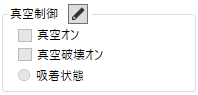  

「真空オン」および「真空破壊オン」のチェックボックスをオンにすると、対応するI/O出力がオンになります。  
オフにすると、I/O出力はオフになります。

「吸着状態」のラジオボタンは、対応するI/O入力の状態に応じて表示が切り替わります。

グループ名の右側にあるアイコンボタンをクリックすると、「真空制御設定」ダイアログが表示されます。  
ダイアログの詳細については、該当する節を参照してください。  

### ログ領域

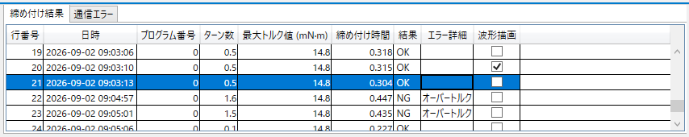  

#### 「締め付け結果」タブ

ネジ締め付け結果を表で示します。表の列は以下の通りです。

| 列名 | 内容 |
| ----- | ----- |
| 行番号 | 先頭を 1 とする、ログファイルでの行位置です。 |
| 日時 | ネジ締めの日時です。 |
| プログラム番号 | プログラム番号です。 |
| ターン数 | ネジ締め終了時のネジの回転数です。 |
| 最大トルク値 | ネジ締め時に記録されたトルクの最大値です。 |
| 締め付け時間 | ネジ締めに要した秒数です |
| 結果 | ネジ締めの結果です。成功した場合は "OK"、失敗した場合は "NG" となります。 |
| エラー詳細 | ネジ締めが失敗した場合の、失敗判定条件です。 |
| 波形描画 | チェックボックスが有効な場合、対応するトルク波形データがあります。チェックを付けると、グラフ領域に描画され続けます。<br>チェックボックスが無効な場合、対応するトルク波形データはありません。|

表の行を選択すると、その行に対応するトルク波形データが存在する場合は、グラフ領域に表示されます。  
チェックが付いている行の波形データには重ねて表示されるため、複数の波形データを比較できます。  
また、チェックがついている行の波形データは、「ウィンドウ設定」ダイアログにも表示されます。

#### 「エラー(通信等)」タブ

発生したエラーを示します。表の列は以下の通りです。  
なお、ネジ締めの失敗に関する情報は、この表には表示されません。「締め付け結果」のほうに記録されます。

| 列名 | 内容 |
| ----- | ----- |
| 日時 | エラーの発生日時です。 |
| 内容 | エラーの内容です。 |

### グラフ領域

「締め付け結果」の表で選択されている行、および波形表示のチェックが付いている行のトルク波形データをグラフに表示します。  
グラフの横軸はターン数、縦軸はトルクを示します。  
横軸および縦軸の表示範囲の上限は、グラフ右上の設定で指定できます。  
自動を選択した場合は、波形データ全体が表示されるように自動的に調整されます。  

  

### ジョグパネル

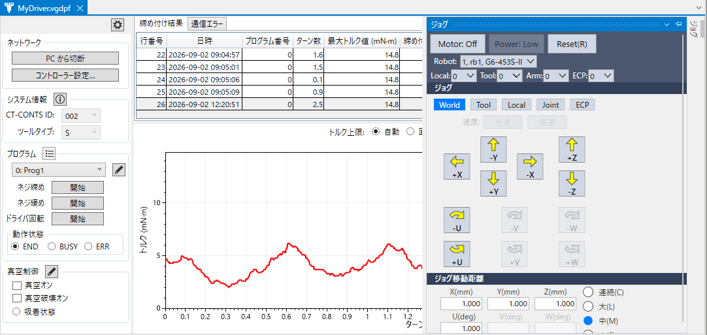

本Extensionでは、利便性向上のため、電動ドライバーの操作とロボットのジョグ操作を同一画面で行えるようにしています。

ジョグパネルは、Vision GuideやForce Guideに用意されているものと同様で、ロボットマネージャーの「ジョグ＆ティーチ」タブのサブセットです。  
操作方法の詳細については、以下を参照してください。  
"Epson RC+ 8.0 ユーザーズガイド"  

### 5.2 「PCから接続」ダイアログ


CT-CONTS (電動ドライバーのコントローラー) と接続するためのダイアログです。

「IP アドレス」欄に、CT-CONTS の IPアドレスを入力します。  
PCでのサブネットマスクおよびゲートウェイの設定は、PC側で行う必要があります。  
詳細は、お使いの Windows のヘルプ等を参照してください。

接続できない場合は、ダイアログ内に記載されている手順に従って操作してください。


### 5.3 「コントローラー設定」ダイアログ


ロボットコントローラーから、CT-CONTS に接続するための設定を行うダイアログです。

CT-CONTS 側の設定は、定義ファイルに保存されている値と、機器からダウンロードした値の両方を確認できます。「OK」をクリックすると、入力値が CT-CONTS 側へアップロードされます。

ロボットコントローラーからEthernet経由で機器にアクセスするための接続パラメーターを、「TCP ポート」と呼びます。  
通常、TCP ポートは、「システム設定」ダイアログで設定しますが、本Extensionでは、利便性向上のため、この設定機能を取り込んでいます。

ロボットコントローラー側で使用するTCPポートを選択し、接続先となる CT-CONTS のIPアドレスを設定してください。通常は、CT-CONTSに設定されているIPアドレスと同じ値を設定します。  
ルーターなどを経由する特殊なネットワーク環境では、ネットワーク管理者の指示に従って設定してください。

参考情報として、ロボットコントローラー側の IP アドレス等を表示しています。なお、コントローラー側のIPアドレスを変更する場合は、「システム設定」ダイアログで設定してください。


### 5.4 「プログラム編集」ダイアログ


「ネジ締め」、「ネジ緩め」、「ドライバ回転」のそれぞれの条件を設定するダイアログです。

| 入力/選択 | 設定値 |
| ----- | ----- |
| プログラム名 | プログラム選択コンボボックスに表示させる際の名前を設定できます。英数字 16 文字まで可能です。|
| 入力ヒント | 編集モードになっている入力欄について、設定値の範囲などを示します。 |

#### ネジ締め

| 入力/選択 | 設定値 |
| ----- | ----- |
| 回転方向 | CW(時計回り) または CCW(反時計回り) を選択します。 |
| 目標トルク | トルクの目標値を設定します。ツールタイプによって、設定できる値の範囲が異なります。入力ヒントをご参照ください。 |
| ステップ | 9 個まで追加可能です。<br>+ アイコンボタンをクリックすると、ステップが追加されます。<br>- アイコンボタンはそのステップを削除します。<br>ステップの左側の「バー」をマウスで掴んでドラッグ＆ドロップすることで、ステップの順序を変更できます。<br> ターン数、速度の設定値範囲は、入力ヒントをご参照ください。<br>注意点として、ターン数 0 のステップは実行されず、そこでプログラムが終了します。以降のステップは定義ファイルにも保存されません。|
| データサンプリング間隔 | トルク波形データを取得する際の刻み幅を、角度で指定します。<br>サンプリング数の最大値は 4,096 個、トルク最大値は 700 mN·m です。<br> 0 ° を指定すると、サンプリングは行われません。 |
| トルク補正値 | トルクずれの許容量を割合で設定します。値の範囲は入力ヒントをご参照ください。|
| ウィンドウ設定 | クリックすると「ウィンドウ設定」ダイアログを開きます。ダイアログの詳細は、当該の節をご覧ください。 |

**ネジ締めの特殊パラメータ**

以下の締め付けモードごとに、さらに細かい条件を設定することが可能です。

| 締め付けモード | 説明 |
| ----- | ----- |
| 通常 | 目標トルクの 80% 到達以降自動的に減速して締結 |
| タッピング | 通常より高速な締結 |
| 高速 | 各ステップで通常より高速な回転速度を設定可能な締結 |

モードごとに設定可能なパラメータは、以下の通りです。「有効」列にチェックがついているものが使用されます。「値」列に設定できる値の範囲は、入力ヒントをご参照ください。締め付けモードおよびパラメータの詳しい説明は、電動ドライバーの取扱説明書でご確認ください。

| パラメータ(「名前」列) | 通常 | タッピング | 高速 |
| ----- | ----- | ----- | ----- |
| 締め始め検出量 | o | o | o |
| 初期タッピングトルク | x | o | x |
| トルクアップ検出時間 | x | o | o |
| マイナス側許容ターン数 | o | o | o |
| プラス側許容ターン数 | o | o | o |
| 増し締め角度 | o | o | o |
| ネジ浮き後の増し締め角度 | o | o | o |
| 速度切替トルク閾値 | x | o | o |
| 切替後速度 | x | o | o |

(o は利用可能、x は対象外)

#### ネジ緩め

| 入力/選択 | 設定値 |
| ----- | ----- |
| 回転方向 | CW(時計回り) または CCW(反時計回り) を選択します。<br>通常、ネジ締めとは逆の方向になります。 |
| 目標トルク | トルクの目標値を設定します。ツールタイプによって、設定できる値の範囲が異なります。入力ヒントをご参照ください。 |
| ステップ | 2 個まで追加可能です。<br>+ アイコンボタンをクリックすると、ステップが追加されます。<br>- アイコンボタンはそのステップを削除します。<br>ステップの左側の「バー」をマウスで掴んでドラッグ＆ドロップすることで、ステップの順序を変更できます。<br> ターン数、速度の範囲は、入力ヒントをご参照ください。<br>注意点として、ターン数 0 のステップは実行されず、そこでプログラムが終了します。以降のステップは定義ファイルにも保存されません。|

#### ドライバ回転

| 入力/選択 | 設定値 |
| ----- | ----- |
| 回転方向 | CW(時計回り) または CCW(反時計回り) を選択します。 |
| ステップ | 1 個固定です。<br> ターン数は設定できません。速度の範囲は、入力ヒントをご参照ください。|

### 5.5 「ウィンドウ設定」ダイアログ

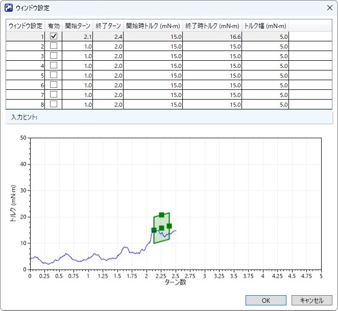

ウィンドウは、トルク波形グラフ上での矩形範囲を定義するデータです。  
トルク波形がウィンドウの左辺を横切って矩形内に入り、そのまま矩形内を通過して右辺を横切って出た場合は、「合格(成功)」と判定されます。それ以外の場合は、「不合格(失敗)」と判定されます。

ウィンドウの定義は、ダイアログ内の表で数値を変更するか、グラフ上でマウスをドラッグして移動またはサイズ変更することで調整できます。  
設定可能な数値範囲については、入力ヒントを参照してください。

### 5.6 「システム情報」ダイアログ

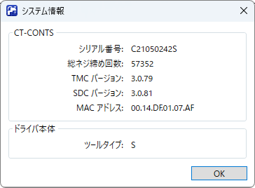

電動ドライバーに関する情報を表示するダイアログです。  
機器のシリアル番号や、機器に記録されている総ネジ締め回数などを調べたい場合にご利用ください。


### 5.7 「環境設定」ダイアログ


以下を変更するためのダイアログです。
- トルク単位
- ログ保存先

トルク単位を変更すると、トルク値を表示または入力する項目は、選択した単位に応じて自動的に変換されます。  
なお、内部データおよび定義ファイルには、mN·m単位の値が保存されます。  
用途に応じて、使いやすい単位を選択してください。  

本Extensionにおけるログとは、以下のファイル群を指します。
| 内容 | ファイル名(例) | 形式 |
| ----- | ----- | ----- |
| ネジ締め付け結果 | VGD_PF_S_002_R.csv (S はツールタイプ, 002 は CT-CONTS の ID 番号) | カンマ区切りテキスト |
| エラー(通信等) | VGD_PF_S_002_E.csv | カンマ区切りテキスト |
| ネジ締めトルク波形データ | VGD_PF_S_002_OK_00005.tw (ネジ締め成功時)<br>VGD_PF_S_002_NG_00001.tw (ネジ締め失敗時)| バイナリ (弊社の独自形式) |

ログ保存先は、以下から選択することができます。
- PC
- コントローラー外付け USB
- コントローラー FLASH

PCでは、ログの保存先フォルダを指定できます。  
絶対パスを指定した場合は、そのフォルダに保存されます。相対パスを指定した場合は、現在開いているプロジェクトフォルダを基準としたパスとして扱われます(空欄の場合は、プロジェクトフォルダ内に保存されます)。

電動ドライバーの設定後、PCを接続せずにコントローラー単体で運転し、ログを保存する場合は、保存先としてPC以外を選択してください。ただし、T/VTシリーズでは、コントローラーに接続する外付けUSBメモリーはサポートされていません。

ネジ締めトルク波形データ (以下、波形データ) については、保存先ごと、かつ OK および NG ごとに、保存する最大数を設定できます。波形データのファイルには、0 から通し番号が付与されます。保存数が最大数に達すると、再び 0 に戻ります。そのため、一巡後は古いファイルから順に上書きされます。  
コントローラー FLASH に波形データを保存する場合は、記憶容量に制限があること、および頻繁な書き込みがメモリー寿命に影響する可能性があることに注意してください。

設定は、定義ファイルに保存され、SPEL+ プログラムに適用されます。  
ただし、SPEL+ プログラムでログのファイルへ保存する場合は、制御ライブラリーのファンクションを使用して明示的に保存する必要があります。  
また、ネジ締めのプログラムで、データサンプリング間隔が 0 設定されている場合、CT-CONTS は波形データを生成しません。  
なお、ここで選択した保存先によらず、メインウィンドウから、ネジ締めボタンをクリックした場合 (マニュアル操作) は、ログは常にPCに保存されます。

### 5.8 「真空制御設定」ダイアログ

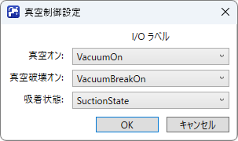

「真空制御設定」ダイアログでは、真空制御に使用するI/Oポートを、あらかじめ定義されたI/Oラベルから選択できます。  
I/Oラベル選択用のコンボボックスには、以下の種類のラベルが表示されます。
| 機能 | I/O ラベル種類 |
| ----- | ----- |
| 真空オン<br>真空破壊オン | ビット出力ポートに設定された I/O ラベル |
| 吸着状態 | ビット入力ポートに設定された I/O ラベル |

I/Oラベルは、あらかじめ「I/O ラベルエディター」で設定してください。  
空白の I/Oラベルを選ぶと、Extension での設定を解除することができます。


### 5.9 その他

#### ProE-Expert (株式会社バンガードシステムズ) との併用について

ProE-Expertとの併用は可能です。  
ただし、以下の操作は行わないでください。  
意図しない動作が発生する可能性があります。
- GUI表示中に、ProE-Expertからネジ締めコントローラーに接続する。
- SPEL+ プログラム実行中に、ProE-Expertからネジ締めコントローラーに接続する。

#### 定義ファイルのバックアップ、リストアについて

定義ファイルは、プロジェクトファイルの一部として格納され (プロジェクトを開いたとき、プロジェクトエクスプローラーの、本Extensionのツリー項目の子項目として表示されている場合)、ビルド時にコントローラーに転送されます。

このため、ロボットコントローラーのバックアップおよびリストアを実行すると、定義ファイルもあわせてバックアップおよびリストアされます。

また、定義ファイルを別のプロジェクトのフォルダにコピーして、プロジェクトエクスプローラーの、本Extensionのツリー項目のコンテキストメニューから、既存ファイルとして追加することで、そのプロジェクトでも利用することが可能です。  
ただし、定義ファイルの内容は、接続する電動ドライバーやロボットコントローラーに合わせて、適切に編集する必要があります。

## 6. ライブラリーリファレンス

電動ドライバーの制御ライブラリー "VanguardProFuseLib.lib" のファンクションのリファレンスを示します。

### 6.1. 共通事項  

### エラー処理

ファンクションの実行に失敗した場合でも、エラーは発生せず、SPEL+ プログラムは継続して実行されます。  
そのため、ファンクションの実行結果を必ず取得し、その結果をもとに継続/エラー処理するようにプログラムを構成してください。  
ファンクションの実行結果は、ファンクションの戻り値、および VGD_PF_CheckStatus ファンクションの実行結果で確認できます。

### 非常停止/安全扉開の対応

非常停止/安全扉開の場合、SPEL+ プログラムはロボットコントローラーの仕様に従って停止または中断します。  一方、電動ドライバーは、直前に受け付けた動作が完了するまで動作を継続します。  
そのため、安全性を確保するため、以下のような構成とすることを推奨します。
- 電動ドライバーの動作を電気的に停止させる (電源を遮断するなど)。
- やむを得ずプログラムで対応する場合は、TRAP コマンドを使用するなどして、停止コマンドを送信する。

### マルチタスク

弊社ロボットコントローラーの TCP 通信の仕様上、別のタスクでオープンした TCP ポートを利用することができません。  
このため、電動ドライバーの通信開始、制御、通信終了は、同一タスク内で行われるようプログラムを構成してください。

### 6.2. コマンドリファレンス

#### VGD_PF_Connect

電動ドライバーとの通信を開始します。

**書式**  

VGD_PF_Connect(定義ファイル名, ByRef 接続 ID)

**パラメーター**  

| | |
|-----|-----|
|定義ファイル名 | 拡張子を含まない定義ファイル名を指定します。 |
|接続 ID | 接続を識別する ID が戻ります。 |

**戻り値**  

実行結果。  
詳細は「ファンクションエラーコード」をご参照ください。

**解説**

接続 ID は、制御する電動ドライバーを区別するために、以降のファンクションで引数として指定します。  
接続 ID は、電動ドライバーとの通信終了まで保持してください。

---
#### VGD_PF_Disconnect

電動ドライバーとの通信を切断します。

**書式**  

VGD_PF_Disconnect(接続 ID)

**パラメーター**  

| | |
|-----|-----|
| 接続 ID | VGD_PF_Connectから取得した接続 ID を指定します。 |

**戻り値**  

実行結果。  
詳細は「ファンクションエラーコード」をご参照ください。

---
#### VGD_PF_StartTightening

ネジ締めを開始します。

**書式**  

VGD_PF_StartTightening(接続 ID, プログラム番号)

**パラメーター**  

| | |
|-----|-----|
| 接続 ID | VGD_PF_Connect から取得した接続 ID を指定します。 |
| プログラム番号 | プログラム番号を指定します。(範囲：0～15) |


**戻り値**  

実行結果。  
詳細は「ファンクションエラーコード」をご参照ください。

**解説**

実行後、ネジ締めの完了を待たずに制御が戻ります。  
ネジ締めの完了は、VGD_PF_CheckStatus で判断できます。

---
#### VGD_PF_StartLoosening

ネジ緩めを開始します。

**書式**  

VGD_PF_StartLoosening(接続 ID, プログラム番号)

**パラメーター**  

| | |
|-----|-----|
| 接続 ID |  VGD_PF_Connect から取得した接続 ID を指定します。 |
| プログラム番号 |  プログラム番号を指定します。(範囲：0～15) |

**戻り値**  

実行結果。  
詳細は「ファンクションエラーコード」をご参照ください。

**解説**

実行後は、ネジ緩めの完了を待たずに制御が戻ります。  
完了は、VGD_PF_CheckStatus で判断できます。

---
#### VGD_PF_StartFreeRun

ドライバ回転を開始します。

**書式**  

VGD_PF_StartFreeRun(接続 ID, プログラム番号)

**パラメーター**  

| | |
|-----|-----|
| 接続 ID |  VGD_PF_Connect から取得した接続 ID を指定します。 |
| プログラム番号 |  プログラム番号を指定します。(範囲：0～15) |

**戻り値**  

実行結果。  
詳細は「ファンクションエラーコード」をご参照ください。

**解説**

実行後は、すぐに制御が戻ります。  
動作を停止するには、VGD_PF_Stop を実行します。

---
#### VGD_PF_Stop

実行中の動作を停止します。

**書式**  

VGD_PF_Stop(接続 ID)

**パラメーター**  

| | |
|-----|-----|
| 接続 ID | VGD_PF_Connect から取得した接続 ID を指定します。 |

**戻り値**  

実行結果。  
詳細は「ファンクションエラーコード」をご参照ください。

---
#### VGD_PF_CheckStatus

現在実行中、または、最新の動作の結果を取得します。

**書式**  

VGD_PF_CheckStatus(接続 ID, ByRef END フラグ状態, ByRef BUSY フラグ状態, ByRef ERR フラグ状態, ByRef エラーコード)  

**パラメーター**  

| | |
|-----|-----|
| 接続 ID | VGD_PF_Connect から取得した接続 ID を指定します。 |
| END フラグ状態 |  ENDフラグの値が戻ります。 True の場合は、処理が成功しています。 |
| BUSY フラグ状態 |  BUSYフラグの値が戻ります。 True の場合は、動作中です。 |
| ERRフラグ状態 |  ERR フラグの値が戻ります。 True の場合は、処理が失敗しています。 |
| エラーコード |  エラーコードが戻ります。「ネジ締めエラー詳細」をご参照ください。 |

**戻り値**  

実行結果。  
詳細は「ファンクションエラーコード」をご参照ください。

--
#### VGD_PF_CanGetTighteningResult

ネジ締め付け結果、および、トルク波形データが取得可能かを取得します。

**書式**  

VGD_PF_CanGetTighteningResult(接続 ID, ByRef 取得可能)  

**パラメーター**  

| | |
|-----|-----|
| 接続 ID |  VGD_PF_Connect から取得した接続 ID を指定します。 |
| 取得可能 |  True の場合は、取得可能です。 |

**戻り値**  

実行結果。  
詳細は「ファンクションエラーコード」をご参照ください。

**解説**

ネジ締めが終了して、END または ERR のフラグがセットされても、トルク波形データを含むネジ締め付け結果が所定の領域に格納されるまで、それらを読み出すことはできません(BUSY 状態)。このファンクションは、その状態を調べるためのものです。

---
#### VGD_PF_GetTighteningResult

最新のネジ締め付け結果を取得し、かつ、指定によりログファイルに追記します。

**書式**  

VGD_PF_GetTighteningResult(接続 ID, 記録指定, ByRef プログラム番号, ByRef 完了時回転数, ByRef 最大トルク, ByRef 動作時間, ByRef 結果, ByRef エラーコード)

**パラメーター**  

| | |
|-----|-----|
| 接続 ID | VGD_PF_Connect から取得した接続 ID を指定します。 |
| 記録指定 | True の場合、ログファイルに結果を追記します。 |
| プログラム番号 | プログラム番号が戻ります。 |
| 完了時回転数 |  動作完了時の回転数が戻ります。(単位: 回転、有効桁：小数点第 1 位) |
| 最大トルク |  最大トルクが戻ります。(単位: 環境設定で指定した単位、有効桁: mN·m の場合は小数点第 1 位、kgf·cm の場合は小数点第 4 位) |
| 動作時間 |  動作時間が戻ります。 |
| 結果 |  成功/失敗が戻ります。True の場合は成功です。 |
| エラーコード |   エラーコードが戻ります。「ネジ締めエラー詳細」をご参照ください。 |

**戻り値**  

実行結果。  
詳細は「ファンクションエラーコード」をご参照ください。

**解説**

実行後は、ログファイルの記録完了後に制御が戻ります。

---
#### VGD_PF_GetTorqueData

トルク波形データを新たなファイルに保存します。

**書式**

VGD_PF_GetTorqueData(接続 ID, ByRef データ数, ByRef サンプリング角度)

**パラメーター**  

| | |
|-----|-----|
| 接続 ID | VGD_PF_Connect から取得した接続 ID を指定します。 |
| データ数 |  トルク波形のデータ数が戻ります。 |
| サンプリング角度 | サンプリング角度が戻ります。 |

**戻り値**  

実行結果。  
詳細は「ファンクションエラーコード」をご参照ください。

**解説**

保持する波形データファイルの最大数は成功/失敗ごとに GUI で設定します。最大数を超える場合は、古いほうから上書きされます。  
実行後、波形データファイルの記録完了後に制御が戻ります。

--
#### VGD_PF_GetVacuumIOLabels

真空制御用 I/O ラベルの名称を返します。

**書式**

VGD_PF_GetVacuumIOLabels(接続 ID, ByRef 真空用 I/O ラベル名、ByRef 真空破壊用 I/O ラベル名, ByRef 吸着状態用 I/O ラベル名)

**パラメーター**  

| | |
|-----|-----|
| 接続 ID | VGD_PF_Connect から取得した接続 ID を指定します。 |
| 真空用 I/O ラベル名 | 真空用I/Oラベル名の文字列が戻ります。|
| 真空破壊用 I/O ラベル名 |  真空破壊用I/Oラベル名の文字列が戻ります。 |
| 吸着状態用 I/O ラベル名 |  吸着状態用I/Oラベル名の文字列が戻ります。|

**戻り値**  

実行結果。  
詳細は「ファンクションエラーコード」をご参照ください。

**解説**

I/O ラベル名は GUI で設定します。


### 6.3. ファンクションエラーコード

定数は必要に応じてお客様のプログラムで定義してください。

| 値(整数) | 定数名(例) | 説明 |
| --- | --- | --- |
| 0 | NO_ERR | 正常 |
| 1 | ERR_BAD_CONNECTION_ID | 電動ドライバーとの接続に失敗 |
| 2 | ERR_FILE | ファイル操作のエラー |
| 3 | ERR_NETWORK | ネットワーク通信のエラー |
| 4 | ERR_NO_MORE_CONNECTION | これ以上接続できない |
| 5 | ERR_BAD_OPERATION | 操作種別エラー(内部エラー) |
| 6 | ERR_BAD_DEFINITION_FILE | 定義ファイル異常 |
| 7 | ERR_MAX_IS_ZERO | トルク波形データ最大数がゼロ |
| 8 | ERR_UNKNOWN_TOOL_TYPE | サポートしていない機種 |

### 6.4. VGD_PF_CheckStatus のエラーコード

詳細は電動ドライバーの取扱説明書をご確認ください。

| コード | 説明 |
| ----- | ----- |
| 0 | ネジ浮き |
| 1 | ネジ空転 |
| 2 | ウィンドウ 1 |
| 3 | ウィンドウ 2 |
| 4 | ウィンドウ 3 |
| 5 | ウィンドウ 4 |
| 6 | ウィンドウ 5 |
| 7 | ウィンドウ 6 |
| 8 | ウィンドウ 7 |
| 9 | ウィンドウ 8 |
| 10 | トルク上限 |
| 11 | トルク下限 |
| 12 | モータ異常 |
| 13 | オーバートルク |
| 14 | 設定異常 |
| 15 | システムエラー |

### 6.5. ネジ締め結果の詳細エラー

詳細は電動ドライバーの取扱説明書をご確認ください。

| コード | 説明 |
| ----- | ----- |
| 0 | ネジ浮き |
| 1 | ネジ空転 |
| 2 | ウィンドウ1 トルク下限 |
| 3 | ウィンドウ1 トルク上限 |
| 4 | ウィンドウ2 トルク下限 |
| 5 | ウィンドウ2 トルク上限 |
| 6 | ウィンドウ3 トルク下限 |
| 7 | ウィンドウ3 トルク上限 |
| 8 | ウィンドウ4 トルク下限 |
| 9 | ウィンドウ4 トルク上限 |
| 10| ウィンドウ5 トルク下限 |
| 11| ウィンドウ5 トルク上限 |
| 12| ウィンドウ6 トルク下限 |
| 13| ウィンドウ6 トルク上限 |
| 14| ウィンドウ7 トルク下限 |
| 15| ウィンドウ7 トルク上限 |
| 16| ウィンドウ8 トルク下限 |
| 17| ウィンドウ8 トルク上限 |
| 20| モーター異常 |
| 21| オーバートルク |
